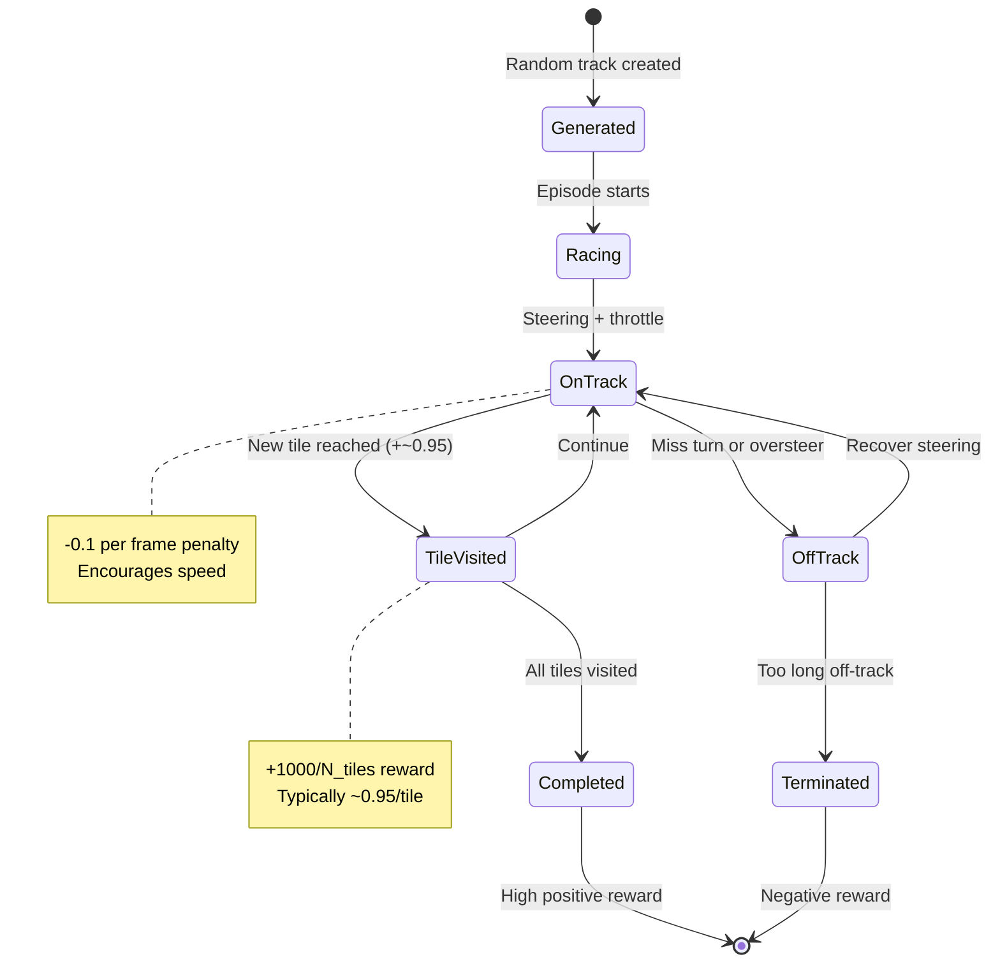

# Car Racing Game Note

## Core Facts

- **Objective:** Complete a randomly generated racetrack as quickly as possible while staying on the track.
- **Physics:** Box2D top-down car simulation with friction, steering, throttle, and brake dynamics.
- **Action space:** Box(3) continuous vector → `[steering: -1 to +1, gas: 0 to 1, brake: 0 to 1]`.
- **Observation space:** Box(96, 96, 3) RGB image representing the top-down camera view.
- **Episode termination:** Completing the track, going off-track for too long, or exceeding time/step limits.

## Reward Structure

| Event | Reward |
| --- | --- |
| Visiting a new track tile | +1000 / total_tiles (~0.95 per tile on average) |
| Each frame on-track | -0.1 (encourages speed) |
| Off-track (on grass) | Additional penalty accumulates |
| Episode end (incomplete) | Negative total if too few tiles visited |

**Optimal strategy:** Visit all track tiles quickly while minimizing time penalties. Perfect runs can score 900+.

## Gameplay Dynamics

- **Track generation:** Each episode generates a new random track with varying turns, straights, and difficulty.
- **Friction model:** Grass has higher friction than asphalt, slowing the car and increasing steering difficulty.
- **Off-track penalty:** Spending too many consecutive frames off-track terminates the episode.
- **Visual observation:** Unlike symbolic state games, agents must process pixel data to identify track boundaries and curvature.
- **Continuous control:** Steering, gas, and brake require smooth coordination; discrete approximations may struggle with tight turns.

## Keyboard Controls (Human Mode)

The GUI maps keyboard inputs to 5 discrete action presets approximating continuous control:

| Key | Preset | Steering | Gas | Brake | Use Case |
| --- | --- | --- | --- | --- | --- |
| **Up** | Forward | 0.0 | 1.0 | 0.0 | Straight acceleration |
| **Left** | Turn left | -1.0 | 0.5 | 0.0 | Left turn while moving |
| **Right** | Turn right | +1.0 | 0.5 | 0.0 | Right turn while moving |
| **Down** | Brake | 0.0 | 0.0 | 1.0 | Emergency stop |
| **Space** | Coast | 0.0 | 0.0 | 0.0 | Release controls |

**Note:** These presets simplify continuous control for human play but are less precise than true continuous actions.

## Mermaid Race Flow

## Training Considerations

1. **Image preprocessing:** Raw 96×96×3 RGB is high-dimensional; agents often benefit from grayscale conversion, downsampling, or frame stacking.
2. **Exploration:** Random continuous actions often drive off-track immediately; curriculum learning or demonstration data helps.
3. **Reward shaping:** The tile-visit reward is sparse early in training; consider auxiliary objectives like staying on-track.
4. **Action smoothing:** Discrete approximations can cause jerky steering; continuous policy gradients (e.g., PPO, DDPG) work better.
5. **Generalization:** Each episode has a new track; agents must learn track-following, not memorization.

## Configuration Options

| Parameter | Default | Effect |
| --- | --- | --- |
| `domain_randomize` | False | Randomizes car color and background for visual diversity |
| `lap_complete_percent` | 0.95 | Fraction of tiles required to complete episode |
| `max_episode_steps` | 1000 | Step limit (can be overridden via config panel) |
| `continuous` | True | Use Box(3) action space; set False for Discrete(5) keyboard presets |

## Common Pitfalls

- **Oversteering:** Applying full left/right steering at high speed causes spins and off-track excursions.
- **Brake panic:** Slamming brakes mid-turn destabilizes the car; gradual deceleration works better.
- **Ignoring grass:** Driving on grass reduces control and speed; recovering quickly is essential.
- **Time penalties:** Slow, cautious driving accumulates -0.1/frame penalties; balance safety with speed.
- **Random tracks:** Policies that work on one track may fail on others if they overfit to specific turn sequences.

## Quick Testing Tips

1. **Human baseline:** Use keyboard controls to understand steering sensitivity and turn timing.
2. **Discrete mode:** Set `continuous=False` for simpler action space (Discrete(5)) during initial experiments.
3. **Frame stacking:** Combine 3-4 consecutive frames to give the agent temporal context for motion.
4. **Reward logging:** Track tile-visit count and time penalties separately to diagnose training issues.
5. **Visual inspection:** Render episodes to verify the agent is following the track, not exploiting edge cases.

## References

- Gymnasium documentation – [Car Racing](https://gymnasium.farama.org/environments/box2d/car_racing/).
- Original OpenAI Gym implementation (2018).
- Box2D physics engine documentation.
*   [Wrappers](../../../api/wrappers/)
    
    Toggle navigation of Wrappers
    
    *   [List of Wrappers](../../../api/wrappers/table/)
    *   [Misc Wrappers](../../../api/wrappers/misc_wrappers/)
    *   [Action Wrappers](../../../api/wrappers/action_wrappers/)
    *   [Observation Wrappers](../../../api/wrappers/observation_wrappers/)
    *   [Reward Wrappers](../../../api/wrappers/reward_wrappers/)
*   [Vectorize](../../../api/vector/)
    
    Toggle navigation of Vectorize
    
    *   [Wrappers](../../../api/vector/wrappers/)
    *   [AsyncVectorEnv](../../../api/vector/async_vector_env/)
    *   [SyncVectorEnv](../../../api/vector/sync_vector_env/)
    *   [Utility functions](../../../api/vector/utils/)
*   [Utility functions](../../../api/utils/)
*   [Functional Env](../../../api/functional/)

### Environments

*   [Classic Control](../../classic_control/)
    
    Toggle navigation of Classic Control
    
    *   [Acrobot](../../classic_control/acrobot/)
    *   [Cart Pole](../../classic_control/cart_pole/)
    *   [Mountain Car Continuous](../../classic_control/mountain_car_continuous/)
    *   [Mountain Car](../../classic_control/mountain_car/)
    *   [Pendulum](../../classic_control/pendulum/)
*   [Box2D](../)
    
    Toggle navigation of Box2D
    
    *   [Bipedal Walker](../bipedal_walker/)
    *   [Car Racing](#)
    *   [Lunar Lander](../lunar_lander/)
*   [Toy Text](../../toy_text/)
    
    Toggle navigation of Toy Text
    
    *   [Blackjack](../../toy_text/blackjack/)
    *   [Taxi](../../toy_text/taxi/)
    *   [Cliff Walking](../../toy_text/cliff_walking/)
    *   [Frozen Lake](../../toy_text/frozen_lake/)
*   [MuJoCo](../../mujoco/)
    
    Toggle navigation of MuJoCo
    
    *   [Ant](../../mujoco/ant/)
    *   [Half Cheetah](../../mujoco/half_cheetah/)
    *   [Hopper](../../mujoco/hopper/)
    *   [Humanoid](../../mujoco/humanoid/)
    *   [Humanoid Standup](../../mujoco/humanoid_standup/)
    *   [Inverted Double Pendulum](../../mujoco/inverted_double_pendulum/)
    *   [Inverted Pendulum](../../mujoco/inverted_pendulum/)
    *   [Pusher](../../mujoco/pusher/)
    *   [Reacher](../../mujoco/reacher/)
    *   [Swimmer](../../mujoco/swimmer/)
    *   [Walker2D](../../mujoco/walker2d/)
*   [Atari](../../atari/)
*   [External Environments](../../third_party_environments/)

### Tutorials

*   [Gymnasium Basics](../../../tutorials/gymnasium_basics/)
    
    Toggle navigation of Gymnasium Basics
    
    *   [Make your own custom environment](../../../tutorials/gymnasium_basics/environment_creation/)
    *   [Handling Time Limits](../../../tutorials/gymnasium_basics/handling_time_limits/)
    *   [Implementing Custom Wrappers](../../../tutorials/gymnasium_basics/implementing_custom_wrappers/)
    *   [Load custom quadruped robot environments](../../../tutorials/gymnasium_basics/load_quadruped_model/)
*   [Training Agents](../../../tutorials/training_agents/)
    
    Toggle navigation of Training Agents
    
    *   [Action Masking in the Taxi Environment](../../../tutorials/training_agents/action_masking_taxi/)
    *   [Running the Experiment](../../../tutorials/training_agents/action_masking_taxi/#running-the-experiment)
    *   [Visualizing Results](../../../tutorials/training_agents/action_masking_taxi/#visualizing-results)
    *   [Results Analysis](../../../tutorials/training_agents/action_masking_taxi/#results-analysis)
    *   [Solving Blackjack with Tabular Q-Learning](../../../tutorials/training_agents/blackjack_q_learning/)
    *   [Solving Frozenlake with Tabular Q-Learning](../../../tutorials/training_agents/frozenlake_q_learning/)
    *   [Training using REINFORCE for Mujoco](../../../tutorials/training_agents/mujoco_reinforce/)
    *   [Speeding up A2C Training with Vector Envs](../../../tutorials/training_agents/vector_a2c/)
*   [Third-Party Tutorials](../../../tutorials/third-party-tutorials/)

### Development

*   [Github](https://github.com/Farama-Foundation/Gymnasium)
*   [Paper](https://arxiv.org/abs/2407.17032)
*   [Gymnasium Release Notes](../../../gymnasium_release_notes/)
*   [Gym Release Notes](../../../gym_release_notes/)
*   [Contribute to the Docs](https://github.com/Farama-Foundation/Gymnasium/blob/main/docs/README.md)

[Back to top](#)

Toggle Light / Dark / Auto color theme

Toggle table of contents sidebar

Car Racing[¶](#car-racing "Link to this heading")
=================================================

  

This environment is part of the Box2D environments which contains general information about the environment.

Action Space

`Box([-1. 0. 0.], 1.0, (3,), float32)`

Observation Space

`Box(0, 255, (96, 96, 3), uint8)`

import

`gymnasium.make("CarRacing-v3")`

Description[¶](#description "Link to this heading")
---------------------------------------------------

The easiest control task to learn from pixels - a top-down racing environment. The generated track is random every episode.

Some indicators are shown at the bottom of the window along with the state RGB buffer. From left to right: true speed, four ABS sensors, steering wheel position, and gyroscope. To play yourself (it’s rather fast for humans), type:

python gymnasium/envs/box2d/car\_racing.py

Remember: it’s a powerful rear-wheel drive car - don’t press the accelerator and turn at the same time.

Action Space[¶](#action-space "Link to this heading")
-----------------------------------------------------

If continuous there are 3 actions :

*   0: steering, -1 is full left, +1 is full right
    
*   1: gas
    
*   2: braking
    

If discrete there are 5 actions:

*   0: do nothing
    
*   1: steer right
    
*   2: steer left
    
*   3: gas
    
*   4: brake
    

Observation Space[¶](#observation-space "Link to this heading")
---------------------------------------------------------------

A top-down 96x96 RGB image of the car and race track.

Rewards[¶](#rewards "Link to this heading")
-------------------------------------------

The reward is -0.1 every frame and +1000/N for every track tile visited, where N is the total number of tiles visited in the track. For example, if you have finished in 732 frames, your reward is 1000 - 0.1\*732 = 926.8 points.

Starting State[¶](#starting-state "Link to this heading")
---------------------------------------------------------

The car starts at rest in the center of the road.

Episode Termination[¶](#episode-termination "Link to this heading")
-------------------------------------------------------------------

The episode finishes when all the tiles are visited. The car can also go outside the playfield - that is, far off the track, in which case it will receive -100 reward and die.

Arguments[¶](#arguments "Link to this heading")
-----------------------------------------------

\>>> import gymnasium as gym
\>>> env \= gym.make("CarRacing-v3", render\_mode\="rgb\_array", lap\_complete\_percent\=0.95, domain\_randomize\=False, continuous\=False)
\>>> env
<TimeLimit<OrderEnforcing<PassiveEnvChecker<CarRacing<CarRacing-v3>>>>>

*   `lap_complete_percent=0.95` dictates the percentage of tiles that must be visited by the agent before a lap is considered complete.
    
*   `domain_randomize=False` enables the domain randomized variant of the environment. In this scenario, the background and track colours are different on every reset.
    
*   `continuous=True` specifies if the agent has continuous (true) or discrete (false) actions. See action space section for a description of each.
    

Reset Arguments[¶](#reset-arguments "Link to this heading")
-----------------------------------------------------------

Passing the option `options["randomize"] = True` will change the current colour of the environment on demand. Correspondingly, passing the option `options["randomize"] = False` will not change the current colour of the environment. `domain_randomize` must be `True` on init for this argument to work.

\>>> import gymnasium as gym
\>>> env \= gym.make("CarRacing-v3", domain\_randomize\=True)

\# normal reset, this changes the colour scheme by default
\>>> obs, \_ \= env.reset()

\# reset with colour scheme change
\>>> randomize\_obs, \_ \= env.reset(options\={"randomize": True})

\# reset with no colour scheme change
\>>> non\_random\_obs, \_ \= env.reset(options\={"randomize": False})

Version History[¶](#version-history "Link to this heading")
-----------------------------------------------------------

*   v2: Change truncation to termination when finishing the lap (1.0.0)
    
*   v1: Change track completion logic and add domain randomization (0.24.0)
    
*   v0: Original version
    

References[¶](#references "Link to this heading")
-------------------------------------------------

*   Chris Campbell (2014), http://www.iforce2d.net/b2dtut/top-down-car.
    
