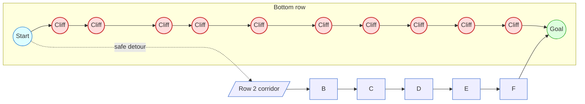

# Cliff Walking Game Note

## Core Facts

- **Grid:** 4×12 board inspired by Sutton & Barto Example 6.6.
- **Start / Goal:** Start at bottom-left `[3,0]`, goal at bottom-right `[3,11]`.
- **Cliff tiles:** Bottom row columns `[3,1]` through `[3,10]`. Entering the cliff teleports you back to start with a -100 reward.
- **Action space:** Discrete(4) → `0: up`, `1: right`, `2: down`, `3: left`.
- **Reward scheme:** `-1` per step, `-100` for the cliff penalty, and `0` when reaching the terminal goal state.

## Gameplay considerations

- Optimal policies learn to hug the second row to avoid the cliff while minimising total step cost.
- Episodes are short, so this is a clean benchmark for on-policy control algorithms such as SARSA vs. Q-Learning: SARSA prefers the safe path; Q-Learning gambles on the risky but shorter cliff edge path.
- Set `is_slippery=True` to introduce stochastic slips (new in Gymnasium v1). When enabled, intended actions succeed with probability `success_rate`, otherwise the agent shifts perpendicular, mirroring Frozen Lake’s mechanics.

## Mermaid snapshot of the 4×12 board

## Quick experimentation tips

1. **Baseline run:** `gym.make("CliffWalking-v1")` – deterministic transitions.
2. **Slippery variant:** `gym.make("CliffWalking-v1", is_slippery=True, success_rate=0.8)` – adds exploration pressure similar to Frozen Lake.
3. **Policy comparison:** Evaluate SARSA vs. Q-Learning to show on-policy/off-policy differences on risky paths.

## Reference material

- Gymnasium documentation – [Cliff Walking](https://gymnasium.farama.org/environments/toy_text/cliff_walking/).
- Sutton & Barto, *Reinforcement Learning: An Introduction*, Example 6.6.
