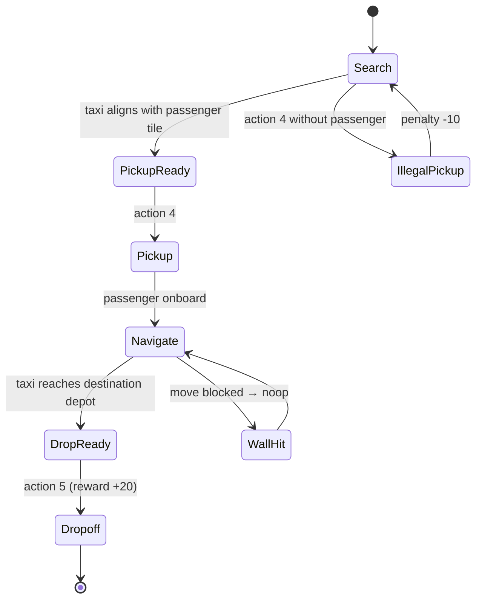

# Taxi Game Note

## Scenario snapshot

- **Map:** Fixed 5×5 grid with four depots labelled `R`, `G`, `Y`, `B`.
- **Objective:** Navigate the taxi to the passenger, pick them up, deliver to the requested depot.
- **Action space:** Discrete(6) → `0: south`, `1: north`, `2: east`, `3: west`, `4: pickup`, `5: dropoff`.
- **Observation space:** Discrete(500) encoding `(taxi_row, taxi_col, passenger_location, destination)`; 404 of those states are reachable in practice.
- **Reward schedule:** `-1` per time step, `+20` for a correct drop-off, `-10` for illegal pickup/drop-off attempts.

## Dynamics at a glance

- Walls embedded in the map block lateral moves and generate a noop (still costs -1).
- `info["action_mask"]` identifies which actions are currently legal; sampling from it avoids noops.
- Optional stochasticity mirrors the Frozen Lake mechanic:
  - `is_raining=True` → intended move succeeds with 80% probability; otherwise the taxi drifts perpendicular (10% each way).
  - `fickle_passenger=True` → after the taxi moves away from the pickup square the passenger may change their destination with 30% probability (only once per episode).

## Mermaid overview of a typical delivery

## Training tips

1. **Baseline:** `gym.make("Taxi-v3")` with default deterministic dynamics.
2. **Stochastic variant:** toggle `is_raining` or `fickle_passenger` to force policies that consider uncertainty.
3. **Curriculum:** start with deterministic training, then fine-tune on the stochastic version to improve robustness.

## References

- Gymnasium documentation – [Taxi](https://gymnasium.farama.org/environments/toy_text/taxi/).
- Dietterich, T. “Hierarchical Reinforcement Learning with the MAXQ Value Function Decomposition,” JAIR, 2000.
