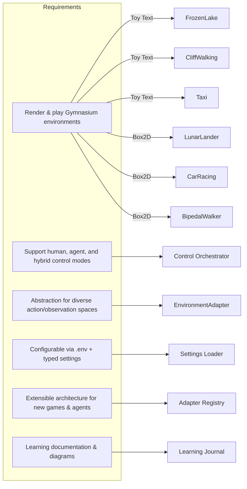
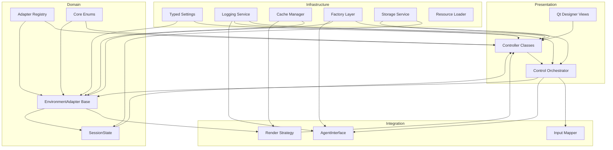
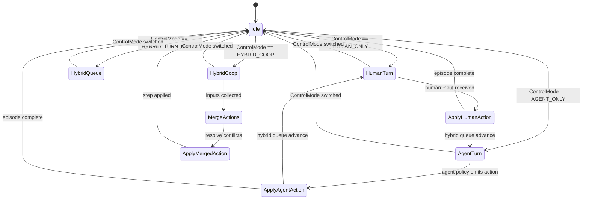
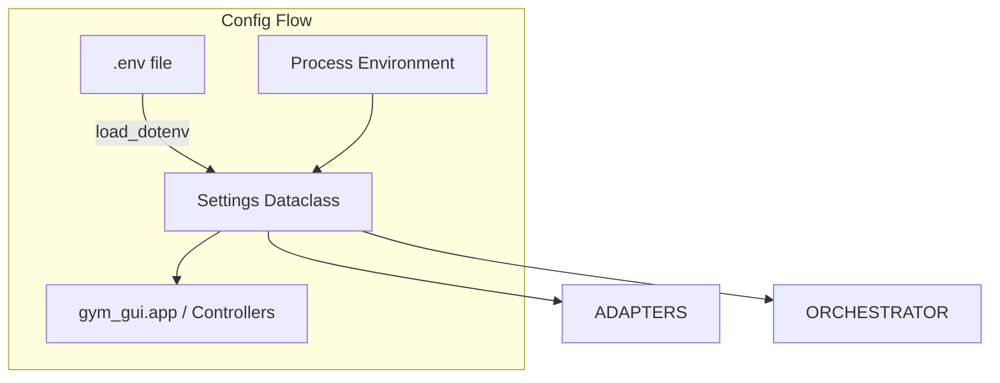
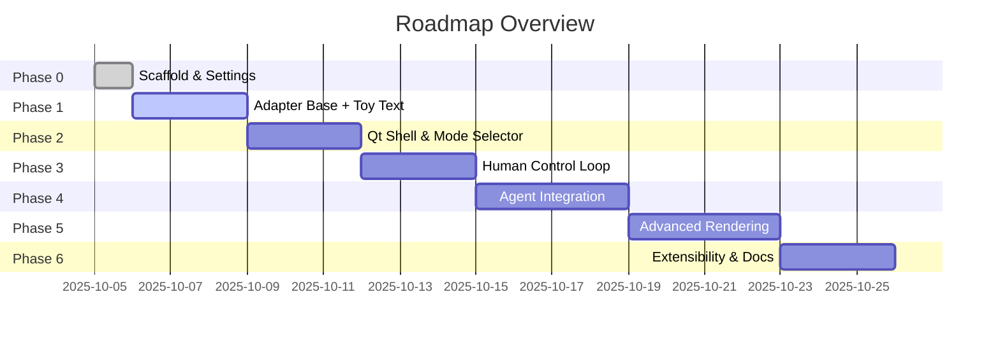

# Day 0 Initial Plan – Gymnasium Qt GUI

## WHY: Purpose and problem framing
- **Learning-first build:** create a PyQt-powered hub where you learn GUI engineering by progressively supporting Gymnasium environments for both humans and agents.
- **Unified abstraction layer:** provide a contract that any Gymnasium environment can satisfy (step/reset/render), allowing you to drop in new games without reworking UI plumbing.
- **Human + agent collaboration:** bake in control modes (human-only, agent-only, hybrid) to experiment with assistive AI flows from the start, reinforcing RL and HCI concepts simultaneously.
- **Sustainable architecture:** follow best practices observed in `qtpy`, `openshot-qt`, and `PyQt5-Apps` so code regeneration, theming, and concurrency stay manageable as the project scales.

## WHAT: Specification requirements snapshot

## HOW: Layered architecture blueprint

### WHY this architecture works
- **Decoupled layers:** Controllers never talk to Gym directly; they delegate to adapters, making it easy to sandbox new games or swap to mock environments for tests.
- **Regenerated UI safety:** Designer-generated classes remain untouched, keeping with PyQt5-Apps best practice. Controllers own logic and can be unit-tested.
- **Qt-friendly concurrency:** the orchestrator isolates agent threads from the UI, following the signal/slot patterns proven in openshot-qt.
- **Config-driven behaviour:** typed settings guarantee the app can switch bindings, default envs, or modes without code edits.

> **Guidance references:** Architecture decisions draw directly from `1.4_CODING_PRACTICE_QTPY.md` (binding-aware tooling via QtPy) and `1.7_CODING_PRACTICES_QT_6_OFFICIAL.md` (Qt 6 recommendations for layered UI design and threading).

### DESIGN PRACTICE ALIGNMENT
- **Binding abstraction via QtPy CLI** – following `1.4_CODING_PRACTICE_QTPY.md` and the `qtpy` package itself, every Qt access flows through QtPy so the GUI stays agnostic to PyQt6 vs. PySide6.
- **Controller + generated view pairing** – mirrors the `PyQt5-Apps` pattern documented in `1.2_CODING_PRACTICE_2_PyQt5-APPS.md`, ensuring Designer-generated classes remain untouched while controllers manage signals.
- **Qt 6 best practices** – respects the guidance in `1.7_CODING_PRACTICES_QT_6_OFFICIAL.md` and the official docs (`Qt Quick Best Practices`, `Session Management`, `Unix Signals`) by isolating long-running work in orchestrators and keeping UI updates on the main thread.
- **MVC inspiration** – borrows from `qt-python-mvc` to keep models (`SessionState`, adapters), views (`Qt Designer`), and controllers (`MainWindow` subclasses) clearly separated, easing future MVVM experimentation.

### INFRASTRUCTURE ADDITIONS
- **Logging (`gym_gui/logging_config/logger.py`, `gym_gui/runtime/log_output/`)** – centralize structured logging (human actions, agent decisions, environment transitions). Aligns with Qt 6 session guidance to persist state across launches.
- **Cache utilities (`gym_gui/cache/memory.py`, `gym_gui/runtime/cache/`)** – memoize expensive environment assets (tile maps, preprocessed observations), enabling quick reloads and offline usage.
- **Factories (`gym_gui/core/factories/`)** – encapsulate creation of adapters, agents, and renderers, making it easy to inject alternative implementations for testing.
- **Data models (`gym_gui/core/data_model/`)** – define pydantic/dataclass schemas for observations, rewards, and session metadata to ensure consistent serialization.
- **Storage layer (`gym_gui/storage/filesystem.py`, `gym_gui/runtime/data/`)** – handle saving episodes, replay buffers, and configuration snapshots, following the OpenShot-style separation of persistence logic from controllers.
- **Utilities (`gym_gui/utils/qt.py`)** – host cross-cutting helpers such as time conversions, signal throttling, and Qt-safe thread wrappers, derived from patterns in `qtpy` and official Qt best practices.

## Control-mode orchestration (WHY hybrid is feasible)

- **Human-only:** input mapper emits actions directly to the orchestrator; agent threads stay idle.
- **Agent-only:** orchestrator listens exclusively to agent signals, keeping UI responsive.
- **Hybrid turn-based:** orchestrator rotates through a queue (`[Human, Agent, Human, …]`) maintained in `SessionState`, teaching you about deterministic scheduling.
- **Hybrid co-op:** orchestrator merges simultaneous inputs (e.g., vector averaging), enabling investigations into assistive agents.

## Config + environment strategy

- **`.env` + defaults** ensure reproducible experiments (e.g., `DEFAULT_CONTROL_MODE`, `GYM_DEFAULT_ENV`).
- **Typed accessors** prevent stringly-typed bugs; your IDE/autocomplete guide shows available options.
- **Why it works:** mirrors `qtpy` CLI’s single source of truth and stops configuration drift across modules.

## Naming convention rationale
- **`1.0_DAY_0_INITIAL_PLAN.md`:** numeric prefix mirrors earlier practice files (`1.x_CODING_PRACTICE…`) for chronological ordering; `DAY_0` captures the project-sprint mindset borrowed from RL experiment logs; `INITIAL_PLAN` signals this is the foundational roadmap before code.
- **Predictable evolution:** future docs (`1.1_DAY_1_ADAPTER_SPIKE.md`, etc.) will sort naturally in file explorers, making the learning journey easy to replay.
- **Searchability:** consistent `DAY_` markers let you grep or filter by timeline, and the `1.0` group distinguishes planning docs from implementation notes.

## Timeline & deliverables

- **Iterative validation:** each phase ends with a runnable artifact (CLI test, UI shell, agent demo) to keep momentum.
- **Learning checkpoints:** after each phase, update `docs/learning_journal.md` and capture new diagrams or observations.

## Risk mitigation & WHY success is likely
- **API volatility:** adapters encapsulate Gym changes; if an environment updates observation shapes, only its adapter changes.
- **Performance concerns:** rendering strategies throttle frame rates and offload agents to threads, preventing UI freezes.
- **Complexity growth:** enums and registries make unsupported combinations explicit—you’ll know immediately if a mode isn’t available for a game.
- **Human factors:** hybrid mode design ensures humans stay in the loop, letting you iterate on UX without touching core logic.

## Next immediate actions
1. Implement `EnvironmentAdapter` interfaces and the FrozenLake/CliffWalking/Taxi adapters.
2. Flesh out the control orchestrator skeleton aligning with the state diagram.
3. Draft additional diagrams as the project matures (component, sequence, UI flow) and append to this plan when milestones are reached.
