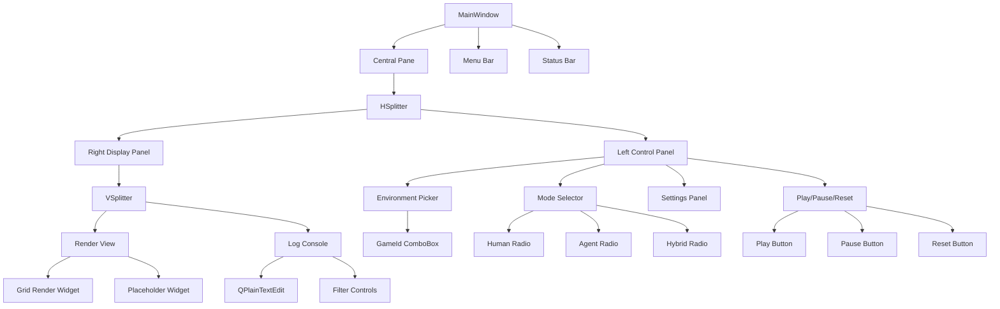
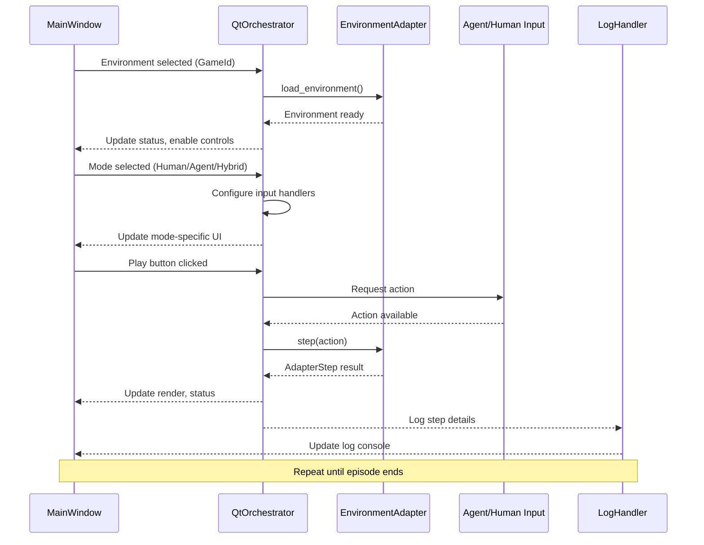
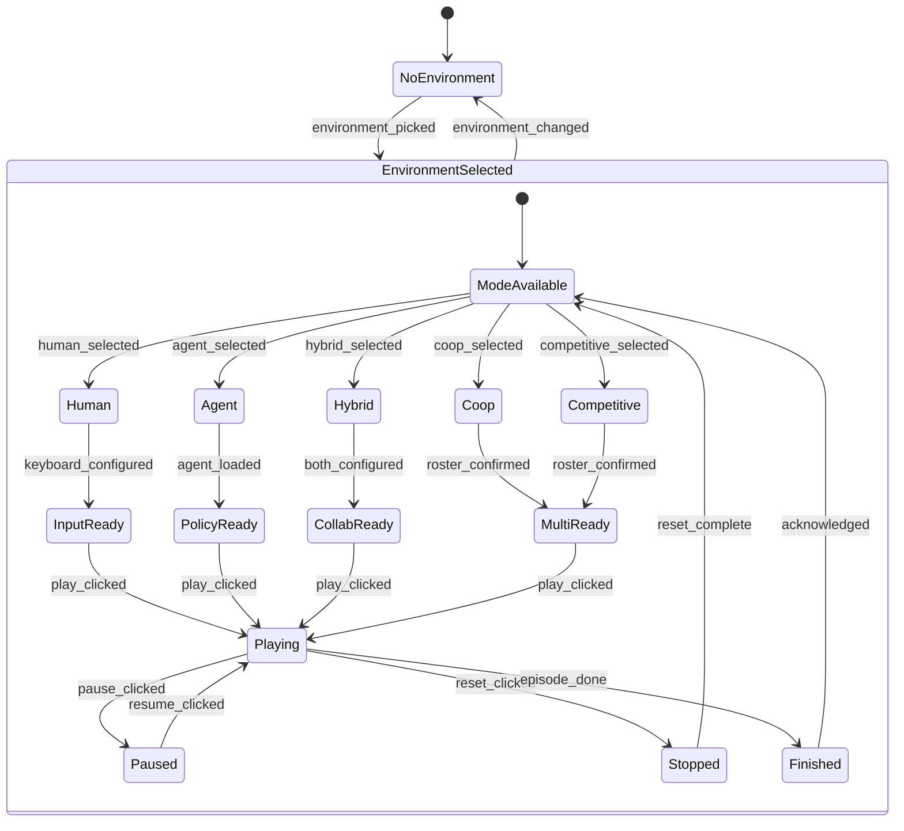

# Day 2 Plan – Qt Shell & Mode Selecto4. **Agent & hybrid orchestration (Qt Threading + Signal Architecture)**
   - **Service Object Pattern**: Reuse the CLI orchestrator core as a service object (extract play loop into a reusable class) and drive it via Qt signals, mirroring the [qtShellSurfaceCreated signal pattern](https://doc.qt.io/qt-6/qml-qtwayland-compositor-qtshell-qtshell.html#qtShellSurfaceCreated-signal) where surface creation triggers downstream updates.
   - **Threading Safety**: Ensure background threads emit signals to the main thread using Qt's `QObject.moveToThread`, `QTimer`, or `QThreadPool`. Follow the [QtShell window management pattern](https://doc.qt.io/qt-6/qtwaylandcompositor-qtshell-example.html#window-management) where ToolButton clicks trigger `shellSurface.sendClose()` methods—our agent actions will trigger similar environment state changes via thread-safe signals.
   - **Multi-Surface Support**: Support multi-agent by allowing the orchestrator to load multiple adapter instances, using a `QRepeater` model approach similar to the [task bar implementation](https://doc.qt.io/qt-6/qtwaylandcompositor-qtshell-example.html#window-management) that manages multiple shell surfaces via `Repeater { model: output.shellSurfaces }`.# WHY this milestone matters
- **Bridge adapters to experience:** Phase 1 proved the adapter and CLI pathways; Phase 2 gives them a visual home so learning flows through a Qt shell instead of pure console logs.
- **Human + agent parity:** The UI must allow humans to play with keyboard/mouse, single or multiple agents to operate autonomously, and hybrid configurations to collaborate—all surfaced through a consistent selector and status display.
- **Continuous observability:** Embedding the logging console and runtime indicators keeps the debugging-first culture from Day 0 intact while making it accessible to learners who rely on visual cues.
- **Foundation for theming:** Integrating iconography and theming early (Qt Material, QtAwesome) ensures future screens stay cohesive without re-architecting widgets.

## WHAT we will ship
- **`MainWindow` scaffold** with:
  - Environment picker (combo box bound to `GameId` values from the adapter factory).
  - Mode selector (radio/buttons for Human, Agent, Hybrid) respecting adapter capabilities.
  - Play/pause/reset controls wired to orchestrator commands.
  - Embedded log console (read-only text widget tailing the logging handlers).
- **Input layer** for human-only mode:
  - Keyboard bindings for discrete actions (e.g., arrows/WASD for toy-text).
  - Mouse affordances for future grid/tile clicks; stub out signal connections now.
- **Agent orchestrator bridge** attaching the CLI logic to Qt via signals/slots and background workers.
- **Runtime status panel** separating state flags from timing telemetry:
    - **Episode State:** reward delta, terminated flag, truncated flag (explicitly labelled instead of the terse `terminated/truncated` string).
    - **Shell Uptime:** wall-clock elapsed since the Qt shell bootstrapped, formatted as `Shell Uptime: 00:01:23`.
    - **Episode Clock:** elapsed time since the *first* move in the active episode, reset on `reset()`.
    - **Outcome Timestamp:** records when the episode finished, annotated as `Outcome: Victory @ 12:04:31` or `Outcome: Loss @ 12:04:31 (hole)`.
    - **Last Fault Timestamp:** when a human/agent loss occurred due to a misplay (e.g., slipping into a hole); surfaces even if the episode continues via automatic reset.
    - Render preview (grid for toy-text, placeholder for other families).
- **Documentation updates** covering UI architecture decisions, control flow, and usage instructions in the learning journal.

## HOW we will build it
1. **Window + layout structure (Qt Chrome Pattern)**
   - Use `QtWidgets` (QMainWindow + central stacked layout) for quick iteration.
   - **Chrome Pattern Implementation**: Following QtShell Compositor example, encapsulate panels in dedicated widgets (PickerPanel, LogConsole, RenderView) that act as "Chrome" decorations around the core environment display. Each widget manages its own `frameMargins` and `maximizedRect` calculations similar to [QtShellChrome](https://doc.qt.io/qt-6/qml-qtwayland-compositor-qtshell-qtshellchrome.html).
   - **Surface Management**: Use `QSplitter` layouts to enable dynamic panel resizing, with `QListModel` backing the environment picker combo box to mirror the [ListModel pattern](https://doc.qt.io/qt-6/qtwaylandcompositor-qtshell-example.html#making-the-connection) used for shell surface management.
   - Adopt naming conventions from Day 0 (controllers orchestrate, generated views remain untouched) and prepare for eventual Qt Designer integration.

2. **Mode selector mechanics**
   - Bind selector options to `ControlMode` enums; disable unsupported modes as soon as the user selects an environment (using factory metadata).
   - Persist chosen mode back to settings/environment orchestrator so CLI + Qt share the same source of truth.
    - Surface both multi-agent modes alongside human and hybrid options; when selected, gate human shortcuts while leaving agent orchestration controls active for cooperative or competitive experiments.
   - For hybrid mode, expose an additional panel outlining whose turn it is (queue display) to reinforce collaboration concepts.

3. **Input handling for human mode**
   - Register `QShortcut`/`QAction` mappings for discrete actions; start with toy-text arrow keys.
   - Provide a command palette hook for continuous environments (placeholder) to avoid rewriting once Box2D arrives.
   - Keep input logic in a dedicated controller class (`HumanInputController`) that communicates with adapters through the same interfaces used by the CLI.

4. **Agent & hybrid orchestration**
   - Reuse the CLI orchestrator core as a service object (extract play loop into a reusable class) and drive it via Qt signals.
   - Ensure background threads emit signals to the main thread (Qt’s `QObject.moveToThread`, `QTimer`, or `QThreadPool`) following the threading rules collected in Day 0 references.
   - Support multi-agent by allowing the orchestrator to load multiple adapter instances or agent policies depending on selected configuration (stub with TODOs if implementation lands in Phase 3).

5. **Logging console integration (Qt Text Stream Architecture)**
   - **Handler Implementation**: Register a custom `logging.Handler` that streams formatted records into a `QPlainTextEdit` using Qt's text cursor and document model, respecting the existing log level controls.
   - **Filter Architecture**: Provide filters/toggles (human vs agent vs environment logs) using a pattern similar to the [QtShell window decorations visibility](https://doc.qt.io/qt-6/qtwaylandcompositor-qtshell-example.html#window-decorations) where `visible: (chrome.windowFlags & Qt.WindowMinimizeButtonHint) != 0` conditionally shows/hides elements based on flags.
   - **Usable Area Management**: Like the [task bar usable area calculation](https://doc.qt.io/qt-6/qtwaylandcompositor-qtshell-example.html#window-management) that defines `maximizedRect` to exclude taskbar space, manage log console space allocation to prevent UI overflow during verbose logging sessions.
   - Persist window/log settings to `runtime/log_output` if the user wants reproducible sessions (optional advanced task).

6. **Asset & theming alignment**
   - Reference Qt Material guidelines (`1.6_CODING_PRACTICE_QT_MATERIAL.md`, `qt-material/`) for color palettes and component sizing.
   - Use `qtawesome` for iconography in toolbar buttons (play, pause, reset, agent avatar) to keep the UI polished.
   - When richer sprites are needed, load Gymnasium assets (e.g., `gymnasium/envs/toy_text/img/elf_down.png`) via `importlib.resources` and transform them into Qt pixmaps at runtime—no licensed assets committed to the repo.

7. **Documentation & journal updates**
   - Capture architectural diagrams (component interactions, signal flow between Qt and orchestrator) and add them to the Day 0 plan or learning journal.
   - Document keyboard/mouse mappings and troubleshooting steps for Qt dependencies.

## Technical Implementation Patterns

### Qt Signal/Slot Architecture
Following QtShell patterns, our orchestrator will use Qt's signal system for loose coupling:

```python
class QtOrchestrator(QObject):
    # Signals mirror QtShell surface lifecycle
    environment_loaded = pyqtSignal(str)  # Like qtShellSurfaceCreated
    step_completed = pyqtSignal(dict)     # Like surface geometry updates
    episode_finished = pyqtSignal(bool)  # Like sendClose() responses
    
    def load_environment(self, game_id: str):
        # Load adapter in background thread
        worker = EnvironmentWorker(game_id)
        worker.finished.connect(self.environment_loaded.emit)
        QThreadPool.globalInstance().start(worker)
```

### Widget Hierarchy (Chrome Pattern)
Inspired by QtShell Chrome implementation with frame margins and decoration management:

```python
class MainWindow(QMainWindow):
    def __init__(self):
        super().__init__()
        # Central widget acts as "usable area"
        central = QWidget()
        self.setCentralWidget(central)
        
        # HSplitter manages frame margins like QtShellChrome
        hsplitter = QSplitter(Qt.Horizontal)
        
        # Left panel = control decorations
        left_chrome = ControlChromeWidget()
        # Right panel = content surface
        right_surface = DisplaySurfaceWidget()
        
        hsplitter.addWidget(left_chrome)
        hsplitter.addWidget(right_surface)
        
        layout = QVBoxLayout(central)
        layout.addWidget(hsplitter)

class ControlChromeWidget(QWidget):
    """Left panel acting as window decorations/chrome"""
    mode_changed = pyqtSignal(str)  # Signal emission like QtShell
    
    def setup_mode_selector(self):
        # Radio buttons with conditional visibility
        # Like QtShell decoration visibility based on window flags
        self.human_radio.setVisible(self.adapter_supports_human)
        self.agent_radio.setVisible(self.adapter_supports_agent)
```

### Threading Pattern (Qt Background Workers)
Based on QtShell surface management in separate threads:

```python
class EnvironmentWorker(QRunnable):
    """Background worker for environment operations"""
    def __init__(self, adapter: 'EnvironmentAdapter'):
        super().__init__()
        self.adapter = adapter
        self.signals = WorkerSignals()
    
    def run(self):
        try:
            result = self.adapter.step(action)
            self.signals.step_complete.emit(result)
        except Exception as e:
            self.signals.error.emit(str(e))

class WorkerSignals(QObject):
    step_complete = pyqtSignal(dict)
    error = pyqtSignal(str)
```

## Architecture Diagrams

### Main Window Component Layout


### Signal Flow Architecture


### Mode Selector State Machine


## References & research
- Day 0 initial plan (`1.0_DAY_0_INITIAL_PLAN.md`) – control-mode goals, layering rationale, logging strategy.
- **Qt Wayland Shell Architecture**: 
  - [QtShell QML Type](https://doc.qt.io/qt-6/qml-qtwayland-compositor-qtshell-qtshell.html) – Surface lifecycle management, QtShellSurface creation signals, and shell extension patterns for trusted Qt applications.
  - [QtShell Compositor Example](https://doc.qt.io/qt-6/qtwaylandcompositor-qtshell-example.html) – Chrome pattern implementation, window decorations, task bar management, and multi-window orchestration using ListModel/Repeater patterns.
- Styling resources: `1.6_CODING_PRACTICE_QT_MATERIAL.md`, `qt-material/`, `qtawesome/` – theming and iconography patterns to adopt.
- Existing CLI orchestrator (`gym_gui/controllers/cli.py`) and adapter factory (`gym_gui/core/factories/adapters.py`) – behavioural baseline for Qt controllers.

## Control mode requirements update
- **Control Mode Coverage:** The selector now includes Human Only, Agent Only, Hybrid Turn-Based, Hybrid Human+Agent Simultaneous, Multi-Agent Cooperation, and Multi-Agent Competition. Each adapter advertises which modes it supports so the UI can toggle availability automatically.
- **Toy-Text parity:** FrozenLake, CliffWalking, and Taxi now surface the multi-agent modes in their capability metadata so the Qt shell presents the full six-option selector even for introductory environments.
- **Deterministic FrozenLake option:** A new `FROZEN_LAKE_IS_SLIPPERY` setting (defaulting to `false`) feeds through Settings into the adapter so human-only runs can remain deterministic unless the user explicitly opts back into stochastic slips.
- **Status telemetry clarity:** The status card now separates episode termination vs truncation, adds session uptime, active play time, and the completion timestamp powered by the shared `SessionTimers` utility.
- **Per-game configuration hooks:** A dedicated Game Configuration panel lets Frozen Lake toggle slipperiness directly from the GUI—future adapters can plug in their own knobs the same way.
 - **Per-game configuration hooks:** A dedicated Game Configuration panel lets Frozen Lake toggle slipperiness directly from the GUI—future adapters can plug in their own knobs the same way.
 - **Frozen Lake checkbox persistence:** The slippery ice toggle now retains its checkmark when clicked and keeps the override active until the user changes it again.
 - **Toy-text hero highlighting:** All toy-text grids now spotlight the active agent cell, including Cliff Walking and Taxi, so the hero position is consistent across environments.

### Actions taken
- Let `HumanInputController` report both the key used and the translated action, then send that tuple into `SessionController` so logs show exactly what the human pressed.
- Log the agent position difference and reward delta inside `SessionController` every step to keep observability aligned with the telemetry requirement.
- Emit an additional `SessionController` debug entry the moment a human action is accepted so the keystroke shows up in the log before the environment step.
- Expand `ControlMode` enum and apply the new modes across adapters, controllers, and UI labels so hybrid and multi-agent options can be toggled directly from the shell, including toy-text games.
- Introduce `gym_gui.utils.timekeeping.SessionTimers` and embed it in the session controller plus a 1 Hz refresh loop in the main window for live timekeeping.
- Rework the status panel layout to call out termination, truncation, and the three timing fields with reader-friendly labels.
- Add the Game Configuration group (starting with Frozen Lake slipperiness) so environment-specific settings are surfaced alongside the selector.

## Acceptance checklist
- [ ] Main window launches with environment picker, mode selector, log console, and render placeholder.
- [ ] Mode selector enforces adapter capabilities; unsupported modes are disabled or clearly messaged.
- [ ] Human-only mode responds to keyboard shortcuts for toy-text environments.
- [ ] Agent-only mode runs via background orchestrator using the same adapter pipeline as the CLI.
- [ ] Hybrid mode surfaces turn/state transitions in the UI (even if backed by simple toy-text logic initially).
- [ ] Logging console mirrors file/stdout output in near real time.
- [ ] Documentation (README or learning journal) updated with UI flow and controls.

## Risks & mitigations
- **Qt dependency churn:** Clearly document required PyQt/PySide packages and fallback instructions; keep CLI usable if Qt fails.
- **Threading pitfalls:** Adhere to Qt threading guidelines—run agents in worker threads and marshal results via signals to avoid UI hangs.
- **Input divergence:** Maintain a single source of truth for human controls (e.g., map keys to action enums) to stay consistent across CLI and GUI.
- **Visual overload:** Start with minimal panels; use Qt Material spacing and typography presets to avoid clutter while features grow.

## Next steps after Phase 2
1. Expand adapter coverage (Classic Control, Box2D) and update the factory so the picker recognizes new families.
2. Introduce session persistence (storage module integration) for replay saves and configuration snapshots.
3. Layer agent policy selection UI (model registry, training toggles) and integrate with RL tooling.
4. Explore advanced rendering pathways (Qt Quick, QGraphicsView) once the foundational shell proves stable.
