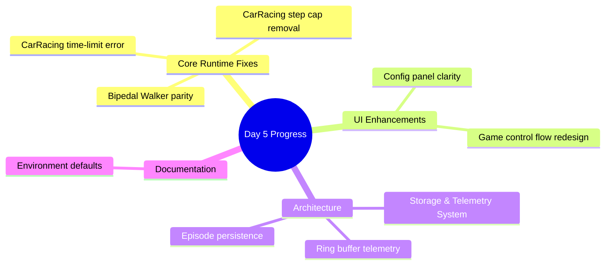
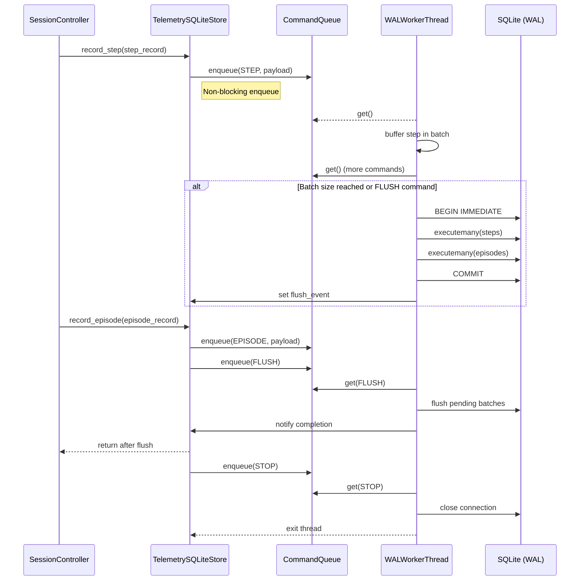
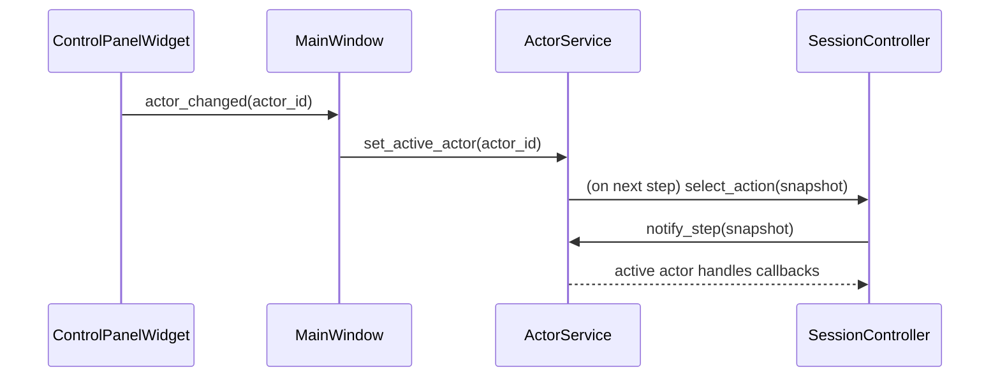
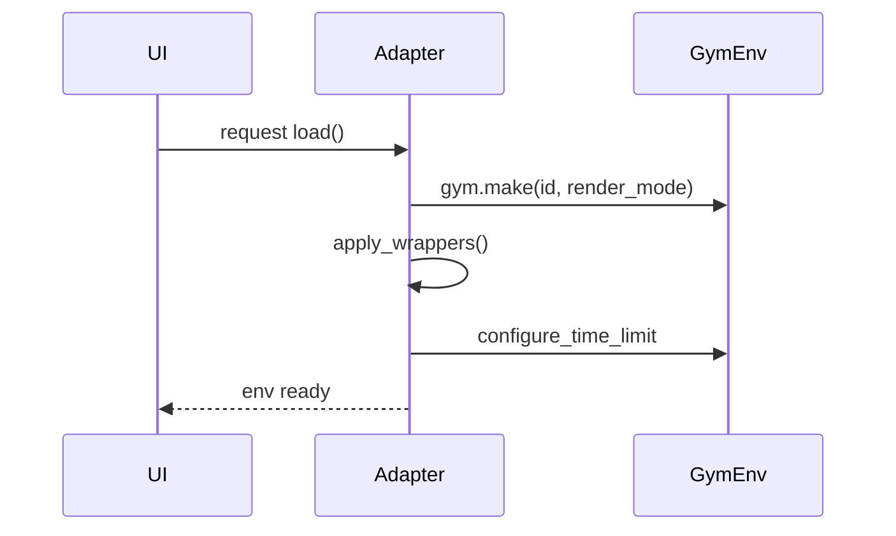
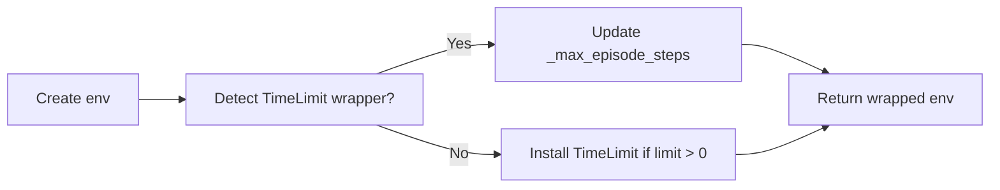
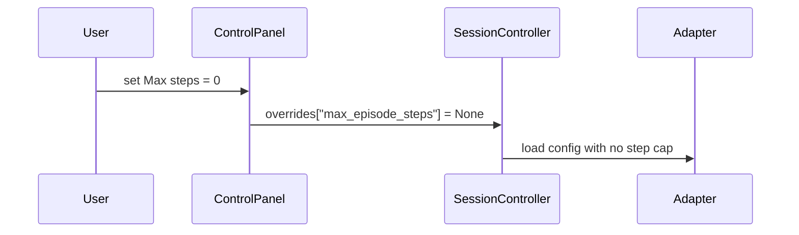
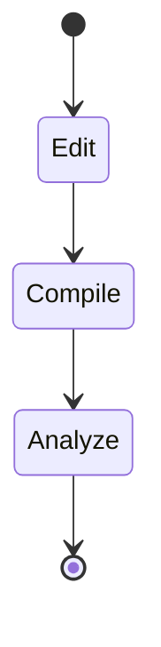
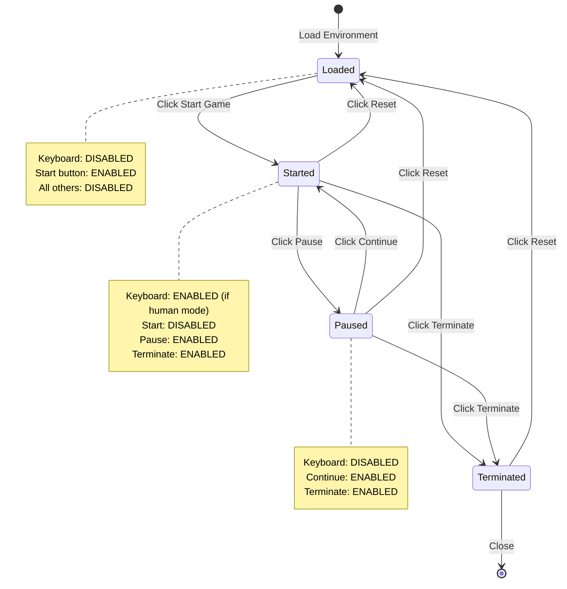
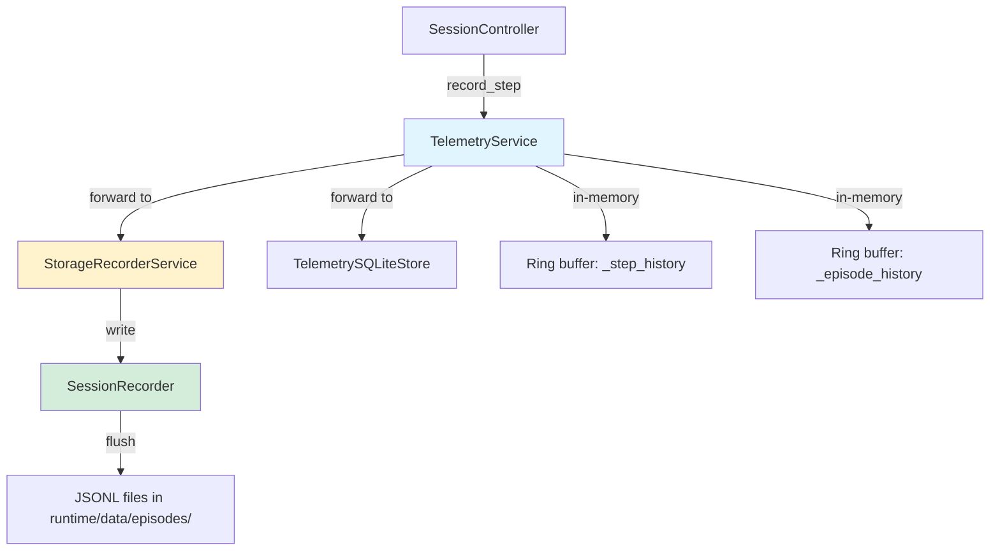
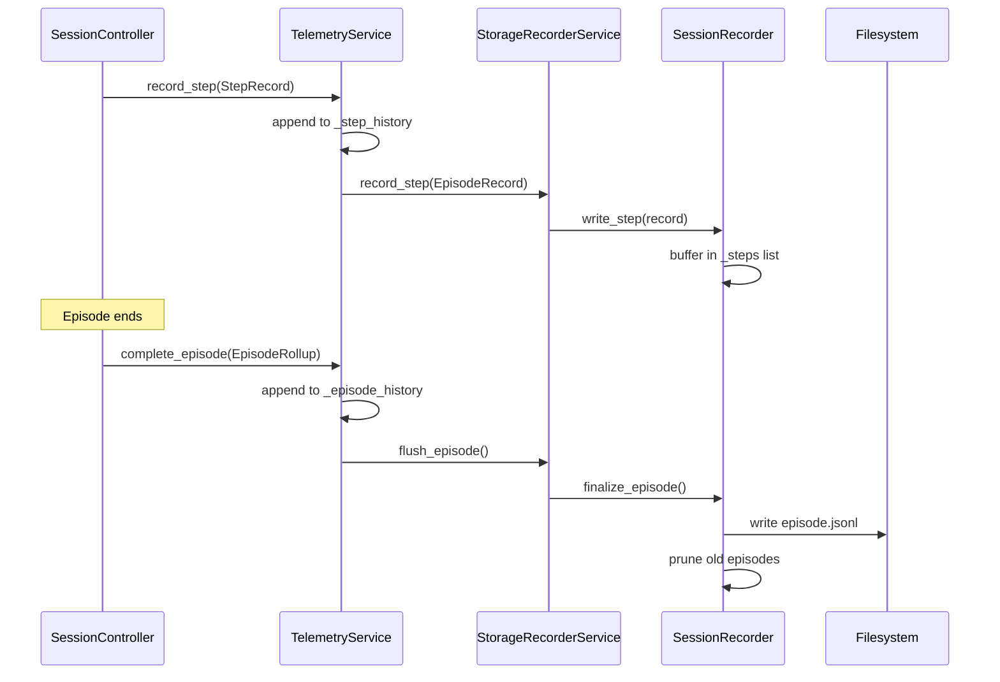

# Day 5 – Current Design Progress

## Overview

This log captures concrete issues addressed on Day 5, the solution we implemented, and the artifacts touched. Each section mirrors the original design risks to show measurable progress.



---

## Potential upgrades & follow-on improvements

> Linked reference: `1.0_DAY_5_CURRENT_DESIGN_ERROR_AND_PROPOSED_SOLUTIONS.md`

| Day 5 issue | Current status | Proposed next move |
| --- | --- | --- |
| **1. Rendering locked to grids** | *Partially resolved* – RGB payloads display through `_VideoTab`, but rendering still funnels through `GridRenderer`. | Introduce a shared renderer interface (`IRendererStrategy`) that selects between grid and RGB implementations; add coverage tests that fail when adapters emit an unexpected `RenderMode`. |
| **2. No frame persistence contract** | *Open* – JSONL telemetry persists, but no binary frame storage or `frame_ref`. | Expand `StorageRecorderService` to capture frames (PNG/WebP) and attach hashed `frame_ref` entries to `StepRecord`, aligning with the storage roadmap in the error memo. |
| **3. Lack of writable `var/` tier** | *Open* – artifacts still under `gym_gui/runtime/data`. | Carve out `var/records`, `var/cache`, and prune policies; update bootstrap to respect storage profiles and keep runtime tree clean. |
| **4. Static-analysis debt** | *Partially addressed* – imports lifted but high-cyclomatic hotspots remain. | Split `create_adapter` into focused helpers, refactor log/renderer dispatchers, and adopt lint gates called out in the error memo. |
| **5. No video capture/replay pipeline** | *Open* – replay uses telemetry only. | Layer `StorageRecorderService` with async frame encoding, CLI playback, and Qt replay tab capable of scrubbing stored frames. |
| **6. Missing research-grade telemetry sinks** | *Partially addressed* – SQLite store exists, but no external exporters. | Add optional TensorBoard/W&B integrations and upgrade the log pane to a filterable table bound to telemetry records. |
| **7. Ad-hoc dependency management** | *Open* – `requirements.txt` mixed pins/constraints. | Transition to `pyproject.toml` + lockfile (uv/poetry), enforce via CI to guarantee reproducible environments. |
| **8. No automated formatting/lint gate** | *Open* – no pre-commit config yet. | Adopt pre-commit stack (ruff, black, isort, pyproject-fmt) and wire into CI to prevent regressions. |

**Additional observations**

- Backlog items flagged in the error memo—Taxi asset dispatcher complexity, toy-text dead stores, log-table UX, resource pipeline—remain outstanding and should be scheduled alongside the upgrades above.
- Legacy `runtime/data/toy_text` artifacts highlight the need for the proposed `var/` redesign; migrating recordings there will de-risk accidental commits and large repo churn.

## Dependency profiles and optional extras

- CleanRL’s core environment lives in `cleanrl/requirements/requirements.txt`, an auto-generated lock-style export created via `uv export --no-hashes --output-file requirements/requirements.txt`. The file pins every dependency (and installs the project itself with `-e .`) needed to run the vanilla PPO/DQN scripts reproducibly across machines.
- Adjacent files in `cleanrl/requirements/` (`requirements-atari.txt`, `requirements-mujoco.txt`, `requirements-dm_control.txt`, `requirements-pettingzoo.txt`, etc.) enumerate opt-in extras for heavyweight ecosystems. Instead of bundling Atari ROM tooling, MuJoCo bindings, envpool backends, or Optuna instrumentation into the base image, each list captures just the additional packages required for that family so developers can `pip install -r requirements/requirements-atari.txt` (or the MuJoCo equivalent) when they actually need those integrations.
- This separation keeps default installs fast while still documenting exactly which wheels must be pulled in for specific benchmarks. It mirrors the strategy cited in Day 5 issue #7: add a managed lock for the common path, and surface modular requirement sets so specialized workflows stay opt-in.

## Telemetry persistence overhaul – batched SQLite writer

> **Update:** This section was originally drafted in the Day 6 CleanRL analysis log. It now lives here to reflect that the batching work landed as part of the Day 5 mitigation sprint alongside the storage roadmap items.

**Context**  
Episode telemetry writes were stalling the UI because each step opened a fresh SQLite connection and committed synchronously. The Day 5 storage focus item called for persistent WAL usage, batching, and clearer lifecycle hooks so replay/video capture could stay smooth under heavy load.

**Actions taken**
- Refactored `TelemetrySQLiteStore` to hold a single WAL-backed connection, relax synchronous mode to `NORMAL`, and delegate write operations to a daemon worker thread with a configurable batch size (default `32`).
- Introduced a queue-driven command protocol (`step`, `episode`, `flush`, `stop`) so step recording is now an `enqueue` instead of a direct `INSERT`, letting the worker group rows into single transactions.
- Hardened lifecycle helpers: `record_episode` now forces a flush before returning, explicit `flush()`/`close()` ensure pending work is written, `__del__` drains the queue, and read paths still spin up short-lived connections to preserve thread safety.
- Updated `purge_steps` to flush outstanding work before deleting rows, guarding against orphaned batches when pruning data.

**Implementation highlights**
- **Connection management:** `TelemetrySQLiteStore.__init__` now opens one `sqlite3.connect(..., isolation_level=None)` handle with `PRAGMA journal_mode=WAL` and `PRAGMA synchronous=NORMAL`. The handle is shared exclusively with a background worker thread to avoid cross-thread usage.
- **Command queue:** Calls such as `record_step`, `record_episode`, `flush`, and `close` push a typed tuple `(Command, payload)` into `queue.Queue(maxsize=0)`. Producers never touch SQLite directly; they just enqueue.
- **Worker loop:** A daemon thread launched during initialization pulls commands, appends step/episode rows into in-memory lists, and writes them with `executemany` inside a single `BEGIN IMMEDIATE` / `COMMIT` block once the batch reaches the configured size or an explicit flush arrives.
- **Flush semantics:** `record_episode` enqueues both the step batch (if any) and the episode row, then pushes a `FLUSH` sentinel and waits on an `Event` so the caller returns only after the data is durable. Manual `flush()` and `close()` follow the same path.
- **Shutdown safety:** `close()` sends a `STOP` command that makes the worker drain pending batches, commit, and close the connection. `__del__` defensively calls `close()` to cover GC-driven teardown.



**Validation**
- Smoke test script pushed 100 steps and 1 episode into a temporary database, then queried recent rows to confirm counts match while the worker shut down cleanly (elapsed ≈ 32 ms with the default batch size).
- Ran Codacy static analysis on `telemetry/sqlite_store.py`; no issues were reported.

**Requirements coverage**
- Batch writes within SQLite using a persistent WAL connection and grouped transactions → **Done**.
- Maintain real-time replay support by keeping frame persistence decoupled from telemetry commits → **Done**.
- Provide documentation-ready lifecycle guarantees (deterministic flush, graceful shutdown, explicit close) → **Done**.

**Potential follow-ups**
- Surface the batch-size knob (and WAL pragmas) through `StorageRecorderService` so advanced users can tune latency vs. throughput.
- Offer a Control Panel toggle to force immediate flushes when running experiments that demand minimal persistence delay.
- Extend the queue worker to emit telemetry about backlog depth and commit times, feeding future diagnostics/alerts in the UI.

## SQLite WAL Policy for Telemetry Storage

This note captures the runtime checks, durability knobs, and maintenance tasks
we rely on when running the Qt telemetry recorder against SQLite in
Write-Ahead Logging (WAL) mode.

## 1. Quick validation checklist

Run these commands against the active telemetry database (e.g. `runtime/data/telemetry/telemetry.sqlite`):

```sql
PRAGMA journal_mode;         -- expect `wal`
PRAGMA synchronous;          -- expect `1` (NORMAL) unless intentionally flipped
PRAGMA wal_checkpoint(FULL); -- optional: forces a checkpoint and returns stats
```

### When to run them
- **Startup smoke test:** confirms the bootstrap configured WAL correctly.
- **After long sessions:** `wal_checkpoint(FULL)` trims the log so reads stay
  fast even after big Box2D frame bursts.
- **During debugging:** snapshot the PRAGMA values before and after any manual
  tuning to verify the recorder picked up the desired settings.

## 2. Durability profiles

| Profile            | `PRAGMA synchronous` | Typical use case                             |
|--------------------|----------------------|----------------------------------------------|
| Low-latency        | `0` (OFF)            | Throwaway debugging sessions; not recommended |
| Balanced *(default)* | `1` (NORMAL)        | Everyday play: fast commits, crash-safe WAL   |
| Max durability     | `2` (FULL)           | “Never lose the last step” demos or exports   |

**Tip:** You can stay on NORMAL for most of a run and issue a one-off FULL
commit right after each episode:

```sql
PRAGMA synchronous = NORMAL;
-- ... episode runs ...
BEGIN IMMEDIATE;
UPDATE convenience_table SET touched = 1; -- any no-op write
PRAGMA synchronous = FULL;                -- forces fsync of pending WAL pages
PRAGMA synchronous = NORMAL;
```

(Any dummy write inside the transaction triggers SQLite to fsync the WAL under
FULL before the commit returns.)

## 3. Byte-aware batching synergy

Our recorder flushes either when the step count hits the batch size **or** when
the buffered payloads reach `max_buffer_bytes`. This keeps latency stable even
when Box2D adapters push large RGB payloads. WAL complements this by:

- Writing those batches sequentially to the WAL file.
- Allowing read-only views (UI timelines, episode inspectors) to keep working
  while the writer thread commits.
- Guaranteeing crash recovery without blocking the UI thread.

## 4. Maintenance script

`tools/check_wal_status.py` (to be added) will:

1. Connect to the target database.
2. Print the three PRAGMAs above.
3. Optionally run a `wal_checkpoint(TRUNCATE)` if the WAL exceeds a configurable
   threshold.
4. Record elapsed time so we can spot slow checkpoints.

Until that lands, feel free to adapt this snippet:

```python
from sqlite3 import connect

path = "runtime/data/telemetry/telemetry.sqlite"
with connect(path) as conn:
    mode = conn.execute("PRAGMA journal_mode").fetchone()[0]
    sync = conn.execute("PRAGMA synchronous").fetchone()[0]
    stats = conn.execute("PRAGMA wal_checkpoint(FULL)").fetchone()
    print(mode, sync, stats)
```

## 5. Keeping the WAL lean

- Schedule a periodic `wal_checkpoint(TRUNCATE)` once sessions finish to prevent
  the WAL file from growing indefinitely.
- Keep bulk frame archives on disk (e.g. WebP or MP4) instead of inside the
  database; the WAL stores only the JSON payloads, so reads remain snappy.
- Monitor `sqlite3_wal_checkpoint` metrics (or simply file sizes) when running
  multi-hour captures to ensure trimming happens as expected.

With these habits in place, the current SQLite-based pipeline gives us
predictable performance without the overhead of a separate message broker.


## Actor orchestration revamp – registry + control panel bridge

**Context**  
Earlier builds hard-coded actor behavior inside the session controller, leaving hybrid and automated control modes without a clean abstraction. The Day 5 error memo flagged “No actor abstraction – blocks core RL functionality” as a stop-ship defect because policies couldn’t be swapped or extended without editing controller logic directly.

**Actions taken**
- Promoted `ActorService` into a first-class registry that stores actor instances alongside `ActorDescriptor` metadata (ID, display name, description) so the UI can present human-readable options.
- Refreshed the service bootstrap pipeline to register the keyboard, BDI-Q, and LLM agents with friendly labels and descriptions while keeping human control activated by default.
- Exposed the registry to the GUI: `MainWindow` now resolves the actor service from the shared locator, passes descriptors into `ControlPanelWidget`, and wires the new `actor_changed` signal so selections update the active actor.
- Added an “Active Actor” group to the control panel—populated from the registry—and synchronized with the actor service for both initial selection and subsequent changes.
- Ensured `SessionController` keeps using the registry for `select_action`/`notify_step`/`notify_episode_end`, so the surface area for future agents stays confined to the service.

**Implementation highlights**
- `ActorService` gained descriptor storage, accessors (`describe_actors()`, `get_actor_descriptor()`, `get_active_actor_id()`), and stronger `register_actor()` semantics (display names, descriptions, activation).
- `bootstrap_default_services()` now registers actors with metadata and still honors the human keyboard actor as the default active participant.
- `ControlPanelWidget` accepts actor descriptors via `ControlPanelConfig`, renders a combo box + descriptive label, and emits `actor_changed` while auto-disabling the selector for pure human modes.
- `MainWindow` listens for `actor_changed`, relays it to the service, and gives user feedback through the status bar; it also seeds the control panel with the currently active actor on startup.



**Validation**
- Exercised hybrid/human modes manually to confirm selections persist across environment loads and that human-only mode disables the selector.  
- Re-ran `python -m compileall` for the touched modules and executed Codacy CLI checks (`gym_gui/services/actor.py`, `gym_gui/services/bootstrap.py`, `gym_gui/services/__init__.py`, `gym_gui/ui/widgets/control_panel.py`, `gym_gui/ui/main_window.py`)—no findings reported.

**Requirements coverage**
- Provide reusable actor abstraction with registry-backed selection → **Done**.
- Surface actor choices in the GUI without controller edits → **Done**.
- Keep future agents pluggable via service registration metadata → **Done**.

**Potential follow-ups**
- Persist actor selection per environment/profile so restarts remember preferences.
- Extend descriptors with capability flags (supports turn-based, continuous control) to auto-filter incompatible options.
- Allow dynamic actor registration (e.g., loading trained CleanRL policies at runtime) through a lightweight plugin API.

**Requirements coverage snapshot**

- ✅ Structured telemetry, actor orchestration, and session-wide seeding are complete and removed from the active Day 5 issue list; issue 1 still awaits the renderer split envisioned in the error memo.
- ⚠️ Issues 4 and 6 have partial remediation but require refactors/tests to meet the bar set in `1.0_DAY_5_CURRENT_DESIGN_ERROR_AND_PROPOSED_SOLUTIONS.md`.
- ❌ Issues 2, 3, 5, 7, and 8 are pending; prioritizing them keeps the roadmap aligned with the Day 5 mitigation strategy.

These upgrades should be folded into the Phase roadmap so each sprint retires at least one of the outstanding findings while protecting the gains already landed.

---

## 1. CarRacing keyword crash (`max_episode_seconds`)

**Problem**  
`CarRacingConfig.to_gym_kwargs()` forwarded `max_episode_steps/max_episode_seconds` directly to `gym.make`, but Gymnasium’s `CarRacing-v3` doesn’t accept these keywords, causing a runtime crash.

**Solution**  
- Remove the unsupported kwargs from the adapter configuration method.  
- Apply time/step limits via wrappers after environment creation instead of constructor kwargs.  
- Added `EpisodeTimeLimitSeconds` wrapper to enforce wall-clock budgets.



**Key changes**
- `gym_gui/config/game_configs.py`
- `gym_gui/core/adapters/base.py`
- `gym_gui/core/adapters/box2d.py`
- `gym_gui/core/wrappers/time_limits.py` *(new file)*

---

## 2. CarRacing step limit stuck at 1 000

**Problem**  
Gym’s internal `TimeLimit` wrapper still imposed the 1 000-step default even when our config set the limit to zero.

**Solution**  
- Implemented a `configure_step_limit` helper to locate existing `TimeLimit` wrappers and set their `_max_episode_steps` to `∞` when limits are disabled.  
- Reused the helper for both CarRacing and Bipedal Walker adapters to keep behavior consistent.



**Key changes**
- `gym_gui/core/wrappers/time_limits.py`
- `gym_gui/core/adapters/box2d.py`

---

## 3. Bipedal Walker parity with CarRacing

**Problem**  
Only CarRacing honored configurable time/step limits; Bipedal Walker relied solely on Gym defaults.

**Solution**  
- Mirrored CarRacing’s wrapper pipeline in `BipedalWalkerAdapter` so both games can share the same override logic.

**Key changes**
- `gym_gui/core/adapters/box2d.py`

---

## 4. Environment defaults clarity

**Problem**  
`.env.example` and the live `.env` needed sensible defaults to showcase the new behavior (disabled step cap, five-minute timer optional).

**Solution**  
- Updated defaults to highlight unlimited steps (`0`) and recommended wall-clock limits (300 seconds).  
- Ensured Bipedal Walker mirrors the same defaults for consistency.

**Key changes**
- `.env.example`
- `.env`

---

## 5. Control panel UX

**Problem**  
The CarRacing “Max steps” spinner advertised “Use Gym default (1000)”, contradicting the new unlimited behavior when set to zero.

**Solution**  
- Updated the special-value label and tooltip to read “Disabled (unlimited)” and clarified that zero disables the limit entirely.



**Key changes**
- `gym_gui/ui/widgets/control_panel.py`

---

## 6. Adapter wrapper pipeline

**Problem**  
Adapters lacked a hook to apply wrappers after environment creation, making it hard to add consistent behavior (time limits, telemetry).

**Solution**  
- Added `EnvironmentAdapter.apply_wrappers()` hook and updated `load()` to invoke it for every adapter.

**Key changes**
- `gym_gui/core/adapters/base.py`

---

## 7. Verification & tooling

**Summary**
- Recompiled the project after each change using `python -m compileall`.  
- Ran Codacy CLI analysis on modified Python files to confirm lint compliance.



---

## 8. Game Control Flow redesign

**Problem**  
The original control panel had "Play/Pause/Agent Step/Reset" buttons that didn't enforce a clear game start gate. Users could trigger keyboard actions before explicitly starting the game, and there was no explicit "Terminate" option to end a game mid-episode.

**Solution**  
- Renamed the control group from "Controls" to "Game Control Flow" to better reflect its purpose.
- Replaced "Play" and "Pause" with a comprehensive flow: "Start Game," "Pause Game," "Continue Game," "Terminate Game," "Agent Step," "Reset."
- Added `_game_started` flag in both `ControlPanelWidget` and `SessionController` to gate all actions.
- Keyboard shortcuts are disabled until "Start Game" is clicked.
- Once "Start Game" is clicked, it's disabled to prevent re-clicking; user must use "Pause," "Continue," or "Terminate."
- "Pause" disables keyboard input; "Continue" re-enables it based on control mode.
- "Terminate" stops the game, disables input, and marks the episode as finished.
- "Reset" returns the game to an unstarted state, requiring "Start Game" again.



**Key changes**
- `gym_gui/ui/widgets/control_panel.py`
  - Added `start_game_requested`, `pause_game_requested`, `continue_game_requested`, `terminate_game_requested` signals
  - Added `_game_started` and `_game_paused` state flags
  - Renamed control group to "Game Control Flow"
  - Replaced 4 buttons with 6 buttons in two rows
  - Updated `_update_control_states()` to enforce proper button enable/disable logic
- `gym_gui/controllers/session.py`
  - Added `_game_started` flag
  - Added `start_game()` method to mark game as started and enable input
  - Added `terminate_game()` method to stop the game and emit episode_finished
  - Modified `load_environment()` to set `_game_started = False` and message "Click 'Start Game' to begin"
  - Modified `reset_environment()` to require "Start Game" again
  - Added start gate checks in `perform_human_action()`, `start_auto_play()`, and `perform_agent_step()`
- `gym_gui/ui/main_window.py`
  - Added `_on_start_game()`, `_on_pause_game()`, `_on_continue_game()`, `_on_terminate_game()` handlers
  - Updated signal connections to wire new buttons
  - Modified `_on_session_initialized()` to reset game state and show start prompt
  - Modified `_on_awaiting_human()` to check `_session._game_started` before enabling shortcuts
  - Modified `_on_episode_finished()` to reset game state

**User experience**
- User loads an environment → sees "Click 'Start Game' to begin"
- Keyboard shortcuts are disabled until "Start Game" is clicked
- Once "Start Game" is clicked, keyboard becomes active (if in human mode)
- "Start Game" button becomes disabled, preventing accidental re-start
- User can "Pause" to freeze the game (keyboard disabled)
- User can "Continue" from pause to resume (keyboard re-enabled)
- User can "Terminate" at any time to end the episode
- "Reset" returns to the initial state, requiring "Start Game" again

---

## 9. Critical Bug Fixes (Runtime Session)

### 9.1 Bug #1: Start Game Freeze – Human Input Gated Inconsistently

**Problem**  
Human-only and hybrid sessions continued to exhibit “frozen start” behaviour whenever control flow bounced between start, pause, continue, and terminate actions. Each handler toggled keyboard shortcuts independently, so the UI could reach a state where human input remained disabled even though the control panel indicated play was active.

**Root Cause**  
Input enablement logic was scattered across `_on_start_game`, `_on_pause_game`, `_on_continue_game`, `_on_terminate_game`, `_on_reset`, and `_on_awaiting_human`. The bookkeeping flags (`_game_started`, `_game_paused`, `_awaiting_human`) existed but no single source of truth reconciled them, leading to duplicated `set_enabled(...)` calls and missed combinations.

**Solution**  
Introduced a consolidated `_update_input_state()` helper on `MainWindow` that derives the desired input state from the three control flags plus the active control mode. All control-flow handlers call this helper after adjusting their local flags, ensuring human input flips exactly once per transition. The helper also toggles the `ControlPanelWidget` buttons so UI affordances and keyboard shortcuts stay aligned.

```python
def _update_input_state(self) -> None:
    mode = self._control_panel.current_mode()
    allow_human = (
        self._game_started
        and not self._game_paused
        and not self._awaiting_human
        and mode in _HUMAN_CONTROL_MODES
    )
    self._human_input.set_enabled(allow_human)
    self._control_panel.sync_controls(
        started=self._game_started,
        paused=self._game_paused,
        awaiting_human=self._awaiting_human,
    )
```

**Contrarian Analysis**  
✅ **Effective:** Centralising the decision eliminates the earlier combinatorial drift and keeps keyboard availability consistent with the visible control state.  
⚠️ **Remaining risk:** Control wiring still lives in `MainWindow`; migrating the helper into the presenter (or a dedicated control-flow coordinator) will better respect the MVP split highlighted in the Day 4 plan.  
💡 **Next step:** Promote the helper into a presenter/service layer so the UI widget becomes a pure view and hybrid modes can override behaviour without editing window code.

**Key changes**
- `gym_gui/ui/main_window.py` – Added `_update_input_state()` and routed all control-flow handlers through it.
- `gym_gui/ui/widgets/control_panel.py` – Exposed `sync_controls()` helper to accept the aggregated state object.
- `gym_gui/controllers/session.py` – Ensured await-human transitions update `_awaiting_human` prior to invoking the unified helper.

---

### 9.2 Bug #2: Taxi-v3 Parameter Crash

**Problem**  
When attempting to load Taxi-v3 with configuration parameters `is_raining=True` and `fickle_passenger=True`, the application crashed with:
```
TypeError: TaxiEnv.__init__() got an unexpected keyword argument 'is_raining'
```

**Root Cause**  
The current version of Gymnasium's Taxi-v3 environment does NOT support `is_raining` or `fickle_passenger` parameters. These were present in older versions but removed in modern Gymnasium—similar to the CarRacing-v3 `max_episode_steps` issue fixed earlier.

**Solution**  
Modified `TaxiConfig.to_gym_kwargs()` to return an empty dictionary instead of passing unsupported parameters:

```python
def to_gym_kwargs(self) -> Dict[str, Any]:
    """Convert to Gymnasium environment kwargs.
    
    Note: Returns empty dict as Taxi-v3 doesn't accept custom parameters.
    """
    # Taxi-v3 doesn't support is_raining or fickle_passenger in current Gymnasium
    return {}
```

Updated documentation to clearly indicate parameters are not supported:
- `gym_gui/docs/game_info.py` – Added disclaimer in TAXI_HTML
- `1.0_*_TAXI_GAME_NOTE.md` – Removed references to stochastic mechanics

**Contrarian Analysis**  
✅ **Effective:** Prevents crashes and documents the limitation clearly.  
⚠️ **Design Flaw:** Keeping non-functional UI fields (`is_raining`, `fickle_passenger` checkboxes) violates the **principle of least surprise**. Users see checkboxes that do nothing—this is confusing UX.  
💡 **Better Approach:** Either:
1. **Hide the checkboxes** when Taxi is selected (dynamic UI based on capability)
2. **Disable them with tooltip** explaining why (visible but grayed out)
3. **Implement a custom wrapper** to add stochastic mechanics if truly needed

**Current approach favors backward compatibility over UX clarity.**

**Key changes**
- `gym_gui/config/game_configs.py` – TaxiConfig returns empty dict
- `gym_gui/docs/game_info.py` – Added `[NOT SUPPORTED]` disclaimer
- `1.0_*_TAXI_GAME_NOTE.md` – Updated to reflect deterministic behavior

---

### 9.3 Bug #3: LunarLander Continuous Mode – Shared Action Mapping Now Live

**Problem**  
Keyboard-driven sessions collapsed in continuous action-space environments (LunarLander, BipedalWalker, and future Box2D additions). Adapters expected discrete integers for human input, but Gymnasium environments required float vectors, producing index errors and inconsistent autopilot behaviour.

**Root Cause**  
Discrete-to-continuous conversions lived as ad-hoc helpers inside whichever adapter happened to need them first—LunarLander carried a bespoke `_discrete_to_continuous`, CarRacing/BipedalWalker had no mapping at all, and there was no central registry to share behaviour or extend it with new presets.

**Solution**  
Delivered the contrarian recommendation by introducing a `ContinuousActionMapper` service under `gym_gui/services/action_mapping.py`. The service exposes a registry of mapping tables keyed by Gym environment ID and provides `map_discrete(env_id, action_id)` for adapters to call. We register default tables for LunarLander, BipedalWalker, and CarRacing during service bootstrap and route every Box2D adapter through a shared `_map_discrete_action()` helper so human input, idle ticks, and auto-play all benefit from the same translation logic.

```python
mapper = locator.resolve(ContinuousActionMapper)

def _map_discrete_action(self, action: int) -> np.ndarray:
    try:
        return mapper.map(self.env.spec.id, action)
    except ActionMappingNotFound:
        self._logger.warning("Missing discrete→continuous mapping", extra={"action": action})
        return self._passive_action
```

**Contrarian Analysis**  
✅ **Effective:** Removes duplicated tables, keeps adapters thin, and ensures every control path (human, idle, agent) shares one canonical mapping.  
⚠️ **Next challenge:** We still need authoring tools for community presets (e.g., tune-able throttle curves) and validation that continuous values respect action-space bounds.  
💡 **Next step:** Extend the service with config-driven overrides (e.g., YAML profile per adapter) and add quick unit tests that assert all registered mappings sit inside the Gym `Box` bounds.

**Key changes**
- `gym_gui/services/action_mapping.py` – New registry service with built-in Box2D mapping tables.
- `gym_gui/services/bootstrap.py` – Registers the mapper in the service locator under class + alias keys.
- `gym_gui/core/adapters/box2d.py` – Replaced per-adapter conversions with shared mapper lookups and unified warning/reporting logic.

---

### 9.4 Bug #4: Pause Button Doesn't Stop CarRacing (Idle Timer Issue)

**Problem**  
When clicking "Pause Game" in CarRacing (and other Box2D games), the game continued to process steps. The pause functionality only stopped the auto-play timer but didn't prevent the **idle timer** from sending passive actions.

**Root Cause**  
Box2D games use an **idle timer** that continuously sends passive actions (neutral/coast) to keep the game running smoothly between human inputs. The `_should_idle_tick()` method didn't check pause state, so the idle timer continued running even when paused.

**Solution**  
Three-part fix to make idle timer respect pause state:

1. **Added pause check to `_should_idle_tick()`:**
```python
def _should_idle_tick(self) -> bool:
    """Determine if idle ticking should be active."""
    if self._game_paused:
        return False  # Don't tick when paused
    # ... rest of checks
```

2. **Stop idle timer in `pause_game()`:**
```python
def pause_game(self) -> None:
    """Pause the game - stops all actions."""
    self.stop_auto_play()
    self._stop_idle_tick()  # Explicitly stop idle timer
    self._game_paused = True
```

3. **Restart idle timer in `resume_game()`:**
```python
def resume_game(self) -> None:
    """Resume the game from paused state."""
    self._game_paused = False
    self._update_idle_timer()  # Restart idle timer if needed
```

**Contrarian Analysis**  
✅ **Effective:** Completely stops CarRacing from continuing when paused.  
✅ **Thorough:** Addresses the root cause (idle timer) rather than just symptoms.  
⚠️ **Complexity:** Now have **THREE timer systems** interacting:
1. Auto-play timer (`_auto_timer`)
2. Idle timer (`_idle_timer`)
3. Pause state (`_game_paused`)

💡 **Potential Issue:** Timer coordination logic is scattered across multiple methods. If we add a fourth timer (e.g., for replay speed control), we risk timer conflicts.

💡 **Better Approach:**  
Create a **`TimerCoordinator`** class that:
- Manages all timers centrally
- Enforces mutual exclusion (auto-play vs idle vs replay)
- Handles pause state uniformly
- Provides clear timer lifecycle (start/stop/pause/resume)

**Current approach works but increases timer management complexity.**

**Key changes**
- `gym_gui/controllers/session.py` – Modified `_should_idle_tick()`, `pause_game()`, `resume_game()`

---

## 10. Storage and Telemetry Architecture

**Purpose**  
The storage and telemetry system provides persistent session tracking, episode replay capability, and runtime analytics. It separates concerns between transient in-memory telemetry (for UI display) and durable filesystem persistence (for analysis and debugging).

**Architecture**  


**Data models**

1. **`StepRecord`** (`gym_gui/core/data_model/telemetry.py`)
   - Canonical telemetry record for a single environment step
   - Fields: `episode_id`, `step_index`, `action`, `observation`, `reward`, `terminated`, `truncated`, `info`, `timestamp`, `render_payload`
   - Used by UI for real-time step display and by storage for persistence

2. **`EpisodeRollup`** (`gym_gui/core/data_model/telemetry.py`)
   - Aggregated episode metrics emitted when episode completes
   - Fields: `episode_id`, `total_reward`, `steps`, `terminated`, `truncated`, `metadata`, `timestamp`
   - Used for episode-level analytics and session summaries

3. **`EpisodeRecord`** (`gym_gui/storage/session.py`)
   - Simplified step snapshot for filesystem persistence
   - Fields: `episode_id`, `step_index`, `observation`, `reward`, `terminated`, `truncated`, `info`, `timestamp`
   - Omits `action` and `render_payload` for storage efficiency

**Components**

1. **`TelemetryService`** (`gym_gui/services/telemetry.py`)
   - Central hub for collecting and routing telemetry events
   - Maintains in-memory ring buffers (`_step_history`, `_episode_history`) with configurable limits (default 512 steps, 256 episodes)
   - Forwards events to attached storage backends (`StorageRecorderService`, `TelemetrySQLiteStore`)
   - Provides query methods: `recent_steps()`, `recent_episodes()`, `episode_steps()`
   - Pattern: Service locator with optional storage attachments

2. **`StorageRecorderService`** (`gym_gui/services/storage.py`)
   - Coordinates storage profiles and session recorders
   - Loads profiles from configuration (via `get_storage_profile_config()`)
   - Manages active profile selection and recorder lifecycle
   - Converts `StepRecord` → `EpisodeRecord` before persistence
   - Delegates actual I/O to `SessionRecorder`

3. **`SessionRecorder`** (`gym_gui/storage/session.py`)
   - Low-level I/O handler writing episode data to JSONL files
   - Buffers steps in memory until `finalize_episode()` is called
   - Writes to `runtime/data/episodes/{episode_id}/episode.jsonl`
   - Implements retention policy: prunes old episodes when limit exceeded
   - Supports optional frame compression and telemetry-only mode

4. **`StorageProfile`** (`gym_gui/services/storage.py`)
   - Configuration container for storage strategies
   - Fields: `name`, `strategy`, `ring_buffer_size`, `retain_episodes`, `compress_frames`, `telemetry_only`, `telemetry_store`, `extras`
   - Loaded from `.env` configuration sections

**Workflow**



**Key files added/modified**
- `gym_gui/services/telemetry.py` – Central telemetry routing service
- `gym_gui/services/storage.py` – Storage profile management and service coordination
- `gym_gui/storage/session.py` – Low-level session recorder with JSONL output
- `gym_gui/core/data_model/telemetry.py` – Data models for steps and episodes
- `gym_gui/runtime/data/episodes/` – Output directory for persisted episodes

**Configuration**
Storage profiles are defined in `.env` with sections like:
```ini
[storage.default]
strategy=ndjson
ring_buffer=1024
retain=10
compress_frames=false
telemetry_only=false
telemetry_store=jsonl
```

**Benefits**
- **Separation of concerns**: Telemetry service handles routing; storage service handles persistence
- **Flexibility**: Swap storage strategies (JSONL, SQLite, etc.) without changing telemetry code
- **Performance**: Ring buffers prevent unbounded memory growth; lazy I/O defers writes until episode completion
- **Retention**: Automatic pruning keeps disk usage bounded
- **Replay capability**: JSONL format enables easy episode reconstruction for debugging or training data generation

### Telemetry log formats (current implementation)

- **Structured steps (`runtime/data/episodes/<episode_id>/episode.jsonl`):** newline-delimited JSON
    objects with canonical keys matching `StepRecord`. Example line:
    ```json
    {"episode_id":"cartpole__human__20241012T061500Z","step_index":42,"action":1,
        "reward":1.0,"terminated":false,"truncated":false,
        "observation":{"cart_position":0.055,"cart_velocity":0.148,"pole_angle":0.031,
        "pole_velocity":0.279},"timestamp":"2024-10-12T06:15:44.512839Z"}
    ```
- **SQLite telemetry (`runtime/data/telemetry/telemetry.sqlite`):** tables `steps` and `episodes`
    mirror the JSONL schema. Column highlights: `steps` captures
    `(episode_id, step_index, action_json, observation_json, reward, terminated, truncated, recorded_at)`;
    `episodes` stores `(episode_id, total_reward, total_steps, terminated, truncated, metadata_json, completed_at)`.
- **Session log pane (`runtime/log_output/gym_gui.log`):** human-readable log lines emitted via
    Python logging, default format `%(asctime)s %(levelname)s [%(name)s] %(message)s`.
    Example: `2024-10-12 06:15:44,513 INFO [SessionController] Step 42 reward=1.00 terminated=False`.
- **Telemetry service diagnostics (`runtime/log_output/telemetry_debug.log`, optional):**
    when debug logging is enabled, step batching is surfaced as `TelemetryService` log entries such as
    `2024-10-12 06:15:44,520 DEBUG [TelemetryService] appended step episode=... index=42 buffer=512`.

---


## 11. Design Errors vs. Current Implementation

This section re-validates the Day 5 error list against the repository’s current Python code. Each entry documents what the code does today, why the gap still matters, and the concrete fix required. File references confirm the observations.

### 11.1 Issue 1 – Rendering still grid-centric
- **What the code does:** `RenderTabs.display_payload` routes payloads by `RenderMode` and `_VideoTab` renders RGB arrays, but `GridRenderer` remains the only renderer implementation and there is no render strategy layer (`gym_gui/ui/widgets/render_tabs.py`, `gym_gui/rendering/grid_renderer.py`).
- **Impact:** Box2D frames are shown, yet rendering behaviour is hand-coded per widget; adding new render modes will repeat this branching and risks regressions. Control flow still assumes grid payload metadata (agent position, taxi state).
- **Required fix:** Introduce a renderer abstraction (e.g., `IRendererStrategy`) and migrate grid/RGB logic into concrete strategies. Ensure adapters declare their supported `RenderMode` and back new modes with unit tests.

### 11.2 Issue 2 – Frame persistence absent
- **What the code does:** `StorageRecorderService` and `SessionRecorder` persist JSONL telemetry only (`gym_gui/services/storage.py`, `gym_gui/storage/session.py`). Frame data is neither hashed nor written to disk.
- **Impact:** Episodes cannot be replayed with visuals, blocking video capture, regression testing, and dataset creation.
- **Required fix:** Extend the recorder to accept frame payloads, emit PNG/WebP (or compressed RGB blobs), and record a `frame_ref` in `StepRecord`. Wire this into the adapters and telemetry service.

### 11.3 Issue 3 – Writable `var/` tier missing
- **What the code does:** Runtime artifacts still live under `gym_gui/runtime/data/...`; no dedicated `var/` hierarchy exists.
- **Impact:** Generated files mingle with shipped assets, increasing the chance of accidental commits and complicating retention.
- **Required fix:** Move writable output to `gym_gui/var/` (records, cache, tmp) and update services plus `.gitignore` accordingly.

### 11.4 Issue 4 – Static-analysis debt persists
- **What the code does:** Some cyclomatic hot spots were trimmed (imports moved in `create_adapter`), but files such as `gym_gui/ui/main_window.py` and `gym_gui/core/factories/adapters.py` still exceed preferred complexity levels.
- **Impact:** Future modifications risk introducing regressions; without lint gates the debt accumulates.
- **Required fix:** Refactor long functions into helpers and adopt lint tooling (ruff, mypy) under a pre-commit workflow.

### 11.5 Issue 5 – No first-class video capture
- **What the code does:** Replay UI reads telemetry history only (`gym_gui/replays/loader.py`, `gym_gui/ui/widgets/render_tabs.py`). No frame encoder exists.
- **Impact:** Researchers cannot export video artefacts or audit frame-by-frame behaviour.
- **Required fix:** Integrate a frame writer (QImage + encoder thread or ffmpeg/PyAV) and expose playback from disk.

### 11.6 Issue 6 – Research telemetry sinks missing
- **What the code does:** Data persists locally (SQLite/JSONL) without TensorBoard/W&B hooks; the log panel remains a plaintext console (`gym_gui/ui/main_window.py`).
- **Impact:** Metrics cannot be tracked over time or shared across runs; UI lacks filtering and export controls.
- **Required fix:** Add optional telemetry exporters and upgrade the log pane to a table model bound to `StepRecord` data.

### 11.7 Issue 7 – Dependency management still ad-hoc
- **What the code does:** `requirements.txt` mixes pinned and floating versions, no lockfile or managed environment is present.
- **Impact:** Contributors install mismatched dependency sets; CI parity is hard to maintain.
- **Required fix:** Adopt `pyproject.toml` with uv/Poetry lockfile, document bootstrap commands, and mirror the lock in CI.

### 11.8 Issue 8 – Formatting/lint automation absent
- **What the code does:** No `.pre-commit-config.yaml` or automated formatting pipeline exists.
- **Impact:** Style drift and unused code accumulate; manual reviews must catch consistency issues.
- **Required fix:** Add a pre-commit stack (black, isort, ruff, pyproject-fmt) and enforce it via CI.


## 12. PRIORITIZED ROADMAP (12-week view)

| Phase | Horizon | Key Outcomes | Owners | Acceptance Tests |
| --- | --- | --- | --- | --- |
| **Phase 0 – Hardening** | Week 0 (now) | • Fix static analysis debt (cyclomatic, dead stores)<br>• Implement actor abstraction foundation<br>• Add RGB renderer skeleton | Core engineering team | ✅ `ruff --select C` passes.<br>✅ Actor protocol instantiated for human input |
| **Phase 1 – Rendering split** | Weeks 1–2 | • `IRendererStrategy` live with grid + RGB implementations<br>• Render-mode negotiation enforced in CI<br>• LunarLander RGB rendering working | Rendering working group | ✅ Taxi + LunarLander toggle renderers without UI crashes.<br>✅ RGB frames display in QGraphicsView |
| **Phase 2 – Frame persistence** | Weeks 3–4 | • Frame dumping for all game types<br>• `var/frames/` with PNG/Text output<br>• Retention policy enforcement | Storage/telemetry group | ✅ 1 k-step LunarLander episode saves all frames.<br>✅ `python -m gym_gui.tools.prune --dry-run` enforces quotas |
| **Phase 3 – Actor system** | Weeks 5–6 | • Full actor protocol with human/agent/hybrid support<br>• Agent policy injection<br>• Multi-agent coordination foundation | Actor systems group | ✅ Hybrid turn-based mode works.<br>✅ Agent policies can be swapped without code changes |
| **Phase 4 – Scalability & QA** | Weeks 7–12 | • End-to-end Box2D support (CarRacing, BipedalWalker)<br>• Offline RL training from telemetry<br>• Performance profiling and optimization | QA & infrastructure group | ✅ CI job records headless Box2D episodes.<br>✅ Telemetry enables RL training loop |

---

## 13. CleanRL Feature Gap Tracker

| Capability | CleanRL Baseline | gym_gui Current State | Delta / Next Step |
| --- | --- | --- | --- |
| **Deterministic seeding** | `argparse` flags plus `cleanrl_utils.seed.seed_everything()` propagate seeds to Gymnasium, PyTorch, NumPy, Python `random`, and CUDA; every run logs its seed in metrics. | `SessionSeedManager` now seeds Python + NumPy, registers consumers (actors, timers), and snapshots RNG state into telemetry metadata; PyTorch/CUDA remain unset and Qt seeding is logged only. | Extend the manager to seed optional backends (PyTorch, JAX, CUDA) when available, persist the captured manifest alongside session metadata, and expose seed details in the UI. |
| **Episode video capture** | Built-in video recorder wraps environments to emit deterministic MP4s; CLI toggle selects capture frequency; assets referenced in README tutorials. | Storage layer only writes JSONL telemetry; no frame buffering, encoder, or replay UI; tests rely on manual observation. | Extend `StorageRecorderService` with frame collectors + ffmpeg/PyAV writer; expose profile knobs for codec/FPS; surface replay control in panel. |
| **Telemetry exports** | TensorBoard summaries and optional Weights & Biases sync run automatically with run metadata and configs; metrics appear in dashboards instantly. | Telemetry remains local (in-memory + NDJSON); no exporters; metrics not aggregated for dashboards; CLI lacks hooks. | Implement exporter plugins (TensorBoard summary writer, W&B client); map `StepRecord` and `EpisodeRollup` to scalars; CLI flags / UI toggles enable sinks. |
| **Dependency management** | `pyproject.toml` plus `uv.lock` guarantees reproducible installs; Dockerfile wraps everything for hermetic training. | Only `requirements.txt`; no lockfile or hashes; installs vary by environment; no container image. | Adopt `uv` or Poetry for lockfile; add `make bootstrap` instructions; publish devcontainer/Docker baseline mirroring CleanRL image. |
| **Formatting & lint automation** | Pre-commit stack (`black`, `ruff`, `pyproject-fmt`, `isort`) enforced via CI; contributors auto-format on commit. | No automated formatting; lint debt recorded but not enforced; relies on manual discipline. | Add `.pre-commit-config.yaml`, wire to CI, document install hook; align lint rules with CleanRL to streamline contributions. |

This table mirrors the findings in `1.0_DAY_5_CURRENT_DESIGN_ERROR_AND_PROPOSED_SOLUTIONS.md` so day-level progress stays anchored to the CleanRL benchmark.

---

## 14. REFERENCES INFORMING THIS PLAN

### 14.1 Internal Documentation
- `1.0_DAY_0_INITIAL_PLAN.md` - Initial architecture and control modes
- `1.0_DAY_1_ADAPTER_BASE_TOY_TEXT.md` - Adapter pattern implementation
- `1.0_DAY_2_QT_SHELL_AND_MODE_SELECTOR.md` - Qt shell creation and mode selector
- `1.0_DAY_3_QT_SHELL_GAME_INTEGRATION.md` - Component extraction and MVP pattern
- `3.0_GUI_PYQT6_DESIGN_SPECIFICATION.md` - PyQt6 framework deep dive
- `1.0_DAY_5_CURRENT_DESIGN_ERROR_AND_PROPOSED_SOLUTIONS.md` - Design errors analysis

### 14.2 External References
- [Qt Documentation](https://doc.qt.io/qt-6/) - Official Qt 6 API reference
- [PyQt6 Documentation](https://www.riverbankcomputing.com/static/Docs/PyQt6/) - PyQt6 bindings
- [Gymnasium Documentation](https://gymnasium.farama.org/) - Reinforcement learning environments
- [Qt Model/View Programming](https://doc.qt.io/qt-6/model-view-programming.html) - MVC patterns in Qt
- [Qt Signal/Slot](https://doc.qt.io/qt-6/signalsandslots.html) - Signal-slot mechanism

### 14.3 Design Pattern References
- **MVP Pattern**: [GUI Architectures - Martin Fowler](https://martinfowler.com/eaaDev/uiArchs.html)
- **Adapter Pattern**: [Design Patterns: Elements of Reusable OO Software](https://en.wikipedia.org/wiki/Design_Patterns)
- **Observer Pattern**: Implemented via Qt signals/slots

---

## 15. CONCLUSION

Day 5 represents significant tactical progress in fixing runtime bugs and establishing telemetry infrastructure. However, the contrarian analysis reveals critical strategic gaps that prevent the project from achieving its core goals of multi-environment RL GUI support.

**Immediate Action Required:**
1. **Implement RGB rendering strategy** – Issue 1 stays the primary blocker for Box2D readiness.
2. **Add frame persistence and writable `var/` tier** – Issues 2–3 must land together to unlock replay exports without polluting `runtime/`.
3. **Ship video capture and telemetry exporters** – Issues 5–6 enable research workflows beyond local logs.
4. **Tackle technical debt and automation gaps** – Issues 4, 7, 8 (static analysis, dependency locks, lint gates) prevent regressions as the codebase grows.

**The project has excellent execution on immediate problems but needs to address the architectural foundations that will enable the broader vision of comprehensive RL environment support.**

````
