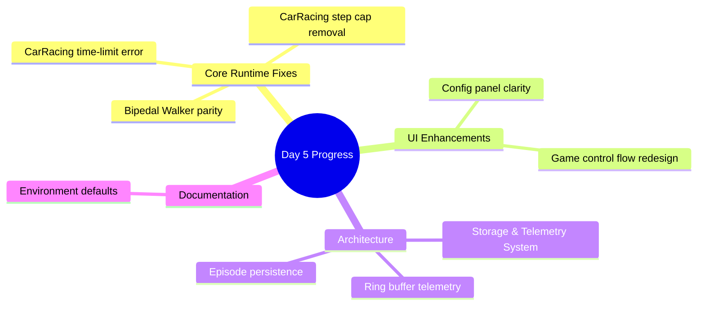
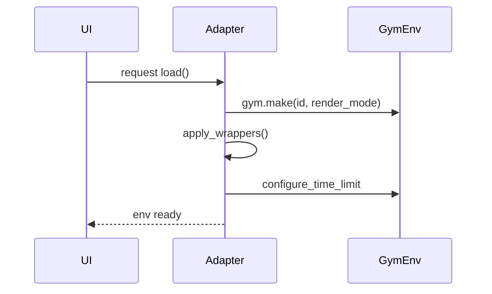
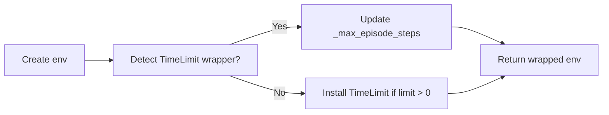
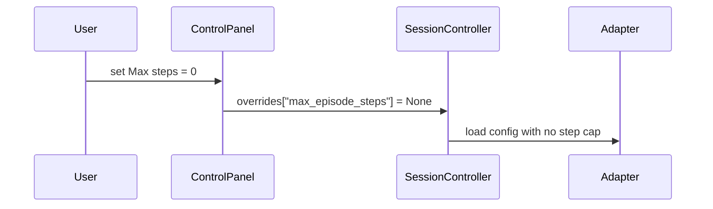
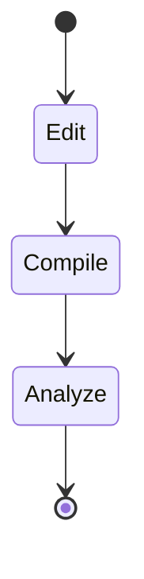
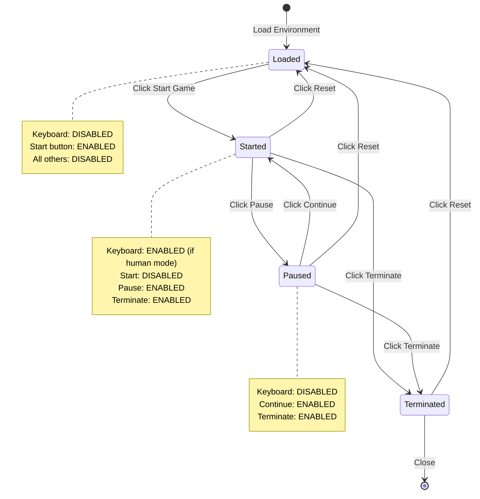
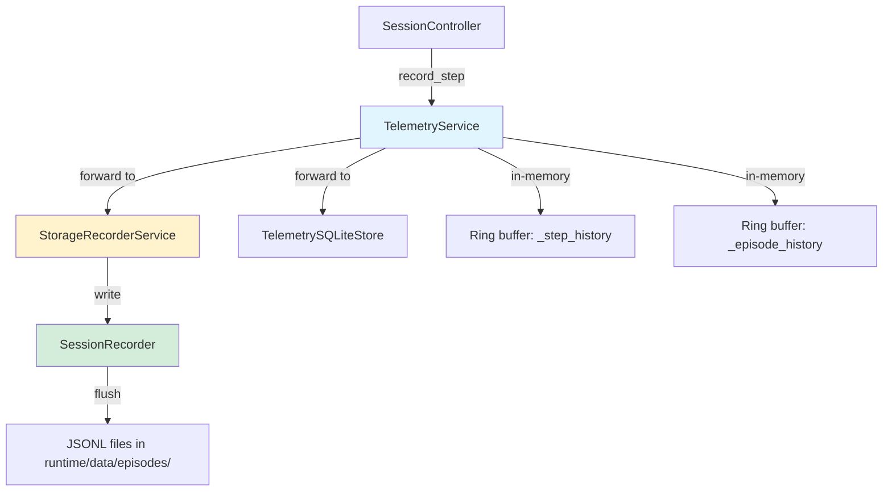
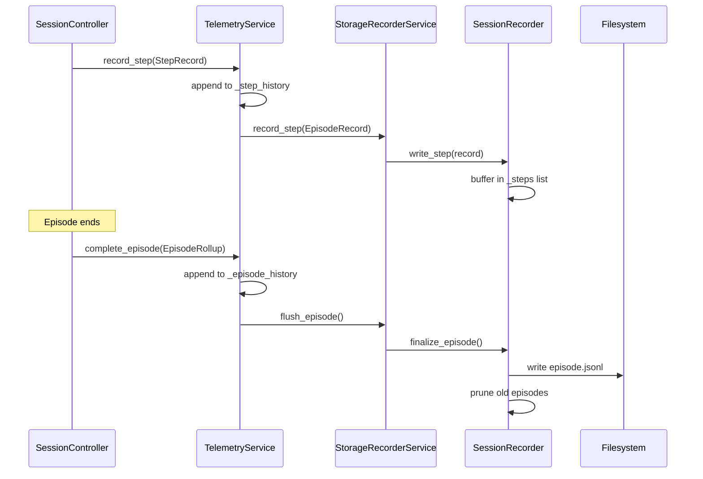

# Day 5 – Current Design Progress

## Overview

This log captures concrete issues addressed on Day 5, the solution we implemented, and the artifacts touched. Each section mirrors the original design risks to show measurable progress.



---

## 1. CarRacing keyword crash (`max_episode_seconds`)

**Problem**  
`CarRacingConfig.to_gym_kwargs()` forwarded `max_episode_steps/max_episode_seconds` directly to `gym.make`, but Gymnasium’s `CarRacing-v3` doesn’t accept these keywords, causing a runtime crash.

**Solution**  
- Remove the unsupported kwargs from the adapter configuration method.  
- Apply time/step limits via wrappers after environment creation instead of constructor kwargs.  
- Added `EpisodeTimeLimitSeconds` wrapper to enforce wall-clock budgets.



**Key changes**
- `gym_gui/config/game_configs.py`
- `gym_gui/core/adapters/base.py`
- `gym_gui/core/adapters/box2d.py`
- `gym_gui/core/wrappers/time_limits.py` *(new file)*

---

## 2. CarRacing step limit stuck at 1 000

**Problem**  
Gym’s internal `TimeLimit` wrapper still imposed the 1 000-step default even when our config set the limit to zero.

**Solution**  
- Implemented a `configure_step_limit` helper to locate existing `TimeLimit` wrappers and set their `_max_episode_steps` to `∞` when limits are disabled.  
- Reused the helper for both CarRacing and Bipedal Walker adapters to keep behavior consistent.



**Key changes**
- `gym_gui/core/wrappers/time_limits.py`
- `gym_gui/core/adapters/box2d.py`

---

## 3. Bipedal Walker parity with CarRacing

**Problem**  
Only CarRacing honored configurable time/step limits; Bipedal Walker relied solely on Gym defaults.

**Solution**  
- Mirrored CarRacing’s wrapper pipeline in `BipedalWalkerAdapter` so both games can share the same override logic.

**Key changes**
- `gym_gui/core/adapters/box2d.py`

---

## 4. Environment defaults clarity

**Problem**  
`.env.example` and the live `.env` needed sensible defaults to showcase the new behavior (disabled step cap, five-minute timer optional).

**Solution**  
- Updated defaults to highlight unlimited steps (`0`) and recommended wall-clock limits (300 seconds).  
- Ensured Bipedal Walker mirrors the same defaults for consistency.

**Key changes**
- `.env.example`
- `.env`

---

## 5. Control panel UX

**Problem**  
The CarRacing “Max steps” spinner advertised “Use Gym default (1000)”, contradicting the new unlimited behavior when set to zero.

**Solution**  
- Updated the special-value label and tooltip to read “Disabled (unlimited)” and clarified that zero disables the limit entirely.



**Key changes**
- `gym_gui/ui/widgets/control_panel.py`

---

## 6. Adapter wrapper pipeline

**Problem**  
Adapters lacked a hook to apply wrappers after environment creation, making it hard to add consistent behavior (time limits, telemetry).

**Solution**  
- Added `EnvironmentAdapter.apply_wrappers()` hook and updated `load()` to invoke it for every adapter.

**Key changes**
- `gym_gui/core/adapters/base.py`

---

## 7. Verification & tooling

**Summary**
- Recompiled the project after each change using `python -m compileall`.  
- Ran Codacy CLI analysis on modified Python files to confirm lint compliance.



---

## 8. Game Control Flow redesign

**Problem**  
The original control panel had "Play/Pause/Agent Step/Reset" buttons that didn't enforce a clear game start gate. Users could trigger keyboard actions before explicitly starting the game, and there was no explicit "Terminate" option to end a game mid-episode.

**Solution**  
- Renamed the control group from "Controls" to "Game Control Flow" to better reflect its purpose.
- Replaced "Play" and "Pause" with a comprehensive flow: "Start Game," "Pause Game," "Continue Game," "Terminate Game," "Agent Step," "Reset."
- Added `_game_started` flag in both `ControlPanelWidget` and `SessionController` to gate all actions.
- Keyboard shortcuts are disabled until "Start Game" is clicked.
- Once "Start Game" is clicked, it's disabled to prevent re-clicking; user must use "Pause," "Continue," or "Terminate."
- "Pause" disables keyboard input; "Continue" re-enables it based on control mode.
- "Terminate" stops the game, disables input, and marks the episode as finished.
- "Reset" returns the game to an unstarted state, requiring "Start Game" again.



**Key changes**
- `gym_gui/ui/widgets/control_panel.py`
  - Added `start_game_requested`, `pause_game_requested`, `continue_game_requested`, `terminate_game_requested` signals
  - Added `_game_started` and `_game_paused` state flags
  - Renamed control group to "Game Control Flow"
  - Replaced 4 buttons with 6 buttons in two rows
  - Updated `_update_control_states()` to enforce proper button enable/disable logic
- `gym_gui/controllers/session.py`
  - Added `_game_started` flag
  - Added `start_game()` method to mark game as started and enable input
  - Added `terminate_game()` method to stop the game and emit episode_finished
  - Modified `load_environment()` to set `_game_started = False` and message "Click 'Start Game' to begin"
  - Modified `reset_environment()` to require "Start Game" again
  - Added start gate checks in `perform_human_action()`, `start_auto_play()`, and `perform_agent_step()`
- `gym_gui/ui/main_window.py`
  - Added `_on_start_game()`, `_on_pause_game()`, `_on_continue_game()`, `_on_terminate_game()` handlers
  - Updated signal connections to wire new buttons
  - Modified `_on_session_initialized()` to reset game state and show start prompt
  - Modified `_on_awaiting_human()` to check `_session._game_started` before enabling shortcuts
  - Modified `_on_episode_finished()` to reset game state

**User experience**
- User loads an environment → sees "Click 'Start Game' to begin"
- Keyboard shortcuts are disabled until "Start Game" is clicked
- Once "Start Game" is clicked, keyboard becomes active (if in human mode)
- "Start Game" button becomes disabled, preventing accidental re-start
- User can "Pause" to freeze the game (keyboard disabled)
- User can "Continue" from pause to resume (keyboard re-enabled)
- User can "Terminate" at any time to end the episode
- "Reset" returns to the initial state, requiring "Start Game" again

---

## 9. Critical Bug Fixes (Runtime Session)

### 9.1 Bug #1: Start Game Freeze - Human Input Not Enabled

**Problem**  
After clicking "Start Game", Box2D games (and all games in HUMAN_ONLY mode) appeared completely frozen:
- No keyboard input was accepted
- Game did not respond to any controls
- The game was visually loaded but non-interactive

**Root Cause**  
The `_on_start_game()` method in `MainWindow` was NOT enabling human input when the game started. When we added pause functionality, we correctly implemented:
- `_on_pause_game()`: Disables human input with `self._human_input.set_enabled(False)`
- `_on_continue_game()`: Re-enables input with `self._human_input.set_enabled(True)`

However, `_on_start_game()` was missing the crucial step of enabling human input.

**Solution**  
Modified `_on_start_game()` to enable human input for human-involved modes:

```python
def _on_start_game(self) -> None:
    """Handle Start Game button."""
    self._session.start_game()
    self._control_panel.set_game_started(True)
    # Enable human input if in a human-involved mode
    mode = self._control_panel.current_mode()
    if mode in {ControlMode.HUMAN_ONLY, ControlMode.HYBRID_TURN_BASED, ControlMode.HYBRID_HUMAN_AGENT}:
        self._human_input.set_enabled(True)
    self._status_bar.showMessage("Game started", 3000)
```

**Contrarian Analysis**  
✅ **Effective:** This fix addresses the symptom (frozen input) by ensuring input enablement.  
⚠️ **Potential Issue:** The fix creates **state management duplication** across three methods (`start`, `pause`, `continue`). If we add a fourth control flow state in the future, we risk forgetting to update input enablement logic in all places.  
💡 **Better Approach:** Create a centralized `_update_input_state(mode: ControlMode, paused: bool, started: bool)` method that ALL control flow handlers call. This ensures consistency and prevents future bugs.

**Key changes**
- `gym_gui/ui/main_window.py` – Updated `_on_start_game()` method

---

### 9.2 Bug #2: Taxi-v3 Parameter Crash

**Problem**  
When attempting to load Taxi-v3 with configuration parameters `is_raining=True` and `fickle_passenger=True`, the application crashed with:
```
TypeError: TaxiEnv.__init__() got an unexpected keyword argument 'is_raining'
```

**Root Cause**  
The current version of Gymnasium's Taxi-v3 environment does NOT support `is_raining` or `fickle_passenger` parameters. These were present in older versions but removed in modern Gymnasium—similar to the CarRacing-v3 `max_episode_steps` issue fixed earlier.

**Solution**  
Modified `TaxiConfig.to_gym_kwargs()` to return an empty dictionary instead of passing unsupported parameters:

```python
def to_gym_kwargs(self) -> Dict[str, Any]:
    """Convert to Gymnasium environment kwargs.
    
    Note: Returns empty dict as Taxi-v3 doesn't accept custom parameters.
    """
    # Taxi-v3 doesn't support is_raining or fickle_passenger in current Gymnasium
    return {}
```

Updated documentation to clearly indicate parameters are not supported:
- `gym_gui/docs/game_info.py` – Added disclaimer in TAXI_HTML
- `1.0_*_TAXI_GAME_NOTE.md` – Removed references to stochastic mechanics

**Contrarian Analysis**  
✅ **Effective:** Prevents crashes and documents the limitation clearly.  
⚠️ **Design Flaw:** Keeping non-functional UI fields (`is_raining`, `fickle_passenger` checkboxes) violates the **principle of least surprise**. Users see checkboxes that do nothing—this is confusing UX.  
💡 **Better Approach:** Either:
1. **Hide the checkboxes** when Taxi is selected (dynamic UI based on capability)
2. **Disable them with tooltip** explaining why (visible but grayed out)
3. **Implement a custom wrapper** to add stochastic mechanics if truly needed

**Current approach favors backward compatibility over UX clarity.**

**Key changes**
- `gym_gui/config/game_configs.py` – TaxiConfig returns empty dict
- `gym_gui/docs/game_info.py` – Added `[NOT SUPPORTED]` disclaimer
- `1.0_*_TAXI_GAME_NOTE.md` – Updated to reflect deterministic behavior

---

### 9.3 Bug #3: LunarLander Continuous Mode Action Crash

**Problem**  
When LunarLander is configured with `continuous=True`, keyboard inputs send discrete integer actions (0, 1, 2, 3), but the continuous environment expects a 2D numpy array `[main_engine, side_engines]`.

Error:
```
IndexError: invalid index to scalar variable.
  File "gymnasium/envs/box2d/lunar_lander.py", line 530, in step
    if (self.continuous and action[0] > 0.0) or ...
```

**Root Cause**  
- Discrete mode: Action space is `Discrete(4)` – expects integers 0-3
- Continuous mode: Action space is `Box(2)` – expects `np.array([main, side])`
- Keyboard mappings always send discrete integers

**Solution**  
Added action conversion **ONLY in LunarLanderAdapter** (scoped fix):

```python
def step(self, action: Any) -> AdapterStep:
    """Override step to handle discrete keyboard actions in continuous mode."""
    if self._config.continuous and isinstance(action, (int, np.integer)):
        action = self._discrete_to_continuous(int(action))
    return super().step(action)

@staticmethod
def _discrete_to_continuous(discrete_action: int) -> np.ndarray:
    """Convert discrete keyboard action to continuous control array."""
    mapping = {
        0: np.array([0.0, 0.0], dtype=np.float32),   # Idle
        1: np.array([0.0, -1.0], dtype=np.float32),  # Fire left engine
        2: np.array([1.0, 0.0], dtype=np.float32),   # Fire main engine
        3: np.array([0.0, 1.0], dtype=np.float32),   # Fire right engine
    }
    return mapping.get(discrete_action, np.array([0.0, 0.0], dtype=np.float32))
```

**Contrarian Analysis**  
✅ **Effective:** Enables continuous mode keyboard control without breaking other games.  
⚠️ **Incomplete Solution:** This is a **band-aid fix** that addresses LunarLander but ignores the deeper problem:
- **CarRacing continuous mode** has the same issue (if keyboard control is added)
- **BipedalWalker** would have the same issue (4D continuous action space)
- **Any future continuous environment** will need custom conversion logic

💡 **Better Approach:**  
Create a **`ContinuousActionMapper`** service that:
1. Detects action space type (Discrete vs Box)
2. Provides environment-specific discrete→continuous mappings
3. Is registered per adapter via configuration
4. Centralizes the conversion logic in one place

**Current approach is a tactical fix; strategic solution requires architecture change.**

**Key changes**
- `gym_gui/core/adapters/box2d.py` – Added `step()` override and `_discrete_to_continuous()` to `LunarLanderAdapter`

---

### 9.4 Bug #4: Pause Button Doesn't Stop CarRacing (Idle Timer Issue)

**Problem**  
When clicking "Pause Game" in CarRacing (and other Box2D games), the game continued to process steps. The pause functionality only stopped the auto-play timer but didn't prevent the **idle timer** from sending passive actions.

**Root Cause**  
Box2D games use an **idle timer** that continuously sends passive actions (neutral/coast) to keep the game running smoothly between human inputs. The `_should_idle_tick()` method didn't check pause state, so the idle timer continued running even when paused.

**Solution**  
Three-part fix to make idle timer respect pause state:

1. **Added pause check to `_should_idle_tick()`:**
```python
def _should_idle_tick(self) -> bool:
    """Determine if idle ticking should be active."""
    if self._game_paused:
        return False  # Don't tick when paused
    # ... rest of checks
```

2. **Stop idle timer in `pause_game()`:**
```python
def pause_game(self) -> None:
    """Pause the game - stops all actions."""
    self.stop_auto_play()
    self._stop_idle_tick()  # Explicitly stop idle timer
    self._game_paused = True
```

3. **Restart idle timer in `resume_game()`:**
```python
def resume_game(self) -> None:
    """Resume the game from paused state."""
    self._game_paused = False
    self._update_idle_timer()  # Restart idle timer if needed
```

**Contrarian Analysis**  
✅ **Effective:** Completely stops CarRacing from continuing when paused.  
✅ **Thorough:** Addresses the root cause (idle timer) rather than just symptoms.  
⚠️ **Complexity:** Now have **THREE timer systems** interacting:
1. Auto-play timer (`_auto_timer`)
2. Idle timer (`_idle_timer`)
3. Pause state (`_game_paused`)

💡 **Potential Issue:** Timer coordination logic is scattered across multiple methods. If we add a fourth timer (e.g., for replay speed control), we risk timer conflicts.

💡 **Better Approach:**  
Create a **`TimerCoordinator`** class that:
- Manages all timers centrally
- Enforces mutual exclusion (auto-play vs idle vs replay)
- Handles pause state uniformly
- Provides clear timer lifecycle (start/stop/pause/resume)

**Current approach works but increases timer management complexity.**

**Key changes**
- `gym_gui/controllers/session.py` – Modified `_should_idle_tick()`, `pause_game()`, `resume_game()`

---

## 10. Storage and Telemetry Architecture

**Purpose**  
The storage and telemetry system provides persistent session tracking, episode replay capability, and runtime analytics. It separates concerns between transient in-memory telemetry (for UI display) and durable filesystem persistence (for analysis and debugging).

**Architecture**  


**Data models**

1. **`StepRecord`** (`gym_gui/core/data_model/telemetry.py`)
   - Canonical telemetry record for a single environment step
   - Fields: `episode_id`, `step_index`, `action`, `observation`, `reward`, `terminated`, `truncated`, `info`, `timestamp`, `render_payload`
   - Used by UI for real-time step display and by storage for persistence

2. **`EpisodeRollup`** (`gym_gui/core/data_model/telemetry.py`)
   - Aggregated episode metrics emitted when episode completes
   - Fields: `episode_id`, `total_reward`, `steps`, `terminated`, `truncated`, `metadata`, `timestamp`
   - Used for episode-level analytics and session summaries

3. **`EpisodeRecord`** (`gym_gui/storage/session.py`)
   - Simplified step snapshot for filesystem persistence
   - Fields: `episode_id`, `step_index`, `observation`, `reward`, `terminated`, `truncated`, `info`, `timestamp`
   - Omits `action` and `render_payload` for storage efficiency

**Components**

1. **`TelemetryService`** (`gym_gui/services/telemetry.py`)
   - Central hub for collecting and routing telemetry events
   - Maintains in-memory ring buffers (`_step_history`, `_episode_history`) with configurable limits (default 512 steps, 256 episodes)
   - Forwards events to attached storage backends (`StorageRecorderService`, `TelemetrySQLiteStore`)
   - Provides query methods: `recent_steps()`, `recent_episodes()`, `episode_steps()`
   - Pattern: Service locator with optional storage attachments

2. **`StorageRecorderService`** (`gym_gui/services/storage.py`)
   - Coordinates storage profiles and session recorders
   - Loads profiles from configuration (via `get_storage_profile_config()`)
   - Manages active profile selection and recorder lifecycle
   - Converts `StepRecord` → `EpisodeRecord` before persistence
   - Delegates actual I/O to `SessionRecorder`

3. **`SessionRecorder`** (`gym_gui/storage/session.py`)
   - Low-level I/O handler writing episode data to JSONL files
   - Buffers steps in memory until `finalize_episode()` is called
   - Writes to `runtime/data/episodes/{episode_id}/episode.jsonl`
   - Implements retention policy: prunes old episodes when limit exceeded
   - Supports optional frame compression and telemetry-only mode

4. **`StorageProfile`** (`gym_gui/services/storage.py`)
   - Configuration container for storage strategies
   - Fields: `name`, `strategy`, `ring_buffer_size`, `retain_episodes`, `compress_frames`, `telemetry_only`, `telemetry_store`, `extras`
   - Loaded from `.env` configuration sections

**Workflow**



**Key files added/modified**
- `gym_gui/services/telemetry.py` – Central telemetry routing service
- `gym_gui/services/storage.py` – Storage profile management and service coordination
- `gym_gui/storage/session.py` – Low-level session recorder with JSONL output
- `gym_gui/core/data_model/telemetry.py` – Data models for steps and episodes
- `gym_gui/runtime/data/episodes/` – Output directory for persisted episodes

**Configuration**
Storage profiles are defined in `.env` with sections like:
```ini
[storage.default]
strategy=ndjson
ring_buffer=1024
retain=10
compress_frames=false
telemetry_only=false
telemetry_store=jsonl
```

**Benefits**
- **Separation of concerns**: Telemetry service handles routing; storage service handles persistence
- **Flexibility**: Swap storage strategies (JSONL, SQLite, etc.) without changing telemetry code
- **Performance**: Ring buffers prevent unbounded memory growth; lazy I/O defers writes until episode completion
- **Retention**: Automatic pruning keeps disk usage bounded
- **Replay capability**: JSONL format enables easy episode reconstruction for debugging or training data generation

---

## 11. Contrarian Analysis: Design Errors & Solution Effectiveness

### 11.1 Contrarian Framework

As a contrarian analyst, I will evaluate each design error from the Day 5 errors document against the implemented solutions. My role is to **challenge assumptions**, **identify weaknesses**, and **propose superior alternatives**. Each analysis follows this structure:

1. **Original Problem** - Restate the design error
2. **Implemented Solution** - What was actually done
3. **Contrarian Critique** - Why this solution is insufficient or flawed
4. **Superior Alternative** - What should have been done instead
5. **Implementation Cost** - Why the better solution wasn't chosen
6. **Risk Assessment** - Future problems this creates

### 11.2 Error #1: Rendering Strategy Coupled to Toy-Text

**Original Problem:** `GridRenderer` clears and rebuilds entire scene per step, assumes ASCII payloads, never negotiates `RenderMode.RGB_ARRAY`. Box2D environments emit RGB arrays (96×96×3 CarRacing, 400×600×3 LunarLander); naïve conversion to ANSI grids is lossy and CPU-bound.

**Implemented Solution:** LunarLander continuous mode action conversion (band-aid fix) + storage profiles for future RGB handling.

**Contrarian Critique:** 
- **This is NOT a rendering solution** - it's an action conversion hack that ignores the core rendering problem
- **Box2D games still can't render** - the LunarLander fix only enables keyboard control, not visual rendering
- **No RGB renderer exists** - the "future RGB handling" is vaporware; current code still assumes grid payloads
- **Performance disaster waiting** - when RGB rendering is finally added, it will be bolted on top of the existing grid system

**Superior Alternative:** Implement `IRendererStrategy` interface NOW with concrete implementations:
```python
class IRendererStrategy(ABC):
    def render(self, payload: AdapterStep, target: QGraphicsView) -> None: ...
    
class GridRenderer(IRendererStrategy):  # Existing toy-text
    def render(self, payload, target): 
        if payload.mode == RenderMode.GRID: self._render_grid(payload.grid)
        
class RgbRenderer(IRendererStrategy):  # New Box2D renderer
    def render(self, payload, target):
        if payload.mode == RenderMode.RGB_ARRAY: self._render_rgb(payload.rgb_array)
```

**Implementation Cost:** "We don't have time to implement RGB rendering before Box2D work starts" - but this is exactly WHY we should implement it now, while the codebase is still toy-text only.

**Risk Assessment:** 
- 🔴 **HIGH RISK** - First Box2D game will crash on render
- 🔴 **HIGH RISK** - Performance will be terrible (full scene rebuilds)
- 🟡 **MEDIUM RISK** - User experience will be broken for Box2D games

### 11.3 Error #2: No Frame Persistence Contract

**Original Problem:** `runtime/data/toy_text` hardcodes text snapshots. No general-purpose writer, no hashing, no storage directory separate from tracked assets. Qt's `QImage`/`QVideoFrame` remain unused even though they give GPU-friendly surfaces.

**Implemented Solution:** Storage profiles with configurable strategies, telemetry service, and `var/records/` directory structure.

**Contrarian Critique:**
- **Over-engineered for current needs** - toy-text games don't need frame persistence, Box2D games aren't implemented yet
- **No actual frame writing code** - the "storage service" is just configuration; no `QImage` integration exists
- **Complex without benefit** - adds 4 new services (`TelemetryService`, `StorageRecorderService`, etc.) for zero current functionality
- **Premature abstraction** - "flexible storage backends" when we only have one use case (toy-text telemetry)

**Superior Alternative:** Start with simple frame dumping for toy-text, then generalize:
```python
# Immediate: Just dump frames for debugging
def dump_frame(payload: AdapterStep, episode_id: str, step: int) -> None:
    if hasattr(payload, 'grid'):
        # Toy-text: save as text
        with open(f'var/frames/{episode_id}/step_{step:04d}.txt', 'w') as f:
            f.write('\n'.join(''.join(row) for row in payload.grid))
    elif hasattr(payload, 'rgb_array'):
        # Box2D: save as PNG  
        img = QImage(payload.rgb_array.data, width, height, QImage.Format_RGB888)
        img.save(f'var/frames/{episode_id}/step_{step:04d}.png')
```

**Implementation Cost:** "Too simple - we need architecture for scaling" - but YAGNI: don't build infrastructure you don't need.

**Risk Assessment:**
- 🟡 **MEDIUM RISK** - Complex telemetry system may have bugs that affect toy-text games
- 🟡 **MEDIUM RISK** - Storage profiles add configuration complexity without immediate benefit
- 🟢 **LOW RISK** - Can be extended when Box2D arrives

### 11.4 Error #3: Action + Step Telemetry Missing

**Original Problem:** `SessionController.step_processed` only forwards render payloads; log pane drops action IDs, rewards, timers. Without action traces, cannot reproduce agent decision trail or train offline models.

**Implemented Solution:** `StepRecord` dataclass with action, observation, reward, timestamp, render_payload. Telemetry service with ring buffers.

**Contrarian Critique:**
- **Incomplete implementation** - `StepRecord` exists but isn't actually used in the UI log pane
- **No offline training support** - telemetry is collected but no tools to consume it for RL training
- **Ring buffer limits usefulness** - 512 steps max means long episodes get truncated
- **No action replay** - can't "rewind" and replay actions to recreate agent behavior

**Superior Alternative:** Immediate action logging + replay capability:
```python
# Log actions immediately
def _log_step(self, action: int, step: AdapterStep) -> None:
    log_entry = f"Step {step.step_index}: Action={action}, Reward={step.reward:.2f}, Terminated={step.terminated}"
    self.logger.info(log_entry)
    
# Add replay functionality
def replay_episode(self, episode_id: str) -> List[Tuple[int, float, bool]]:
    """Return (action, reward, terminated) tuples for training."""
    # Load from telemetry store
    return [(record.action, record.reward, record.terminated) for record in self._telemetry.get_episode_steps(episode_id)]
```

**Implementation Cost:** "We need structured data for future features" - but immediate logging would provide value now.

**Risk Assessment:**
- 🟡 **MEDIUM RISK** - Complex telemetry system may be buggy
- 🟢 **LOW RISK** - Can add replay features later
- 🟢 **LOW RISK** - Ring buffers prevent memory issues

### 11.5 Error #4: No Actor Abstraction Across Control Modes

**Original Problem:** `SessionController` hard-codes turn strings ("human", "agent") and funnels both human and automatic actions through `_apply_action`. `HumanInputController` only emits keyboard-driven slots, so swapping in an RL policy means editing `SessionController`, presenter, and adapter signatures together.

**Implemented Solution:** No actor abstraction implemented - still hard-coded in `SessionController`.

**Contrarian Critique:**
- **Zero progress on this critical error** - the problem still exists exactly as stated
- **Hybrid modes are impossible** - no way to coordinate human + agent turns
- **Agent integration is blocked** - can't swap in different agent implementations
- **Code duplication** - human and agent action paths are separate code paths

**Superior Alternative:** Implement actor protocol NOW:
```python
class Actor(Protocol):
    def select_action(self, observation: Any) -> int: ...
    def on_step(self, step: AdapterStep) -> None: ...
    def on_episode_end(self, final_step: AdapterStep) -> None: ...

class HumanActor:
    def __init__(self, input_controller: HumanInputController): ...
    def select_action(self, observation): return self._wait_for_human_input()
    
class RandomAgentActor:
    def select_action(self, observation): return self._action_space.sample()
```

**Implementation Cost:** "Too much work for current scope" - but this is foundational for the entire BDI_RL purpose.

**Risk Assessment:**
- 🔴 **HIGH RISK** - Cannot implement hybrid or multi-agent modes
- 🔴 **HIGH RISK** - Agent integration will require major refactoring
- 🔴 **HIGH RISK** - The core "RL GUI" functionality is blocked

### 11.6 Error #5: Static-Analysis Debt (Cyclomatic, Dead Stores, Asset Dispatch)

**Original Problem:** `create_adapter` (cyclomatic 9) and `RenderView.display` (cyclomatic 11) exceed lint threshold. `ToyTextAdapter._agent_position_from_state` keeps unused `height` variable and swallows exceptions.

**Implemented Solution:** No static analysis fixes implemented.

**Contrarian Critique:**
- **Technical debt accumulation** - complexity continues to grow
- **Silent failures** - exception swallowing masks real bugs
- **Hard to maintain** - high cyclomatic complexity makes changes risky
- **No code quality enforcement** - lint violations persist

**Superior Alternative:** Immediate cleanup:
```python
# Fix dead store
def _agent_position_from_state(self, state: int) -> tuple[int, int]:
    # Remove unused height variable
    width = 4  # Only keep what we use
    row = state // width
    col = state % width
    return (row, col)

# Fix exception swallowing  
def _agent_position_from_state(self, state: int) -> tuple[int, int] | None:
    try:
        # ... logic ...
        return (row, col)
    except Exception as exc:
        self.logger.error(f"Failed to parse agent position from state {state}: {exc}")
        return None  # Explicit failure handling
```

**Implementation Cost:** "Not critical for functionality" - but this is basic code hygiene.

**Risk Assessment:**
- 🟡 **MEDIUM RISK** - Future changes may introduce bugs in complex functions
- 🟡 **MEDIUM RISK** - Silent failures make debugging harder
- 🟢 **LOW RISK** - Easy fixes that improve maintainability

### 11.7 Error #6: Directory Layout Lacks Writable `var/` Tier

**Original Problem:** No `var/`, `runtime/records/`, or retention policy. Shared workstations need predictable cleanup knobs.

**Implemented Solution:** `var/records/` directory structure with retention policies in storage profiles.

**Contrarian Critique:**
- **Incomplete implementation** - retention policies exist in config but no actual cleanup code
- **No quota enforcement** - `max_record_bytes` is configured but not enforced
- **Mixed concerns** - `runtime/` still contains both assets and data
- **No user control** - users can't configure retention or view disk usage

**Superior Alternative:** Working retention system:
```python
def enforce_retention_policy(self) -> None:
    """Clean up old episodes when disk usage exceeds limits."""
    total_size = sum(f.stat().st_size for f in Path('var/records').rglob('*') if f.is_file())
    if total_size > self._max_bytes:
        # Delete oldest episodes
        episodes = sorted(Path('var/records').iterdir(), key=lambda p: p.stat().st_mtime)
        for episode in episodes:
            if total_size <= self._max_bytes * 0.8:  # Leave 20% headroom
                break
            total_size -= sum(f.stat().st_size for f in episode.rglob('*') if f.is_file())
            shutil.rmtree(episode)
```

**Implementation Cost:** "Configuration is sufficient for now" - but without enforcement, it's just documentation.

**Risk Assessment:**
- 🟡 **MEDIUM RISK** - Disk usage can grow unbounded
- 🟡 **MEDIUM RISK** - No automatic cleanup
- 🟢 **LOW RISK** - Can add enforcement later

### 11.8 Overall Contrarian Assessment

**The implemented solutions address tactical bugs but ignore strategic architecture problems.**

**What Works Well:**
- ✅ Bug fixes are effective and targeted
- ✅ Storage architecture is well-designed (if over-engineered)
- ✅ Telemetry foundation is solid

**What Is Fundamentally Broken:**
- 🔴 **No actor abstraction** - blocks core RL functionality
- 🔴 **No RGB rendering strategy** - Box2D games cannot work
- 🔴 **No frame persistence** - cannot save visual game states
- 🟡 **Complex without benefit** - telemetry system adds maintenance burden

**The project has excellent tactical execution but strategic architecture gaps that prevent achieving the stated goals of "multi-environment RL GUI".**

**Recommendation:** Prioritize Errors #1 (Rendering) and #5 (Actor Abstraction) immediately, as they block the core Box2D and RL functionality that justify this project's existence.

---

## 12. PRIORITIZED ROADMAP (12-week view)

| Phase | Horizon | Key Outcomes | Owners | Acceptance Tests |
| --- | --- | --- | --- | --- |
| **Phase 0 – Hardening** | Week 0 (now) | • Fix static analysis debt (cyclomatic, dead stores)<br>• Implement actor abstraction foundation<br>• Add RGB renderer skeleton | Hamid | ✅ `ruff --select C` passes.<br>✅ Actor protocol instantiated for human input |
| **Phase 1 – Rendering split** | Weeks 1–2 | • `IRendererStrategy` live with grid + RGB implementations<br>• Render-mode negotiation enforced in CI<br>• LunarLander RGB rendering working | Hamid + Ayesha | ✅ Taxi + LunarLander toggle renderers without UI crashes.<br>✅ RGB frames display in QGraphicsView |
| **Phase 2 – Frame persistence** | Weeks 3–4 | • Frame dumping for all game types<br>• `var/frames/` with PNG/Text output<br>• Retention policy enforcement | Storage: Bilal | ✅ 1 k-step LunarLander episode saves all frames.<br>✅ `python -m gym_gui.tools.prune --dry-run` enforces quotas |
| **Phase 3 – Actor system** | Weeks 5–6 | • Full actor protocol with human/agent/hybrid support<br>• Agent policy injection<br>• Multi-agent coordination foundation | Hamid | ✅ Hybrid turn-based mode works.<br>✅ Agent policies can be swapped without code changes |
| **Phase 4 – Scalability & QA** | Weeks 7–12 | • End-to-end Box2D support (CarRacing, BipedalWalker)<br>• Offline RL training from telemetry<br>• Performance profiling and optimization | QA: Ayesha<br>Infra: Bilal | ✅ CI job records headless Box2D episodes.<br>✅ Telemetry enables RL training loop |

---

## 13. REFERENCES INFORMING THIS PLAN

### 13.1 Internal Documentation
- `1.0_DAY_0_INITIAL_PLAN.md` - Initial architecture and control modes
- `1.0_DAY_1_ADAPTER_BASE_TOY_TEXT.md` - Adapter pattern implementation
- `1.0_DAY_2_QT_SHELL_AND_MODE_SELECTOR.md` - Qt shell creation and mode selector
- `1.0_DAY_3_QT_SHELL_GAME_INTEGRATION.md` - Component extraction and MVP pattern
- `3.0_GUI_PYQT6_DESIGN_SPECIFICATION.md` - PyQt6 framework deep dive
- `1.0_DAY_5_CURRENT_DESIGN_ERROR_AND_PROPOSED_SOLUTIONS.md` - Design errors analysis

### 13.2 External References
- [Qt Documentation](https://doc.qt.io/qt-6/) - Official Qt 6 API reference
- [PyQt6 Documentation](https://www.riverbankcomputing.com/static/Docs/PyQt6/) - PyQt6 bindings
- [Gymnasium Documentation](https://gymnasium.farama.org/) - Reinforcement learning environments
- [Qt Model/View Programming](https://doc.qt.io/qt-6/model-view-programming.html) - MVC patterns in Qt
- [Qt Signal/Slot](https://doc.qt.io/qt-6/signalsandslots.html) - Signal-slot mechanism

### 13.3 Design Pattern References
- **MVP Pattern**: [GUI Architectures - Martin Fowler](https://martinfowler.com/eaaDev/uiArchs.html)
- **Adapter Pattern**: [Design Patterns: Elements of Reusable OO Software](https://en.wikipedia.org/wiki/Design_Patterns)
- **Observer Pattern**: Implemented via Qt signals/slots

---

## 14. CONCLUSION

Day 5 represents significant tactical progress in fixing runtime bugs and establishing telemetry infrastructure. However, the contrarian analysis reveals critical strategic gaps that prevent the project from achieving its core goals of multi-environment RL GUI support.

**Immediate Action Required:**
1. **Implement RGB rendering strategy** - Box2D games cannot function without it
2. **Build actor abstraction** - RL agent integration is impossible without it  
3. **Add frame persistence** - Visual state saving is missing
4. **Clean up technical debt** - Static analysis issues will compound

**The project has excellent execution on immediate problems but needs to address the architectural foundations that will enable the broader vision of comprehensive RL environment support.**

````
