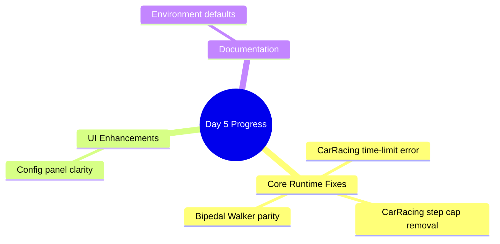
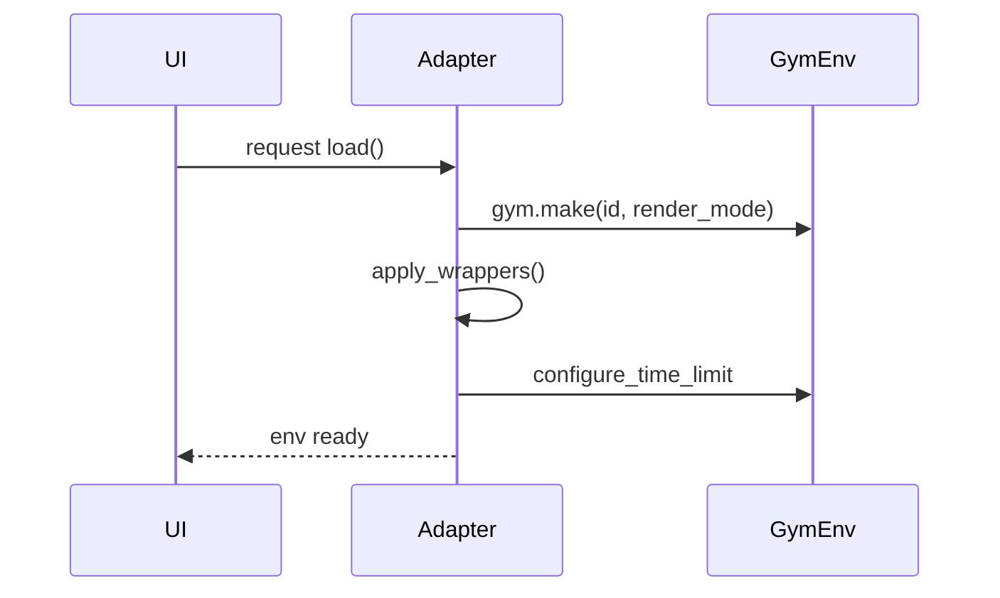
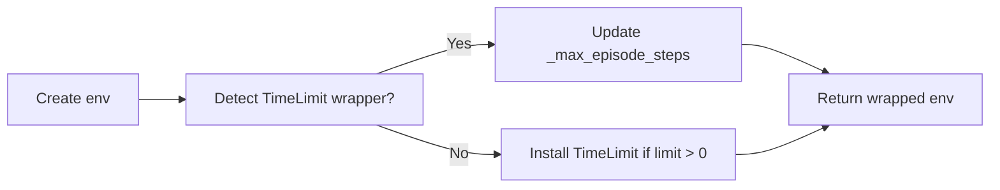
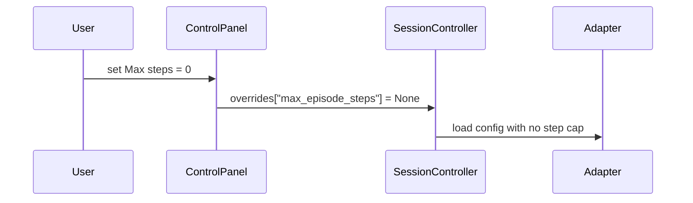
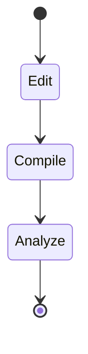

# Day 5 – Current Design Progress

## Overview

This log captures concrete issues addressed on Day 5, the solution we implemented, and the artifacts touched. Each section mirrors the original design risks to show measurable progress.

---

## 1. CarRacing keyword crash (`max_episode_seconds`)

**Problem**  
`CarRacingConfig.to_gym_kwargs()` forwarded `max_episode_steps/max_episode_seconds` directly to `gym.make`, but Gymnasium’s `CarRacing-v3` doesn’t accept these keywords, causing a runtime crash.

**Solution**  
- Remove the unsupported kwargs from the adapter configuration method.  
- Apply time/step limits via wrappers after environment creation instead of constructor kwargs.  
- Added `EpisodeTimeLimitSeconds` wrapper to enforce wall-clock budgets.

**Key changes**
- `gym_gui/config/game_configs.py`
- `gym_gui/core/adapters/base.py`
- `gym_gui/core/adapters/box2d.py`
- `gym_gui/core/wrappers/time_limits.py` *(new file)*

---

## 2. CarRacing step limit stuck at 1 000

**Problem**  
Gym’s internal `TimeLimit` wrapper still imposed the 1 000-step default even when our config set the limit to zero.

**Solution**  
- Implemented a `configure_step_limit` helper to locate existing `TimeLimit` wrappers and set their `_max_episode_steps` to `∞` when limits are disabled.  
- Reused the helper for both CarRacing and Bipedal Walker adapters to keep behavior consistent.

**Key changes**
- `gym_gui/core/wrappers/time_limits.py`
- `gym_gui/core/adapters/box2d.py`

---

## 3. Bipedal Walker parity with CarRacing

**Problem**  
Only CarRacing honored configurable time/step limits; Bipedal Walker relied solely on Gym defaults.

**Solution**  
- Mirrored CarRacing’s wrapper pipeline in `BipedalWalkerAdapter` so both games can share the same override logic.

**Key changes**
- `gym_gui/core/adapters/box2d.py`

---

## 4. Environment defaults clarity

**Problem**  
`.env.example` and the live `.env` needed sensible defaults to showcase the new behavior (disabled step cap, five-minute timer optional).

**Solution**  
- Updated defaults to highlight unlimited steps (`0`) and recommended wall-clock limits (300 seconds).  
- Ensured Bipedal Walker mirrors the same defaults for consistency.

**Key changes**
- `.env.example`
- `.env`

---

## 5. Control panel UX

**Problem**  
The CarRacing “Max steps” spinner advertised “Use Gym default (1000)”, contradicting the new unlimited behavior when set to zero.

**Solution**  
- Updated the special-value label and tooltip to read “Disabled (unlimited)” and clarified that zero disables the limit entirely.

**Key changes**
- `gym_gui/ui/widgets/control_panel.py`

---

## 6. Adapter wrapper pipeline

**Problem**  
Adapters lacked a hook to apply wrappers after environment creation, making it hard to add consistent behavior (time limits, telemetry).

**Solution**  
- Added `EnvironmentAdapter.apply_wrappers()` hook and updated `load()` to invoke it for every adapter.

**Key changes**
- `gym_gui/core/adapters/base.py`

---

## 7. Verification & tooling

**Summary**
- Recompiled the project after each change using `python -m compileall`.  
- Ran Codacy CLI analysis on modified Python files to confirm lint compliance.

