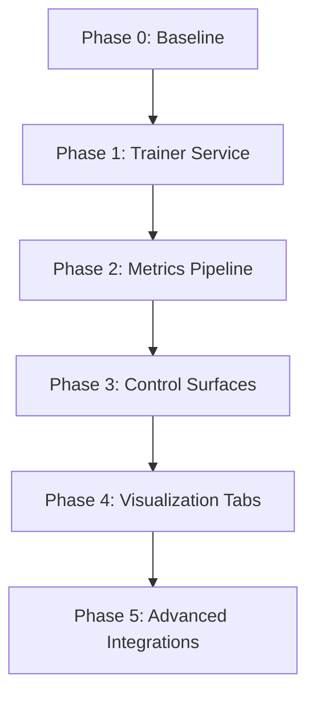
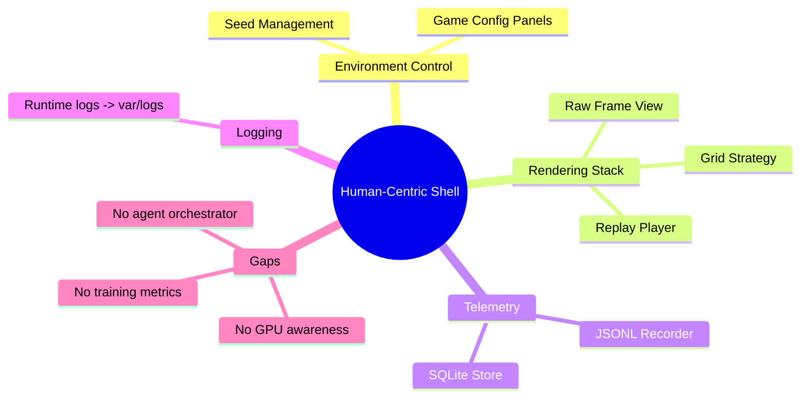
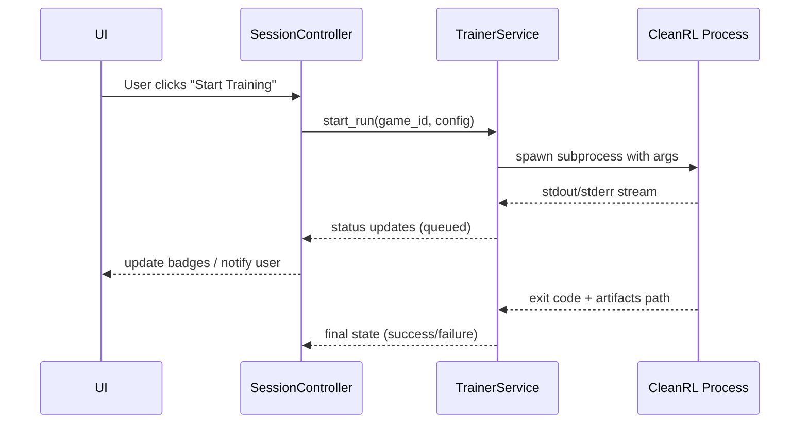
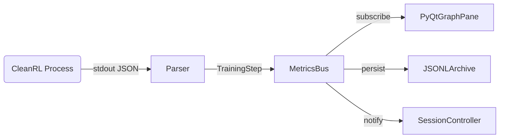
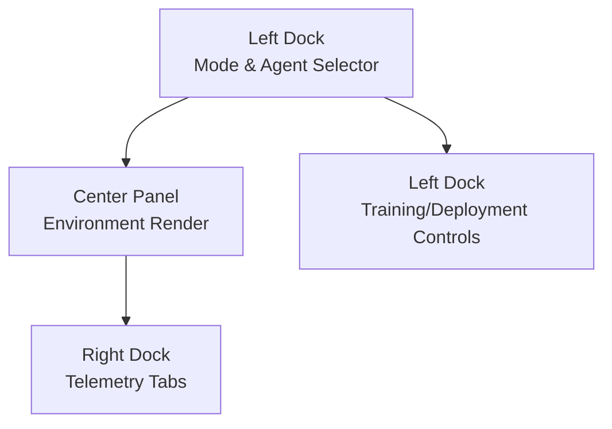
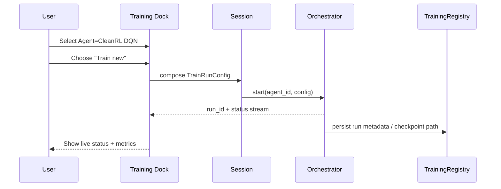
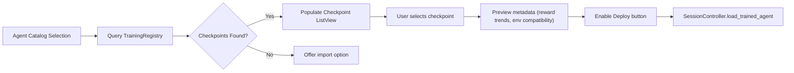
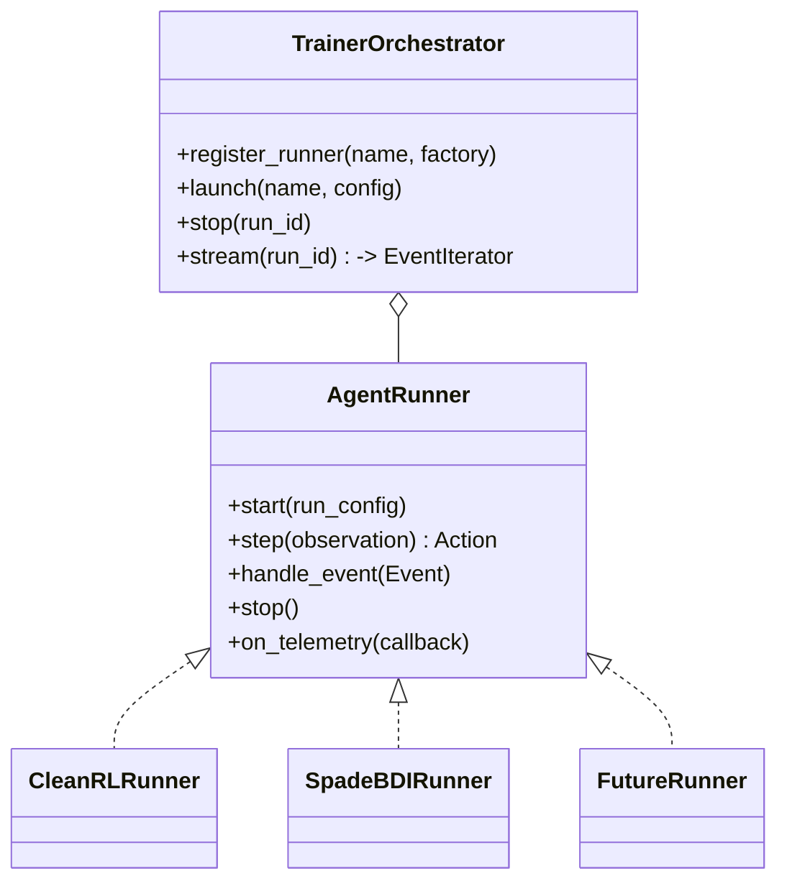

# Day 7 – Agent RL Integration (Contrarian Plan)

## Guiding Intent
- Transition from human-only workflows toward orchestrated agent training and evaluation while **preserving UI responsiveness** and **avoiding premature entanglement** with heavy trainer dependencies.
- Leverage CleanRL single-file learners without embedding their CLI ergonomics directly into the GUI until we prove we can orchestrate, monitor, and recover from runs programmatically.
- Maintain optionality for TensorBoard, Weights & Biases, and PyQtGraph dashboards without hard-wiring heavyweight web runtimes into the shell.

> **Contrarian stance:** Every addition must pay rent. If a feature can’t demonstrate resilience against GPU unavailability, long-running training jobs, or operator error, defer it. The plan below emphasises staged validation over UI flash.

---

## Phase Overview (High-Level)

1. **Phase 0 – Baseline**: Catalogue current UI layout, control modes, data paths, and ensure Box2D agents run deterministically with seeded configs.
2. **Phase 1 – Trainer Service**: Build a headless orchestration layer able to launch CleanRL jobs, stream logs, and handle failure states without UI coupling.
3. **Phase 2 – Metrics Pipeline**: Normalize training telemetry (reward curves, loss, wall-clock) and deliver it to observers via an internal bus.
4. **Phase 3 – Control Surfaces**: Introduce minimal UI affordances (buttons, status badges) to start/stop runs and show health states.
5. **Phase 4 – Visualization Tabs**: Add PyQtGraph views first (local rendering), then gated launchers for TensorBoard/W&B instead of embedded browsers.
6. **Phase 5 – Advanced Integrations**: Optional in-app web views, run schedulers, cloud offloading, GPU diagnostics.

---

## Current State Inventory

- **Control Modes:** Only human-only flows are exercised. Hybrid/agent modes exist on paper but lack automated policies.
- **Data Persistence:** Episode records and telemetry are structured, enabling replay but not training ingestion.
- **External Dependencies:** CleanRL repo already includes successful CartPole DQN runs under `cleanrl/runs/` (TensorBoard events confirm logging works); pyqtgraph vendor tree still lets us embed charts locally without QtWebEngine.

---

## Reality Check – CleanRL & CORL Expectations

- **CleanRL fundamentals:**
  - Single-file scripts (e.g., `cleanrl/dqn.py`, `cleanrl/ppo.py`) are meant to be launched via `uv run python ...` or plain `python ...` with Python < 3.11. They are not import-friendly, so our integration must treat them as subprocess workloads.
  - Logging defaults to TensorBoard (`runs/`) and optionally W&B. Our plan to stream stdout JSON aligns, but we must also parse event files if we want richer metrics beyond what stdout provides.
  - Existing `CartPole-v1` DQN run in `cleanrl/runs/CartPole-v1__dqn__1__1760220680` validates TrainerService MVP assumptions; we should mine it to confirm schema for reward curves.
- **CORL (offline RL) fundamentals:**
  - Similar single-file style but offline datasets (D4RL, Antmaze, Adroit) are required. Scripts expect dataset paths/env registration plus optional offline-to-online fine-tuning.
  - CORL emphasizes experiment tracking in W&B; no tensorboard by default. We must bake W&B credentials prompts or provide storage fallbacks when offline.
  - Offline workloads can run much longer and rely on GPU; our scheduler must flag disk footprint of downloaded datasets and warn users early.
- **Consequence for the plan:** TrainerService needs adapters for both `CleanRLRunner` (online) and `CORLRunner` (offline) with different pre-flight checks (dataset availability, W&B creds, GPU readiness).

---

---

## Phase 1 – Trainer Service (Contrarian Highlights)

| Concern | Mitigation | Deliverable |
|---------|------------|-------------|
| We need reproducible training launches without hijacking the GUI thread. | Spawn trainers as managed subprocesses via a dedicated `TrainerService` (async event loop, queue-based RPC). | `services/trainer.py` with APIs: `start_run(config)`, `stop_run(run_id)`, `stream_log(run_id)`. |
| CleanRL expects CLI args & GPU context. | Generate config files / CLI args in temp dirs; inspect `torch.cuda.is_available()` before launch. | Thin wrapper around CleanRL modules using `python -m cleanrl.dqn --cfg` style invocation. |
| Crash recovery & orphaned runs. | Implement PID tracking, exit-status reporting, and cleanup hooks. | Run registry persisted under `var/training/runs.jsonl`. |

**Diagram – Trainer launch flow**

**Contrarian checkpoints**
- No terminal embedding yet—logs stream through structured channels (e.g., `asyncio.Queue`, websockets).
- Training launch is blocked if GPU check fails *and* the selected algorithm requires CUDA.
- Validate Python version (<3.11) and prefer invoking scripts through `uv run python cleanrl/...` when available; fall back to `python` only if environment matches CleanRL requirements.
- The service is CLI-agnostic; future trainers (Stable-Baselines, offline learners) can reuse the orchestration layer.

---

## Phase 2 – Metrics Pipeline

- **Goal:** Convert raw trainer streams into metrics consumable by UI, disk exporters, and optional dashboards.
- **Approach:**
  - Parse CleanRL log outputs (stdout JSON lines or `wandb/run.log`) into canonical events (`TrainingStep`, `EpisodeSummary`).
  - Publish via `TelemetryService`-like bus: `TrainingTelemetryService` with ring buffers in memory + JSONL archive under `var/training/metrics/`.
  - Provide query API: `recent_metrics(run_id, count)` for PyQtGraph, `export_to_tensorboard(run_id)` for optional TB launch.
- **Contrarian warnings:**
  - Resist direct file polling (race conditions); prefer streaming from TrainerService.
  - Validate schema versioning; CleanRL log format may change between releases.

---

## Phase 3 – Control Surfaces

- **Minimal UI additions:**
  - "Train Agent" button in control panel when Agent/Hybrid modes selected.
  - Status badge (Idle / Running / Error) + elapsed time.
  - Log drawer referencing TrainerService streaming output (text area with auto-truncation, not a full terminal emulator).
- **Contrarian trap:** Avoid mixing training controls into the same column as human gameplay to prevent modal confusion. Consider a collapsible "Training" dock that can be hidden.
- **Error UX:** Show actionable messages (missing CUDA, CleanRL script missing, run failure exit code).

---

## Layout & Run Selection Blueprint (Train vs Deploy)

### Structural Layout

- **Left Dock (Collapsible)**
  1. **Mode Switcher**: `Human | Hybrid | Agent` segmented control.
  2. **Agent Catalog**: Combo box bound to `TrainerOrchestrator.registered_runners()` (CleanRL DQN, CleanRL PPO, SpadeBDI, Future...).
  3. **Operation Toggle**: Pill buttons `Train new` vs `Use trained` (defaults to last selection per agent).
- **Center Stage** remains the environment render, untouched during training to avoid UI thrash.
- **Right Dock** hosts PyQtGraph charts, run metadata, checkpoint history, and keeps scrollable context out of the main viewport.
- **Bottom Snackbar** (optional) for transient alerts (run started, checkpoint load failed, etc.).

> **Contrarian guardrail:** Training widgets stay hidden until `Agent` mode is selected. No global modals; all actions must be reversible without killing the app.

### Train-New Workflow

- **Run Config Panel** (collapsible drawer): hyperparameters, seed, max episodes.
- **Launch Button** disabled until required fields validated (env compatibility, GPU readiness, dependencies satisfied).
- **Checkpoint Policy**: orchestrator writes metadata (`run_id`, `agent`, `env`, `checkpoint_uri`, `metrics_digest`) to `var/training/runs.jsonl` for later discovery.
- **Cancel Button**: sends `stop(run_id)` through orchestrator and surfaces termination reason in status badge.

### Use-Trained Workflow & Checkpoint Picker

- **Checkpoint Browser Panel**
  - Displays cards grouped by environment & algorithm; highlight most recent successful run.
  - Each card shows reward summary, training date, storage profile (local/remote), and integrity status (hash match).
  - "Import" action for manually added checkpoints (copies into managed storage + registers metadata).
- **Deploy Button** executes `AgentService.load_policy(agent_id, checkpoint_uri)` asynchronously. Success flips the session into playback mode; failure raises inline error with diagnostics.
- **Warm-Start Option**: For training mode, allow selecting an existing checkpoint as initialization (enabled only if runner advertises support via capability matrix).

### Capability Matrix & Dynamic UI

| Feature | CleanRLRunner | SpadeBDIRunner | Notes |
|---------|---------------|----------------|-------|
| Offline inference | ✅ load `.pt` weights | ✅ load Q-table | Will call respective adapter hooks. |
| Warm-start training | ✅ (where algorithm supports) | ✅ (Q-table seeds) | UI exposes when `runner.supports_warmstart` true. |
| External dependencies | PyTorch GPU optional | XMPP service required | UI displays readiness badges beside agent selector. |
| Live belief telemetry | ❌ | ✅ optional | Adds extra telemetry tab when available. |

- Dock recomputes visibility whenever the selected runner publishes `RunnerCapabilities`. Unknown capabilities default to conservative UI (hide unsupported toggles).

### Data Contracts Involved

- `TrainingRegistry` index: JSONL or SQLite table keyed by `(agent_id, env_id, run_id)` with columns `checkpoint_uri`, `artifacts`, `metrics_digest`, `capabilities`.
- `SessionController` new APIs:
  - `prepare_training(agent_id, mode, config)` – validates dependencies, populates UI with preflight.
  - `activate_checkpoint(agent_id, run_id)` – instructs AgentService to load & report readiness.
- `AgentService`/`ActorService` ensures loaded policy is bound to environment before control loop begins.

### UX Fail-Safes

- Disable deployment if environment mismatch (e.g., checkpoint for LunarLander selected while FrozenLake loaded); offer "Switch Environment" CTA.
- Pre-flight checklist: GPU availability, dependency health (XMPP, PyTorch), disk space before launching training.
- On checkpoint load failure, keep previous policy active rather than dropping to null agent.
- `Train new` and `Use trained` maintain separate config presets so toggling between them does not wipe user input unintentionally.

> **Contrarian reminder:** The layout must negotiate power-user needs without overwhelming newcomers—store complexity behind collapsible drawers and capability-driven toggles, and require every new agent runner to prove it can surface in this dock with minimal bespoke code.

---

## Phase 4 – Visualization Tabs

1. **PyQtGraph First:**
   - Render reward curves, loss, Q-values with decimated data to protect frame rate.
   - Runs in-process, uses existing pyqtgraph vendor snapshot.
2. **TensorBoard & Weights & Biases (Defer Browser Embed):**
   - Provide buttons to launch `tensorboard --logdir <run>` in the user’s external browser.
   - For W&B, open the run URL once training registers with the service (requires API key setup outside app).
   - Optional: show run metadata in-app (project, run name, link).

**Contrarian flag:** Embedding QtWebEngine is heavy (hundreds of MB) and introduces sandbox/security maintenance. Only revisit if external browser launch is insufficient.

---

## Phase 5 – Advanced Integrations (Optional)

- **In-App Web Views:** Gate behind a feature flag; only enable if PyQtGraph + external dashboards prove insufficient.
- **Resource Scheduling:** Support queued runs, multi-GPU detection, remote execution via SSH or Ray.
- **Policy Replay:** Pipe trained models back into the GUI for Agent/Human hybrid sessions, ensuring checkpoint loading doesn’t block the UI thread.
- **Auto-archival:** Compress run artifacts, rotate logs based on retention policy defined in `storage_profiles.yaml` analog for training.

---

## Risks & Open Questions

| Category | Risk | Proposed Handling |
|----------|------|-------------------|
| Hardware | Many users lack CUDA; CPU training is slow. | Detect GPU at startup; warn users; allow CPU fallback with throttled defaults. |
| Dependency Drift | CleanRL updates may change CLI flags. | Pin CleanRL version; wrap invocation in adapter module where we control argument names. |
| UI Overload | Too many panels compete for space. | Introduce dockable panels; default to collapsed training widgets until user opts in. |
| Telemetry Volume | Streaming metrics every step could choke Qt. | Down-sample summaries (every N steps) and throttle UI updates to ~10 Hz. |
| Security | Executing external scripts from GUI. | Require explicit consent; show command preview; sandbox run directories under `var/training/`. |

---

## Immediate Next Steps (Actionable)

1. Draft `TrainerService` interface and spike with a no-op echo subprocess to validate async plumbing.
2. Define canonical training metric schema (reward, episode_len, loss, learning_rate).
3. Audit CleanRL scripts to confirm output format and required dependencies.
4. Prototype PyQtGraph integration with synthetic data to size performance impact.
5. Document GPU/PyTorch prerequisites in README before surfacing any UI controls.

---

## Decision Gates

- ✅ Phase 1 completes when we can start/stop a CPU CleanRL DQN run from Python code **without touching the UI** and stream logs into a file.
- ✅ Phase 2 completes when PyQtGraph renders live metrics from a mocked stream while the render view remains above 30 FPS.
- ✅ Phase 3 completes when users can kick off training through the GUI with proper error handling and log viewing.
- ✅ Phase 4 completes when external TensorBoard/W&B launchers work and PyQtGraph charts are stable.
- ✅ Phase 5 is optional; only tackle if earlier phases prove stable and user demand exists for deep integration.

---

## Summary
- Approach the CleanRL integration incrementally, prioritising orchestration safety and telemetry clarity over UI novelty.
- Avoid embedding full terminals or browsers until we validate trainer lifecycle management.
- Use PyQtGraph as the first visualization step; treat TensorBoard/W&B integrations as launchers, not embedded surfaces.
- Maintain strong separation between gameplay loop and training loop to keep the app responsive and debuggable.

---

## Beyond CleanRL – Custom Agent Abstractions (SPADE-BDI & Future Runtimes)

We must expect multiple agent stacks (CleanRL, SPADE-BDI, Stable Baselines, homebrew policies). The GUI should present a **unified integration surface** so each runner plugs into the same orchestration, telemetry, and replay systems.

### Core Abstractions

- **`AgentRunner` interface**: Shared contract for start/stop, per-step decisions (if in-process), and telemetry callbacks. CleanRL implementations may be subprocess-backed; SPADE-BDI likely runs in-process with async event hooks.
- **`TrainerOrchestrator`**: Registry + lifecycle manager that hides whether a runner is local, remote, or CLI-driven. Supplies seed, env config, and handles cancellation.
- **Telemetry Bus Reuse**: Both CleanRL and SPADE-BDI publish `TrainingStep`, `EpisodeSummary`, and optional metadata (belief states, Q-table snapshots) into the same `TrainingTelemetryService`.

### SPADE-BDI Refactor Objectives

| Topic | Current State | Desired Refactor |
|-------|---------------|------------------|
| Visualization | `visual_demo.py` Matplotlib animations. | Emit standard telemetry + replay artifacts; render via GUI PyQtGraph/Replay tabs. |
| Control Flow | CLI orchestrates ASL agent, handles goals, prints to stdout. | Implement `SpadeBDIRunner` wrapping the async agent, exposing `start/stop` & event sink to orchestrator. |
| Persistence | Q-tables & policies saved under `spadeBDI_RL/data/`. | Store checkpoints under `var/training/custom/spade_bdi/` with metadata for replay + warm starts. |
| Messaging | XMPP/EJABBERD dependency with manual setup. | Provide sandboxed bootstrap (docker-compose or mock) and guard UI controls with readiness checks. |

**Integration Tactics**
- Extract reusable logic (`create_environment`, `create_agent`, `QLearningRuntime`) into `gym_gui/contrib/spade_bdi/`.
- Build a translation layer that converts SPADE-BDI `trace` events into GUI telemetry events. Include BDI-specific fields (belief, intention, confidence) but mark them optional.
- Ensure `SpadeBDIRunner` can operate headless (no Matplotlib) and respects our logging conventions.
- Reuse replay pipeline: once telemetry is stored, existing renderers can show episode rollouts—no custom plotting.

### Future-Proofing for Other Libraries
- Provide adapter templates for third-party runners (Stable Baselines, RLlib). Each template supplies configuration binding, process spawning, and telemetry parsing stubs.
- Document the minimal requirements: environment API compatibility, event stream format, checkpoint export.
- Maintain a capability matrix (supports policy reload? GPU required? external services?) to inform UI affordances per runner.

### Next Actions for Custom Agent Onboarding
1. Draft `AgentRunner` interface and orchestrator scaffolding (shared with CleanRL work).
2. Spike `SpadeBDIRunner` that loads a pretrained Q-table and plays one episode while emitting telemetry—verify replay integration.
3. Define telemetry schema extensions for BDI metadata and update analytics viewers to surface them conditionally.
4. Add readiness checks (XMPP running, dependencies installed) before enabling SPADE-BDI training controls in the GUI.
5. Extend documentation to explain how new agent libraries can implement the runner interface and tap into the GUI tooling.

> **Contrarian reminder:** No runner is first-class until it can be launched, monitored, and replayed through our shared infrastructure without bespoke UI code. We iterate on CleanRL and SPADE-BDI first, then open the door to other ecosystems.

---

## Offline RL Track – CORL Alignment

- **Runner Shape:** Introduce `CORLRunner` mirroring `CleanRLRunner` but with dataset pre-flight (download/verify D4RL, Antmaze, Adroit archives) and W&B credential validation since CORL scripts log there by default. Provide an opt-out that redirects metrics to local JSONL when operators decline W&B.
- **Resource Guardrails:** Offline training is GPU- and storage-hungry. TrainerService must surface heuristics for GPU availability and free disk space (datasets can exceed tens of GB) before enabling the launch button.
- **Telemetry Strategy:** Capture stdout/W&B metrics via the same telemetry bus. Where W&B is unavailable, run CORL with `--disable-wandb` (or equivalent flag) and parse emitted JSON metrics so the GUI remains consistent.
- **Checkpoint Registry:** Save CORL artifacts alongside CleanRL ones but tag them with `offline_dataset` metadata to filter compatible deployments. Evaluation UI should validate environment/dataset pairs before allowing policy activation.
- **UI Affordance:** When a CORL runner is selected, show a dataset selector and integrity badge in the training dock. Disable controls until dataset hashes match manifest records residing under `var/training/datasets/`.
- **Staged Rollout:**
  1. Extend `TrainerOrchestrator` to register dataset handlers and caching paths for CORL.
  2. Implement dataset cache management (download, checksum, prune) with progress feedback in the UI.
  3. Add analytics comparing offline score baselines to online fine-tuning progress to help decide when to switch to deployment mode.

> **Accuracy check:** These guardrails align with CORL’s README emphasis on single-file scripts, W&B-first logging, and heavy dataset usage, ensuring the plan acknowledges offline RL realities instead of assuming CleanRL-like behavior.

---

## Capturing Video Evidence – W&B vs Local Pipelines

### Current State
- Replay tooling (`gym_gui/replays/loader.py`, `ui/widgets/render_tabs.py`) inspects telemetry only—no frame or clip artefacts are persisted locally.
- CleanRL runners already hook into Weights & Biases (W&B) when `--track` is enabled, uploading `.mp4` clips generated via Gym’s `RecordVideo` wrapper at checkpoint cadence.
- The GUI lacks a native encoder; auditors must open W&B to review behaviour.

### Option A – Lean Entirely on W&B
- ✅ Zero additional dependencies in our app (no PyAV/ffmpeg packaging, no Qt encoding thread).
- ✅ Cloud storage and sharing come for free; we just deep-link to the run page.
- ⚠️ Requires network access and W&B credentials—air-gapped or regulated installs lose footage entirely.
- ⚠️ Replay tabs stay empty; users context-switch to a browser.
- ⚠️ Uploads still block the training subprocess while Gym encodes clips; long segments dent SPS.

### Option B – Add Local Recording
- ✅ Guarantees artefacts offline; enables GUI-native playback and compliance audits.
- ✅ Lets human-only sessions produce reviewable footage without W&B set up.
- ❌ Adds dependencies and performance risk unless we offload encoding to a worker thread/process.
- ❌ Consumes disk space; requires retention policies in `storage_profiles`.

### Contrarian Decision
- Do **not** delay Phase 1 (TrainerService) to build an encoder. Instead, define the storage contract now and schedule the recorder as the first milestone in Phase 2 (Metrics Pipeline) once the telemetry bus exists.
- Adopt a dual-path strategy:
  1. **Default** – When W&B tracking is active, surface upload status + “Open run” links in the GUI, relying on W&B for clips.
  2. **Fallback (opt-in)** – Offer a local recorder toggle that writes short clips (≤200 frames) under `var/training/videos/` via ffmpeg/PyAV in a background worker. Disabled by default to avoid impacting SPS.
- Warn users in the UI when encoding/uploading to set expectations about temporary slowdowns.
- Reserve long-form recordings for post-training evaluation sessions; keep live training captures short to limit blocking.

> **Staging note:** Frame schema definitions and storage directories land in Phase 1 documentation, but implementation starts alongside Phase 2 telemetry so we leverage the same event bus for both metrics and video cues.

---
