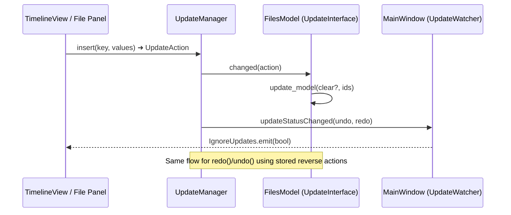

# OpenShot-QT: Transactional Update Management for Responsive PyQt UIs

OpenShot-QT keeps its large editing interface responsive by funnelling **every project mutation through a central `UpdateManager`** (`src/classes/updates.py`). Widgets subscribe as `UpdateInterface` listeners while toolbars, menus, and shortcuts register as `UpdateWatcher`s. Each mutation is wrapped in an `UpdateAction` that captures payload, inverse data, and a transaction id so undo/redo can be replayed safely (`UpdateManager.undo()` / `redo()`).

ahmed hafeez

## Why this practice stands out
- **Deterministic state propagation.** Whether a clip is added from the timeline, file tree, or import dialog, the change is broadcast to every interested view via `UpdateInterface.changed()` (see `windows/models/files_model.py::FilesModel`). Widgets refresh only when relevant keys appear in the action, eliminating brittle direct coupling.
- **Free undo/redo for every feature.** Because each action stores inverse data, `UpdateManager.get_reverse_action()` can rewind grouped transactions (e.g., a multi-object delete initiated in `TimelineView`). Watching components simply react to the dispatched reverse action—no extra undo logic per widget.
- **UI throttling baked in.** Listeners emit `IgnoreUpdates`/`verifySelections` signals to batch expensive repaints while transactions replay, keeping frame renders smooth even when multiple actions fire in sequence (`MainWindow.undo()` usage of `IgnoreUpdates.emit`).
- **Serializable project history.** `UpdateManager.save_history()` writes redo/undo stacks back into the project JSON, allowing crash recovery and cross-machine collaboration without extra bookkeeping.

## Adapting it to your own project
1. **Model your domain operations as `UpdateAction` objects.** Define paths/keys that map cleanly onto your data tree and include `old_values` so reversals never hit the database or disk.
2. **Give each view a tiny adapter.** Implement `UpdateInterface.changed()` to filter for the keys that matter (exactly like `FilesModel.update_model`). Emit granular signals to your widgets instead of reaching into them directly.
3. **Batch UI work during multi-step edits.** Pair transactions with an "ignore updates" signal so scenes can pause repaints until the final action lands.
4. **Persist history alongside user data.** Store the serialized undo/redo stacks whenever you save, then hydrate them on load so users can time-travel across sessions.

## Mermaid snapshot of the flow

## Try it when you start from scratch
- Stub a `core/updates.py` module, port the OpenShot class trio (`UpdateManager`, `UpdateAction`, interfaces) with a reduced feature set.
- In your first feature (e.g., todo list add/remove), **force every mutation through the manager** even if it feels verbose—that discipline pays off as screens multiply.
- Add a quick regression test: emit two actions in the same transaction and assert that undo restores the original serialized state.

Embracing this pattern early gives you a rock-solid foundation for MVC/MVVM experiments: your models stay dumb, your views stay reactive, and undo/redo becomes a checklist item instead of a rewrite.
