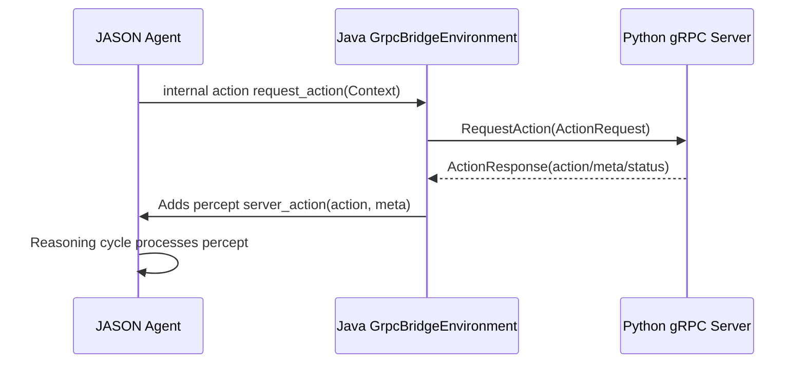
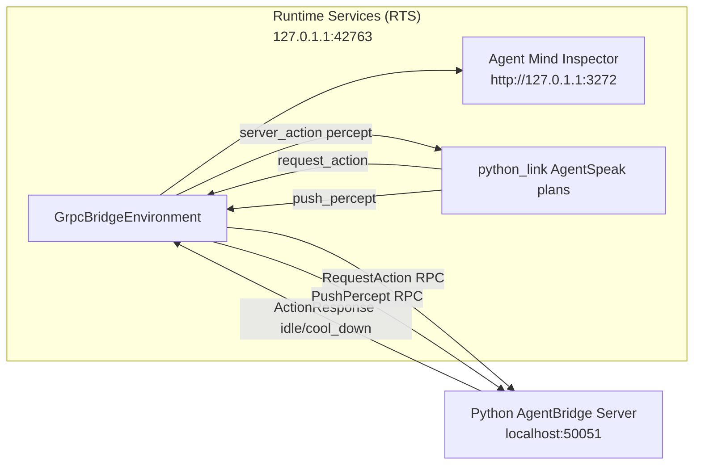
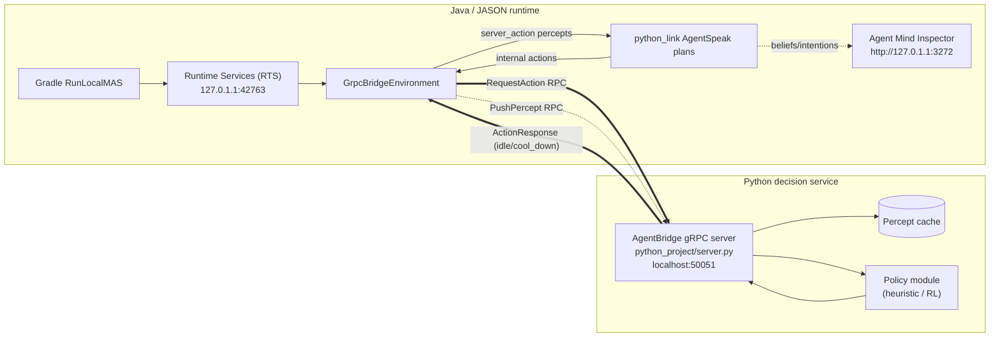
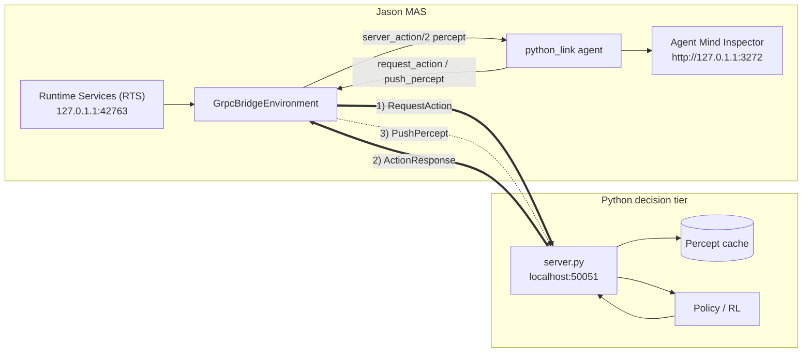
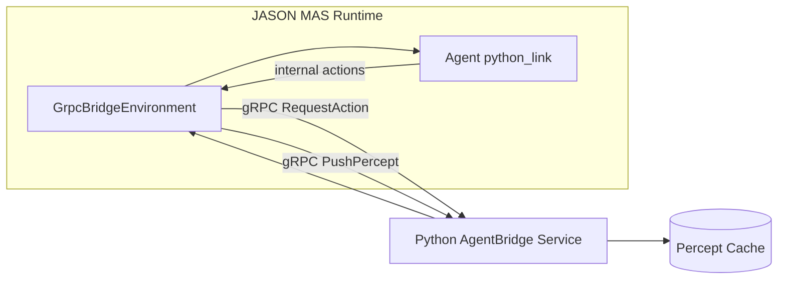
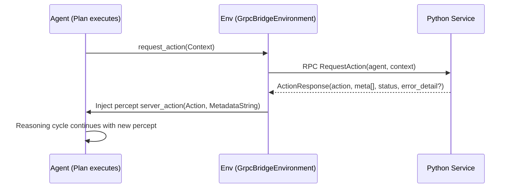
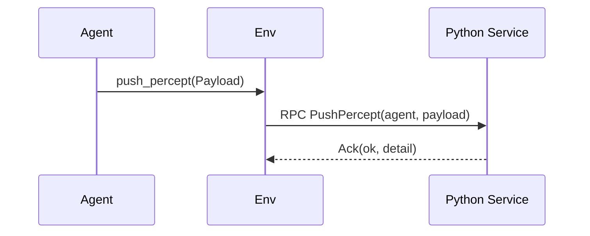

# JASON ↔ Python gRPC Bridge

This document explains the architecture, protobuf contract, build & run workflow, and security considerations for linking the legacy JASON (Java) agent platform with a Python-based decision service via gRPC.

## 1. Goals

1. Allow JASON agents to push percepts to Python.
1. Request next actions from Python given agent context.
1. Support structured metadata and status codes (extensible semantics).
1. Provide pathway for streaming actions.
1. Maintain backward compatibility while evolving the protocol.

## 2. Protobuf Contract (`proto/agent_bridge.proto`)

Key additions:

- `MetaEntry`: repeated key/value metadata.
- `ActionStatus` enum and `error_detail` for robust error signaling.
- `StreamActions` RPC for future continuous suggestions.
- Legacy `metadata` string retained for backward compatibility.

```proto
service AgentBridge {
  rpc PushPercept (Percept) returns (Ack);
  rpc RequestAction (ActionRequest) returns (ActionResponse);
  rpc StreamActions (ActionRequest) returns (stream ActionResponse); // new
}
```

`ActionResponse` now:

```proto
message ActionResponse {
  string action = 1;
  string metadata = 2;              // legacy free-form
  repeated MetaEntry meta = 3;      // structured entries
  ActionStatus status = 4;          // OK, ERROR, PARTIAL
  string error_detail = 5;          // present when ERROR
}
```

### Compatibility Strategy

- Existing Java & Python code using only `action`/`metadata` still works.
- New clients can read `meta` & `status` when available.

---

## 3. Data Flow



Percepts flow Java → Python (`PushPercept`). Action suggestions flow Python → Java (via `RequestAction` or streaming).

### 3.1 Runtime observability & sample trace



During a run you should see logs like:

```
Runtime Services (RTS) is running at 127.0.1.1:42763
Agent mind inspector is running at http://127.0.1.1:3272
[GrpcBridgeEnvironment] Connected to AgentBridge at localhost:50051
[python_link] [Jason] requesting first action...
[GrpcBridgeEnvironment] [python_link] <- python action: idle
[GrpcBridgeEnvironment] [python_link] -> python percept: temperature=32C
[GrpcBridgeEnvironment] [python_link] <- python action: cool_down
```

Annotated walkthrough:

1. The first two lines confirm the Jason IDE services that host the MAS runtime and make the Inspector available so you can watch beliefs while the system runs.
2. The connection line shows the Java environment acting as the gRPC client that dials the Python AgentBridge service on `localhost:50051`.
3. `requesting first action` originates inside `python_link.asl` (internal action `request_action/1`). It translates to a `RequestAction` RPC on the wire, and the immediate `python action: idle` log proves the Python server answered.
4. When the agent obtains new sensor data, it invokes `push_percept/1`. The environment logs `-> python percept: temperature=32C` as it forwards the payload via `PushPercept`, and the next RPC reply (`cool_down`) shows how the service adapts actions based on the updated percept.

Keep the Inspector panel open while tailing these logs to correlate every RPC hop with the agent's reasoning cycle.

### 3.2 Java↔Python gRPC bridge overview



The refined diagram highlights every major runtime: Gradle launches the MAS via Runtime Services, `GrpcBridgeEnvironment` sits between the Jason agent (`python_link`) and the gRPC channel, and the Agent Mind Inspector attaches to the same runtime so you can watch beliefs. On the Python side `server.py` fronts a tiny percept cache plus whatever policy logic you load. Bidirectional arrows show `RequestAction`/`ActionResponse`, while the dashed edge reflects the asynchronous `PushPercept` stream back into Python.

### 3.3 Environment-centric data flow (same framing as `docs/1.0_DAY_21/TASK_1/GRPC.md`)



This mirrors the “Data flow overview” diagram from the trainer gRPC documentation: the environment node is the choke point where Jason’s internal actions turn into RPCs, while the Python tier behaves like the telemetry services—cache incoming percepts, call a policy, and respond. The numbering matches the `docs/JASON_GRPC_BIDI_PYTHON.drawio` diagram so you can cross-reference both representations when explaining the bridge.

---

## 4. Java Environment (`GrpcBridgeEnvironment`)

Enhancements:

- Escapes quotes & backslashes in `action` and metadata to prevent injection into AgentSpeak.
- Conditionally composes metadata from structured `meta` list or legacy `metadata` field.
- Annotates status when ERROR or PARTIAL (e.g. `;status=error;detail=...`).

TODO for production: replace `.usePlaintext()` with TLS.

---

## 5. Python Server (`python_project/server.py`)

Features:

- Stores latest percept per agent (simple in-memory map).
- Returns action decisions with structured metadata entries.
- Implements new `StreamActions` RPC (demo: emits three incremental actions).
- Currently runs insecure (plaintext) for local development.

To evolve: add TLS with `add_secure_port(cert_chain, private_key)` and optional client auth.

---

## 6. Code Generation

### Python

Use helper script:

```bash
bash tools/generate_python_protos.sh
```

Generated files appear in `python_project/`:

- `agent_bridge_pb2.py`
- `agent_bridge_pb2_grpc.py`

### Java

Gradle plugin regenerates on build:

```bash
./gradlew :grpc-bridge-example:compileJava
```

The proto directory is shared via the multi-project build.

---

## 7. Running the Demo

One-shot script (creates venv if missing, installs deps, regenerates stubs, starts Python server, runs Java MAS):

```bash
./run_bridge_demo.sh
```

Logs:

- Python server: `/tmp/py_bridge_server.log`

Manual steps:

```bash
cd JASON_GRPC_BIDI_PYTHON
python -m venv .venv
source .venv/bin/activate
pip install -r requirements.txt
bash tools/generate_python_protos.sh
python python_project/server.py --port 50051 --insecure &
PY_PID=$!
./gradlew :grpc-bridge-example:run --args='src/main/resources/grpc_bridge.mas2j'
kill $PY_PID
```

> The Gradle task deliberately stays in the "running" state (often reporting ~91% progress) because the MAS keeps exchanging RPCs with the Python server until you terminate the run. This is expected; stop the task (Ctrl+C) when you are done observing the interaction. See `docs/README.md` for a Mermaid overview of the communication loop.

---

## 8. Security Considerations

Aspect | Current | Recommended Upgrade
---------|---------|--------------------
Transport | Plaintext | TLS (server & client certs) for non-localhost

## JASON ↔ Python gRPC Bridge Deep Dive

This deep dive documents architecture, reasoning lifecycle, protocol evolution, performance, security and operational concerns for the JASON ⇄ Python gRPC bridge.

### 1. Objectives & Constraints

Design Targets:

1. Low-friction augmentation of legacy JASON agents with external (Python) decision logic.
1. Preserve MAS reasoning semantics: actions still appear as percepts (`server_action/2`).
1. Backwards compatibility: older code using `action` + `metadata` must not break.
1. Extensible envelope for richer semantics (status codes, structured metadata, streaming).
1. Incremental security hardening path (plaintext → TLS → auth → quotas).

Non-goals (for now): multi-agent broadcast channels, binary percept payloads, hierarchical agent groups.

### 2. High-Level Architecture



Key Points:

- The environment is the sole gRPC client; agents remain unaware of transport.
- Actions become percepts ⇒ consistent with JASON’s belief update cycle.
- Structured metadata lets policy enrich percept with machine-parsable key/values.

### 3. Lifecycle & Interaction Patterns

### 3.1 Action Request Path



### 3.2 Percept Push Path



### 3.3 Error / Degradation Path

```mermaid
sequenceDiagram
  participant A as Agent
  participant E as Env
  participant S as Python Service
  A->>E: request_action("search")
  E->>S: RequestAction
  S-->>E: ActionResponse(status=ERROR, detail=policy_timeout, action=idle)
  E->>A: server_action(idle, "status=error;detail=policy_timeout")
  A->>A: Fallback plan triggers
```

### 3.4 Streaming (Future Use)

Server may emit progressive suggestions (e.g. path steps) via `StreamActions`. Java side can adapt to consume until termination or cancellation.

---
### 4. Protobuf Contract Evolution (`proto/agent_bridge.proto`)

Additions & Rationale:

- `MetaEntry`: avoids parsing ad-hoc delimiters, supports multi-field metadata.
- `ActionStatus`: explicit success vs partial vs error; enables agent fallback logic.
- `error_detail`: machine-readable cause string (e.g. `policy_timeout`, `validation_failed`).
- `StreamActions`: foundation for multi-step guidance without repeated unary calls.

Versioning Strategy:

- Reserve field numbers before large refactors.
- Prefer additive changes; never reuse removed field numbers.
- Gate experimental fields behind presence checks in Java before constructing AgentSpeak literals.

Backward Compatibility:

- Legacy clients ignore unknown fields (proto3 default).
- Java environment still propagates `metadata` string if `meta[]` absent.

---
### 5. Java Environment Internals (`GrpcBridgeEnvironment`)

Responsibilities:

1. Provide custom internal actions (`request_action/1`, `push_percept/1`).
1. Marshal parameters into gRPC messages.
1. Escape response strings (quotes, backslashes) to avoid AgentSpeak parse errors.
1. Translate structured metadata into a compact delimited string for percept injection.
1. Annotate status & error detail when not OK.

Safety Measures:

- Escaping ensures no arbitrary plan injection.
- Null / empty checks prevent malformed percept creation.
- Channel lifecycle logged for observability.

Production TODO:

- Replace `.usePlaintext()` with TLS & add retry/backoff.
- Add deadline on RPC calls (e.g. 500ms) to avoid agent stall.

---
### 6. Python Service Internals (`python_project/server.py`)

Simple Policy:
- `_decide_action(context, percept)` heuristically picks actions.
- Maintains `latest_percepts[agent]` map.

Extensibility Points:
- Swap heuristic with ML/RL policy loader.
- Introduce batching layer (collect N percepts before inference).
- Add metrics: counts, latency histograms.

Threading:
- Default gRPC thread pool (max_workers=4). Increase for higher concurrency or integrate async server variant.

---
### 7. Performance & Backpressure Considerations

Dimension | Current State | Risk | Mitigation
--------- | ------------- | ---- | ----------
Unary latency | ~local loop | Low | Deadlines + metrics
Streaming (future) | Prototype only | Unbounded flow | Credits / window size
Metadata size | Small (<256 bytes) | Log inflation | Enforce size cap & truncate
Percept volume | Single agent demo | N/A | Queue + drop policy for surge
Thread pool | 4 workers | Saturation under load | Dynamic sizing / async

Backpressure Plan (future):
1. Introduce credit token per agent for streaming actions.
2. Server stops emitting when credit exhausted; agent replenishes via control message.
3. Metrics expose credit exhaustion events.

---
### 8. Security Deep Dive

Threat | Vector | Current Mitigation | Future Hardening
------ | ------ | ------------------ | -----------------
Eavesdropping | Plain TCP | None | TLS w/ modern ciphers
Spoofed policy | Fake server | Manual host selection | mTLS + pin public key
Injection via action text | Special chars | Escaping | Field validation & allowlist
Resource exhaustion | Flood percept RPCs | None | Rate limits & quotas
Replay attacks | Reused messages | Not addressed | Timestamps + nonce if needed
Unauthorized access | Open port | Dev only | Auth interceptor (JWT / mTLS)

Logging Hygiene:
- Avoid including raw secrets in percepts.
- Sanitize large payloads (truncate >2KB).

TLS Migration Steps:
1. Generate cert/key pair (PEM) + CA.
2. Python: `grpc.ssl_server_credentials(...)` + `add_secure_port`.
3. Java: `NettyChannelBuilder.forTarget(...).sslContext(SslContext)`.
4. Remove plaintext builder call, add ALPN if needed.

---
### 9. Testing Strategy

Layer | Test Type | Example
----- | --------- | -------
Proto | Contract | Ensure stub regen & field presence
Java Env | Unit | Escape utility, status injection
Python Policy | Unit | `_decide_action` edge cases
Integration | End-to-end | Start server, run MAS, assert percept/action cycle
Resilience | Fault injection | Simulate timeouts → expect ERROR status fallback

Suggested Integration Test Outline:
1. Start Python server on ephemeral port.
2. Run MAS with agent that triggers `request_action` and `push_percept`.
3. Capture log output; assert presence of `server_action(cool_down, ...)`.
4. Simulate server shutdown mid-run; assert error status injection.

---
### 10. Troubleshooting Matrix (Expanded)

Symptom | Likely Cause | Diagnostic Command | Resolution
------- | ------------ | ------------------ | ----------
`MetaEntry` missing in Python | Stubs stale | Re-run proto script | Regenerate stubs
Agent file not found | Wrong `aslSourcePath` | Inspect MAS file | Fix path / ensure file exists
`status=error` frequent | Policy timeout | Add timing logs | Optimize or raise deadline
Gradle build proto errors | Plugin config mismatch | `./gradlew :grpc-bridge-example:dependencies` | Align versions
Port already in use | Zombie server | `lsof -i:50051` | Kill process / change port

---
### 11. Operations Runbook (Dev)

Action | Command | Notes
------ | ------- | -----
Generate Python stubs | `bash tools/generate_python_protos.sh` | Requires venv deps
Run Python server | `python python_project/server.py` | Add `--port` to change port
Compile Java | `./gradlew :grpc-bridge-example:build` | Includes proto generation
Run MAS | `./gradlew :grpc-bridge-example:run --args="src/main/resources/grpc_bridge.mas2j"` | Ensure server up first
Clean build | `./gradlew clean` | Forces fresh proto compile

---
### 12. Extensibility & Roadmap

Near Term:
- Add action deadlines & fallback policy.
- Implement structured error taxonomy.

Medium Term:
- Metrics: Prometheus counters (`bridge_requests_total`, `bridge_errors_total`).
- Backpressure credits.

Long Term:
- Multi-agent broadcast channel.
- Pluggable serialization (e.g., JSON percept payload vs raw string).

---
## 13. Verification Checklist

- [x] Proto extended (MetaEntry, ActionStatus, error_detail, StreamActions)
- [x] Java environment consumes new fields safely
- [x] Python server implements new fields + streaming stub
- [x] MAS file corrected (agent, environment, source path)
- [x] Demo run shows bidirectional flow

---
## 14. Glossary

Term | Definition
---- | ----------
Percept | Information injected into agent belief base
Internal Action | Custom environment-provided action in a plan
Metadata | Supplemental context about decision
Status | Outcome classification of request_action RPC
Streaming | Server push of multiple ActionResponse messages

---
## 15. Change Log (Recent)

Day 22: Added deep dive sections, security, testing, performance & runbook.

---
## 16. Next Steps

1. Implement TLS channel.
2. Add integration test harness.
3. Introduce metrics instrumentation.
4. Evaluate streaming adoption.

---
*Last updated: Day 22 deep-dive augmentation.*
