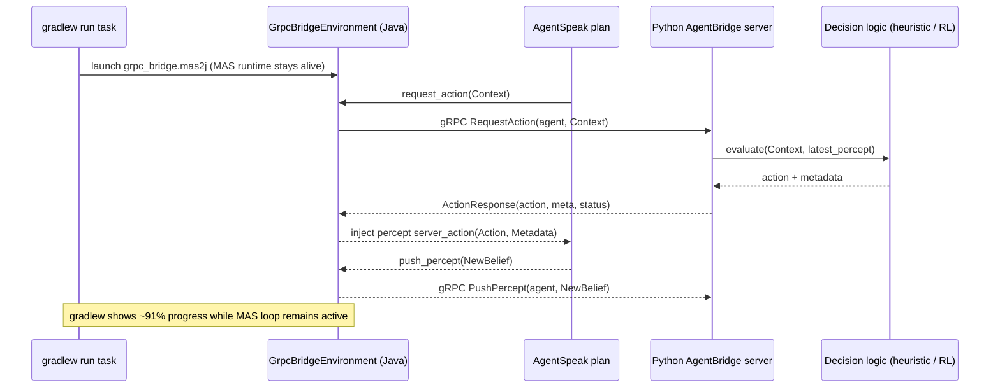
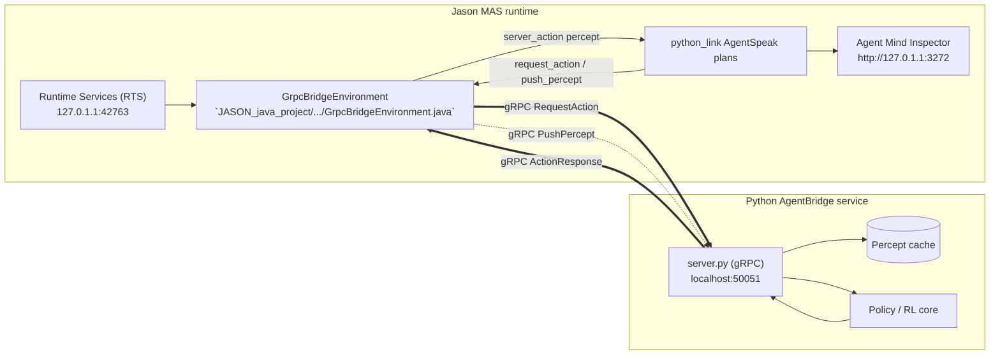

# Jason ⇄ Python gRPC Bridge (Quick Start & Overview)

This document captures the steps we took to create the smallest possible bridge between the legacy Jason MAS project and a modern Python component using gRPC. Use it as a recipe to reproduce or extend the demo.

## Repo layout

```
JASON_GRPC_BIDI_PYTHON/
├── proto/agent_bridge.proto          # shared contract (bidirectional RPCs)
├── python_project/                   # Python gRPC server example
│   ├── agent_bridge_pb2*.py          # generated stub code
│   └── server.py                     # minimal handler storing percepts & returning actions
└── JASON_java_project/grpc-bridge-example/
    ├── build.gradle                  # adds protobuf + grpc plugins/deps
    ├── src/main/java/org/jason/...   # custom Jason environment + launcher
    └── src/main/resources/
        ├── grpc_bridge.mas2j         # MAS definition using the new env
        └── python_link.asl           # demo AgentSpeak agent
```

## Python side

1. Use the dedicated venv inside `JASON_GRPC_BIDI_PYTHON/.venv` (Python 3.11.14).
2. Install packages from `requirements.txt` (grpcio, grpcio-tools, protobuf) if needed.
3. Regenerate stubs after editing the proto:
   ```bash
   source .venv/bin/activate
   python -m grpc_tools.protoc -I proto \
       --python_out=python_project \
       --pyi_out=python_project \
       --grpc_python_out=python_project \
       proto/agent_bridge.proto
   ```
4. Start the toy server:
   ```bash
   source .venv/bin/activate
   python python_project/server.py --port 50051
   ```

The server keeps the latest percept per agent and returns heuristic actions (`recharge`, `cool_down`, etc.). Replace `_decide_action` with your own policy or forward to RL code.

## Java / Jason side

1. `settings.gradle` now includes the Gradle subproject `:grpc-bridge-example`.
2. `grpc-bridge-example/build.gradle` pulls in gRPC + protobuf plugins and points the proto source set to `../proto` so both languages share the same `.proto` file.
3. `GrpcBridgeEnvironment` implements two custom actions exposed to AgentSpeak:
   - `push_percept("json_or_text")` → invokes Python `PushPercept` RPC.
   - `request_action("context")` → gets the next action and injects it back as the percept `server_action(Action, Metadata)`.
4. `python_link.asl` shows how a Jason agent can call those actions within plans, while `grpc_bridge.mas2j` wires the environment/agent together.

### Building & running the demo

```bash
cd JASON_GRPC_BIDI_PYTHON/JASON_java_project
export JAVA_HOME=../.jdks/jdk-21.0.5+11
export PATH="$JAVA_HOME/bin:$PATH"
./gradlew :grpc-bridge-example:build     # compiles proto + java
./gradlew :grpc-bridge-example:run       # runs RunLocalMAS with grpc_bridge.mas2j
```

Run order for the integration test:
1. Start the Python server first (see above).
2. Run the Gradle `run` task. You should see logs similar to:
   ```
   [GrpcBridgeEnvironment] Connected to AgentBridge at localhost:50051
   [python_link] [Jason] python suggests: idle info:ctx_len=7;percept_len=0
   ```

### Communication flow (Mermaid overview)



The Gradle task remains "in progress" (e.g., 91%) because the MAS continues to exchange requests with the Python server until you stop the run.

### Runtime services & observability map

```mermaid
flowchart LR
  subgraph RTS["Runtime Services (RTS)\n127.0.1.1:42763"]
    CLI[Gradle RunLocalMAS task]
    ENV[GrpcBridgeEnvironment]
    INSPECTOR[Agent Mind Inspector\nhttp://127.0.1.1:3272]
    AGENT[AgentSpeak plan python_link.asl]
  end
  PY[Python AgentBridge Server\nlocalhost:50051]

  CLI --> ENV
  AGENT -->|internal action request_action| ENV
  ENV -->|gRPC RequestAction| PY
  PY -->|ActionResponse (idle, cool_down, ...)| ENV
  ENV -->|percept server_action(Action, Meta)| AGENT
  AGENT -->|internal action push_percept| ENV
  ENV -->|gRPC PushPercept (temperature=32C)| PY
  ENV --> INSPECTOR
```

How to read the live logs:

1. `Runtime Services (RTS) is running at 127.0.1.1:42763` confirms the Jason IDE back-end that hosts both `GrpcBridgeEnvironment` and the Agent Mind Inspector.
2. `Agent mind inspector is running at http://127.0.1.1:3272` means you can open the inspector UI to watch beliefs and plans that correspond to the `python_link` agent node in the diagram.
3. `[GrpcBridgeEnvironment] Connected to AgentBridge at localhost:50051` maps to the gRPC edge between `GrpcBridgeEnvironment` and the Python server; it fires once when the Java env starts.
4. `[python_link] [Jason] requesting first action...` shows the AgentSpeak plan invoking `request_action`, which becomes the `RequestAction` RPC and eventually the `python suggests: idle` line when the Python server responds.
5. `[GrpcBridgeEnvironment] [python_link] -> python percept: temperature=32C` is the reverse direction in the diagram: after the agent collects new percept data, it calls `push_percept`, which the environment forwards through `PushPercept` so the Python service can compute the next suggestion (`cool_down`).

Mirror these lines while the inspector UI is open and you can correlate every RPC hop with the MAS reasoning cycle.

### Where the GrpcBridgeEnvironment lives (data-flow lens)

Borrowing the same framing as `docs/1.0_DAY_21/TASK_1/GRPC.md`, the environment is a node inside the Jason runtime that owns both sides of the gRPC session:



Key takeaways:

- `GrpcBridgeEnvironment` is the only component with a gRPC client connection; agents stay within Jason semantics and just call internal actions.
- The Agent Mind Inspector watches the beliefs injected by `server_action/2`, so you can verify every recommendation the Python side emits.
- The Python stack mirrors the trainer data-flow doc: the gRPC server accepts percepts, caches them, forwards to the policy, then returns the next action.

### Why a Python server is part of the bridge

- **Decoupled decision logic** – Python hosts the policy/heuristics that decide actions. Swapping in an RL model or another service does not require touching the JASON code.
- **Shared contract** – The gRPC server exposes `PushPercept` and `RequestAction`, giving the Java environment a consistent endpoint regardless of the underlying policy implementation.
- **Stateful perception** – The Python side keeps recent percepts/context so it can make informed choices or feed ML pipelines.
- **Operational flexibility** – Running the policy out-of-process lets you scale, debug, or restart decision logic independently from the MAS runtime.

## Next steps

- Replace the heuristic Python handler with real environment logic (RL policy, data collector, etc.).
- Extend the proto to cover streaming RPCs or agent-to-agent broadcasts if needed.
- Package the shared proto as its own module so other languages (C++, Go, etc.) can reuse it.
- Write MAS tests to exercise failure scenarios (Python unavailable, timeouts, etc.)
- Capture production instructions (systemd units, Dockerfiles) once the prototype hardens.
