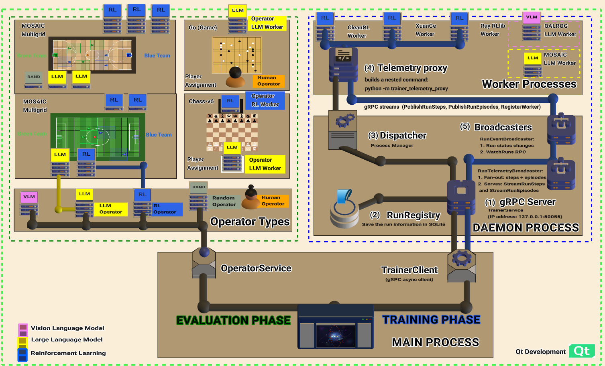

<div align="center">
    <a href="https://github.com/Abdulhamid97Mousa/mosaic"></a>
</div>

---

[](https://www.python.org/downloads/)
[](https://pytorch.org/get-started/locally/)
[](https://gymnasium.farama.org/)
[](https://pettingzoo.farama.org/)
[](https://github.com/Abdulhamid97Mousa/mosaic/blob/main/LICENSE)
[](https://mosaic-platform.readthedocs.io/en/latest/index.html)

# MOSAIC

**A Unified Platform for Cross-Paradigm Comparison and Evaluation of Homogeneous and Heterogeneous Multi-Agent RL, LLM, VLM, and Human Decision-Makers**

MOSAIC is a visual-first platform that enables researchers to configure, run, and compare experiments across RL, LLM, VLM, and human decision-makers in the same multi-agent environment. Different paradigms like tiles in a mosaic come together to form a complete picture of agent performance.

| **Documentation**: [mosaic-platform.readthedocs.io](https://mosaic-platform.readthedocs.io/en/latest/index.html) | **GitHub**: [github.com/Abdulhamid97Mousa/mosaic](https://github.com/Abdulhamid97Mousa/mosaic) |
|---|---|

## Two Evaluation Modes

MOSAIC provides two evaluation modes designed for reproducibility:

<video src="docs/source/_static/videos/demo_shared_seed.mp4" controls autoplay muted loop style="width:100%; max-width:100%; height:auto; border-radius:8px;"></video>
<p align="center"><b>Manual Mode:</b> Side-by-side lock-step evaluation with shared seeds.</p>

- **Manual Mode:** side-by-side comparison where multiple operators step through the same environment with shared seeds, letting researchers visually inspect decision-making differences between paradigms in real time.

<video src="docs/source/_static/videos/script_based_experiments.mp4" controls autoplay muted loop style="width:100%; max-width:100%; height:auto; border-radius:8px;"></video>
<p align="center"><b>Script Mode:</b> Automated batch evaluation with deterministic seed sequences.</p>

- **Script Mode:** automated, long-running evaluation driven by Python scripts that define operator configurations, worker assignments, seed sequences, and episode counts. Scripts execute deterministically with no manual intervention, producing reproducible telemetry logs (JSONL) for every step and episode.

All evaluation runs share **identical conditions**: same environment seeds, same observations, and unified telemetry. Script Mode additionally supports **procedural seeds** (different seed per episode to test generalization) and **fixed seeds** (same seed every episode to isolate agent behaviour), with configurable step pacing for visual inspection or headless batch execution.

## Why MOSAIC?

Today's AI landscape offers powerful but **fragmented** tools: RL frameworks ([CleanRL](https://github.com/vwxyzjn/cleanrl), [RLlib](https://docs.ray.io/en/latest/rllib/index.html), [XuanCe](https://github.com/agi-brain/xuance)), language models (GPT, Claude), and robotics simulators (MuJoCo). Each excels in isolation, but **no platform bridges them together** under a unified, visual-first interface.

**MOSAIC provides:**

- **Visual-First Design**: Configure experiments through an intuitive PyQt6 interface, **almost no code required**.
- **Heterogeneous Agent Mixing**: Deploy Human, RL, and LLM agents in the same environment.
- **Resource Management & Quotas**: GPU allocation, queue limits, credit-based backpressure, health monitoring.
- **Per-Agent Policy Binding**: Route each agent to different workers via `PolicyMappingService`.
- **Worker Lifecycle Orchestration**: Subprocess management with heartbeat monitoring and graceful termination.

<video src="docs/source/_static/videos/human_vs_human.mp4" controls autoplay muted loop style="width:100%; max-width:100%; height:auto; border-radius:8px;"></video>
<p align="center"><b>Human vs Human:</b> Two human players competing via dedicated USB keyboards.</p>

<video src="docs/source/_static/videos/random_worker.mp4" controls autoplay muted loop style="width:100%; max-width:100%; height:auto; border-radius:8px;"></video>
<p align="center"><b>Random Agents:</b> Baseline agents across 26 environment families.</p>

<video src="docs/source/_static/videos/heterogeneous_agents_adversarial.mp4" controls autoplay muted loop style="width:100%; max-width:100%; height:auto; border-radius:8px;"></video>
<p align="center"><b>Heterogeneous Multi-Agent Ad-Hoc Teamwork in Adversarial Settings:</b> Different decision-making paradigms (RL, LLM, Random) competing head-to-head in the same multi-agent environment.</p>

<video src="docs/source/_static/videos/random_team_vs_llm_team.mp4" controls autoplay muted loop style="width:100%; max-width:100%; height:auto; border-radius:8px;"></video>
<p align="center"><b>Homogeneous Teams: Random vs LLM:</b> Two homogeneous teams (all-Random vs all-LLM) competing in the same multi-agent environment.</p>

## Agent-Level Interface and Cross-Paradigm Evaluation

**Agent-Level Interface.** Existing infrastructure lacks the ability to deploy agents from different decision-making paradigms within the same environment. The root cause is an **interface mismatch**: RL agents expect tensor observations and produce integer actions, while LLM agents expect text prompts and produce text responses. MOSAIC addresses this through an *operator abstraction* that forms an agent-level interface by mapping workers to agents: each operator, regardless of whether it is backed by an RL policy, an LLM, or a human, conforms to a minimal unified interface (`select_action(obs) → action`). The environment never needs to know what kind of decision-maker it is communicating with. This is the agent-side counterpart to what [Gymnasium](https://gymnasium.farama.org/) did for environments: Gymnasium standardized the environment interface (`reset()` / `step()`), so any algorithm can interact with any environment; MOSAIC's Operator Protocol standardizes the agent interface, so any decision-maker can be plugged into any compatible environment without modifying either side.

**Cross-Paradigm Evaluation.** Cross-paradigm evaluation is the ability to deploy decision-makers from *different paradigms* (RL, LLM/VLM, Human, scripted baselines) within the same multi-agent environment under identical conditions, and to produce directly comparable results. Both evaluation modes described above ([Manual Mode](https://mosaic-platform.readthedocs.io/en/latest/documents/architecture/operators/lifecycle.html#manual-mode) and [Script Mode](https://mosaic-platform.readthedocs.io/en/latest/documents/architecture/operators/lifecycle.html#script-mode)) guarantee that all decision-makers face the same environment states, observations, and shared seeds, making this the first infrastructure to enable fair, reproducible cross-paradigm evaluation.

## Comparison with Existing Frameworks

Existing frameworks are paradigm-siloed. No prior framework allowed fair, reproducible, head-to-head comparison between RL agents and LLM agents in the same multi-agent environment.

*Agent Paradigms*: which decision-maker types are supported. *Framework*: algorithms can be integrated without source-code modifications. *Platform GUI*: real-time visualization during execution. *Cross-Paradigm*: infrastructure for comparing different agent types (e.g., RL vs. LLM) on identical environment instances with shared random seeds for reproducible head-to-head evaluation.

> ✅ Supported · ❌ Not supported · 🔵 Partial

| | | **Agent Paradigms** | | | **Infrastructure** | | **Evaluation** |
|---|---|:---:|:---:|:---:|:---:|:---:|:---:|
| **System** | | **RL** | **LLM/VLM** | **Human** | **Framework** | **Platform GUI** | **Cross-Paradigm** |
| | *RL Frameworks* | | | | | | |
| RLlib | [[1]](#references) | ✅ | ❌ | ❌ | ✅ | ❌ | ❌ |
| CleanRL | [[2]](#references) | ✅ | ❌ | ❌ | ✅ | ❌ | ❌ |
| Tianshou | [[3]](#references) | ✅ | ❌ | ❌ | ✅ | ❌ | ❌ |
| Acme | [[4]](#references) | ✅ | ❌ | ❌ | ✅ | ❌ | ❌ |
| XuanCe | [[5]](#references) | ✅ | ❌ | ❌ | ✅ | ❌ | ❌ |
| OpenRL | [[6]](#references) | ✅ | ❌ | ❌ | ✅ | ❌ | ❌ |
| Stable-Baselines3 | [[7]](#references) | ✅ | ❌ | ❌ | ✅ | ❌ | ❌ |
| Coach | [[8]](#references) | ✅ | ❌ | ❌ | ✅ | ✅ | ❌ |
| BenchMARL | [[15]](#references) | ✅ | ❌ | ❌ | ✅ | ❌ | ❌ |
| | *LLM/VLM Benchmarks* | | | | | | |
| BALROG | [[9]](#references) | ❌ | ✅ | ❌ | ✅ | ❌ | ❌ |
| TextArena | [[10]](#references) | ❌ | ✅ | ✅ | ✅ | ❌ | ❌ |
| GameBench | [[11]](#references) | ❌ | ✅ | ❌ | ✅ | ❌ | ❌ |
| lmgame-Bench | [[12]](#references) | ❌ | ✅ | ❌ | ✅ | ❌ | ❌ |
| LLM Chess | [[13]](#references) | ✅ | ✅ | ❌ | ✅ | ❌ | ❌ |
| LLM-Game-Bench | [[14]](#references) | ❌ | ✅ | ❌ | ✅ | 🔵 | ❌ |
| AgentBench | [[16]](#references) | ❌ | ✅ | ❌ | ✅ | ❌ | ❌ |
| MultiAgentBench | [[17]](#references) | ❌ | ✅ | ❌ | ✅ | ❌ | ❌ |
| GAMEBoT | [[18]](#references) | ❌ | ✅ | ❌ | ✅ | ❌ | ❌ |
| Collab-Overcooked | [[19]](#references) | 🔵 | ✅ | ❌ | ✅ | ❌ | ❌ |
| BotzoneBench | [[20]](#references) | ❌ | ✅ | ❌ | ✅ | ❌ | ❌ |
| AgentGym | [[21]](#references) | ❌ | ✅ | ❌ | ✅ | ❌ | ❌ |
| | | | | | | | |
| **MOSAIC (Ours)** | | **✅** | **✅** | **✅** | **✅** | **✅** | **✅** |

## Experimental Configurations

Heterogeneous decision-making enables a systematic ablation matrix for cross-paradigm research. Here are examples using 2v2 soccer:

### Adversarial Cross-Paradigm

Testing how paradigms perform against each other:

| Configuration | Team A | Team B | Purpose |
|---|---|---|---|
| RL vs RL | MAPPO + MAPPO | MAPPO + MAPPO | Homogeneous RL baseline |
| LLM vs LLM | GPT-4o + GPT-4o | GPT-4o + GPT-4o | Homogeneous LLM baseline |
| RL vs LLM | MAPPO + MAPPO | GPT-4o + GPT-4o | Cross-paradigm matchup |
| RL vs Random | MAPPO + MAPPO | Random + Random | Sanity check |

### Cooperative Heterogeneous Teams

Testing how paradigms work together as teammates:

| Configuration | Green Team | Blue Team |
|---|---|---|
| Heterogeneous vs Crippled | RL + LLM | RL + Random |
| Heterogeneous vs Solo | RL + LLM | RL + No-Operation (action=NOOP/STILL) |
| Solo-pair vs Solo-pair | RL + RL | RL + RL |
| Heterogeneous vs Co-trained | RL + LLM | RL + RL (trained 2vs2 policy) |

> **1v1-to-2v2 Transfer Design.** RL agents are trained as solo experts in 1v1, then deployed as teammates alongside an LLM in 2v2. This eliminates the **co-training confound**: if RL agents were instead trained in 2v2 via MAPPO self-play, their policies would encode implicit partner models calibrated against another MAPPO agent. Swapping one teammate with an LLM would then conflate two effects: the paradigm difference *and* the partner mismatch. With 1v1-trained agents, the RL policy has zero partner expectations because it never had a partner, isolating the paradigm variable.
>
> This is distinct from **zero-shot coordination (ZSC)** in the ad-hoc teamwork literature. ZSC studies RL agents cooperating with unknown *RL* partners, agents from the same paradigm that share the same observation and action representations. The 1v1-to-2v2 design studies an LLM as an ad-hoc partner for a frozen RL policy, where the partner is not just unknown but from a fundamentally different paradigm (text-based reasoning vs. learned tensor-to-action mapping). The comparison baseline also changes: in ZSC the reference is a co-trained RL+RL team, while here the fair reference is two independently trained 1v1 solo experts paired in 2v2 (the "Solo-pair vs Solo-pair" configuration above), since neither agent was trained with any partner.

## Supported Environment Families (26)

MOSAIC supports **26 environment families** spanning single-agent, multi-agent, and cooperative/competitive paradigms. See the full [Environment Families](https://mosaic-platform.readthedocs.io/en/latest/documents/environments/index.html) reference for installation instructions, environment lists, and academic citations.

| Family | Description | Example |
|--------|-------------|---------|
| **Gymnasium** | Standard single-agent RL (Toy Text, Classic Control, Box2D, MuJoCo) |  |
| **Atari / ALE** | 128 classic Atari 2600 games |  |
| **MiniGrid** | Procedural grid-world navigation |  |
| **BabyAI** | Language-grounded instruction following |  |
| **ViZDoom** | Doom-based first-person visual RL |  |
| **MiniHack / NetHack** | Roguelike dungeon crawling (NLE) |  |
| **Crafter** | Open-world survival benchmark |  |
| **Procgen** | 16 procedurally generated environments |  |
| **BabaIsAI** | Rule-manipulation puzzles |  |
| **Jumanji** | JAX-accelerated logic/routing/packing (25 envs) |  |
| **PyBullet Drones** | Quadcopter physics simulation |  |
| **PettingZoo Classic** | Turn-based board games (AEC) |  |
| **MOSAIC MultiGrid** | Competitive team sports (view_size=3) |  |
| **INI MultiGrid** | Cooperative exploration (view_size=7) |  |
| **Melting Pot** | Social multi-agent scenarios (up to 16 agents) |  |
| **Overcooked** | Cooperative cooking (2 agents) |  |
| **SMAC** | StarCraft Multi-Agent Challenge (hand-designed maps) |  |
| **SMACv2** | StarCraft Multi-Agent Challenge v2 (procedural units) |  |
| **RWARE** | Cooperative warehouse delivery |  |
| **MuJoCo** | Continuous-control robotics tasks |  |

## Supported Workers (8)

| Worker | Description |
|--------|-------------|
| **[CleanRL](https://github.com/vwxyzjn/cleanrl)** | Single-file RL implementations (PPO, DQN, SAC, TD3, DDPG, C51) |
| **[XuanCe](https://github.com/agi-brain/xuance)** | Modular RL framework with flexible algorithm composition. Multi-agent algorithms (MAPPO, QMIX, MADDPG, VDN, COMA) |
| **[Ray RLlib](https://docs.ray.io/en/latest/rllib/)** | RL with distributed training and large-batch optimization (PPO, IMPALA, APPO) |
| **[BALROG](https://github.com/balrog-ai/BALROG)** | LLM/VLM agentic evaluation (GPT-4o, Claude 3, Gemini; NetHack, BabyAI, Crafter) |
| **[MOSAIC LLM](docs/source/documents/architecture/workers/integrated_workers/MOSAIC_LLM_Worker)** | Multi-agent LLM with coordination strategies and Theory of Mind (MultiGrid, BabyAI, MeltingPot, PettingZoo) |
| **[Chess LLM](docs/source/documents/architecture/workers/integrated_workers/Chess_LLM_Worker)** | LLM chess play with multi-turn dialog (PettingZoo Chess) |
| **[MOSAIC Human Worker](docs/source/documents/architecture/workers/integrated_workers/MOSAIC_Human_Worker)** | Human-in-the-loop play via keyboard for any Gymnasium-compatible environment (MiniGrid, Crafter, Chess, NetHack) |
| **[MOSAIC Random Worker](docs/source/documents/architecture/workers/integrated_workers/MOSAIC_Random_Worker)** | Baseline agents with random, no-op, and cycling action behaviours across all 26 environment families |

## Installation

```bash
# Clone the repository
git clone https://github.com/Abdulhamid97Mousa/mosaic.git
cd mosaic

# Create virtual environment (Python 3.10-3.12)
python3.11 -m venv .venv
source .venv/bin/activate

# Install core GUI
pip install -e .
```

Install only what you need. **Workers** and **environment families** are independent extras:

```bash
# Worker (CleanRL) + environment family (MiniGrid)
pip install -e ".[cleanrl,minigrid]"

# Multi-agent worker (XuanCe) + competitive environments
pip install -e ".[xuance,mosaic_multigrid]"

# Everything
pip install -e ".[full]"
```

## Quick Start

```bash
# Launch with trainer daemon (recommended)
./run.sh

# Or launch GUI only
python -m gym_gui
```

## Citing MOSAIC

If you use MOSAIC in your research, please cite:

```bibtex
@article{mousa2026mosaic,
  title   = {{MOSAIC}: A Unified Platform for Cross-Paradigm Comparison
             and Evaluation of Homogeneous and Heterogeneous Multi-Agent
             {RL}, {LLM}, {VLM}, and Human Decision-Makers},
  author  = {Mousa, Abdulhamid M. and Daoui, Zahra and Khajiev, Rakhmonberdi
             and Azzabi, Jalaledin M. and Mousa, Abdulkarim M. and Liu, Ming},
  year    = {2026},
  url     = {https://github.com/Abdulhamid97Mousa/mosaic},
  note    = {Available at \url{https://github.com/Abdulhamid97Mousa/mosaic}}
}
```

## References

1. E. Liang et al., "RLlib: Abstractions for Distributed Reinforcement Learning," *ICML*, 2018.
2. S. Huang et al., "CleanRL: High-quality Single-file Implementations of Deep Reinforcement Learning Algorithms," *JMLR*, 2022.
3. J. Weng et al., "Tianshou: A Highly Modularized Deep Reinforcement Learning Library," *JMLR*, 2022.
4. M. Hoffman et al., "Acme: A Research Framework for Distributed Reinforcement Learning," *arXiv:2006.00979*, 2020.
5. W. Liu et al., "XuanCe: A Comprehensive and Unified Deep Reinforcement Learning Library," *arXiv:2312.16248*, 2023.
6. S. Huang et al., "OpenRL: A Unified Reinforcement Learning Framework," *arXiv:2312.16189*, 2023.
7. A. Raffin et al., "Stable-Baselines3: Reliable Reinforcement Learning Implementations," *JMLR*, 2021.
8. I. Caspi et al., "Reinforcement Learning Coach," 2017. https://github.com/IntelLabs/coach
9. D. Paglieri et al., "BALROG: Benchmarking Agentic LLM and VLM Reasoning On Games," *arXiv:2411.13543*, 2024.
10. G. De Magistris et al., "TextArena," 2025. https://github.com/LeonGuertworktler/TextArena
11. D. Costarelli et al., "GameBench: Evaluating Strategic Reasoning Abilities of LLM Agents," *arXiv:2406.06613*, 2024.
12. Y. Huang et al., "lmgame-Bench: Evaluating LLMs on Game-Theoretic Decision-Making," 2025.
13. M. Saplin, "LLM Chess," 2025. https://github.com/maxim-saplin/llm_chess
14. J. Guo et al., "LLM-Game-Bench: Evaluating LLM Reasoning through Game-Playing," 2024.
15. M. Bettini et al., "BenchMARL: Benchmarking Multi-Agent Reinforcement Learning," *JMLR*, 2024. *arXiv:2312.01472*.
16. X. Liu et al., "AgentBench: Evaluating LLMs as Agents," *ICLR*, 2024. *arXiv:2308.03688*.
17. K. Zhu et al., "MultiAgentBench: Evaluating the Collaboration and Competition of LLM Agents," *ACL*, 2025. *arXiv:2503.01935*.
18. Y. Lin et al., "GAMEBoT: Transparent Assessment of LLM Reasoning in Games," *ACL*, 2025. *arXiv:2412.13602*.
19. H. Sun et al., "Collab-Overcooked: Benchmarking and Evaluating Large Language Models as Collaborative Agents," *EMNLP*, 2025. *arXiv:2502.20073*.
20. "BotzoneBench: Scalable LLM Evaluation via Graded AI Anchors," *arXiv:2602.13214*, 2026.
21. Z. Xi et al., "AgentGym: Evolving Large Language Model-based Agents across Diverse Environments," *ACL*, 2025. *arXiv:2406.04151*.

## License

MOSAIC is released under the [MIT License](https://github.com/Abdulhamid97Mousa/mosaic/blob/main/LICENSE).

## Acknowledgments

**RL & MARL Frameworks**
- [Gymnasium](https://gymnasium.farama.org/): Standard RL API
- [PettingZoo](https://pettingzoo.farama.org/): Multi-agent environment API
- [CleanRL](https://github.com/vwxyzjn/cleanrl): Single-file RL implementations
- [XuanCe](https://github.com/agi-brain/xuance): Multi-agent RL algorithms
- [Ray RLlib](https://docs.ray.io/en/latest/rllib/): Distributed RL training
- [Stable-Baselines3](https://stable-baselines3.readthedocs.io/): RL algorithms library (PPO, A2C, DQN)
- [MARLlib](https://github.com/Farama-Foundation/Marllib): Multi-agent RL library
- [SuperSuit](https://github.com/Farama-Foundation/SuperSuit): PettingZoo wrapper utilities
- [Shimmy](https://shimmy.farama.org/): Environment compatibility wrappers

**Environment Families**
- [Atari / ALE](https://github.com/mgbellemare/Arcade-Learning-Environment): Classic Atari 2600 games
- [MiniGrid](https://github.com/Farama-Foundation/Minigrid): Procedural grid-world navigation
- [ViZDoom](https://github.com/Farama-Foundation/ViZDoom): Doom-based first-person visual RL
- [NLE](https://github.com/facebookresearch/nle) / [MiniHack](https://github.com/facebookresearch/minihack): Roguelike dungeon crawling
- [Crafter](https://github.com/danijar/crafter): Open-world survival benchmark
- [Procgen](https://github.com/openai/procgen): Procedurally generated environments
- [Baba Is AI](https://github.com/nacloos/baba-is-ai): Rule-manipulation puzzles
- [Jumanji](https://github.com/google-deepmind/jumanji): JAX-accelerated logic/routing/packing environments
- [PyBullet Drones](https://github.com/utiasDSL/gym-pybullet-drones): Quadcopter physics simulation
- [INI MultiGrid](https://github.com/ini/multigrid): Cooperative multi-agent exploration
- [SMAC](https://github.com/oxwhirl/smac) / [SMACv2](https://github.com/oxwhirl/smacv2): StarCraft Multi-Agent Challenge
- [RWARE](https://github.com/uoe-agents/robotic-warehouse): Cooperative warehouse delivery
- [Melting Pot](https://github.com/google-deepmind/meltingpot): Multi-agent social scenarios
- [Overcooked-AI](https://github.com/HumanCompatibleAI/overcooked_ai): Cooperative cooking benchmark
- [OpenSpiel](https://github.com/google-deepmind/open_spiel): Board games collection
- [MuJoCo](https://mujoco.org/): Continuous-control physics engine

**LLM / VLM Agents**
- [BALROG](https://github.com/balrog-ai/BALROG): LLM/VLM agentic evaluation benchmark
- [llm_chess](https://github.com/maxim-saplin/llm_chess): LLM chess evaluation
- [python-chess](https://github.com/niklasf/python-chess): Chess move generation and validation
- [Stockfish](https://stockfishchess.org/): Chess engine for evaluation
- [vLLM](https://github.com/vllm-project/vllm): Local GPU LLM inference

**JAX Ecosystem**
- [JAX](https://github.com/google/jax): Composable transformations of Python+NumPy programs
- [Flax](https://github.com/google/flax): Neural network library for JAX
- [Optax](https://github.com/google-deepmind/optax): Gradient transformation library
- [MCTX](https://github.com/google-deepmind/mctx): GPU-accelerated Monte-Carlo Tree Search
- [Pgx](https://github.com/sotetsuk/pgx): JAX-based board game environments

**GUI, Visualization & Core**
- [PyQt6](https://www.riverbankcomputing.com/software/pyqt/): GUI framework
- [PyTorch](https://pytorch.org/): Deep learning framework
- [gRPC](https://grpc.io/) / [Protobuf](https://developers.google.com/protocol-buffers): Inter-process communication
- [TensorBoard](https://www.tensorflow.org/tensorboard) / [Weights & Biases](https://wandb.ai/): Experiment tracking
