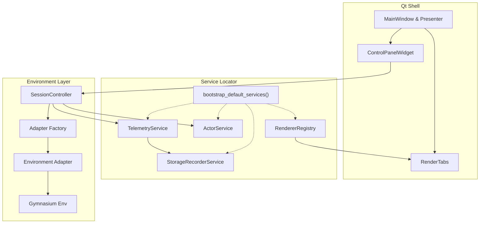
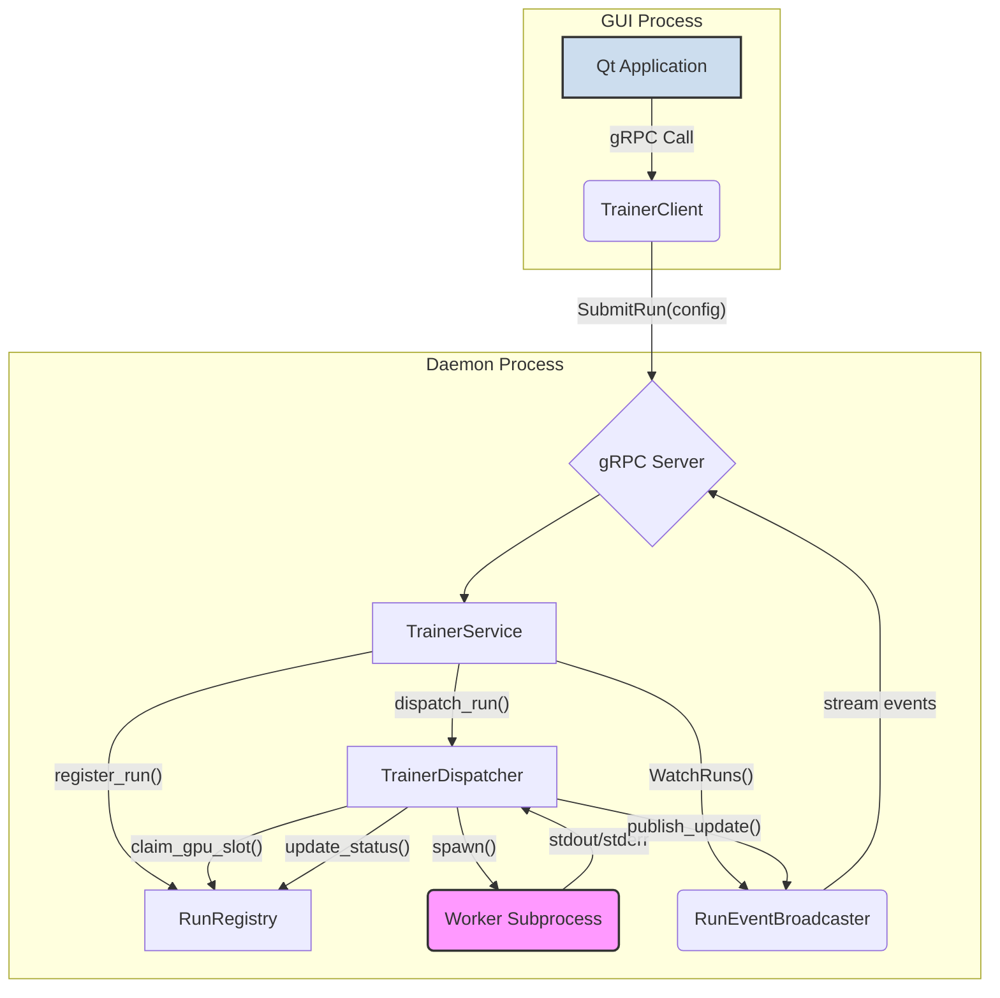
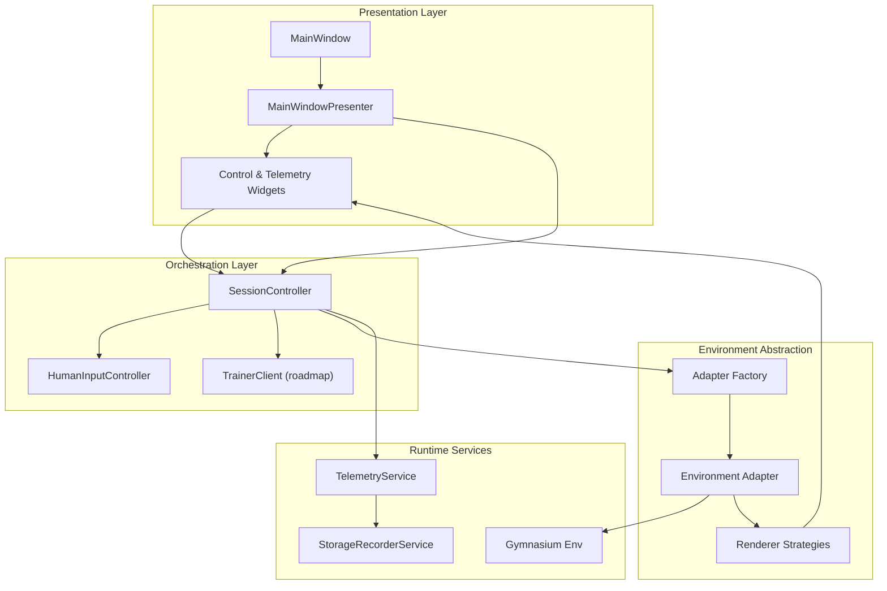
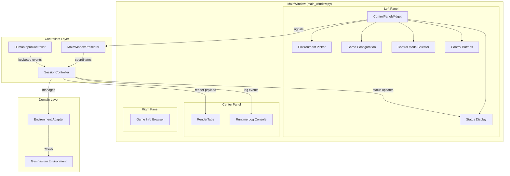
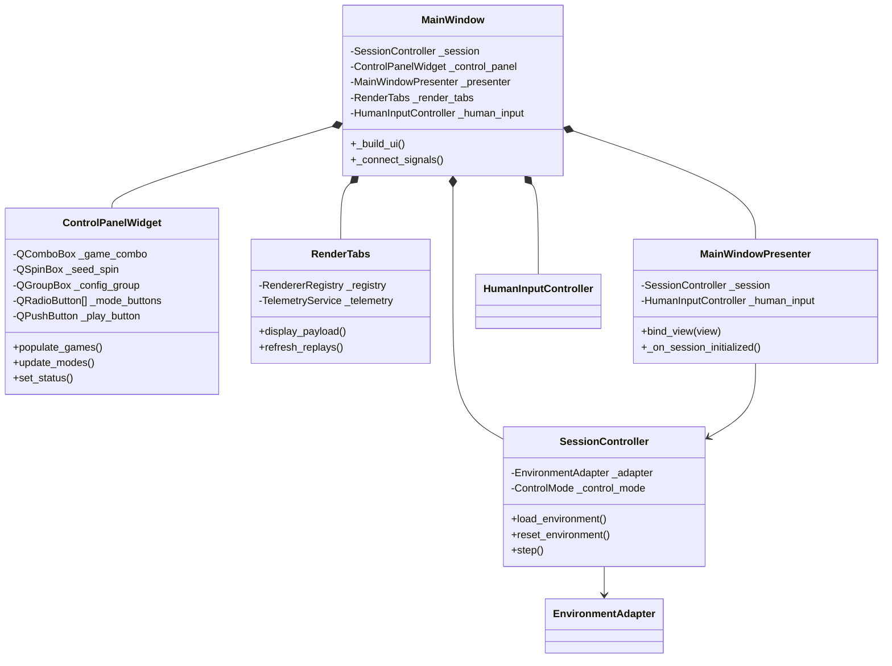

# Jumanji — A Qt-powered Graphical User Interface [GUI] for exploring, benchmarking, and documenting RL with Human Mode or Automated agents

<p align="center"> <a href="#getting-started">🚀 Quickstart</a> • <a href="#feature-spotlight">✨ Features</a> • <a href="#architecture">🧠 Architecture</a> • <a href="#environment-support">🎮 Environments</a> • <a href="#telemetry--storage-pipeline">📦 Storage</a> • <a href="#roadmap">🧭 Roadmap</a> </p> <p align="center">  </p> <p align="center">     </p>


## What is Jumanji?

Jumanji is an interactive RL laboratory: a desktop app that lets you (1) play environments as a human, (2) train agents as long-running jobs, and (3) replay every decision with synchronized telemetry—without stitching together notebooks, ad-hoc scripts, and log folders by hand. It is algorithm-agnostic: any trainer that runs as a CLI process can be orchestrated (e.g., CleanRL baselines), while the GUI focuses on visibility, control, and reproducible artifacts. Gymnasium provides the environment APIs and wrappers; the GUI sits above them as an operator console. [^sqlite-wal]

## Why this matters for research

Human-in-the-loop understanding. Build intuition quickly: pause, step, and annotate episodes; hand control between human and agent mid-trajectory to diagnose failure modes. (Qt thread/GUI safety is preserved via queued signals across threads.) [^[Box2D](https://envpool.readthedocs.io/en/latest/env/box2d.html)]

Reproducible records. Every step is captured in structured telemetry (JSONL + WAL-backed SQLite), enabling exact episode reconstruction and post-hoc analysis across runs and machines. (SQLite WAL allows readers to run while a writer appends.) [^[Isolation In SQLite](https://www.sqlite.org/isolation.html)]


Library-neutral training. Use your preferred trainers. CleanRL, for example, supplies concise, reproducible single-file baselines and logs metrics/videos; Jumanji orchestrates such runs and centralizes their artifacts.[^[How to open a WAL-enabled db file](https://sqlite.org/forum/info/50a4bfdb294333eec1ba4749661934521af19e6fc0790a6189696607f67c2b54?t=h)]

## 🎯 Vision: the interactive RL laboratory

RL tooling is powerful but fragmented—scripts here, logs there, videos elsewhere. Jumanji turns experiment management into a live, visual workflow: play as a human, train an agent, and replay every decision with synchronized telemetry. It targets Gymnasium-compatible environments and research workflows that need observability and reproducibility, not just final scores.
## ✨ Core Philosophy: Human-Led Today, Agent Assist Tomorrow

Jumanji already doubles as an exploratory cockpit for humans while laying the groundwork for automated agents. The philosophy is to ship reliable human tooling first, then layer agent orchestration and hybrid hand-offs as the daemon stack matures.

<p align="center">
	
</p>

### 🕵️ Human Mode (Shipping Today)

In Human Mode, you are the agent. This is more than just playing a game; it's a powerful tool for research and analysis:

-   **Intuition Building:** Get a deep, intuitive feel for an environment's dynamics, rewards, and challenges before you write a single line of agent code.
-   **Live Replay & Debugging:** Pause, rewind, and inspect any episode. Every action, observation, and reward is captured and can be replayed frame-by-frame, synchronized with telemetry charts.
-   **Dataset Creation:** Your gameplay automatically generates high-quality demonstration data. These trajectories become baselines for future agents or offline RL experiments.

### 🤖 Agent Mode (Under Construction)

The trainer daemon, dispatcher, and registry form the backbone for agent runs, but the GUI bridge is still being wired. Here’s what the near-term roadmap unlocks:

-   **Real-Time Observation:** Stream run records from the daemon into the GUI once the TrainerClient bridge lands, mirroring the human telemetry panels.
-   **Algorithm-Agnostic Launch:** Use CleanRL, LeanRL, CORL, or custom scripts as CLI workers managed by the dispatcher, with GPU reservations enforced by the registry.
-   **Ops Resilience:** Keep long runs alive even if the Qt shell restarts; the daemon stays in charge.

### 🧬 Hybrid Handoffs (Roadmap)

Interactive human↔agent switching is a stated goal, not a shipped feature. Achieving it requires:

- Shared action queues between human controllers and agent workers.
- Deterministic state sync so a hand-off mid-episode keeps observations/actions consistent.
- GUI affordances for choosing when to intervene versus resume automation.

These pieces will arrive after the TrainerClient bridge and control-panel updates land.

## 💡 Feature Spotlight

| Category | Today in Jumanji | Roadmap Lift | Traditional Approach (e.g., CleanRL) |
| --- | --- | --- | --- |
| **Interactive Experimentation** | Human mode with live telemetry, pause, and replay tooling. | Introduce agent-driven control surfaces and curated intervention hooks once TrainerClient wiring lands. | Scripted, non-interactive training runs with no GUI feedback loop. |
| **Visual Debugging & Replay** | Frame-by-frame playback for human sessions synchronized with JSONL/SQLite telemetry. | Extend replay loader to agent runs and persist RGB frames via the recorder service. | Generate MP4s post-run; no interactive scrubbing or linked telemetry. |
| **Decoupled Training Pipeline** | Trainer daemon, registry, and dispatcher operate headlessly to protect long jobs. | Expose daemon functionality through the GUI with watch/submit views and run health dashboards. | Training script dies with the terminal session or GUI crash. |
| **Unified Data Pipeline** | TelemetryService and StorageRecorderService capture every human step for reproducibility. | Add frame archives, pruning policies, and exporter bridges (TensorBoard/W&B). | Users manually juggle logs, checkpoints, and videos. |
| **Architectural Clarity** | Service locator + design journals document how controllers, adapters, and services plug together. | Publish getting-started diagrams (below) and API docs for trainer/client surfaces. | Monolithic scripts that require spelunking to extend. |

### Headline Capabilities

- **Human Telemetry Cockpit**: Play, pause, rewind, and annotate sessions while the GUI captures every step for reproducibility.
- **Structured Storage Pipeline**: JSONL logs plus WAL-backed SQLite keep artifacts queryable and durable.
- **Decoupled Trainer Foundations**: The daemon/dispatcher/registry trio protects long-running jobs from GUI hiccups.
- **Extensible Service Graph**: Actors, renderers, telemetry, and adapters register through the locator for Cura-style modularity.
- **Design Journals as Source of Truth**: Day-level logs document constraints, contrarian analyses, and pending work.

> **Reality check:** Agent-mode playback and human↔agent hand-offs are in active development. The daemon is live, but GUI controls for automated policies ship once the TrainerClient bridge and control-panel updates land.

## 🧠 Architecture


### Cura-Inspired Service Topology (GUI Process)

Inside the Qt process we mirror Cura’s modular service approach: controllers stay lightweight and delegate to services registered via the locator.



### Trainer Orchestrator (Daemon)

Jumanji is built on a robust client-server split: the Qt shell is an operator console, while an out-of-process trainer daemon manages long-running jobs. The diagram below recaps how the daemon components collaborate.




### Qt Shell Layering

The UI follows a layered MVP pattern with clear seams between presentation, orchestration, and environment control.



### Qt Shell High-Level Layout



### Component Hierarchy



### Core Components

-   **Qt Shell (GUI Process)**: The user-facing application. It includes the main window, rendering viewports, and telemetry dashboards. It communicates with the backend via a lightweight `TrainerClient` (under development).
-   **Trainer Daemon (Daemon Process)**: A persistent, `asyncio`-based background service that orchestrates all training tasks.
    -   **gRPC Server**: Exposes the `TrainerService` API for submitting runs, watching events, and managing jobs.
    -   **Run Registry**: The source of truth, using SQLite in WAL mode to store metadata for every run without blocking reads.
    -   **Trainer Dispatcher**: Manages the lifecycle of worker subprocesses, from GPU allocation to state tracking and log streaming.
    -   **Run Event Broadcaster**: A pub/sub system that fans out real-time updates to any connected clients.

This decoupled design means you can close the GUI, and your training jobs will continue to run, managed safely by the daemon.

### Boot Sequence

1.  **`python -m gym_gui.services.trainer_daemon`** starts the background daemon, which acquires a singleton lock and listens for gRPC connections.
2.  **`python -m gym_gui.app`** launches the Qt GUI, which connects to the daemon as a client.
3.  The GUI's **`SessionController`** mediates between UI actions, Gym environment adapters, and the `TrainerClient`.
4.  When a run is submitted, the daemon's **`TrainerDispatcher`** spawns a worker process, which executes a training script (e.g., from CleanRL).

## 🚀 Getting Started

### Prerequisites

- Python 3.10+
- System packages for Qt & Box2D (Ubuntu example):

```bash
sudo apt-get update
sudo apt-get install -y python3-pyqt6 pyqt6-dev-tools libgl1 libglu1
```

- (Optional) Virtual environment via `venv`, `conda`, or `uv`.

### Installation

```bash
git clone https://github.com/Abdulhamid97Mousa/GUI_BDI_RL.git jumanji
cd jumanji
python -m venv .venv
source .venv/bin/activate
pip install --upgrade pip
pip install -r requirements.txt
```

### Running the Application

First, start the background trainer daemon in one terminal:

```bash
# In terminal 1:
source .venv/bin/activate
python -m gym_gui.services.trainer_daemon
```

Then, launch the Qt GUI in another terminal:

```bash
# In terminal 2:
source .venv/bin/activate
python -m gym_gui.app
```

The first boot creates directories under `var/` (at the repository root) for logs, data, and telemetry. Check the status bar for seed and actor selections.

### Quick Smoke Test

```bash
python -m compileall gym_gui/core/adapters/box2d.py gym_gui/services/action_mapping.py
```

## 🕹️ Exploring Environments

1. Pick an environment family (Toy-Text, Box2D) in the Control Panel.
2. Configure step/time limits, control mode, and actor.
3. Click **Start Game** to enable keyboard shortcuts or auto-play timers.
4. Use telemetry tabs to inspect rewards, termination flags, and stored frames.

Passive actions remain synchronized across human, idle, and agent ticks via the shared action-mapper service.

## 🔍 Comparative Review: LeanRL & CORL Through the Jumanji Lens

### LeanRL vs. Jumanji

**Where LeanRL shines**

- Lean, single-file PyTorch (and JAX) baselines with aggressive optimizations (`torch.compile`, CUDA graphs, `vmap`) that deliver up to 6–7× faster Atari or continuous-control training loops.
- A benchmarked test suite covering PPO, SAC, TD3, and DQN variants, making it ideal for performance-focused experimentation.
- Out-of-the-box integrations for EnvPool, multi-GPU torchrun, and JAX accelerators.

**What Jumanji is building on top**

- A Qt control room where LeanRL policies can be launched, paused, and compared against human play without leaving the desktop shell once the TrainerClient bridge lands.
- Unified telemetry and storage (JSONL, SQLite, planned frame archives) that will transform LeanRL’s fast training outputs into inspectable, replayable artifacts.
- ActorService orchestration so LeanRL accelerators plug in cleanly alongside human and scripted actors.
- Pedagogical value: LeanRL explains how to write fast code, while Jumanji surfaces what the agent is doing in real time via replay tooling.

### CORL vs. Jumanji

**Where CORL excels**

- A sprawling offline RL zoo (CQL, ReBRAC, IQL, SPOT, Cal-QL, etc.) covering 30+ datasets with Weights & Biases reports.
- Ready-to-run evaluation tooling for offline, offline-to-online, and fine-tuning benchmarks.
- Rich documentation that lowers the barrier to applying state-of-the-art offline methods.

**What Jumanji aims to unlock**

- Online data collection via the GUI: human or automated actors can generate new trajectories that feed directly into CORL fine-tuning flows.
- Visual replay and explainability—exactly what CORL leaves to downstream tooling—so stakeholders can observe offline policies before deployment.
- A managed storage pipeline that keeps datasets auditable and reproducible when moving between online sessions and CORL batch jobs.
- Live evaluation harnesses where offline-trained agents and humans share the same environment session for interactive comparisons.

### Why Jumanji Has the Edge

- **Human + Agent Interaction:** Jumanji blends LeanRL’s throughput and CORL’s dataset rigor with an operator-friendly console that encourages intervention, annotation, and decision reviews.
- **Unified Telemetry Story:** Every episode produces synchronized step logs, metrics, and soon frame artifacts—capabilities missing from the training-centric repos.
- **Service-Oriented Extensibility:** The service locator pattern makes it trivial to wrap LeanRL accelerators, CORL offline policies, katakomba NetHack agents, or yet-to-be-added adapters without reworking the UI.
- **From Research to Production Readiness:** Deterministic seeds, actor metadata, and storage profiles create compliance-grade records that survive beyond the Jupyter cell.

**Next levers:** expose LeanRL runner presets inside the Actor palette, build dataset import/export bridges for CORL, and showcase multi-actor demos (human vs. LeanRL vs. CORL) to prove out the combined stack.

## 🎮 Environment Support

| Family | Status | Control modes | Render mode(s) | Storage profile |
| --- | --- | --- | --- | --- |
| FrozenLake, CliffWalking, Taxi | ✅ Stable | Human, Hybrid, Agent-only | ASCII grid | `toy_text` (JSONL telemetry only) |
| LunarLander (discrete & continuous) | ✅ Stable | Human, Auto-play | RGB array | `box2d_default` (JSONL + planned PNG frames) |
| CarRacing | ✅ Stable | Human, Auto-play, Idle tick | RGB array | `box2d_high_throughput` (JSONL + PNG frame capture) |
| BipedalWalker | ✅ Stable | Human, Auto-play | RGB array | `box2d_high_throughput` (JSONL + PNG frame capture) |
| Atari (ALE) | 🔜 Planned | Agent-only (headless) | RGB array | `atari_sqlite` (batched frame blobs) |

## 📦 Data & Storage Layout

- `var/records/` – JSONL step logs per episode and replay snapshots (gitignored).
- `var/telemetry/telemetry.sqlite` – WAL-backed store for analytics & dashboards.
- `var/cache/` & `var/tmp/` – Derived caches and scratch space safe to purge.

Retention knobs such as `max_record_bytes`, `max_sessions`, and `prune_on_start` will live in `gym_gui/config/storage_profiles.yaml` to keep large Box2D runs manageable.

## 🔧 Development Workflow

| Task | Recommended Command |
| --- | --- |
| Format/lint (upcoming pre-commit stack) | `pre-commit run --all-files` |
| Static type hints | `mypy gym_gui` |
| Unit tests | `pytest` *(suite under construction)* |
| Codacy CLI analysis | `codacy-analysis-cli analyze` *(configured via MCP)* |

### Launching a Dev Session

```bash
export QT_QPA_PLATFORM=offscreen  # for headless CI
PYTHONPATH=. python examples/run_cartpole.py  # coming soon
```

## 🧭 Roadmap

- RGB renderer abstraction & render-mode negotiation tests.
- Frame persistence pipeline with PNG/WebP writers and replay tooling.
- Structured telemetry table view + export from the Qt shell.
- Managed environment via `pyproject.toml` + lockfile.
- Automated formatting/lint gates mirroring CleanRL’s pre-commit stack.
- Actor plugins for BDI-based agents and LLM-based multi-step agents.
- Storage pruning CLI (`python -m gym_gui.tools.prune`) with dry-run reports.
- Telemetry exporter bridge (TensorBoard, W&B, MLflow).

Follow progress in the Day-level design journals (e.g., `1.0_DAY_5_CURRENT_DESIGN_PROGRESS.md`).

## 🤝 Contributing

Contributions are welcome! Please:

1. Open an issue describing the feature or bug.
2. Fork & create a branch (`feat/<summary>` or `fix/<summary>`).
3. Add tests or docs where applicable.
4. Run formatting, linting, and Codacy analysis before submitting a PR.

## 📚 References & Inspiration

- [Gymnasium](https://gymnasium.farama.org/) – Environment APIs powering adapters.
- [Qt / PyQt6](https://doc.qt.io/qt-6/) – UI framework underpinning the shell.
- [CleanRL](https://github.com/vwxyzjn/cleanrl) – Lockfile discipline and telemetry expectations we aim to match.
- [OpenShot](https://github.com/OpenShot/openshot-qt) – Reference for Qt service orchestration and caching strategies.

## 🌍 Why Jumanji (and how it complements our submodules)

Jumanji is the control tower that sits above a constellation of best-in-class RL projects. Each git submodule in this repository solves a different research problem; Jumanji stitches them into an interactive, human-friendly workflow.

| Ecosystem component | What it excels at | How Jumanji adds value |
| --- | --- | --- |
| [`cleanrl/`](cleanrl) – single-file algorithm references | Teaches PPO/DQN/SAC with ~300-line scripts, rich docs, and reproducible baselines. | Wraps CleanRL agents inside the ActorService so those baselines can be driven live from the Qt shell, benchmarked against human play, and logged with the same storage pipeline. |
| [`LeanRL/`](LeanRL) – performance-tuned PyTorch kernels | Turbo-charged CleanRL scripts using `torch.compile`, CUDA graphs, tensordict, and `vmap` for up to **6.8×** faster Atari runs. | Provides “agent-only” playback profiles and telemetry exporters so LeanRL’s high-throughput training can still be inspected frame-by-frame without patching its lean logging stack. |
| [`CORL/`](CORL) – offline RL algorithms | 20+ single-file ORL baselines (CQL, ReBRAC, IQL, SPOT, Cal-QL, etc.) with Weights & Biases reports over 30+ datasets. | Supplies dataset ingestion hooks; Jumanji’s storage/telemetry services become the online data producers and evaluation harness for CORL fine-tuning or offline-to-online comparisons. |
| [`katakomba/`](katakomba) – NetHack offline benchmark | Decomposed AutoAscend datasets (38 roles/races/alignments), sequential buffers, and recurrent offline baselines. | Offers adapters that surface Katakomba runs with live tty rendering, letting researchers pit NetHack agents against humans or CleanRL/LeanRL policies inside the same UI and dataset export flow. |
| [`openrlbenchmark/`](openrlbenchmark) – experiment tracking | Public repository of benchmarked DRL runs across libraries. | Jumanji’s structured outputs (JSONL, SQLite, frames) map cleanly into Open RL Benchmark upload jobs, making our GUI sessions part of the broader reproducibility story. |

### Why build Jumanji?

- **Unify the practitioner experience:** RL tooling is fragmented—scripts in one repo, datasets in another, benchmarks elsewhere. Jumanji gives researchers a cockpit where everything comes together: load an environment, pick a baseline (CleanRL/LeanRL), compare against human input, and push telemetry to Open RL Benchmark.
- **Make RL explainable to humans:** Algorithms are only half the story; educators and product teams need to observe, pause, rewind, and annotate episodes. Jumanji’s emphasis on visual replay, structured storage, and actor orchestration fills that gap.
- **Accelerate iteration:** The service locator and Qt shell make it trivial to slot in new adapters or actors. CORL can drop in an offline policy, katakomba can register a new dungeon, LeanRL can surface a GPU-accelerated agent—all without rewriting UI plumbing.
- **Bridge research and production:** By capturing deterministic seeds, telemetry, and soon frame archives, Jumanji creates artifacts suitable for compliance reviews, reproducibility requirements, and cross-team handoffs.

In short, the submodules provide the algorithms, environments, and benchmarks; Jumanji orchestrates them into a cohesive, human-in-the-loop RL lab.

## 📣 Community & Support

- **Discussion** – Open an issue or start a GitHub Discussion to propose features or share feedback.
- **Design diaries** – Day-by-day logs capture decisions, contrarian analyses, and refactoring plans.
- **Benchmarks** – Planned integration with Open RL Benchmark for reproducible experiment dashboards.

## 📄 License

All rights reserved. This repository is provided for evaluation and collaboration only. Redistribution, modification, or any commercial use requires prior written permission from the maintainers. Please reach out through the issue tracker or direct contact channels to discuss licensing terms.

---

Welcome to **Jumanji**—may your episodes be reproducible, your agents convergent, and your storage quotas intact.
