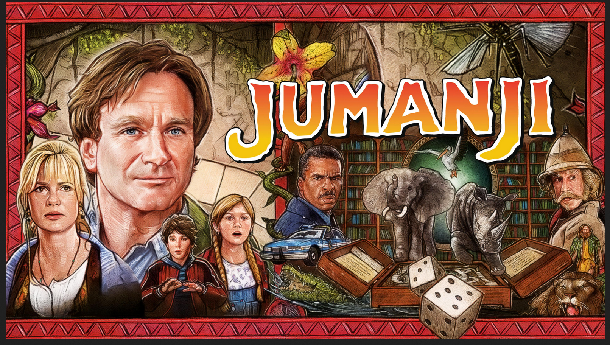
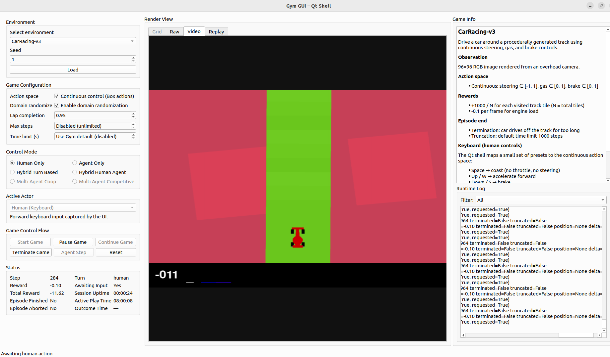
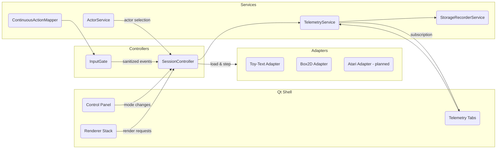

# A Qt-powered command center for exploring, benchmarking, and documenting reinforcement-learning environments with human and automated agents.

<p align="center">
	<a href="#getting-started">🚀 Quickstart</a> •
	<a href="#feature-spotlight">✨ Features</a> •
	<a href="#architecture">🧠 Architecture</a> •
	<a href="#environment-support">🎮 Environments</a> •
	<a href="#telemetry--storage-pipeline">📦 Storage</a> •
	<a href="#roadmap">🧭 Roadmap</a>
</p>

<p align="center">
	
</p>

<p align="center">
	
	
	
	
</p>

## Jumanji – A Research-Grade RL Control Room

## 🎯 Vision

Jumanji turns the raw telemetry of Gymnasium environments into an interactive mission-control GUI. It mixes real-time visualization, structured storage, and service-oriented orchestration so researchers can prototype agents, replay episodes, and curate datasets—all without leaving a unified desktop shell.

<p align="center">
	
</p>

Key ambitions:

- **Environment parity** – Treat toy-text grids and Box2D pixel worlds with the same UX and storage guarantees.
- **Human + agent collaboration** – Swap effortlessly between keyboard play, scripted policies, BDI/Q learners, and LLM copilots.
- **Research reproducibility** – Capture every step, frame, and seed so experiments remain rewritable months later.

## ✨ Feature Spotlight

| Category | Why it matters | Jumanji take | CleanRL contrast |
| --- | --- | --- | --- |
| **Human-in-the-loop RL** | Inspect and intervene mid-episode | Live control flow gates, actor registry, and shared continuous action mapping keep humans and agents in sync. | CleanRL targets scripted training only; no GUI.
| **Experiment explainability** | Replaying episodes demands visual + telemetry parity | Structured step records, upcoming frame archives, and service-based exporters. | CleanRL records video/metrics but lacks an interactive replay console.
| **Infrastructure guardrails** | Scaling to Box2D/Atari requires predictable IO | Configurable storage profiles, retention policies, and JSONL/SQLite parity. | CleanRL emphasises single-file scripts; storage left to user tooling.
| **Architecture clarity** | Contributors need to trace responsibilities fast | Service locator + controller layering with mermaid diagrams and day-level design journals. | CleanRL favours succinct algorithm files without GUI abstractions.

### Headline Capabilities

- **Qt shell with modular renderers** – Grid and RGB payloads share a pluggable renderer interface so adapters can draw into a consistent viewport.
- **Service locator architecture** – Telemetry, storage, actors, and action mapping register through a bootstrap pipeline, keeping UI glue thin and testable.
- **Box2D-ready control flow** – Centralized input gating prevents “frozen start” states while shared discrete→continuous mappings translate keyboard intents into float action spaces.
- **Real-time telemetry analysis** – Live reward charts, termination flags, and actor state roll in as episodes run, giving researchers immediate feedback without leaving the shell.
- **Storage pipeline you can trust** – `TelemetryService` writes JSONL episode logs and a WAL-backed SQLite database, so every run has durable, queryable artifacts.
- **Actor registry** – Register human, scripted, and learning agents with metadata so the control panel can advertise capabilities and swap modes live.
- **Day-by-day design logs** – Architectural intent stays aligned through living memoranda (`1.0_DAY_*`) that document decisions and refactors.

## 🧠 Architecture

Jumanji embraces the Model-Presenter-Service pattern: the Qt Shell stays thin, the `SessionController` orchestrates episode lifecycle, and cross-cutting concerns live in scoped services.



### Boot Sequence

1. **`python -m gym_gui.app`** configures logging, loads `.env`, and bootstraps services.
2. **Service locator** registers the telemetry, storage, actor, and action-mapper singletons.
3. **SessionController** mediates between the UI, Gym adapters, and services.
4. **Adapters** (toy-text, Box2D, upcoming Atari) surface environment-specific rendering and control semantics.

## 🚀 Getting Started

### Prerequisites

- Python 3.10+
- System packages for Qt & Box2D (Ubuntu example):

```bash
sudo apt-get update
sudo apt-get install -y python3-pyqt6 pyqt6-dev-tools libgl1 libglu1
```

- (Optional) Virtual environment via `venv`, `conda`, or `uv`.

### Installation

```bash
git clone https://github.com/Abdulhamid97Mousa/GUI_BDI_RL.git jumanji
cd jumanji
python -m venv .venv
source .venv/bin/activate
pip install --upgrade pip
pip install -r requirements.txt
```

### Running the Qt Shell

```bash
export QT_QPA_PLATFORM=offscreen  # omit on desktops with a display server
python -m gym_gui.app
```

The first boot creates `gym_gui/runtime/` for logs and telemetry. Check the status bar for seed and actor selections.

### Quick Smoke Test

```bash
python -m compileall gym_gui/core/adapters/box2d.py gym_gui/services/action_mapping.py
```

## 🕹️ Exploring Environments

1. Pick an environment family (Toy-Text, Box2D) in the Control Panel.
2. Configure step/time limits, control mode, and actor.
3. Click **Start Game** to enable keyboard shortcuts or auto-play timers.
4. Use telemetry tabs to inspect rewards, termination flags, and stored frames.

Passive actions remain synchronized across human, idle, and agent ticks via the shared action-mapper service.

## 🔍 Comparative Review: LeanRL & CORL Through the Jumanji Lens

### LeanRL vs. Jumanji

**Where LeanRL shines**

- Lean, single-file PyTorch (and JAX) baselines with aggressive optimizations (`torch.compile`, CUDA graphs, `vmap`) that deliver up to 6–7× faster Atari or continuous-control training loops.
- A benchmarked test suite covering PPO, SAC, TD3, and DQN variants, making it ideal for performance-focused experimentation.
- Out-of-the-box integrations for EnvPool, multi-GPU torchrun, and JAX accelerators.

**What Jumanji adds on top**

- A Qt control room where LeanRL policies can be launched, paused, and compared against human play without leaving the desktop shell.
- Unified telemetry and storage (JSONL, SQLite, planned frame archives) that transform LeanRL’s fast training outputs into inspectable, replayable artifacts.
- ActorService orchestration so LeanRL accelerators plug in cleanly alongside human and scripted actors.
- Pedagogical value: LeanRL explains how to write fast code, while Jumanji shows what the agent is doing in real time.

### CORL vs. Jumanji

**Where CORL excels**

- A sprawling offline RL zoo (CQL, ReBRAC, IQL, SPOT, Cal-QL, etc.) covering 30+ datasets with Weights & Biases reports.
- Ready-to-run evaluation tooling for offline, offline-to-online, and fine-tuning benchmarks.
- Rich documentation that lowers the barrier to applying state-of-the-art offline methods.

**What Jumanji unlocks**

- Online data collection via the GUI: human or automated actors can generate new trajectories that feed directly into CORL fine-tuning flows.
- Visual replay and explainability—exactly what CORL leaves to downstream tooling—so stakeholders can observe offline policies before deployment.
- A managed storage pipeline that keeps datasets auditable and reproducible when moving between online sessions and CORL batch jobs.
- Live evaluation harnesses where offline-trained agents and humans share the same environment session for interactive comparisons.

### Why Jumanji Has the Edge

- **Human + Agent Interaction:** Jumanji blends LeanRL’s throughput and CORL’s dataset rigor with an operator-friendly console that encourages intervention, annotation, and decision reviews.
- **Unified Telemetry Story:** Every episode produces synchronized step logs, metrics, and soon frame artifacts—capabilities missing from the training-centric repos.
- **Service-Oriented Extensibility:** The service locator pattern makes it trivial to wrap LeanRL accelerators, CORL offline policies, katakomba NetHack agents, or yet-to-be-added adapters without reworking the UI.
- **From Research to Production Readiness:** Deterministic seeds, actor metadata, and storage profiles create compliance-grade records that survive beyond the Jupyter cell.

**Next levers:** expose LeanRL runner presets inside the Actor palette, build dataset import/export bridges for CORL, and showcase multi-actor demos (human vs. LeanRL vs. CORL) to prove out the combined stack.

## 🎮 Environment Support

| Family | Status | Control modes | Render mode(s) | Storage profile |
| --- | --- | --- | --- | --- |
| FrozenLake, CliffWalking, Taxi | ✅ Stable | Human, Hybrid, Agent-only | ASCII grid | `toy_text` (JSONL telemetry only) |
| LunarLander (discrete & continuous) | ✅ Stable | Human, Auto-play | RGB array | `box2d_default` (JSONL + planned PNG frames) |
| CarRacing | ✅ Stable | Human, Auto-play, Idle tick | RGB array | `box2d_high_throughput` (JSONL + PNG frame capture) |
| BipedalWalker | ✅ Stable | Human, Auto-play | RGB array | `box2d_high_throughput` (JSONL + PNG frame capture) |
| Atari (ALE) | 🔜 Planned | Agent-only (headless) | RGB array | `atari_sqlite` (batched frame blobs) |

## 📦 Data & Storage Layout

- `runtime/data/episodes/` – JSONL step logs per episode.
- `runtime/data/telemetry/telemetry.sqlite` – WAL-backed store for analytics & dashboards.
- Planned `var/` hierarchy – Future home for frame archives (`var/records/`), caches, and pruning tools.

Retention knobs such as `max_record_bytes`, `max_sessions`, and `prune_on_start` will live in `gym_gui/config/storage_profiles.yaml` to keep large Box2D runs manageable.

## 🔧 Development Workflow

| Task | Recommended Command |
| --- | --- |
| Format/lint (upcoming pre-commit stack) | `pre-commit run --all-files` |
| Static type hints | `mypy gym_gui` |
| Unit tests | `pytest` *(suite under construction)* |
| Codacy CLI analysis | `codacy-analysis-cli analyze` *(configured via MCP)* |

### Launching a Dev Session

```bash
export QT_QPA_PLATFORM=offscreen  # for headless CI
PYTHONPATH=. python examples/run_cartpole.py  # coming soon
```

## 🧭 Roadmap

- RGB renderer abstraction & render-mode negotiation tests.
- Frame persistence pipeline with PNG/WebP writers and replay tooling.
- Structured telemetry table view + export from the Qt shell.
- Managed environment via `pyproject.toml` + lockfile.
- Automated formatting/lint gates mirroring CleanRL’s pre-commit stack.
- Actor plugins for BDI-Q learners and LLM-driven assistants.
- Storage pruning CLI (`python -m gym_gui.tools.prune`) with dry-run reports.
- Telemetry exporter bridge (TensorBoard, W&B, MLflow).

Follow progress in the Day-level design journals (e.g., `1.0_DAY_5_CURRENT_DESIGN_PROGRESS.md`).

## 🤝 Contributing

Contributions are welcome! Please:

1. Open an issue describing the feature or bug.
2. Fork & create a branch (`feat/<summary>` or `fix/<summary>`).
3. Add tests or docs where applicable.
4. Run formatting, linting, and Codacy analysis before submitting a PR.

## 📚 References & Inspiration

- [Gymnasium](https://gymnasium.farama.org/) – Environment APIs powering adapters.
- [Qt / PyQt6](https://doc.qt.io/qt-6/) – UI framework underpinning the shell.
- [CleanRL](https://github.com/vwxyzjn/cleanrl) – Lockfile discipline and telemetry expectations we aim to match.
- [OpenShot](https://github.com/OpenShot/openshot-qt) – Reference for Qt service orchestration and caching strategies.

## 🌍 Why Jumanji (and how it complements our submodules)

Jumanji is the control tower that sits above a constellation of best-in-class RL projects. Each git submodule in this repository solves a different research problem; Jumanji stitches them into an interactive, human-friendly workflow.

| Ecosystem component | What it excels at | How Jumanji adds value |
| --- | --- | --- |
| [`cleanrl/`](cleanrl) – single-file algorithm references | Teaches PPO/DQN/SAC with ~300-line scripts, rich docs, and reproducible baselines. | Wraps CleanRL agents inside the ActorService so those baselines can be driven live from the Qt shell, benchmarked against human play, and logged with the same storage pipeline. |
| [`LeanRL/`](LeanRL) – performance-tuned PyTorch kernels | Turbo-charged CleanRL scripts using `torch.compile`, CUDA graphs, tensordict, and `vmap` for up to **6.8×** faster Atari runs. | Provides “agent-only” playback profiles and telemetry exporters so LeanRL’s high-throughput training can still be inspected frame-by-frame without patching its lean logging stack. |
| [`CORL/`](CORL) – offline RL algorithms | 20+ single-file ORL baselines (CQL, ReBRAC, IQL, SPOT, Cal-QL, etc.) with Weights & Biases reports over 30+ datasets. | Supplies dataset ingestion hooks; Jumanji’s storage/telemetry services become the online data producers and evaluation harness for CORL fine-tuning or offline-to-online comparisons. |
| [`katakomba/`](katakomba) – NetHack offline benchmark | Decomposed AutoAscend datasets (38 roles/races/alignments), sequential buffers, and recurrent offline baselines. | Offers adapters that surface Katakomba runs with live tty rendering, letting researchers pit NetHack agents against humans or CleanRL/LeanRL policies inside the same UI and dataset export flow. |
| [`openrlbenchmark/`](openrlbenchmark) – experiment tracking | Public repository of benchmarked DRL runs across libraries. | Jumanji’s structured outputs (JSONL, SQLite, frames) map cleanly into Open RL Benchmark upload jobs, making our GUI sessions part of the broader reproducibility story. |

### Why build Jumanji?

- **Unify the practitioner experience:** RL tooling is fragmented—scripts in one repo, datasets in another, benchmarks elsewhere. Jumanji gives researchers a cockpit where everything comes together: load an environment, pick a baseline (CleanRL/LeanRL), compare against human input, and push telemetry to Open RL Benchmark.
- **Make RL explainable to humans:** Algorithms are only half the story; educators and product teams need to observe, pause, rewind, and annotate episodes. Jumanji’s emphasis on visual replay, structured storage, and actor orchestration fills that gap.
- **Accelerate iteration:** The service locator and Qt shell make it trivial to slot in new adapters or actors. CORL can drop in an offline policy, katakomba can register a new dungeon, LeanRL can surface a GPU-accelerated agent—all without rewriting UI plumbing.
- **Bridge research and production:** By capturing deterministic seeds, telemetry, and soon frame archives, Jumanji creates artifacts suitable for compliance reviews, reproducibility requirements, and cross-team handoffs.

In short, the submodules provide the algorithms, environments, and benchmarks; Jumanji orchestrates them into a cohesive, human-in-the-loop RL lab.

## 📣 Community & Support

- **Discussion** – Open an issue or start a GitHub Discussion to propose features or share feedback.
- **Design diaries** – Day-by-day logs capture decisions, contrarian analyses, and refactoring plans.
- **Benchmarks** – Planned integration with Open RL Benchmark for reproducible experiment dashboards.

## 📄 License

All rights reserved. This repository is provided for evaluation and collaboration only. Redistribution, modification, or any commercial use requires prior written permission from the maintainers. Please reach out through the issue tracker or direct contact channels to discuss licensing terms.

---

Welcome to **Jumanji**—may your episodes be reproducible, your agents convergent, and your storage quotas intact.
