<div align="center">
    <a href="https://github.com/Abdulhamid97Mousa/mosaic">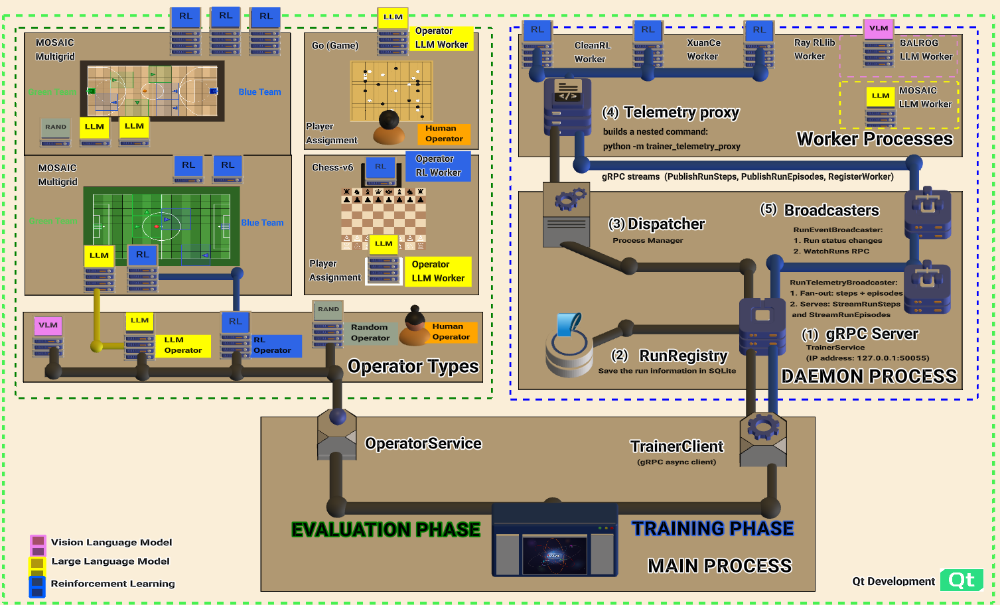</a>
</div>

---

[](https://arxiv.org/abs/2603.01260)
[](https://github.com/Abdulhamid97Mousa/mosaic/actions/workflows/ci.yml)
[](https://codecov.io/gh/Abdulhamid97Mousa/mosaic)
[](https://www.python.org/downloads/)
[](https://pytorch.org/get-started/locally/)
[](https://gymnasium.farama.org/)
[](https://pettingzoo.farama.org/)
[](https://github.com/Abdulhamid97Mousa/mosaic/blob/main/LICENSE)
[](https://mosaic-agent-level-interface.readthedocs.io/en/latest/)

# MOSAIC

**A Unified Platform for Cross-Paradigm Comparison and Evaluation of Homogeneous and Heterogeneous Multi-Agent RL, LLM, VLM, and Human Decision-Makers**

MOSAIC is a visual-first platform that enables researchers to configure, run, and compare experiments across RL, LLM, VLM, and human decision-makers in the same multi-agent environment. Different paradigms like tiles in a mosaic come together to form a complete picture of agent performance.

| **Documentation**: [mosaic-platform.readthedocs.io](https://mosaic-platform.readthedocs.io/en/latest/) | **GitHub**: [github.com/Abdulhamid97Mousa/mosaic](https://github.com/Abdulhamid97Mousa/mosaic) |
|---|---|

## Two Evaluation Modes

MOSAIC provides two evaluation modes designed for reproducibility:

<video src="https://private-user-images.githubusercontent.com/80536675/553915409-ea9ebc18-2216-4fb2-913c-5d354ebea56e.mp4?jwt=eyJ0eXAiOiJKV1QiLCJhbGciOiJIUzI1NiJ9.eyJpc3MiOiJnaXRodWIuY29tIiwiYXVkIjoicmF3LmdpdGh1YnVzZXJjb250ZW50LmNvbSIsImtleSI6ImtleTUiLCJleHAiOjE3NzIxNjgzMzQsIm5iZiI6MTc3MjE2ODAzNCwicGF0aCI6Ii84MDUzNjY3NS81NTM5MTU0MDktZWE5ZWJjMTgtMjIxNi00ZmIyLTkxM2MtNWQzNTRlYmVhNTZlLm1wND9YLUFtei1BbGdvcml0aG09QVdTNC1ITUFDLVNIQTI1NiZYLUFtei1DcmVkZW50aWFsPUFLSUFWQ09EWUxTQTUzUFFLNFpBJTJGMjAyNjAyMjclMkZ1cy1lYXN0LTElMkZzMyUyRmF3czRfcmVxdWVzdCZYLUFtei1EYXRlPTIwMjYwMjI3VDA0NTM1NFomWC1BbXotRXhwaXJlcz0zMDAmWC1BbXotU2lnbmF0dXJlPTAyZDkzMWQwZjczOTI1NzFiNjk2MGU4N2I2ZTAxNDE0M2Y2YmQxNjM5ZTAxMTkxYzA5NGU4ZGE3YzZkZmJkZWEmWC1BbXotU2lnbmVkSGVhZGVycz1ob3N0In0.9BimKYjxGrdN_g1eDbXC69weDC7-My85Gl-ou2wNzxQ" controls autoplay muted loop style="width:100%; max-width:100%; height:auto; border-radius:8px;"></video>
<p align="center"><b>Manual Mode:</b> Side-by-side lock-step evaluation with shared seeds.</p>

- **Manual Mode:** side-by-side comparison where multiple operators step through the same environment with shared seeds, letting researchers visually inspect decision-making differences between paradigms in real time.

<video src="https://private-user-images.githubusercontent.com/80536675/553915854-a9b3f6f4-661c-492f-b43f-34d7125a6d2e.mp4?jwt=eyJ0eXAiOiJKV1QiLCJhbGciOiJIUzI1NiJ9.eyJpc3MiOiJnaXRodWIuY29tIiwiYXVkIjoicmF3LmdpdGh1YnVzZXJjb250ZW50LmNvbSIsImtleSI6ImtleTUiLCJleHAiOjE3NzIxNjgzMzQsIm5iZiI6MTc3MjE2ODAzNCwicGF0aCI6Ii84MDUzNjY3NS81NTM5MTU4NTQtYTliM2Y2ZjQtNjYxYy00OTJmLWI0M2YtMzRkNzEyNWE2ZDJlLm1wND9YLUFtei1BbGdvcml0aG09QVdTNC1ITUFDLVNIQTI1NiZYLUFtei1DcmVkZW50aWFsPUFLSUFWQ09EWUxTQTUzUFFLNFpBJTJGMjAyNjAyMjclMkZ1cy1lYXN0LTElMkZzMyUyRmF3czRfcmVxdWVzdCZYLUFtei1EYXRlPTIwMjYwMjI3VDA0NTM1NFomWC1BbXotRXhwaXJlcz0zMDAmWC1BbXotU2lnbmF0dXJlPWNhMjM0ZjBjYjU1NWFlNmYxOGU2Yzc2N2U0ODE4OTYzZGVkYTc5YTIyMjM5YzRjODU0MTRhODFhOWI4ZDU3NmImWC1BbXotU2lnbmVkSGVhZGVycz1ob3N0In0.tk8Ezu0ivgFlp-xm6YEkIsWlbFPcpOgSq30Hq_JEJvs" controls autoplay muted loop style="width:100%; max-width:100%; height:auto; border-radius:8px;"></video>
<p align="center"><b>Script Mode:</b> Automated batch evaluation with deterministic seed sequences.</p>

- **Script Mode:** automated, long-running evaluation driven by Python scripts that define operator configurations, worker assignments, seed sequences, and episode counts. Scripts execute deterministically with no manual intervention, producing reproducible telemetry logs (JSONL) for every step and episode.

All evaluation runs share **identical conditions**: same environment seeds, same observations, and unified telemetry. Script Mode additionally supports **procedural seeds** (different seed per episode to test generalization) and **fixed seeds** (same seed every episode to isolate agent behaviour), with configurable step pacing for visual inspection or headless batch execution.

## Why MOSAIC?

Today's AI landscape offers powerful but **fragmented** tools: RL frameworks ([CleanRL](https://github.com/vwxyzjn/cleanrl), [RLlib](https://docs.ray.io/en/latest/rllib/index.html), [XuanCe](https://github.com/agi-brain/xuance)), language models (GPT, Claude), and robotics simulators (MuJoCo). Each excels in isolation, but **no platform bridges them together** under a unified, visual-first interface.

**MOSAIC provides:**

- **Visual-First Design**: Configure experiments through an intuitive PyQt6 interface, **almost no code required**.
- **Heterogeneous Agent Mixing**: Deploy Human, RL, and LLM agents in the same environment.
- **Resource Management & Quotas**: GPU allocation, queue limits, credit-based backpressure, health monitoring.
- **Per-Agent Policy Binding**: Route each agent to different workers via `PolicyMappingService`.
- **Worker Lifecycle Orchestration**: Subprocess management with heartbeat monitoring and graceful termination.

<video src="https://private-user-images.githubusercontent.com/80536675/553915983-ded17cdc-f23c-404f-a9f6-074fbe74816c.mp4?jwt=eyJ0eXAiOiJKV1QiLCJhbGciOiJIUzI1NiJ9.eyJpc3MiOiJnaXRodWIuY29tIiwiYXVkIjoicmF3LmdpdGh1YnVzZXJjb250ZW50LmNvbSIsImtleSI6ImtleTUiLCJleHAiOjE3NzIxNjgzMzQsIm5iZiI6MTc3MjE2ODAzNCwicGF0aCI6Ii84MDUzNjY3NS81NTM5MTU5ODMtZGVkMTdjZGMtZjIzYy00MDRmLWE5ZjYtMDc0ZmJlNzQ4MTZjLm1wND9YLUFtei1BbGdvcml0aG09QVdTNC1ITUFDLVNIQTI1NiZYLUFtei1DcmVkZW50aWFsPUFLSUFWQ09EWUxTQTUzUFFLNFpBJTJGMjAyNjAyMjclMkZ1cy1lYXN0LTElMkZzMyUyRmF3czRfcmVxdWVzdCZYLUFtei1EYXRlPTIwMjYwMjI3VDA0NTM1NFomWC1BbXotRXhwaXJlcz0zMDAmWC1BbXotU2lnbmF0dXJlPWUwZmZiZTlmZjQ3OGQ4NTk1ZWQzODEzMGVlYTMyY2E0Y2E1ZjJjZTU0NTg0MDMxYmU0OThlMGVkNjc1ZGVjNDgmWC1BbXotU2lnbmVkSGVhZGVycz1ob3N0In0.1DWDiXB20L5dr8Hx60M70zd0pL1JKkOO5roOjr2kkaQ" controls autoplay muted loop style="width:100%; max-width:100%; height:auto; border-radius:8px;"></video>
<p align="center"><b>Human vs Human:</b> Two human players competing via dedicated USB keyboards.</p>

<video src="https://private-user-images.githubusercontent.com/80536675/553916105-2625a8f8-476c-4171-86cc-a9970cbf1665.mp4?jwt=eyJ0eXAiOiJKV1QiLCJhbGciOiJIUzI1NiJ9.eyJpc3MiOiJnaXRodWIuY29tIiwiYXVkIjoicmF3LmdpdGh1YnVzZXJjb250ZW50LmNvbSIsImtleSI6ImtleTUiLCJleHAiOjE3NzIxNjgzMzQsIm5iZiI6MTc3MjE2ODAzNCwicGF0aCI6Ii84MDUzNjY3NS81NTM5MTYxMDUtMjYyNWE4ZjgtNDc2Yy00MTcxLTg2Y2MtYTk5NzBjYmYxNjY1Lm1wND9YLUFtei1BbGdvcml0aG09QVdTNC1ITUFDLVNIQTI1NiZYLUFtei1DcmVkZW50aWFsPUFLSUFWQ09EWUxTQTUzUFFLNFpBJTJGMjAyNjAyMjclMkZ1cy1lYXN0LTElMkZzMyUyRmF3czRfcmVxdWVzdCZYLUFtei1EYXRlPTIwMjYwMjI3VDA0NTM1NFomWC1BbXotRXhwaXJlcz0zMDAmWC1BbXotU2lnbmF0dXJlPTQwMzljOWNhYWQwNjZjNzRlZDU4ZmM3M2M0YWJlNjYwNWM0NzM2YjkxNmQ4YTQxYmEzYTNmNzJkYWQwZGI3MWQmWC1BbXotU2lnbmVkSGVhZGVycz1ob3N0In0.Lvwy-I3p1fNP-kmUhHtUXO7FtJ9Q_K_NCVuGbxZ6VbY" controls autoplay muted loop style="width:100%; max-width:100%; height:auto; border-radius:8px;"></video>
<p align="center"><b>Random Agents:</b> Baseline agents across 26 environment families.</p>

<video src="https://private-user-images.githubusercontent.com/80536675/553916227-f2d79901-a93d-465b-9058-1b9cdabf311a.mp4?jwt=eyJ0eXAiOiJKV1QiLCJhbGciOiJIUzI1NiJ9.eyJpc3MiOiJnaXRodWIuY29tIiwiYXVkIjoicmF3LmdpdGh1YnVzZXJjb250ZW50LmNvbSIsImtleSI6ImtleTUiLCJleHAiOjE3NzIxNjgzMzQsIm5iZiI6MTc3MjE2ODAzNCwicGF0aCI6Ii84MDUzNjY3NS81NTM5MTYyMjctZjJkNzk5MDEtYTkzZC00NjViLTkwNTgtMWI5Y2RhYmYzMTFhLm1wND9YLUFtei1BbGdvcml0aG09QVdTNC1ITUFDLVNIQTI1NiZYLUFtei1DcmVkZW50aWFsPUFLSUFWQ09EWUxTQTUzUFFLNFpBJTJGMjAyNjAyMjclMkZ1cy1lYXN0LTElMkZzMyUyRmF3czRfcmVxdWVzdCZYLUFtei1EYXRlPTIwMjYwMjI3VDA0NTM1NFomWC1BbXotRXhwaXJlcz0zMDAmWC1BbXotU2lnbmF0dXJlPTU2MzNiMDJjM2ZjOWQwNjA2Y2Q1NWI0MzljMzhmNTNlOTlmMzU4OWNjOGQ1Y2NmMDdlODVkZDBjZTRhOWI4ODgmWC1BbXotU2lnbmVkSGVhZGVycz1ob3N0In0.NQwmmI3Yyu_ePoPhLvU8ZAvp-Jn-q3q90j48n7-TEFk" controls autoplay muted loop style="width:100%; max-width:100%; height:auto; border-radius:8px;"></video>
<p align="center"><b>Heterogeneous Multi-Agent Ad-Hoc Teamwork in Adversarial Settings:</b> Different decision-making paradigms (RL, LLM, Random) competing head-to-head in the same multi-agent environment.</p>

<video src="https://private-user-images.githubusercontent.com/80536675/553916417-2ae1665b-3a57-44be-98a3-4e7223b37628.mp4?jwt=eyJ0eXAiOiJKV1QiLCJhbGciOiJIUzI1NiJ9.eyJpc3MiOiJnaXRodWIuY29tIiwiYXVkIjoicmF3LmdpdGh1YnVzZXJjb250ZW50LmNvbSIsImtleSI6ImtleTUiLCJleHAiOjE3NzIxNjgzMzQsIm5iZiI6MTc3MjE2ODAzNCwicGF0aCI6Ii84MDUzNjY3NS81NTM5MTY0MTctMmFlMTY2NWItM2E1Ny00NGJlLTk4YTMtNGU3MjIzYjM3NjI4Lm1wND9YLUFtei1BbGdvcml0aG09QVdTNC1ITUFDLVNIQTI1NiZYLUFtei1DcmVkZW50aWFsPUFLSUFWQ09EWUxTQTUzUFFLNFpBJTJGMjAyNjAyMjclMkZ1cy1lYXN0LTElMkZzMyUyRmF3czRfcmVxdWVzdCZYLUFtei1EYXRlPTIwMjYwMjI3VDA0NTM1NFomWC1BbXotRXhwaXJlcz0zMDAmWC1BbXotU2lnbmF0dXJlPTIyYzllNjc4OTYwNzg5MGFkZDA5N2Q4ZTZmMzk4Yzg0ZTYzOGNmYTgxNGZkYTU2OWYzMGZiNDk2NmJjY2FiYjMmWC1BbXotU2lnbmVkSGVhZGVycz1ob3N0In0.FK9hfbmCA1GOl80CJkenINfr5iD5CckeipYVYfFy3_Y" controls autoplay muted loop style="width:100%; max-width:100%; height:auto; border-radius:8px;"></video>
<p align="center"><b>Homogeneous Teams: Random vs LLM:</b> Two homogeneous teams (all-Random vs all-LLM) competing in the same multi-agent environment.</p>

## Comparison with Existing Frameworks

Existing frameworks are paradigm-siloed. No prior framework allowed fair, reproducible, head-to-head comparison between RL agents and LLM agents in the same multi-agent environment.

**Column Definitions:**

1. **Agent-mixing**: infrastructure for deploying heterogeneous agents from different paradigms in the same environment

2. **Platform GUI**: real-time visualization during execution

3. **Cross-Paradigm**: infrastructure for comparing different agent types (e.g., RL vs. LLM) on identical environment instances with shared random seeds for reproducible head-to-head evaluation

**Legend:** ✔️ Supported | ❌ Not supported | 🔵 Partial

| System | RL | LLM | VLM | Human | Framework | Platform GUI | Cross-Paradigm | Agent-mixing |
|--------|:--:|:---:|:---:|:-----:|:---------:|:------------:|:--------------:|:-------------------:|
| RLlib <a href="#ref1">[1]</a> | ✔️ | ❌ | ❌ | ❌ | ✔️ | ❌ | ❌ | ❌ |
| CleanRL <a href="#ref2">[2]</a> | ✔️ | ❌ | ❌ | ❌ | ✔️ | ❌ | ❌ | ❌ |
| Tianshou <a href="#ref3">[3]</a> | ✔️ | ❌ | ❌ | ❌ | ✔️ | ❌ | ❌ | ❌ |
| Acme <a href="#ref4">[4]</a> | ✔️ | ❌ | ❌ | ❌ | ✔️ | ❌ | ❌ | ❌ |
| XuanCe <a href="#ref5">[5]</a> | ✔️ | ❌ | ❌ | ❌ | ✔️ | ❌ | ❌ | ❌ |
| OpenRL <a href="#ref6">[6]</a> | ✔️ | ❌ | ❌ | ❌ | ✔️ | ❌ | ❌ | ❌ |
| Stable-Baselines3 <a href="#ref7">[7]</a> | ✔️ | ❌ | ❌ | ❌ | ✔️ | ❌ | ❌ | ❌ |
| Coach <a href="#ref8">[8]</a> | ✔️ | ❌ | ❌ | ❌ | ✔️ | ✔️ | ❌ | ❌ |
| BenchMARL <a href="#ref15">[15]</a> | ✔️ | ❌ | ❌ | ❌ | ✔️ | ❌ | ❌ | ❌ |
| HeMAC <a href="#ref25">[25]</a> | ✔️ | ❌ | ❌ | ❌ | ✔️ | ❌ | ❌ | ❌ |
| Overcooked-AI <a href="#ref26">[26]</a> | ✔️ | ❌ | ❌ | ✔️ | ✔️ | ❌ | ❌ | ❌ |
| BALROG <a href="#ref9">[9]</a> | ❌ | ✔️ | ✔️ | ❌ | ✔️ | ❌ | ❌ | ❌ |
| TextArena <a href="#ref10">[10]</a> | ❌ | ✔️ | ❌ | ✔️ | ✔️ | ❌ | ❌ | ❌ |
| GameBench <a href="#ref11">[11]</a> | ❌ | ✔️ | ❌ | ❌ | ✔️ | ❌ | ❌ | ❌ |
| lmgame-Bench <a href="#ref12">[12]</a> | ❌ | ✔️ | ❌ | ❌ | ✔️ | ❌ | ❌ | ❌ |
| LLM Chess <a href="#ref13">[13]</a> | ✔️ | ✔️ | ❌ | ❌ | ✔️ | ❌ | ❌ | ❌ |
| LLM-Game-Bench <a href="#ref14">[14]</a> | ❌ | ✔️ | ❌ | ❌ | ✔️ | 🔵 | ❌ | ❌ |
| AgentBench <a href="#ref16">[16]</a> | ❌ | ✔️ | ❌ | ❌ | ✔️ | ❌ | ❌ | ❌ |
| MultiAgentBench <a href="#ref17">[17]</a> | ❌ | ✔️ | ❌ | ❌ | ✔️ | ❌ | ❌ | ❌ |
| GAMEBoT <a href="#ref18">[18]</a> | ❌ | ✔️ | ❌ | ❌ | ✔️ | ❌ | ❌ | ❌ |
| Collab-Overcooked <a href="#ref19">[19]</a> | 🔵 | ✔️ | ❌ | ❌ | ✔️ | ❌ | ❌ | ❌ |
| BotzoneBench <a href="#ref20">[20]</a> | ❌ | ✔️ | ❌ | ❌ | ✔️ | ❌ | ❌ | ❌ |
| AgentGym <a href="#ref21">[21]</a> | ❌ | ✔️ | ❌ | ❌ | ✔️ | ❌ | ❌ | ❌ |
| Game Reasoning Arena <a href="#ref22">[22]</a> | ✔️ | ✔️ | 🔵 | 🔵 | ✔️ | ❌ | ❌ | ❌ |
| CREW <a href="#ref23">[23]</a> | ✔️ | ❌ | ❌ | ✔️ | ✔️ | ❌ | ❌ | ❌ |
| LLM-PySC2 <a href="#ref24">[24]</a> | ✔️ | ✔️ | ❌ | ❌ | ✔️ | ❌ | ❌ | ❌ |
| **MOSAIC (Ours)** | ✔️ | ✔️ | ✔️ | ✔️ | ✔️ | ✔️ | ✔️ | ✔️ |

**MOSAIC introduces an agent-level interface enabling agent-mixing across fundamentally different decision-making paradigms.**

## Experimental Configurations

Heterogeneous decision-making enables a systematic ablation matrix for cross-paradigm research. The following configurations illustrate the design using [MOSAIC MultiGrid](documents/environments/mosaic_multigrid/index.html).

### Formal Notation

| **Symbol** | **Description** |
| :--- | :--- |
| **Agent Types** | |
| $\pi^{\text{RL}}_i$ | RL policy trained via reinforcement learning |
| $\bar{\pi}^{\text{RL}}_i$ | Frozen RL policy (parameters $\theta_i$ fixed; no further learning) |
| $\lambda^{\text{LLM}}_j$ | LLM agent (large language model, text-only observations) |
| $\psi^{\text{VLM}}_k$ | VLM agent (vision-language model, multimodal observations) |
| $h_m$ | Human operator (interactive GUI control) |
| $\rho$ | Uniform random baseline policy |
| $\nu$ | No-op baseline policy (null action at every step) |
| **Agent Populations and Sizes** | |
| $\Pi^{\text{RL}}$ | Population of RL policies, $|\Pi^{\text{RL}}| = n_{\text{RL}}$ |
| $\Lambda^{\text{LLM}}$ | Population of LLM agents, $|\Lambda^{\text{LLM}}| = n_{\text{LLM}}$ |
| $\Psi^{\text{VLM}}$ | Population of VLM agents, $|\Psi^{\text{VLM}}| = n_{\text{VLM}}$ |
| $\mathcal{H}$ | Population of human operators, $|\mathcal{H}| = n_{\text{H}}$ |
| $N = n_{\text{RL}} + n_{\text{LLM}} + n_{\text{VLM}} + n_{\text{H}}$ | Total number of agents in the system |
| **Team Partitions** | |
| $\mathcal{T}_A, \mathcal{T}_B$ | Disjoint team partitions: $\mathcal{T}_A \cap \mathcal{T}_B = \emptyset$, $\mathcal{T}_A \cup \mathcal{T}_B = \{1,\ldots,N\}$ |
| $n_A, n_B$ | Team sizes: $n_A = |\mathcal{T}_A|$, $n_B = |\mathcal{T}_B|$, $n_A + n_B = N$ |
| **Observation and Action Spaces** | |
| $\mathcal{O}^{\text{RL}} = \mathbb{R}^d$ | RL observation space (continuous tensor) |
| $\mathcal{O}^{\text{LLM}} = \Sigma^{*}$ | LLM observation space (strings over alphabet $\Sigma$) |
| $\mathcal{O}^{\text{VLM}} = \Sigma^{*} \times \mathbb{R}^{H \times W \times C}$ | VLM observation space (multimodal: text and RGB image) |
| $\mathcal{O}^{\text{H}} = \mathbb{R}^{H \times W \times C}$ | Human observation space (rendered RGB image) |
| $\mathcal{A} = \{1,2,\dots,K\}$ | Discrete action space (shared after paradigm-specific parsing) |
| $\phi: \Sigma^{*} \to \mathcal{A}$ | Deterministic parsing function mapping LLM/VLM text to actions |

### Standard Self-Play vs Cross-Paradigm Transfer

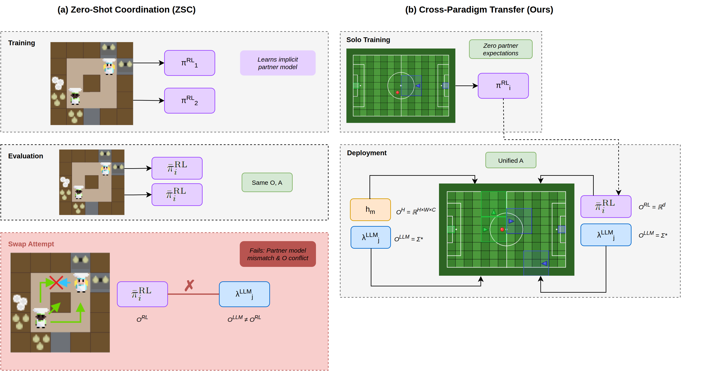

**Standard Self-Play and Cross-Paradigm Transfer.**
**(a) Standard Self-Play (Baseline):** Agents $\pi^{RL}_1$ and $\pi^{RL}_2$ are co-trained, learning implicit partner models that overfit to the specific environment. This approach fails the Zero-Shot Coordination (ZSC) challenge because it struggles to coordinate with unseen RL partners (who may have learned different features). It collapses when a partner is swapped across paradigms (e.g., $\pi^{RL}$ paired with $\lambda^{LLM}$) due to observation space mismatches ($\mathcal{O}^{\text{RL}} \neq \mathcal{O}^{\text{LLM}}$) and violated behavioral expectations.
**(b) Cross-Paradigm Transfer (MOSAIC):** Agent $\pi^{RL}$ is trained solo ($N=1$, zero partner expectations), then deployed in multi-agent teams alongside heterogeneous partners such as LLM agents $\lambda^{LLM}$, human players $h$, or random baselines. By eliminating co-training dependencies, agents can cooperate across paradigm boundaries using a unified action interface.

| Aspect | Standard Self-Play (Baseline) | Cross-Paradigm Transfer (MOSAIC) |
| :--- | :--- | :--- |
| **Training** | Co-training via self-play ($N \geq 2$) | Solo training ($N=1$) |
| **Partner Model** | Implicit partner model (overfitted to training partner) | Zero partner expectations |
| **Generalization (RL)** | Fails with unseen RL partners (ZSC failure) | Generalizes to unseen solo-trained RL partners |
| **Generalization (Cross-Paradigm)** | Fails when swapping RL ↔ LLM (Interface mismatch) | Succeeds across paradigm boundaries |
| **Deployment** | Requires same-paradigm, familiar partners | Supports RL, LLM, human, scripted agents |

### Adversarial Cross‑Paradigm Matchups

The first set of configurations establishes single-paradigm baselines before introducing cross-paradigm matchups to measure relative performance.
Let $\mathcal{T}_A$ and $\mathcal{T}_B$ denote disjoint team partitions with $|\mathcal{T}_A| = n_A$ and $|\mathcal{T}_B| = n_B$.
For each team $\mathcal{T}_k$ ($k \in A,B$), we define its paradigm composition as $(\Pi^{\text{RL}}_k, \Lambda^{\text{LLM}}_k, \Psi^{\text{VLM}}_k, \mathcal{H}_k)$ where $\Pi^{\text{RL}}_k + \Lambda^{\text{LLM}}_k + \Psi^{\text{VLM}}_k + \mathcal{H}_k = n_k$.

| Config | Team A Composition | Team B Composition | Purpose |
| :--- | :--- | :--- | :--- |
| **A1** | $\Pi^{\text{RL}}_A = 2$ | $\Pi^{\text{RL}}_B = 2$ | Homogeneous RL baseline |
| **A2** | $\Lambda^{\text{LLM}}_A = 2$ | $\Lambda^{\text{LLM}}_B = 2$ | Homogeneous LLM baseline |
| **A3** | $\Psi^{\text{VLM}}_A = 2$ | $\Psi^{\text{VLM}}_B = 2$ | Homogeneous VLM baseline |
| **A4** | $\Pi^{\text{RL}}_A = 2$ | $\Lambda^{\text{LLM}}_B = 2$ | Cross-paradigm (RL vs LLM) |
| **A5** | $\Pi^{\text{RL}}_A = 2$ | $\Psi^{\text{VLM}}_B = 2$ | Cross-paradigm (RL vs VLM) |
| **A6** | $\Lambda^{\text{LLM}}_A = 2$ | $\Psi^{\text{VLM}}_B = 2$ | Cross-paradigm (LLM vs VLM) |
| **A7** | $\Pi^{\text{RL}}_A = 2$ | $\rho$ baseline ($n_B = 2$) | Sanity check (trained vs random) |

Configurations A1-A3 measure the performance ceiling for homogeneous teams within each paradigm: RL policies trained via MARL, LLM agents reasoning via text-based decision-making, and VLM agents processing multimodal observations. Configurations A4-A6 address the central cross-paradigm research questions: under identical environmental conditions and shared random seeds, does a team of RL policies outperform teams of LLM or VLM agents, and how do LLM and VLM agents compare head-to-head? A7 serves as a sanity check, confirming that trained agents significantly outperform uniform-random baseline policies.

### Cooperative Heterogeneous Teams

The second set of configurations examines intra-team heterogeneity by mixing paradigms **within** a team. These configurations test whether LLM or VLM agents ($\lambda^{\text{LLM}}$ or $\psi^{\text{VLM}}$) can effectively cooperate with a frozen RL policy $\bar{\pi}^{\text{RL}}$ that was trained without any partner model.

| Config | Team A Composition | Team B Composition | Research Question |
| :--- | :--- | :--- | :--- |
| **C1** | $\bar{\pi}^{\text{RL}}$, $\lambda^{\text{LLM}}$ | $\bar{\pi}^{\text{RL}}$, $\rho$ baseline | Does $\lambda^{\text{LLM}}$ outperform $\rho$ as teammate? |
| **C2** | $\bar{\pi}^{\text{RL}}$, $\lambda^{\text{LLM}}$ | $\bar{\pi}^{\text{RL}}$, $\nu$ baseline | Does $\lambda^{\text{LLM}}$ actively contribute? |
| **C3** | $\bar{\pi}^{\text{RL}}$, $\psi^{\text{VLM}}$ | $\bar{\pi}^{\text{RL}}$, $\rho$ baseline | Does $\psi^{\text{VLM}}$ outperform $\rho$ as teammate? |
| **C4** | $\bar{\pi}^{\text{RL}}$, $\psi^{\text{VLM}}$ | $\bar{\pi}^{\text{RL}}$, $\nu$ baseline | Does $\psi^{\text{VLM}}$ actively contribute? |
| **C5** | $\Pi^{\text{RL}}_A = 2$ | $\Pi^{\text{RL}}_B = 2$ | Solo-pair baseline (no co-training) |
| **C6** | $\bar{\pi}^{\text{RL}}$, $\lambda^{\text{LLM}}$ | $\Pi^{\text{RL}}_B = 2$ (co-trained) | Can zero-shot LLM teaming match co-training? |
| **C7** | $\bar{\pi}^{\text{RL}}$, $\psi^{\text{VLM}}$ | $\Pi^{\text{RL}}_B = 2$ (co-trained) | Can zero-shot VLM teaming match co-training? |
| **C8** | $\bar{\pi}^{\text{RL}}$, $\lambda^{\text{LLM}}$ | $\bar{\pi}^{\text{RL}}$, $\psi^{\text{VLM}}$ | LLM vs VLM as heterogeneous teammates |

All RL policies are trained solo ($N=1$) and frozen before deployment; LLM/VLM agents are zero-shot. Configurations C1-C2 and C3-C4 test whether LLM and VLM agents can serve as effective teammates for frozen RL policies. C5 serves as the fair comparison baseline: two independently trained solo experts paired at evaluation time. C6-C7 compare zero-shot cross-paradigm teaming against co-trained RL teams. C8 directly compares LLM and VLM agents as teammates within heterogeneous teams.

> **Solo‑to‑Team Transfer Design – Why Solo Training?**
>
> RL agents are trained as **solo experts** in single-agent environments ($N=1$), then deployed as teammates in multi-agent settings **without any fine‑tuning**. This design eliminates the *co-training confound* and avoids the failure modes of standard self-play.
>
> In standard self-play, agents develop implicit partner models calibrated against other RL agents sharing the same observation space ($\mathcal{O} = \mathbb{R}^d$). This creates two failure modes:
> (1) **ZSC Failure**: The agent overfits to its training partner's conventions, failing to coordinate with *unseen* RL agents.
> (2) **Cross-Paradigm Failure**: As shown in the figure's "Swap Attempt" panel, replacing an RL partner with an LLM agent causes a breakdown due to observation space mismatches ($\mathcal{O}^{\text{RL}} \neq \mathcal{O}^{\text{LLM}}$).
>
> By training agents in isolation ($N=1$), the RL policy carries **zero partner expectations**. This cleanly isolates the paradigm variable as the sole experimental factor, allowing true cross-paradigm coordination where the challenge is not just an unknown policy, but a fundamentally different way of perceiving and acting in the world.
>
> For full mathematical details and further configurations, see the companion paper.

## Supported Environment Families (26)


| Family | Description | Example |
|--------|-------------|---------|
| **Gymnasium** | Standard single-agent RL (Toy Text, Classic Control, Box2D, MuJoCo) | 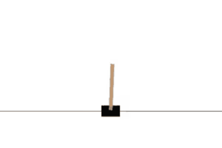 |
| **Atari / ALE** | 128 classic Atari 2600 games | 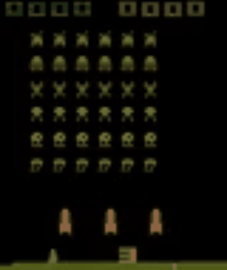 |
| **MiniGrid** | Procedural grid-world navigation | 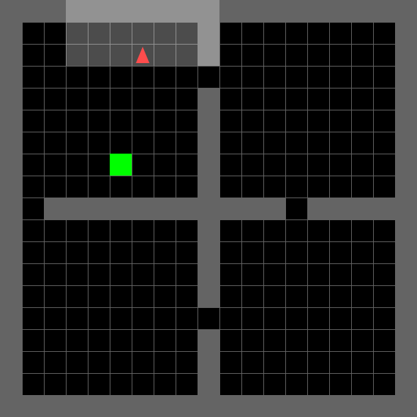 |
| **BabyAI** | Language-grounded instruction following | 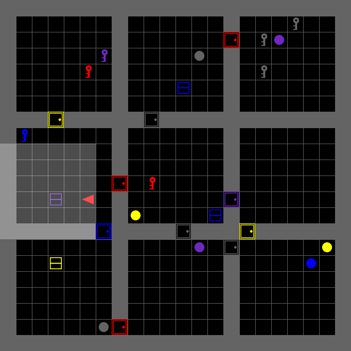 |
| **ViZDoom** | Doom-based first-person visual RL | 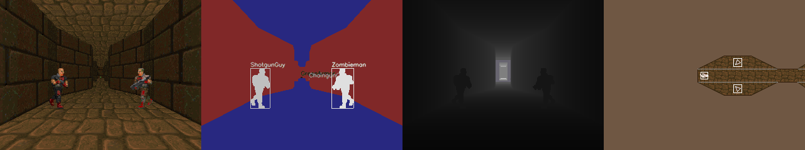 |
| **MiniHack / NetHack** | Roguelike dungeon crawling (NLE) |  |
| **Crafter** | Open-world survival benchmark |  |
| **Procgen** | 16 procedurally generated environments |  |
| **BabaIsAI** | Rule-manipulation puzzles | 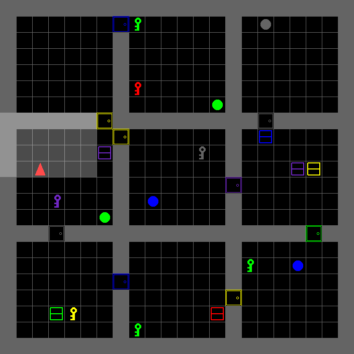 |
| **Jumanji** | JAX-accelerated logic/routing/packing (25 envs) |  |
| **PyBullet Drones** | Quadcopter physics simulation | 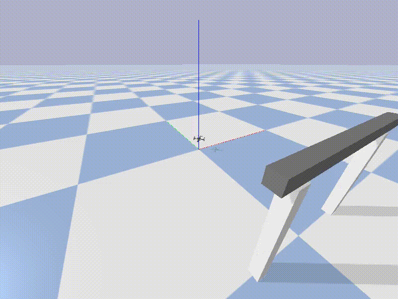 |
| **PettingZoo Classic** | Turn-based board games (AEC) | 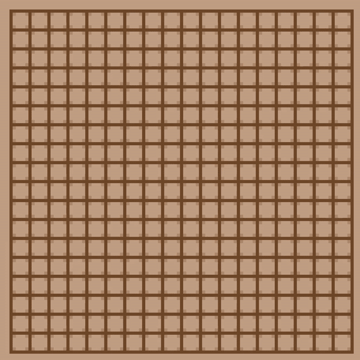 |
| **MOSAIC MultiGrid** | Competitive team sports (view_size=3) | 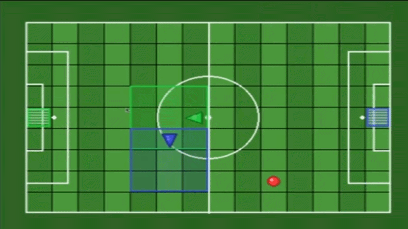 |
| **INI MultiGrid** | Cooperative exploration (view_size=7) | 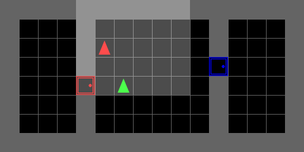 |
| **Melting Pot** | Social multi-agent scenarios (up to 16 agents) |  |
| **Overcooked** | Cooperative cooking (2 agents) | 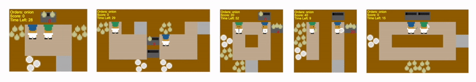 |
| **SMAC** | StarCraft Multi-Agent Challenge (hand-designed maps) | 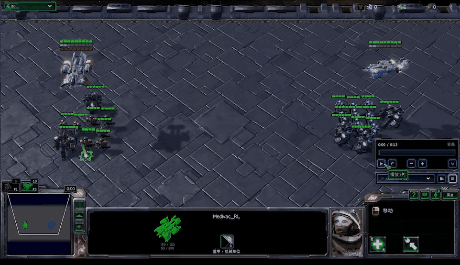 |
| **SMACv2** | StarCraft Multi-Agent Challenge v2 (procedural units) | 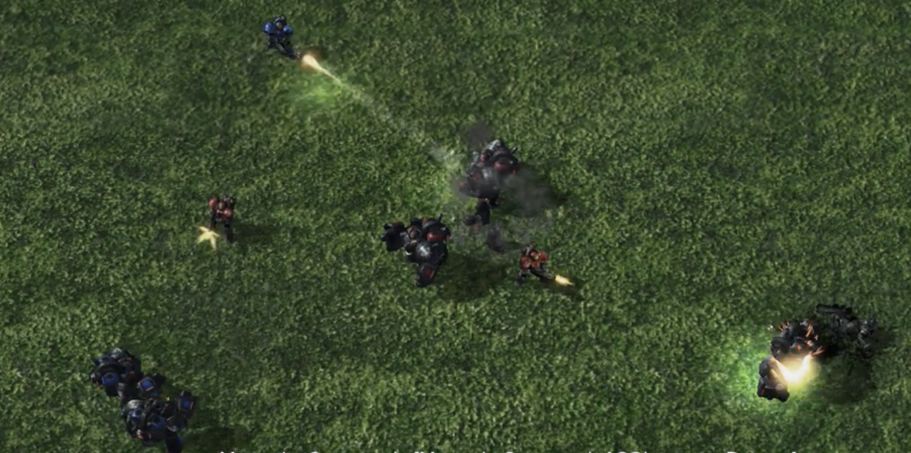 |
| **RWARE** | Cooperative warehouse delivery | 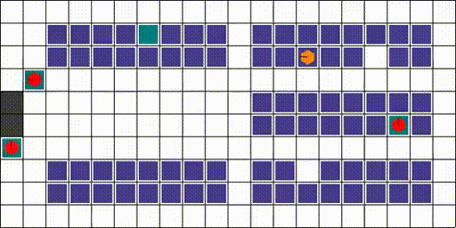 |
| **MuJoCo** | Continuous-control robotics tasks | 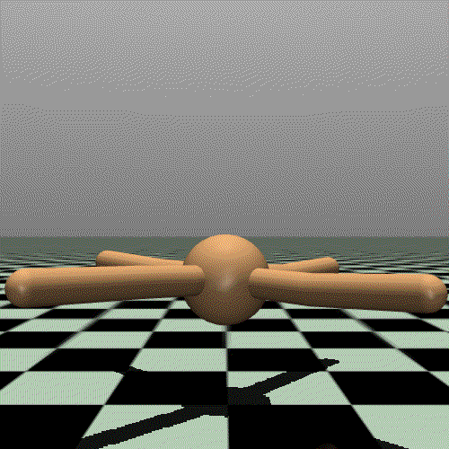 |

## Supported Workers (8)

| Worker | Description |
|--------|-------------|
| **[CleanRL](https://github.com/vwxyzjn/cleanrl)** | Single-file RL implementations (PPO, DQN, SAC, TD3, DDPG, C51) |
| **[XuanCe](https://github.com/agi-brain/xuance)** | Modular RL framework with flexible algorithm composition. Multi-agent algorithms (MAPPO, QMIX, MADDPG, VDN, COMA) |
| **[Ray RLlib](https://docs.ray.io/en/latest/rllib/)** | RL with distributed training and large-batch optimization (PPO, IMPALA, APPO) |
| **[BALROG](https://github.com/balrog-ai/BALROG)** | LLM/VLM agentic evaluation (GPT-4o, Claude 3, Gemini; NetHack, BabyAI, Crafter) |
| **[MOSAIC LLM](docs/source/documents/architecture/workers/integrated_workers/MOSAIC_LLM_Worker)** | Multi-agent LLM with coordination strategies and Theory of Mind (MultiGrid, BabyAI, MeltingPot, PettingZoo) |
| **[Chess LLM](docs/source/documents/architecture/workers/integrated_workers/Chess_LLM_Worker)** | LLM chess play with multi-turn dialog (PettingZoo Chess) |
| **[MOSAIC Human Worker](docs/source/documents/architecture/workers/integrated_workers/MOSAIC_Human_Worker)** | Human-in-the-loop play via keyboard for any Gymnasium-compatible environment (MiniGrid, Crafter, Chess, NetHack) |
| **[MOSAIC Random Worker](docs/source/documents/architecture/workers/integrated_workers/MOSAIC_Random_Worker)** | Baseline agents with random, no-op, and cycling action behaviours across all 26 environment families |

## Installation

```bash
# Clone the repository
git clone https://github.com/Abdulhamid97Mousa/mosaic.git
cd mosaic

# Create virtual environment (Python 3.10-3.12)
python3.11 -m venv .venv
source .venv/bin/activate

# Install core GUI
pip install -e .
```

Install only what you need. **Workers** and **environment families** are independent extras:

```bash
# Worker (CleanRL) + environment family (MiniGrid)
pip install -e ".[cleanrl,minigrid]"

# Multi-agent worker (XuanCe) + competitive environments
pip install -e ".[xuance,mosaic_multigrid]"

# Everything
pip install -e ".[full]"
```

## Quick Start

```bash
# Launch with trainer daemon (recommended)
./run.sh

# Or launch GUI only
python -m gym_gui
```

## Citing MOSAIC

If you use MOSAIC in your research, please cite:

```bibtex
@misc{mousa2026mosaicunifiedplatformcrossparadigm,
      title={MOSAIC: A Unified Platform for Cross-Paradigm Comparison and Evaluation of Homogeneous and Heterogeneous Multi-Agent RL, LLM, VLM, and Human Decision-Makers}, 
      author={Abdulhamid M. Mousa and Yu Fu and Rakhmonberdi Khajiev and Jalaledin M. Azzabi and Abdulkarim M. Mousa and Peng Yang and Yunusa Haruna and Ming Liu},
      year={2026},
      eprint={2603.01260},
      archivePrefix={arXiv},
      primaryClass={cs.LG},
      url={https://arxiv.org/abs/2603.01260}, 
}
```

## License

MOSAIC is released under the [MIT License](https://github.com/Abdulhamid97Mousa/mosaic/blob/main/LICENSE).

## Acknowledgments

- [Gymnasium](https://gymnasium.farama.org/): Standard RL API
- [PettingZoo](https://pettingzoo.farama.org/): Multi-agent environments
- [CleanRL](https://github.com/vwxyzjn/cleanrl): Clean RL implementations
- [XuanCe](https://github.com/agi-brain/xuance): Multi-agent RL algorithms
- [Ray RLlib](https://docs.ray.io/en/latest/rllib/): Distributed RL training
- [BALROG](https://github.com/balrog-ai/BALROG): LLM/VLM agent benchmark
- [llm_chess](https://github.com/maxim-saplin/llm_chess): LLM chess evaluation
- [PyQt6](https://www.riverbankcomputing.com/software/pyqt/): GUI framework

## References

<span id="ref1">[1]</span> E. Liang et al., "RLlib: Abstractions for Distributed Reinforcement Learning," ICML, 2018.
<span id="ref2">[2]</span> S. Huang et al., "CleanRL: High-quality Single-file Implementations of Deep RL Algorithms," JMLR, 2022.
<span id="ref3">[3]</span> J. Weng et al., "Tianshou: A Highly Modularized Deep RL Library," JMLR, 2022.
<span id="ref4">[4]</span> M. Hoffman et al., "Acme: A Research Framework for Distributed RL," arXiv:2006.00979, 2020.
<span id="ref5">[5]</span> W. Liu et al., "XuanCe: A Comprehensive and Unified Deep RL Library," arXiv:2312.16248, 2023.
<span id="ref6">[6]</span> S. Huang et al., "OpenRL: A Unified Reinforcement Learning Framework," arXiv:2312.16189, 2023.
<span id="ref7">[7]</span> A. Raffin et al., "Stable-Baselines3: Reliable RL Implementations," JMLR, 2021.
<span id="ref8">[8]</span> I. Caspi et al., "Reinforcement Learning Coach," 2017.
<span id="ref9">[9]</span> D. Paglieri et al., "BALROG: Benchmarking Agentic LLM and VLM Reasoning On Games," arXiv:2411.13543, 2024.
<span id="ref10">[10]</span> G. De Magistris et al., "TextArena," 2025.
<span id="ref11">[11]</span> D. Costarelli et al., "GameBench: Evaluating Strategic Reasoning Abilities of LLM Agents," arXiv:2406.06613, 2024.
<span id="ref12">[12]</span> Y. Huang et al., "lmgame-Bench: Evaluating LLMs on Game-Theoretic Decision-Making," 2025.
<span id="ref13">[13]</span> M. Saplin, "LLM Chess," 2025.
<span id="ref14">[14]</span> J. Guo et al., "LLM-Game-Bench: Evaluating LLM Reasoning through Game-Playing," 2024.
<span id="ref15">[15]</span> M. Bettini et al., "BenchMARL: Benchmarking Multi-Agent Reinforcement Learning," JMLR, 2024.
<span id="ref16">[16]</span> X. Liu et al., "AgentBench: Evaluating LLMs as Agents," ICLR, 2024.
<span id="ref17">[17]</span> K. Zhu et al., "MultiAgentBench: Evaluating the Collaboration and Competition of LLM Agents," ACL, 2025.
<span id="ref18">[18]</span> Y. Lin et al., "GAMEBoT: Transparent Assessment of LLM Reasoning in Games," ACL, 2025.
<span id="ref19">[19]</span> H. Sun et al., "Collab-Overcooked: Benchmarking and Evaluating Large Language Models as Collaborative Agents," EMNLP, 2025.
<span id="ref20">[20]</span> L. Li et al., "BotzoneBench: Scalable LLM Evaluation via Graded AI Anchors," arXiv:2602.13214, 2026.
<span id="ref21">[21]</span> Z. Xi et al., "AgentGym: Evolving Large Language Model-based Agents across Diverse Environments," ACL, 2025.
<span id="ref22">[22]</span> Cipolina et al., "Game Reasoning Arena: A Comprehensive Evaluation Framework for Large Language Models," arXiv:2501.00363, 2025.
<span id="ref23">[23]</span> Y. Wang et al., "CREW: A Benchmark for Collaborative Multi-Step Reasoning and Planning," NeurIPS, 2024.
<span id="ref24">[24]</span> X. Ma et al., "LLM-PySC2: A Benchmark for Large Language Models in StarCraft II," arXiv:2412.19668, 2024.
<span id="ref25">[25]</span> C. Dansereau et al., "The Heterogeneous Multi-Agent Challenge," arXiv:2509.19512, 2025.
<span id="ref26">[26]</span> M. Carroll et al., "On the Utility of Learning about Humans for Human-AI Coordination," NeurIPS, 2019.
