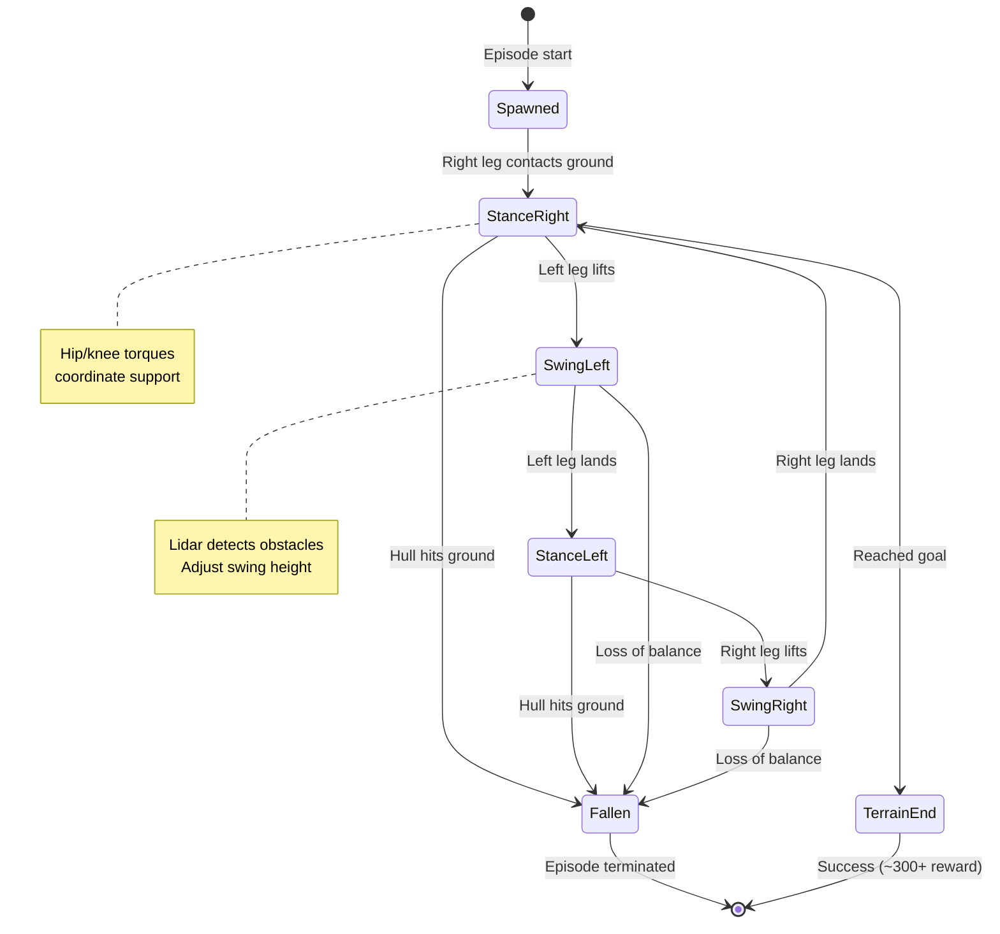
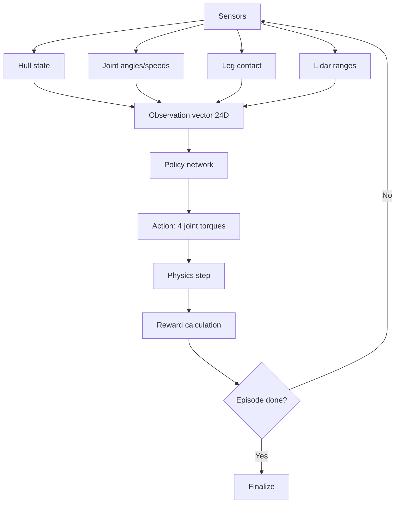

# Bipedal Walker Game Note

## Core Facts

- **Objective:** Control a two-legged robot to walk across randomly generated terrain without falling.
- **Physics:** Box2D simulation with articulated joints, motors, and contact dynamics.
- **Action space:** Box(4) continuous vector → torques for four joints:
  - `[0]` Hip motor 1 (right leg)
  - `[1]` Knee motor 1 (right leg)
  - `[2]` Hip motor 2 (left leg)
  - `[3]` Knee motor 2 (left leg)
  - Range: `-1.0` to `+1.0` per joint.
- **Observation space:** Box(24) continuous vector including:
  - Hull angle, angular velocity
  - Joint angles (4), joint speeds (4)
  - Leg ground contact (2 boolean)
  - Lidar range measurements (10) detecting terrain ahead
- **Episode termination:** Falling (hull touches ground), reaching the end of terrain, or timing out.

## Reward Structure

| Event | Reward |
| --- | --- |
| Moving forward | +1.3 per unit horizontal distance |
| Each frame alive | -0.05 (time penalty, encourages efficiency) |
| Motor torque usage | -0.00035 per unit torque² (discourages excessive effort) |
| Falling (hull hits ground) | Episode ends, no additional penalty beyond lost future rewards |

**Optimal score:** ~300+ for smooth, efficient walking across the full terrain without falling.

## Gameplay Dynamics

- **Terrain generation:** Each episode creates random bumps, stairs, and pits to test locomotion robustness.
- **Lidar sensors:** 10 rangefinders provide forward-looking terrain profile; agents use these to anticipate obstacles.
- **Joint coordination:** Hip and knee motors must synchronize to produce stable gait cycles (swing/stance phases).
- **Energy efficiency:** Excessive torque burns reward; smooth, minimal-effort gaits score higher.
- **Balance control:** Hull angle and angular velocity must be regulated to prevent tipping backward or forward.
- **Ground contact feedback:** Leg contact sensors help the agent distinguish stance phase (support) from swing phase (lift).

## Human Control

**Status:** Manual play is now supported in the GUI via preset torque profiles that map to the four joint motors. While the action space remains continuous, the keyboard shortcuts trigger curated vectors that approximate forward/backward steps, crouches, and hops.

### Keyboard Shortcuts

| Key | Preset | Intent |
| --- | --- | --- |
| `Space` | `[0.0, 0.0, 0.0, 0.0]` | Neutral stance / balance |
| `Right` / `D` | `[0.8, 0.6, -0.8, -0.6]` | Lean forward and stride |
| `Left` / `A` | `[-0.8, -0.6, 0.8, 0.6]` | Lean backward / step back |
| `Up` / `W` | `[0.4, -1.0, 0.4, -1.0]` | Crouch / absorb landing |
| `Down` / `S` | `[-0.4, 1.0, -0.4, 1.0]` | Extend legs / hop |

**Tips:**
- Combine crouch (`W`) followed by hop (`S`) to clear gaps.
- Tap `Space` when losing balance to stop applying torques and let the hull settle.
- For turn-based or hybrid modes, alternate between human inputs and agent steps to compare strategies.

## Mermaid Gait Cycle

## Training Considerations

1. **Curriculum learning:** Start with flat terrain (`hardcore=False`) before advancing to obstacles (`hardcore=True`).
2. **Reward shaping:** Forward progress dominates total reward; optimize gait efficiency to maximize distance per torque.
3. **Gait patterns:** Successful policies often discover cyclic hip oscillations resembling biological walking.
4. **Lidar utilization:** Agents that ignore lidar may trip on stairs/pits; reward shaping can encourage proactive obstacle avoidance.
5. **Hyperparameter tuning:** PPO, TD3, SAC are common choices; tune entropy bonus to balance exploration vs. exploitation.

## Configuration Options

| Parameter | Default | Effect |
| --- | --- | --- |
| `hardcore` | False | Adds stairs, pits, and obstacles to terrain (much harder) |
| `render_mode` | None | Set to `"human"` for real-time visualization or `"rgb_array"` for recording |

## Mermaid Observation Flow

## Common Pitfalls

- **Over-torquing:** Applying maximum torque every step wastes reward and destabilizes motion; smooth, moderate torques work better.
- **Ignoring lidar:** Policies that rely only on joint state may fail on stairs/pits; incorporate lidar features.
- **Static gait:** Fixed sinusoidal patterns may work on flat terrain but fail on obstacles; adaptive control is needed.
- **Falling backward:** Leaning too far back causes early termination; maintain forward hull angle.
- **Training on easy mode only:** Policies trained without `hardcore` may not generalize to complex terrain.

## Quick Testing Tips

1. **Flat terrain first:** Train with `hardcore=False` to learn basic walking before adding obstacles.
2. **Reward logging:** Separate forward progress, time penalty, and torque cost to diagnose policy inefficiencies.
3. **Visual debugging:** Render episodes to verify gait stability and lidar-based anticipation.
4. **Baseline comparison:** Compare random policy (~-100 reward) vs. trained policy (~300+) to gauge progress.
5. **Ablation studies:** Train with/without lidar features to measure obstacle avoidance improvement.

## References

- Gymnasium documentation – [Bipedal Walker](https://gymnasium.farama.org/environments/box2d/bipedal_walker/).
- Original OpenAI Gym implementation (2016).
- Box2D physics engine documentation.
- Related work: Schulman et al., "Proximal Policy Optimization" (2017) used this environment for benchmarking.
*   [Wrappers](../../../api/wrappers/)
    
    Toggle navigation of Wrappers
    
    *   [List of Wrappers](../../../api/wrappers/table/)
    *   [Misc Wrappers](../../../api/wrappers/misc_wrappers/)
    *   [Action Wrappers](../../../api/wrappers/action_wrappers/)
    *   [Observation Wrappers](../../../api/wrappers/observation_wrappers/)
    *   [Reward Wrappers](../../../api/wrappers/reward_wrappers/)
*   [Vectorize](../../../api/vector/)
    
    Toggle navigation of Vectorize
    
    *   [Wrappers](../../../api/vector/wrappers/)
    *   [AsyncVectorEnv](../../../api/vector/async_vector_env/)
    *   [SyncVectorEnv](../../../api/vector/sync_vector_env/)
    *   [Utility functions](../../../api/vector/utils/)
*   [Utility functions](../../../api/utils/)
*   [Functional Env](../../../api/functional/)

### Environments

*   [Classic Control](../../classic_control/)
    
    Toggle navigation of Classic Control
    
    *   [Acrobot](../../classic_control/acrobot/)
    *   [Cart Pole](../../classic_control/cart_pole/)
    *   [Mountain Car Continuous](../../classic_control/mountain_car_continuous/)
    *   [Mountain Car](../../classic_control/mountain_car/)
    *   [Pendulum](../../classic_control/pendulum/)
*   [Box2D](../)
    
    Toggle navigation of Box2D
    
    *   [Bipedal Walker](#)
    *   [Car Racing](../car_racing/)
    *   [Lunar Lander](../lunar_lander/)
*   [Toy Text](../../toy_text/)
    
    Toggle navigation of Toy Text
    
    *   [Blackjack](../../toy_text/blackjack/)
    *   [Taxi](../../toy_text/taxi/)
    *   [Cliff Walking](../../toy_text/cliff_walking/)
    *   [Frozen Lake](../../toy_text/frozen_lake/)
*   [MuJoCo](../../mujoco/)
    
    Toggle navigation of MuJoCo
    
    *   [Ant](../../mujoco/ant/)
    *   [Half Cheetah](../../mujoco/half_cheetah/)
    *   [Hopper](../../mujoco/hopper/)
    *   [Humanoid](../../mujoco/humanoid/)
    *   [Humanoid Standup](../../mujoco/humanoid_standup/)
    *   [Inverted Double Pendulum](../../mujoco/inverted_double_pendulum/)
    *   [Inverted Pendulum](../../mujoco/inverted_pendulum/)
    *   [Pusher](../../mujoco/pusher/)
    *   [Reacher](../../mujoco/reacher/)
    *   [Swimmer](../../mujoco/swimmer/)
    *   [Walker2D](../../mujoco/walker2d/)
*   [Atari](../../atari/)
*   [External Environments](../../third_party_environments/)

### Tutorials

*   [Gymnasium Basics](../../../tutorials/gymnasium_basics/)
    
    Toggle navigation of Gymnasium Basics
    
    *   [Make your own custom environment](../../../tutorials/gymnasium_basics/environment_creation/)
    *   [Handling Time Limits](../../../tutorials/gymnasium_basics/handling_time_limits/)
    *   [Implementing Custom Wrappers](../../../tutorials/gymnasium_basics/implementing_custom_wrappers/)
    *   [Load custom quadruped robot environments](../../../tutorials/gymnasium_basics/load_quadruped_model/)
*   [Training Agents](../../../tutorials/training_agents/)
    
    Toggle navigation of Training Agents
    
    *   [Action Masking in the Taxi Environment](../../../tutorials/training_agents/action_masking_taxi/)
    *   [Running the Experiment](../../../tutorials/training_agents/action_masking_taxi/#running-the-experiment)
    *   [Visualizing Results](../../../tutorials/training_agents/action_masking_taxi/#visualizing-results)
    *   [Results Analysis](../../../tutorials/training_agents/action_masking_taxi/#results-analysis)
    *   [Solving Blackjack with Tabular Q-Learning](../../../tutorials/training_agents/blackjack_q_learning/)
    *   [Solving Frozenlake with Tabular Q-Learning](../../../tutorials/training_agents/frozenlake_q_learning/)
    *   [Training using REINFORCE for Mujoco](../../../tutorials/training_agents/mujoco_reinforce/)
    *   [Speeding up A2C Training with Vector Envs](../../../tutorials/training_agents/vector_a2c/)
*   [Third-Party Tutorials](../../../tutorials/third-party-tutorials/)

### Development

*   [Github](https://github.com/Farama-Foundation/Gymnasium)
*   [Paper](https://arxiv.org/abs/2407.17032)
*   [Gymnasium Release Notes](../../../gymnasium_release_notes/)
*   [Gym Release Notes](../../../gym_release_notes/)
*   [Contribute to the Docs](https://github.com/Farama-Foundation/Gymnasium/blob/main/docs/README.md)

[Back to top](#)

Toggle Light / Dark / Auto color theme

Toggle table of contents sidebar

Bipedal Walker[¶](#bipedal-walker "Link to this heading")
=========================================================

  

This environment is part of the Box2D environments which contains general information about the environment.

### Action Space

`Box(-1.0, 1.0, (4,), float32)`

### Observation Space

`Box([-3.1415927 -5. -5. -5. -3.1415927 -5. -3.1415927 -5. -0. -3.1415927 -5. -3.1415927 -5. -0. -1. -1. -1. -1. -1. -1. -1. -1. -1. -1. ], [3.1415927 5. 5. 5. 3.1415927 5. 3.1415927 5. 5. 3.1415927 5. 3.1415927 5. 5. 1. 1. 1. 1. 1. 1. 1. 1. 1. 1. ], (24,), float32)`

import

`gymnasium.make("BipedalWalker-v3")`

Description[¶](#description "Link to this heading")
---------------------------------------------------

This is a simple 4-joint walker robot environment. There are two versions:

*   Normal, with slightly uneven terrain.
    
*   Hardcore, with ladders, stumps, pitfalls.
    

To solve the normal version, you need to get 300 points in 1600 time steps. To solve the hardcore version, you need 300 points in 2000 time steps.

A heuristic is provided for testing. It’s also useful to get demonstrations to learn from. To run the heuristic:

python gymnasium/envs/box2d/bipedal\_walker.py

Action Space[¶](#action-space "Link to this heading")
-----------------------------------------------------

Actions are motor speed values in the \[-1, 1\] range for each of the 4 joints at both hips and knees.

Observation Space[¶](#observation-space "Link to this heading")
---------------------------------------------------------------

State consists of hull angle speed, angular velocity, horizontal speed, vertical speed, position of joints and joints angular speed, legs contact with ground, and 10 lidar rangefinder measurements. There are no coordinates in the state vector.

Rewards[¶](#rewards "Link to this heading")
-------------------------------------------

Reward is given for moving forward, totaling 300+ points up to the far end. If the robot falls, it gets -100. Applying motor torque costs a small amount of points. A more optimal agent will get a better score.

Starting State[¶](#starting-state "Link to this heading")
---------------------------------------------------------

The walker starts standing at the left end of the terrain with the hull horizontal, and both legs in the same position with a slight knee angle.

Episode Termination[¶](#episode-termination "Link to this heading")
-------------------------------------------------------------------

The episode will terminate if the hull gets in contact with the ground or if the walker exceeds the right end of the terrain length.

Arguments[¶](#arguments "Link to this heading")
-----------------------------------------------

To use the _hardcore_ environment, you need to specify the `hardcore=True`:

\>>> import gymnasium as gym
\>>> env \= gym.make("BipedalWalker-v3", hardcore\=True, render\_mode\="rgb\_array")
\>>> env
<TimeLimit<OrderEnforcing<PassiveEnvChecker<BipedalWalker<BipedalWalker-v3>>>>>

Version History[¶](#version-history "Link to this heading")
-----------------------------------------------------------

*   v3: Returns the closest lidar trace instead of furthest; faster video recording
    
*   v2: Count energy spent
    
*   v1: Legs now report contact with ground; motors have higher torque and speed; ground has higher friction; lidar rendered less nervously.
    
*   v0: Initial version
    

