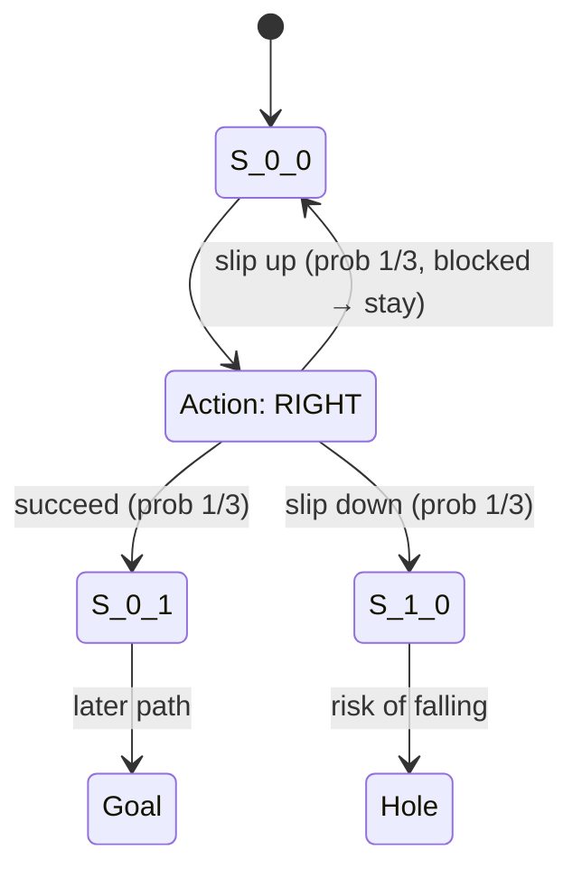

# Frozen Lake Game Note

## Key Takeaways

- **Objective:** Navigate from the start tile (`S`) to the goal tile (`G`) on an icy grid while avoiding holes (`H`).
- **Action space:** Discrete(4) → `0: left`, `1: down`, `2: right`, `3: up`.
- **Observation space:** Discrete(`n_rows * n_cols`). For the default 4×4 map there are 16 encoded states.
- **Episode end:** Reaching the goal or falling into a hole (termination) or timing out via a wrapper (truncation).

## Understanding `is_slippery`

| Configuration | Transition behaviour | Typical use case |
| --- | --- | --- |
| `is_slippery=True` *(default)* | Actions succeed with probability `success_rate` (default `1/3`). On failure, the agent slides into one of the perpendicular directions chosen uniformly. | Models the classic stochastic control problem from Sutton & Barto. Useful for demonstrating exploration and robust policies. |
| `is_slippery=False` | Each action deterministically moves in the commanded direction when the neighbouring tile is valid. | Great for debugging policies, visual demos, or teaching value iteration in a deterministic MDP. |

### What slipping looks like

The environment samples the outcome every time you call `env.step(action)`. With the defaults:

- Commanding **RIGHT** (`action=2`) from the start tile yields:
  - 1/3 chance of moving right as intended.
  - 1/3 chance of sliding up (blocked on the default map, so you stay put).
  - 1/3 chance of sliding down into the tile below.
- This explains why our GUI highlight sometimes “falls” straight down even when we press `D`: the agent experienced a perpendicular slip, which is faithfully reported by the adapter.

When you set `is_slippery=False`, the transition becomes deterministic—pressing `D` will always move right unless there is a wall. This is the recommended setting for demonstrations where you want the grid highlight to mirror your keystrokes exactly.

### Mermaid view of a single step

## Quick simulation checklist

1. Initialise with `gym.make("FrozenLake-v1", is_slippery=True)` for the canonical stochastic lesson.
2. Switch to `is_slippery=False` when validating UI controls, scripted policies, or debugging transitions.
3. Consider raising `success_rate` (e.g. to `0.8`) for intermediate difficulty that still demonstrates stochasticity without feeling random.

## References

- Gymnasium documentation – [Frozen Lake](https://gymnasium.farama.org/environments/toy_text/frozen_lake/).
- Sutton & Barto, *Reinforcement Learning: An Introduction*, 1998/2020 editions.
