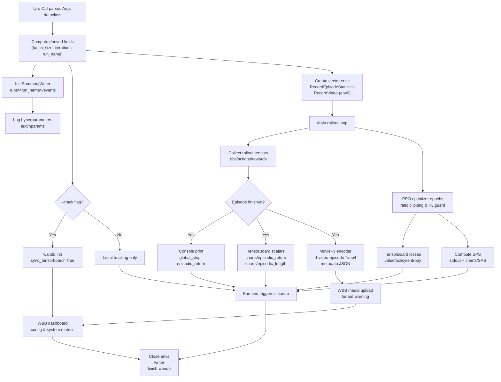
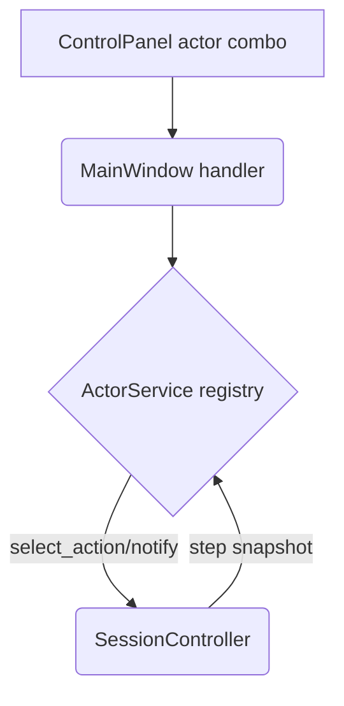

// Package docs contains project documentation artifacts emitted by automation.
package docs

/*
Day 6 – CleanRL Logging & Tracking Deep Dive
===========================================

1. Context and Motivation
-------------------------
- **Goal:** understand how the upstream CleanRL project captures, stores, and exposes reinforcement-learning telemetry so we can integrate comparable insights into `gym_gui`.
- **Reference run:** `cleanrl/ppo.py --env-id CartPole-v1 --total-timesteps 1024 --num-steps 128 --num-envs 1`
  - Environment: `/home/hamid/Desktop/Projects/GUI_BDI_RL/cleanrl/.venv`
  - Run artifacts: `cleanrl/runs/CartPole-v1__ppo__1__1760219123/`

2. CleanRL Architecture (Logging-Focused View)
----------------------------------------------
- **Single-file training scripts:** each algorithm (e.g., `cleanrl/ppo.py`) is self-contained; telemetry logic lives alongside the learning loop.
- **CLI-first design:** scripts parse arguments with `tyro`. Human interaction is limited to console logs; there is no GUI layer.
- **Environment control:** `gymnasium` vectorized envs; optional video capture via `gym.wrappers.RecordVideo` (produces MP4s in `videos/<run>`).
- **Tracking hooks:**
  - `SummaryWriter` (TensorBoard) — all scalar metrics, text tables, and histograms.
  - Weights & Biases (`wandb`) — optional toggle using `--track`; shares configs, scalars, media, and system stats.
  - HuggingFace Hub (`huggingface_hub`) — upload trained policies (manual step per script).

3. Metrics & Telemetry Pipelines
--------------------------------
| Stage | Implementation | Data Type | Output Location |
|-------|----------------|-----------|-----------------|
| Hyperparameter snapshot | `SummaryWriter.add_text("hyperparameters", ...)` | Markdown table | TensorBoard event file |
| Scalar metrics | `SummaryWriter.add_scalar` inside training loop | Rewards, losses, SPS | TensorBoard events |
| Console feedback | `print(f"global_step={...}, episodic_return={...}")` | Plain text | Stdout (capturable) |
| Episode statistics | `gym.wrappers.RecordEpisodeStatistics` | Episode length, return | TensorBoard + stdout |
| Video capture (optional) | `gym.wrappers.RecordVideo` | MP4 | `videos/<run>/` |
| Model upload (optional) | `huggingface_hub.HfApi` | Serialized policy | HuggingFace Hub |
| Experiment tracking (optional) | `wandb.init(..., sync_tensorboard=True)` | Scalars, configs, media | wandb dashboard |

TensorBoard file layout
```
cleanrl/
  runs/
    CartPole-v1__ppo__1__1760219123/
      events.out.tfevents.<timestamp>.v2
```
- Scalars appear under tags such as `charts/episodic_return`, `charts/value_loss`, `charts/policy_entropy`, `charts/SPS`.
- Text tab displays a Markdown table of all CLI arguments + resolved values (clean reproducibility record).

Weights & Biases integration
----------------------------
- When `--track` is set:
  - WandB mirrors all TensorBoard scalars (via `sync_tensorboard=True`).
  - Adds system metrics (GPU usage, hardware stats) unavailable in pure TensorBoard.
  - Saves CLI arguments into the run config.
  - Optional environment video logging.

CleanRL log formats (CartPole-v1 reference run)
----------------------------------------------
- **Console/stdout:** each training update prints a single-line summary following
   `global_step=<int>, episodic_return=<float>, episodic_length=<int>, time_elapsed=<sec>,
   total_timesteps=<int>, fps=<float>, wall_time=<HH:MM:SS>`.
   - Example: `global_step=1024, episodic_return=475.0, episodic_length=475, time_elapsed=1.61,
      total_timesteps=1024, fps=628.5, wall_time=00:00:01`.
   - Parsing tip: split on comma-space; keys stay stable across algorithms.
- **TensorBoard event scalars:** tags live under `charts/*` (training metrics),
   `losses/*` (value/policy losses), and `rollout/*` (episode stats). Keys map to
   the PPO training loop counters: e.g., `charts/episodic_return`,
   `charts/episodic_length`, `charts/value_loss`, `charts/policy_entropy`,
   `charts/SPS` (steps per second).
- **TensorBoard text:** hyperparameters are stored as Markdown in the
   `text/hparams` tag with a table representing every CLI argument and the resolved
   value at launch time.
- **Weights & Biases run logs:** scalars mirror TensorBoard via
   `sync_tensorboard=True`; additional namespaces include `system/*` (CPU, RAM,
   disk), `env/*` (gym metadata), and `media/videos/*` for MP4 clips. Run config
   mirrors the CLI arguments as a JSON object accessible under the “Config” tab.
- **Video artifacts:** when `--capture-video` is enabled, episodes emit two file
   families per run: `videos/<run_id>/rl-video-episode-<n>.mp4` (raw gameplay)
   and `videos/<run_id>/rl-video-episode-<n>.meta.json` (metadata with
   `episode_id`, `episode_return`, `episode_length`, `timestamp`).

Dependency profiles and optional extras
---------------------------------------
- CleanRL centralizes its pinned runtime stack in `cleanrl/requirements/requirements.txt`, an auto-generated lock-style manifest emitted by `uv export --no-hashes --output-file requirements/requirements.txt`. The file installs the project in editable mode and freezes every dependency (PyTorch, Gymnasium, WandB, MoviePy, etc.) needed for a vanilla PPO/DQN run so results stay reproducible across contributors.
- Surrounding siblings such as `requirements-atari.txt`, `requirements-mujoco.txt`, `requirements-dm_control.txt`, `requirements-envpool.txt`, and `requirements-pettingzoo.txt` enumerate heavyweight extras for specific benchmark suites. Pulling in Atari wrappers, MuJoCo physics, DeepMind Control Suite bindings, or PettingZoo multi-agent support can balloon install size, so CleanRL keeps those optional: researchers opt in with `pip install -r requirements/requirements-atari.txt` (or the appropriate counterpart) only when a benchmark requires that stack.
- This modular layout mirrors how CleanRL recommends scaling experiments: start from the locked core environment, then layer on precisely the extra requirements demanded by the target environments, keeping CI setups lean while still documenting the exact package sets for each research domain.

Mermaid overview – CleanRL logging flow
---------------------------------------



4. Comparison: CleanRL vs. `gym_gui`
------------------------------------
| Capability | CleanRL (CLI) | `gym_gui` (Qt GUI) |
|------------|---------------|--------------------|
| Control modes | Agent-centric; human input only for debugging | Human, scripted, BDI, LLM, RL agents via `ActorService` |
| Real-time rendering | Console + optional video capture | Live Qt tabs (`Grid`, `Raw`, `Video`, `Replay`) |
| Telemetry format | TensorBoard events, wandb runs | Structured log (`gym_gui.log`), JSONL episodes, SQLite telemetry |
| User experience | Script-driven, headless-friendly | GUI-first with multi-tab layout and interactive controls |
| Extensibility | Add metrics by modifying single file | Add render/analytics tabs via Qt widgets |
| Reproducibility | CLI flags + run name | Session metadata captured in telemetry + UI controls |

Key differentiator: `gym_gui` already tracks every human+agent interaction in real time, making it ideal to visualize how policies behave *during* learning, not just post-hoc metrics.

5. Integration Opportunities for `gym_gui`
------------------------------------------
1. **TensorBoard Tab**
   - Embed TensorBoard via `qtpy.QtWebEngineWidgets.QWebEngineView` pointing to a locally hosted `tensorboard --logdir gym_gui/runtime/tensorboard`.
   - Alternatively, parse event files with `tensorboard.backend.event_processing.EventAccumulator` and plot via PyQtGraph inside the GUI.

2. **Weights & Biases Tab**
   - Use `QWebEngineView` to load the WandB run dashboard.
   - Allow authentication token entry in settings and store read-only run URLs.

3. **PyQtGraph Analytics Tab**
   - Plot step rewards, advantage estimates, loss curves in real time by streaming CleanRL summaries into `TelemetryService`.
   - Convert scalars into `StepRecord` derivatives to keep storage consistent.

4. **Run Orchestration Bridge**
   - Leverage `ActorService` or a new “TrainingService” to launch CleanRL scripts in subprocesses while piping stdout/stderr into the GUI log pane.
   - Attach watchers that translate `global_step=` console lines into structured telemetry for the analytics tabs.

5. **Dataset Alignment**
   - Adopt the same run naming convention as CleanRL (`<env>__<algo>__<seed>__<timestamp>`), ensuring TensorBoard and `gym_gui` JSONL/SQLite share identifiers.
   - When a CleanRL run finishes, auto-register the resulting policy artifact within the GUI so the researcher can switch between “human” and “trained agent” seamlessly.

6. Implementation Roadmap
-------------------------
1. **Short term (Day 6-7)**
   - Prototype a parser that tails CleanRL stdout and emits structured logs (step, return, SPS) into `TelemetryService`.
   - Add a TensorBoard tab that points to the CleanRL `runs/` directory for immediate comparison.

2. **Medium term**
   - Extend `StorageRecorderService` to persist scalar metrics alongside episode traces, enabling unified replays.
   - Introduce WandB integration hooks (API token management, run list, embedded dashboards).

3. **Long term**
   - Build a training orchestration wizard where users choose an algorithm (`cleanrl/ppo.py`, hybrid policies, etc.) and monitor progress inside the GUI.
   - Support cross-run analytics (compare two policies’ metric curves and replays side-by-side).

8. Actor service bridge to training workflows
---------------------------------------------
- **Problem addressed:** Without a runtime actor abstraction, CleanRL integrations (or any learned policy handoff) required invasive controller edits. The previous UI offered no way to choose between human, scripted, or automated actors at session time.
- **Implementation summary:**
   - Upgraded `ActorService` into a metadata-rich registry (via `ActorDescriptor`) so the GUI can enumerate actors with friendly labels and descriptions.
   - Bootstrapped default actors (human keyboard, BDI-Q, LLM) with descriptors and activation flags, keeping the human actor as the default selection.
   - Added an "Active Actor" combo box to the control panel; it reflects available actors, disables itself in pure human mode, and emits an `actor_changed` signal whenever the user picks a new policy.
   - `MainWindow` now listens for that signal, updates the registry, echoes the change via the status bar, and seeds the control panel with the current actor during initialization.
- **Mermaid overview:**



- **Why it matters for CleanRL:** With a stable service boundary, we can register policies exported from CleanRL runs (e.g., PPO checkpoints) as new actors without touching the session controller. Future work can auto-register trained agents when a CleanRL run finishes, closing the loop between training telemetry and interactive evaluation.
- **Validation:** Manual smoke tests toggling between human and placeholder agents across FrozenLake and CliffWalking modes, plus compileall + Codacy checks on the updated modules.
- **Future opportunities:**
   - Persist the selected actor per environment profile.
   - Add capability metadata (supports continuous, hybrid turn-based) so the UI warns when an actor lacks required features.
   - Offer a plugin hook to register CleanRL checkpoints as actors dynamically.

7. Takeaways
------------
- CleanRL’s strength: turnkey experiment logging for RL algorithms via TensorBoard + WandB.
- `gym_gui`’s strength: rich multimodal visualization of environment state, human inputs, and telemetry in real time.
- Strategy: integrate CleanRL-style scalar tracking into the GUI without sacrificing the existing multi-mode control architecture. Tabs like TensorBoard, WandB, and PyQtGraph are natural extensions atop the current design.

```diff
+ Action Item: draft a Qt widget that launches TensorBoard and captures its URL for embedding.
+ Action Item: map CleanRL metrics (`episodic_return`, `value_loss`, `entropy`) to `TelemetryService` schemas.
```
*/
