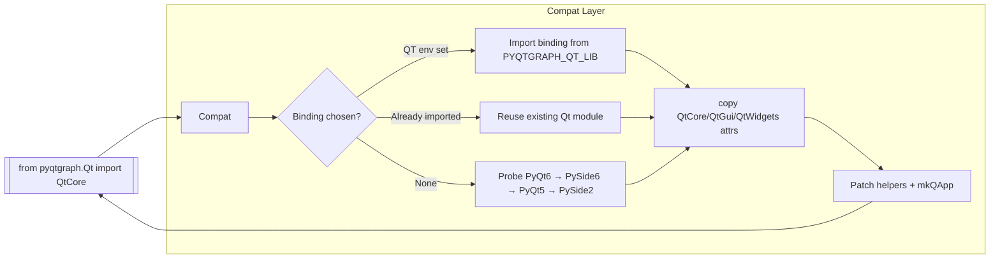

# PyQtGraph: Fast Scientific Graphics with a Built‑in Qt Compatibility Layer

[PyQtGraph](https://www.pyqtgraph.org/) is a pure-Python graphics and GUI toolkit aimed at scientific, mathematical, and engineering applications. It layers interactive 2D/3D plotting, ROI tooling, flowchart widgets, and parameter trees on top of Qt’s GraphicsView framework while pushing pixel processing through NumPy for speed—all distributed under the MIT license. Typical use cases include oscilloscope-style waveform viewers, MRI data slicers, and exploratory dashboards where millisecond updates matter.

### What a minimal PyQtGraph app looks like
```python
import pyqtgraph as pg
from pyqtgraph.Qt import QtWidgets

app = pg.mkQApp("PyQtGraph demo")
win = pg.plot(title="PyQtGraph in 20 lines")
win.plot([0, 1, 0, -1, 0], pen="c", name="sine-ish")
QtWidgets.QApplication.instance().exec()
```

The call to `pg.mkQApp` is the visible tip of PyQtGraph’s biggest engineering decision: a compatibility façade that shields the rest of the library—and your code—from the differences between PyQt5/6 and PySide2/6.

## Why the compatibility shim matters
- **One import for any binding.** Applications simply `from pyqtgraph.Qt import QtCore, QtGui, QtWidgets`. The module auto-detects the active binding (environment variable `PYQTGRAPH_QT_LIB` → already-imported module → fallback order PyQt6 → PySide6 → PyQt5 → PySide2) and exposes a consistent API surface.
- **Mirroring instead of monkey patching.** `_copy_attrs` copies symbols into local `QtCore`, `QtGui`, and `QtWidgets` namespaces, letting PyQtGraph tweak them (e.g., aliasing `QtWidgets.QOpenGLWidget` on Qt6) without polluting global modules.
- **Shared utilities where bindings diverge.** `_loadUiType` invokes the correct UIC compiler when PySide lacks `loadUiType`, and PyQt-specific exception hooks are neutralized so a slot error doesn’t abort the process.
- **HiDPI and UX defaults.** `mkQApp()` primes the QApplication with sensible high-DPI attributes and icons before returning it, so example scripts and user apps render predictably across platforms.

## Mermaid: how PyQtGraph routes your Qt imports


## How to reuse the pattern in your projects
1. **Build your own `qt_compat.py`.** Detect PySide/PyQt the way PyQtGraph does and re-export `QtCore`, `QtGui`, `QtWidgets`, signal aliases, and `mkQApp`-style helpers.
2. **Keep upstream modules pristine.** Clone attributes into your namespace so hotfixes (like merging Qt6 widgets back into QtGui) stay isolated.
3. **House binding quirks with the loader.** Bundle things like `loadUiType` fallbacks, `sys.excepthook` overrides, or enum shims right next to the detection logic.
4. **Document supported combos and guards.** Emit a warning (as PyQtGraph’s `versionReq` does) when you encounter old Qt minor versions, and describe the tested matrix in your README/CI.
5. **Exercise both Qt families in CI.** Smoke test launching a QApplication via your shim against at least one PyQt and one PySide build so regressions surface quickly.

Anchoring your Qt compatibility story this way lets you spend the rest of your time on PyQtGraph’s strengths—streaming plots, ROI-driven analytics, and OpenGL views—without duplicating conditional imports throughout your codebase.
