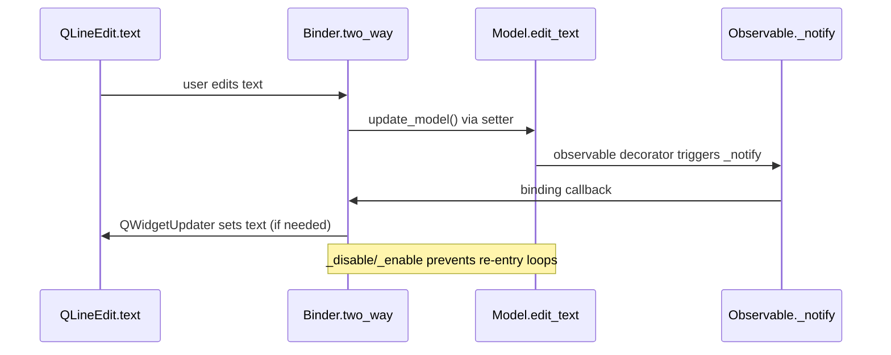

# qt-python-mvc: Descriptor-Based Bindings for Qt-Free Models

This repo’s killer move is the `Binder` (`binding.py`) + `Observable` (`observable.py`) combo: **controllers and models stay pure Python while the view binds widget descriptors to model properties**. The binding layer inspects each widget method, wires the correct setter/signal pair, and prevents feedback loops by temporarily disabling view callbacks when the model updates.

## Highlights worth copying
- **Descriptors over strings.** The binder takes real attribute references (`line_edit.text`, `Model.edit_text`) instead of magic names, so refactors and type checkers stay safe.
- **Automatic signal lookup.** `_get_descriptors` walks the widget MRO to match getters with setters and update signals defined in `qt_getter_setter_signals`, throwing a clear `RuntimeError` if a binding is unsupported.
- **Thread-aware updates.** `Observable` callbacks wrap updates in `MainThread.create_QWidgetUpdater`, pushing model-to-view changes onto the GUI thread without littering your controller with `QMetaObject.invokeMethod` calls.
- **Cycle guards.** `_disable_view_bindings` / `_enable_view_bindings` mask callbacks marked as view bindings, so two-way sync never causes infinite recursion when the model feeds the view, and the view feeds the model.
- **Composable controllers.** Controllers register reactions with `model.add_callback(Model.edit_text, self.set_label)`, keeping business logic testable outside Qt.

## Mermaid: two-way binding handshake

## How to adopt it in your PyQt/PySide app
1. **Keep the model Qt-free.** Subclass an `Observable` that stores callbacks keyed by property setter names; decorate setters with `@observable` so `_notify` fires after each change.
2. **Describe widget capabilities.** Build a `qt_getter_setter_signals` table mapping widget descriptor objects to their setters and signals—start with text, enablement, and checked state.
3. **Bind by descriptors, not strings.** Require callers to pass the bound widget getter and the model property (`Binder.two_way(line_edit.text, Model.edit_text)`), allowing `_identify` to resolve roles.
4. **Marshal to the GUI thread.** Wrap model-to-view callbacks with a `MainThread` helper that schedules widget updates; your models stay thread-agnostic.
5. **Short-circuit cycles.** Toggle a flag before writing back to the model so observers tied to view bindings ignore the update in progress.
6. **Layer controllers last.** After view bindings are set, connect buttons and menus to controller methods so they operate on a model already synced with the UI.

Start with one widget/property pair, write a regression test that toggles the value twice, and extend the descriptor table as new widgets enter your UI. You’ll get MVVM-style bindings without surrendering the clarity of models and controllers that never import Qt.
