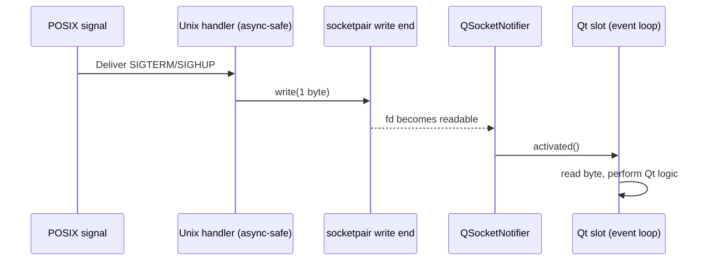

# Qt 6 Official Best Practices Playbook

These notes distill four core Qt 6 guidance documents into a single field manual you can keep at hand while building PyQt/PySide tooling.

## Primary references
- [Qt 6 Best Practice Guides](https://doc.qt.io/qt-6/best-practices.html)
- [Qt 6 Session Management](https://doc.qt.io/qt-6/session.html)
- [Calling Qt Functions From Unix Signal Handlers](https://doc.qt.io/qt-6/unix-signals.html)
- [Best Practices for QML and Qt Quick](https://doc.qt.io/qt-6/qtquick-bestpractices.html)

## Session resilience (desktop & X11)
- **Always join the graceful logout dialogue.** Connect to [`QGuiApplication::commitDataRequest`](https://doc.qt.io/qt-6/qguiapplication.html#commitDataRequest) so you can prompt the user to save/abort when the OS begins shutdown.
- **Persist live state when the session manager asks.** On platforms with full session support (X11), also handle [`saveStateRequest`](https://doc.qt.io/qt-6/qguiapplication.html#saveStateRequest) and tag snapshots with [`sessionId()`](https://doc.qt.io/qt-6/qguiapplication.html#sessionId) so they are unique across clients.
- **Restore deterministically.** In `main()`, check [`isSessionRestored()`](https://doc.qt.io/qt-6/qguiapplication.html#isSessionRestored) and rebuild windows using the same [`QObject::setObjectName`](https://doc.qt.io/qt-6/qobject.html#setObjectName) values you saved—window managers rely on this to reinstate stacking and geometry.
- **Test with a real manager.** Use `xsm` or another X11R6 session manager to simulate checkpoints and forced shutdowns; trigger both `commitDataRequest` and `saveStateRequest` paths to vet dialog behaviour.

## Bridging Unix signals into Qt safely
- **Remember the rule: no Qt in POSIX handlers.** The official guidance reiterates that only async-signal-safe calls are allowed inside Unix handlers.
- **Use socket pairs as signal trampolines.** Create a `socketpair()` for each POSIX signal, watch the read end with [`QSocketNotifier`](https://doc.qt.io/qt-6/qsocketnotifier.html), and write a byte from the handler. The notifier’s `activated` signal gets you back on the event loop.
- **Disable-notify-read-enable around work.** Inside the slot, disable the notifier, drain the byte, perform the Qt work (emit signals, update UI), then re-enable so you never miss level-triggered notifications.
- **Install handlers with `sigaction` + `SA_RESTART`.** Copy the reference setup so interrupted syscalls resume automatically—a subtlety the docs call out in the sample.

### Unix signal handshake (Mermaid)

## Qt Quick & QML craftsmanship
- **Prefer declarative bindings.** Set property values declaratively (for example, `color: "red"`) instead of using `Component.onCompleted` JavaScript assignments that override bindings and delay errors.
- **Keep state out of delegates.** Persist UI state in models, not delegate instances that get recycled within views.
- **Type your properties.** Replace `property var` with explicit types so static analysis and tooling can flag mistakes where the value is assigned.
- **Lean on interaction signals.** Use signals such as `Slider::moved` instead of `valueChanged` to avoid endless loops triggered by automatic clamping.
- **Bundle assets with the Qt resource system.** Define images/fonts via `qt_add_qml_module` (or `.qrc`) so deployment is consistent across OS sandboxes and the files are available for ahead-of-time compilation.
- **Separate UI from business logic.** Expose backend data via required properties, singletons, or initial properties so C++ models stay agnostic of QML refactors.
- **Respect layout dos & don’ts.** Use `Layout.*` attached properties instead of anchors on layout children, and avoid overusing layouts inside delegates for performance.
- **Design for scale.** Provide @2x/@3x art, prefer SVG or font icons, and enable high-DPI scaling so the UI adapts automatically.
- **Localize from day one.** Wrap visible strings with `qsTr()` and follow the translation workflow described in the docs.

## Implementation checklist
1. **Session-proof the shell** by wiring both commit and save state slots, storing state keyed by `sessionId`, and naming top-level windows.
2. **Wrap POSIX signals** with a socketpair + notifier bridge and ensure the handler does nothing more than `write()`.
3. **Structure QML modules** with resources compiled into the binary and keep `.qml` files alongside their `qt_add_qml_module` manifest.
4. **Codify UI guidelines**: adopt typed properties, declarative bindings, layout rules, and `qsTr()` usage as linting criteria.
5. **Plan for multiple densities** by shipping vector or multi-resolution art and letting Qt Quick’s styling system pick the right assets.

Treat this document as your starting contract with the official Qt documentation—the linked pages dive deeper whenever you need full examples or API specifics.
