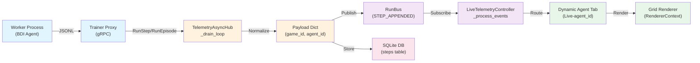
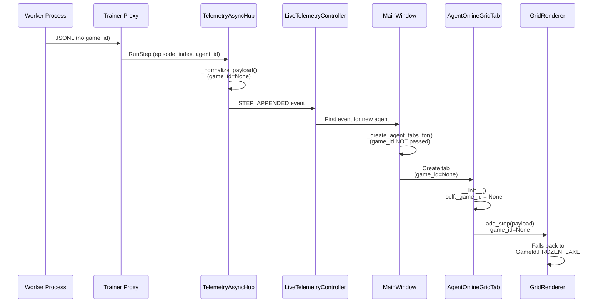
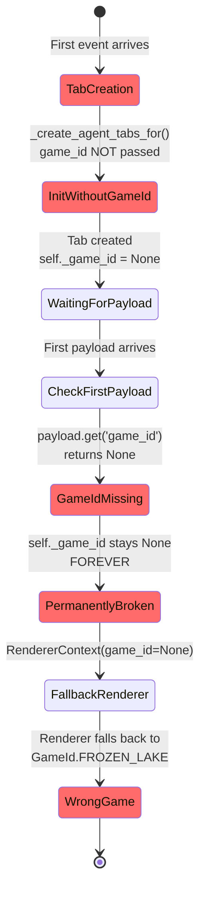
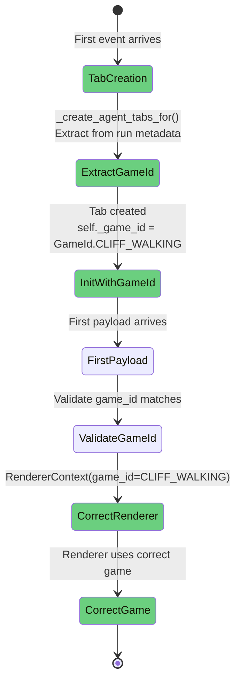
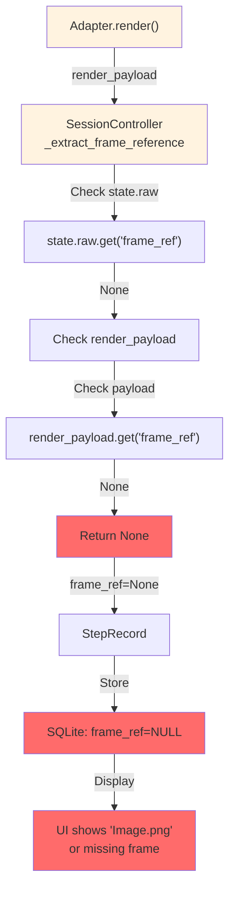
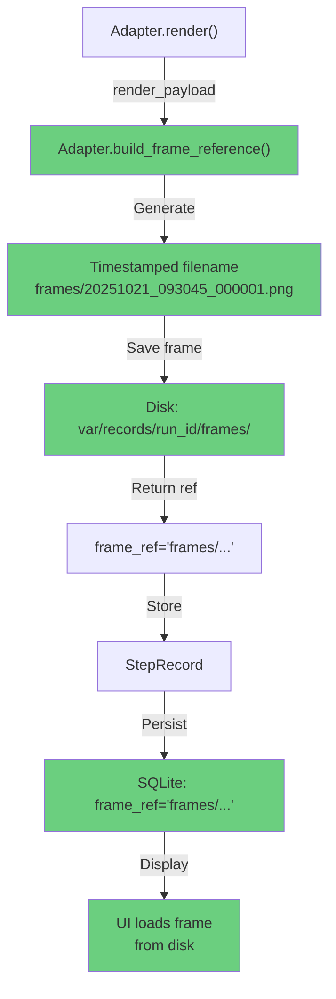
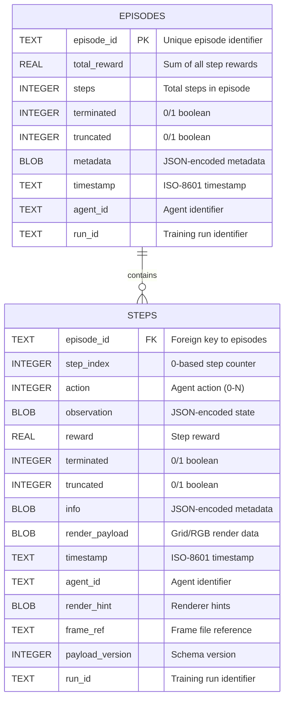
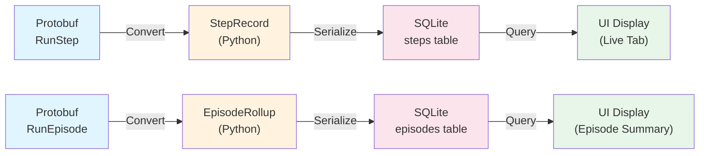

# Analysis: Dynamic Agent Tabs Context Issue & Image Naming Problem

## Executive Summary

You've identified two distinct issues in the Gym GUI:

1. **Dynamic Agent Tab Context Issue**: The `RendererContext` passed to grid renderers in dynamic agent tabs (Live-{agent-id}) may have `game_id=None`, causing incorrect rendering or fallback to default game.

2. **Image Naming Problem**: Frame references in telemetry are showing generic "Image.png" instead of timestamped filenames like "2025-10-21_01-25_1.png".

---

## Complete Data Flow Architecture

### End-to-End Telemetry Pipeline



**Key Transformation Points:**
- **Worker → Proxy**: JSONL → Protobuf (episode_index, agent_id)
- **Proxy → Hub**: Protobuf → Python objects (StepRecord, EpisodeRollup)
- **Hub → RunBus**: Normalization adds game_id, run_id, agent_id
- **RunBus → Controller**: Event routing by (run_id, agent_id) tuple
- **Controller → Tab**: game_id extraction from first payload (⚠️ PROBLEM HERE)
- **Tab → Renderer**: RendererContext creation with game_id (⚠️ FALLBACK TO FROZEN_LAKE)

---

## Problem 1: Dynamic Agent Tab Context Issue

### Root Cause Analysis

#### Code Path: Where game_id is Lost



**The Problem:**
- `self._game_id` is only set on the **first** grid payload where `self._game_id is None`
- If the first payload lacks a `game_id` field, `self._game_id` remains `None`
- The `RendererContext` is created with `game_id=None`
- The grid renderer then falls back to `GameId.FROZEN_LAKE` (line 53 in `grid.py`)

#### Code Location: agent_online_grid_tab.py (lines 160-170)

```python
# Extract game_id from payload
raw_game = payload.get("game_id")
if raw_game and self._game_id is None:
    try:
        self._game_id = raw_game if isinstance(raw_game, GameId) else GameId(str(raw_game))
    except ValueError:
        pass

# Render
if self._renderer_strategy and self._renderer_strategy.supports(payload):
    context = RendererContext(game_id=self._game_id)  # ⚠️ game_id=None if first payload lacks it
    self._renderer_strategy.render(payload, context=context)
```

#### Renderer Fallback: grid.py (line 53)

```python
game_id = _resolve_game_id(context, payload) or GameId.FROZEN_LAKE  # ⚠️ Falls back to FROZEN_LAKE
```

### Tab Creation Lifecycle: Current vs Desired State

#### Current State (Broken)



#### Desired State (Fixed)



### Why This Happens

The dynamic agent tabs are created in `main_window.py:_create_agent_tabs_for()` without passing the game configuration. The tabs rely on extracting `game_id` from incoming telemetry payloads, but:

1. **Worker processes** may not include `game_id` in every step payload
2. **Telemetry streams** from BDI agents may not have this metadata
3. **First payload timing** is critical—if it arrives without `game_id`, the context is permanently broken
4. **No fallback mechanism** exists to recover if first payload is missing game_id

### Solution

The `game_id` should be passed from the **run metadata** or **training configuration**, not extracted from individual step payloads. 

**Recommended Fix:**
1. Extract `game_id` from the run's initial configuration (stored in `RunRegistry` or passed via gRPC)
2. Pass it to `AgentOnlineGridTab` during construction
3. Use the payload's `game_id` only as a fallback/validation

---

## Problem 2: Image Naming (Image.png vs Timestamped Names)

### Frame Reference Generation Flow

#### Current State (Broken)



#### Desired State (Fixed)



### Root Cause Analysis

The `frame_ref` field in telemetry payloads is being set to `None` instead of timestamped filenames. This happens because:

1. **No frame storage implementation**: The `build_frame_reference()` method in `gym_gui/core/adapters/base.py` (line 243) returns `None` by default
2. **No frame naming convention**: There's no system generating timestamped frame filenames like "2025-10-21_01-25_1.png"
3. **No frame persistence**: Frames are not saved to disk before telemetry is emitted
4. **Fallback to generic name**: When `frame_ref` is None, the UI or storage layer may default to "Image.png"

### Code Flow: Where frame_ref is Lost

In `gym_gui/controllers/session.py` (lines 759-770):

```python
def _extract_frame_reference(self, step: AdapterStep) -> str | None:
    state_raw = getattr(step.state, "raw", None)
    if isinstance(state_raw, Mapping):
        ref = state_raw.get("frame_ref")  # ⚠️ Usually None
        if isinstance(ref, str):
            return ref
    payload = step.render_payload
    if isinstance(payload, Mapping):
        ref = payload.get("frame_ref")  # ⚠️ Usually None
        if isinstance(ref, str):
            return ref
    return None  # ⚠️ Returns None, frame_ref stays NULL in database
```

The system looks for `frame_ref` in:
1. `step.state.raw.get("frame_ref")` → Usually None
2. `step.render_payload.get("frame_ref")` → Usually None
3. Falls back to `None` → Stored as NULL in database

### Why You Saw Timestamped Names Yesterday

The timestamped filenames ("2025-10-21_01-25_1.png") were likely:
- **Manually generated** by a previous implementation
- **Stored in a different location** (not in the current frame_ref system)
- **Part of a frame storage service** that was later changed or disabled

### Current State

According to `gym_gui/config/storage_profiles.yaml`:
- `toy_text` profile: `keep_disk_snapshots: true` (but no frame naming convention)
- `box2d` profile: `frame_compression: png` (but no frame storage implementation)
- Frame persistence is **planned but not fully implemented** (see `docs/1.0_DAY_5/`)

---

## Data Model Architecture

### SQLite Schema: steps and episodes Tables



**Indexes:**
- `idx_steps_episode` on `(episode_id, step_index)` - Fast episode lookup
- `idx_episodes_run` on `(run_id, agent_id, episode_id)` - Fast run/agent filtering

### Python Data Models

#### StepRecord (gym_gui/core/data_model/telemetry.py)

```python
@dataclass(slots=True)
class StepRecord:
    episode_id: str                          # Unique episode ID
    step_index: int                          # 0-based counter
    action: int | None                       # Agent action
    observation: Any                         # Environment state
    reward: float                            # Step reward
    terminated: bool                         # Episode ended
    truncated: bool                          # Episode truncated
    info: Mapping[str, Any]                  # Metadata
    timestamp: datetime                      # When step occurred
    render_payload: Any | None               # Grid/RGB data
    agent_id: str | None                     # Agent identifier
    render_hint: Mapping[str, Any] | None    # Renderer hints
    frame_ref: str | None                    # Frame file reference ⚠️ Usually None
    payload_version: int                     # Schema version
    run_id: str | None                       # Training run ID
```

#### EpisodeRollup (gym_gui/core/data_model/telemetry.py)

```python
@dataclass(slots=True)
class EpisodeRollup:
    episode_id: str                          # Unique episode ID
    total_reward: float                      # Sum of rewards
    steps: int                               # Total steps
    terminated: bool                         # Episode ended
    truncated: bool                          # Episode truncated
    metadata: Mapping[str, Any]              # Episode metadata
    timestamp: datetime                      # When episode ended
    agent_id: str | None                     # Agent identifier
    run_id: str | None                       # Training run ID
```

### Data Transformation Pipeline



**Key Transformations:**
- Protobuf `episode_index` (uint64) → Python `episode_id` (string)
- Protobuf `seq_id` (uint64) → Python `step_index` (int)
- All BLOB fields (observation, info, render_payload) → JSON serialization
- Boolean fields → SQLite INTEGER (0/1)

---

## Recommended Actions

### For Problem 1 (Context Issue)

1. **Modify `_create_agent_tabs_for()` in `main_window.py`**:
   - Extract `game_id` from the run's metadata
   - Pass it to `AgentOnlineGridTab` constructor

2. **Update `AgentOnlineGridTab.__init__()`**:
   - Accept optional `game_id` parameter
   - Initialize `self._game_id` with this value instead of waiting for first payload

3. **Verify in `agent_online_grid_tab.py`**:
   - Ensure `game_id` is set before first render call

### For Problem 2 (Image Naming)

1. **Implement frame storage naming convention**:
   - Create timestamped frame filenames: `frame_{timestamp}_{step_index}.png`
   - Store in `var/records/{run_id}/frames/`

2. **Update `build_frame_reference()` in adapters**:
   - Generate proper `frame_ref` values with timestamps
   - Return relative paths for portability

3. **Wire frame storage into telemetry pipeline**:
   - Ensure frames are persisted before telemetry is emitted
   - Update `frame_ref` in `StepRecord` before storage

---

## Files to Investigate

- `gym_gui/ui/main_window.py` - Tab creation logic
- `gym_gui/ui/widgets/agent_online_grid_tab.py` - Grid rendering context
- `gym_gui/core/adapters/base.py` - Frame reference generation
- `gym_gui/controllers/session.py` - Frame reference extraction
- `gym_gui/services/storage.py` - Storage profile management
- `spade_bdi_rl/core/telemetry.py` - Worker telemetry emission

---

## Next Steps

1. Confirm the run metadata includes `game_id`
2. Trace a single step through the telemetry pipeline to see where `game_id` is lost
3. Check if frame storage was intentionally disabled or just incomplete
4. Review git history for frame naming changes (use `git log --oneline -- "*frame*"`)

