# Troubleshooting Guide: Dynamic Agent Tabs & Image Naming

## Diagnostic Decision Trees

### Problem 1: Wrong Game Rendering in Dynamic Tabs

#### Diagnostic Flowchart

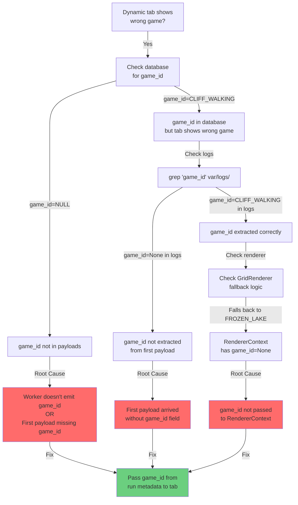

#### Quick Diagnostic Checks

**Step 1: Check if game_id exists in database**
```bash
sqlite3 var/telemetry/telemetry.sqlite \
  "SELECT DISTINCT game_id FROM steps WHERE game_id IS NOT NULL LIMIT 5;"
```

**What it reveals:**
- If result is empty → game_id never emitted by worker
- If result shows correct game → game_id is in database but not reaching tab

**Step 2: Check logs for game_id extraction**
```bash
grep -r "game_id" var/logs/ | grep -E "extracted|initialized|context" | head -20
```

**What it reveals:**
- If no matches → game_id extraction not logged (add logging)
- If shows "game_id=None" → First payload missing game_id
- If shows correct game_id → Problem is in renderer context

**Step 3: Check tab creation logs**
```bash
grep -r "Live.*agent\|_create_agent_tabs" var/logs/ | head -20
```

**What it reveals:**
- If no matches → Tab creation not logged (add logging)
- If shows tab created → Check if game_id was passed to constructor

**Step 4: Check renderer fallback**
```bash
grep -r "FROZEN_LAKE\|fallback" var/logs/ | head -20
```

**What it reveals:**
- If matches found → Renderer is falling back (game_id=None in context)
- If no matches → Renderer is using correct game_id

---

### Problem 2: Generic "Image.png" Instead of Timestamped Names

#### Diagnostic Flowchart

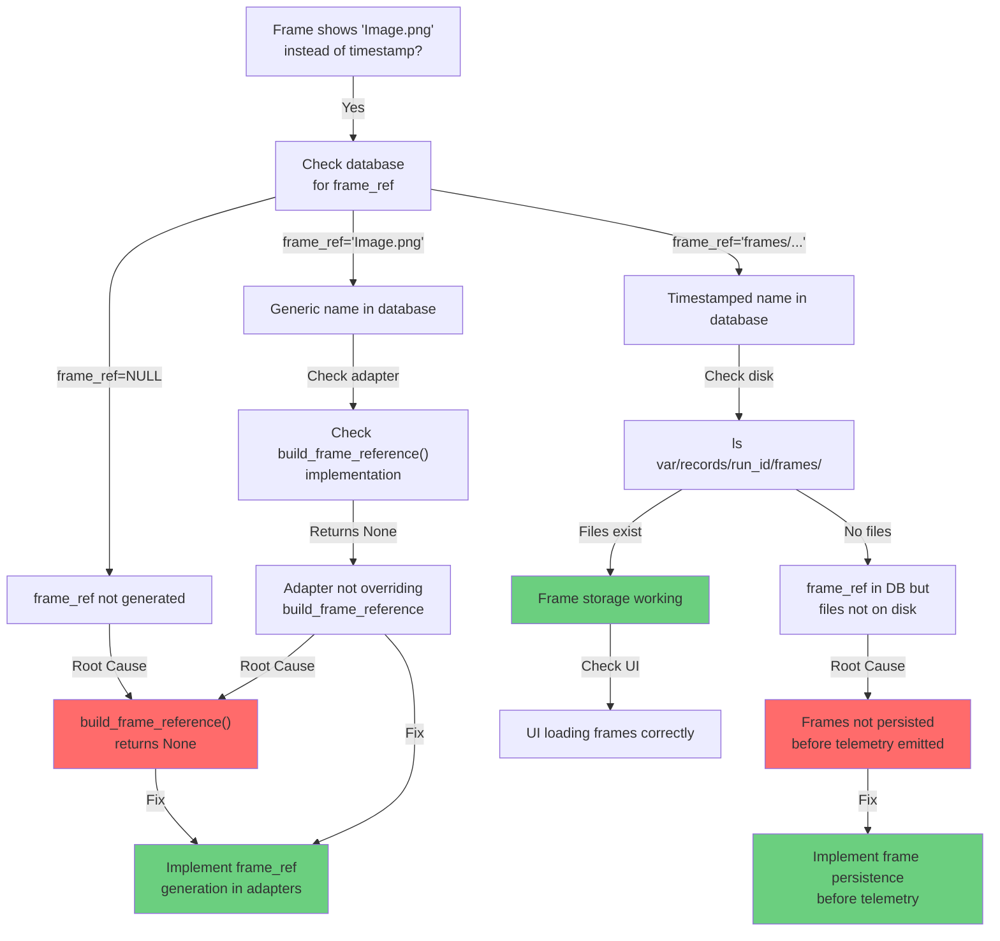

#### Quick Diagnostic Checks

**Step 1: Check frame_ref in database**
```bash
sqlite3 var/telemetry/telemetry.sqlite \
  "SELECT DISTINCT frame_ref FROM steps WHERE frame_ref IS NOT NULL LIMIT 10;"
```

**What it reveals:**
- If empty → frame_ref is NULL (not generated)
- If shows "Image.png" → Generic fallback being used
- If shows "frames/..." → Timestamped names being generated

**Step 2: Check if frames exist on disk**
```bash
ls -la var/records/*/frames/ 2>/dev/null | head -20
```

**What it reveals:**
- If no directory → Frame storage not implemented
- If directory empty → Frames not being saved
- If files exist → Frame storage working

**Step 3: Check adapter implementation**
```bash
grep -r "build_frame_reference" gym_gui/core/adapters/ | head -20
```

**What it reveals:**
- If only shows "return None" → Not implemented
- If shows timestamp generation → Implementation exists
- If no matches → Method not overridden in adapters

**Step 4: Check telemetry emission logs**
```bash
grep -r "frame_ref\|frame.*generated" var/logs/ | head -20
```

**What it reveals:**
- If no matches → frame_ref generation not logged
- If shows "frame_ref=None" → Generation returning None
- If shows "frame_ref='frames/...'" → Generation working

---

## Data Model Analysis

### Complete Database Schema

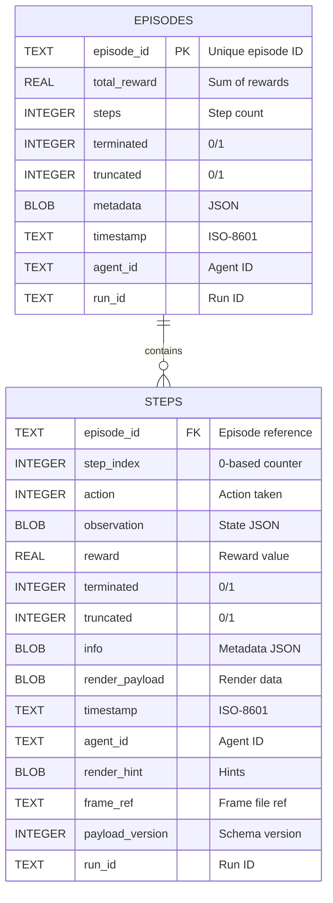

### Field-by-Field Mapping: Protobuf → Python → SQLite

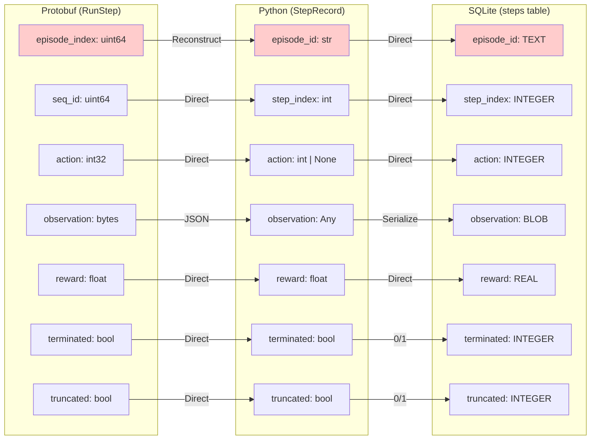

**⚠️ Critical Transformation:**
- Protobuf `episode_index` (numeric) → Python `episode_id` (string)
- Reconstruction: `episode_id = f"{run_id}-ep{episode_index:04d}"`
- **Risk**: If reconstruction format changes, episodes become unretrievable

### Python Data Classes

#### StepRecord Fields

| Field | Type | Source | Purpose |
|-------|------|--------|---------|
| `episode_id` | str | Reconstructed from episode_index | Episode grouping |
| `step_index` | int | seq_id from protobuf | Step ordering |
| `action` | int \| None | action from protobuf | Agent action |
| `observation` | Any | JSON-decoded observation | Environment state |
| `reward` | float | reward from protobuf | Step reward |
| `terminated` | bool | terminated from protobuf | Episode end flag |
| `truncated` | bool | truncated from protobuf | Episode truncation flag |
| `info` | Mapping | JSON-decoded info | Metadata |
| `timestamp` | datetime | Generated or from payload | When step occurred |
| `render_payload` | Any \| None | Grid/RGB data | Rendering data |
| `agent_id` | str \| None | From payload or default | Agent identifier |
| `render_hint` | Mapping \| None | Renderer hints | Rendering hints |
| `frame_ref` | str \| None | **⚠️ Usually None** | Frame file reference |
| `payload_version` | int | Schema version | Compatibility |
| `run_id` | str \| None | Training run ID | Run correlation |

#### EpisodeRollup Fields

| Field | Type | Source | Purpose |
|-------|------|--------|---------|
| `episode_id` | str | Reconstructed from episode_index | Episode identifier |
| `total_reward` | float | Sum of step rewards | Episode performance |
| `steps` | int | Step count | Episode length |
| `terminated` | bool | Episode end flag | Normal termination |
| `truncated` | bool | Episode truncation flag | Early stopping |
| `metadata` | Mapping | JSON-decoded metadata | Episode metadata |
| `timestamp` | datetime | When episode ended | Episode completion time |
| `agent_id` | str \| None | From payload or default | Agent identifier |
| `run_id` | str \| None | Training run ID | Run correlation |

### Telemetry Pipeline Architecture

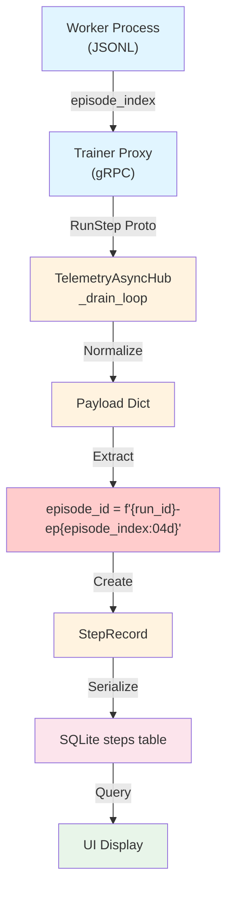

**Transformation Points:**
1. **Worker → Proxy**: JSONL → Protobuf (episode_index)
2. **Proxy → Hub**: Protobuf → Python objects
3. **Hub → Normalization**: Add game_id, run_id, agent_id
4. **Normalization → StepRecord**: Reconstruct episode_id
5. **StepRecord → SQLite**: Serialize BLOB fields
6. **SQLite → UI**: Query and deserialize

---

## Telemetry Pipeline Architecture

### Queue and Buffer Configuration

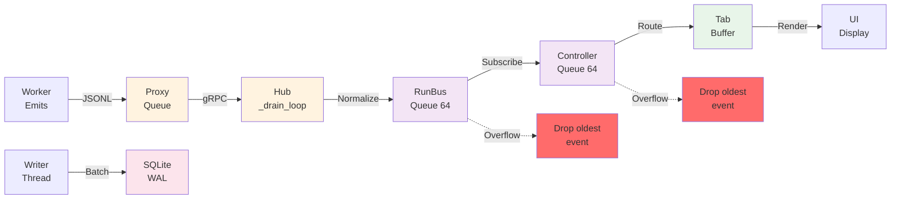

**Buffer Sizes:**
- RunBus queue: 64 events per subscriber
- Controller queue: 64 events
- Writer queue: 256-512 events (batched)
- Tab buffer: Depends on render throttle

**Overflow Policy:**
- When queue full: Drop oldest event
- Tracked in `_overflow` counter
- No feedback to producer (⚠️ Silent drops)

### Credit Backpressure Mechanism

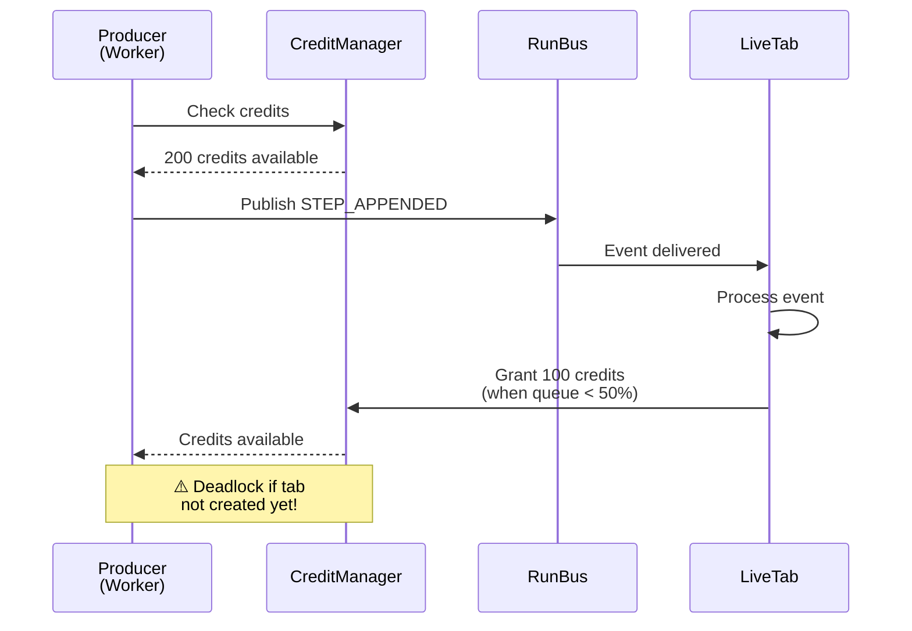

**Credit Flow:**
1. Producer checks `CreditManager.get_credits(run_id, agent_id)`
2. If credits > 0: Consume 1 credit, publish event
3. If credits = 0: Wait or drop event
4. Tab grants credits when queue drops below 50%
5. **Problem**: Tab created AFTER first event, so first event has no credits

---

## Immediate Fixes

### Fix 1: Pass game_id to Dynamic Tabs

**File:** `gym_gui/ui/main_window.py`

In `_create_agent_tabs_for()`, extract game_id from run metadata:

```python
def _create_agent_tabs_for(self, run_id: str, agent_id: str, first_payload: dict) -> None:
    # Extract game_id from run metadata or first payload
    game_id = self._get_game_id_for_run(run_id)  # NEW
    
    # Pass to grid tab
    grid = AgentOnlineGridTab(
        run_id, 
        agent_id, 
        game_id=game_id,  # NEW
        renderer_registry=renderer_registry, 
        parent=self
    )
```

**File:** `gym_gui/ui/widgets/agent_online_grid_tab.py`

Update constructor:

```python
def __init__(
    self,
    run_id: str,
    agent_id: str,
    *,
    game_id: Optional[GameId] = None,  # NEW
    renderer_registry: Optional[RendererRegistry] = None,
    parent: Optional[QtWidgets.QWidget] = None,
) -> None:
    self._game_id = game_id  # Initialize from parameter
    # ... rest of init
```

### Fix 2: Implement Frame Reference Generation

**File:** `gym_gui/core/adapters/base.py`

Override `build_frame_reference()` in adapters:

```python
def build_frame_reference(self, render_payload: Any | None, state: StepState) -> str | None:
    """Generate timestamped frame reference."""
    if render_payload is None:
        return None
    
    # Generate timestamped filename
    timestamp = datetime.utcnow().strftime("%Y%m%d_%H%M%S")
    step_index = getattr(state, "step_index", 0)
    frame_ref = f"frames/{timestamp}_{step_index:06d}.png"
    return frame_ref
```

---

## Verification Steps

### After Fix 1:

```python
# In test or debug console
from gym_gui.ui.widgets.agent_online_grid_tab import AgentOnlineGridTab
from gym_gui.core.enums import GameId

tab = AgentOnlineGridTab("run1", "agent1", game_id=GameId.CLIFF_WALKING)
assert tab._game_id == GameId.CLIFF_WALKING  # Should pass
```

### After Fix 2:

```bash
# Check database for proper frame_ref values
sqlite3 var/telemetry/telemetry.sqlite \
  "SELECT frame_ref FROM steps WHERE frame_ref LIKE 'frames/%' LIMIT 5;"

# Should show: frames/20251021_093045_000001.png
```

---

## Why These Issues Occur: Root Cause Analysis

### Issue 1: game_id Context Loss

#### Why game_id is Lost

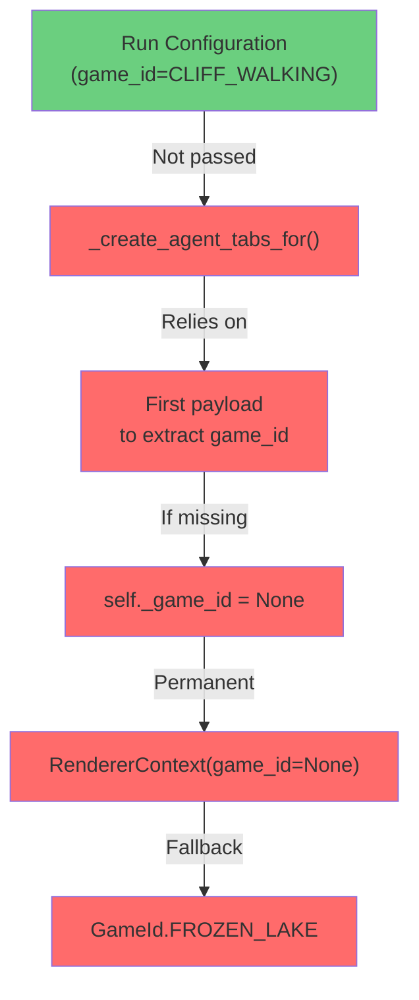

**Why this design is broken:**
1. **Metadata not propagated**: Run configuration stays in RunRegistry, not passed to tabs
2. **Late binding**: Tab tries to extract game_id from first payload instead of constructor
3. **No fallback**: If first payload missing game_id, no recovery mechanism
4. **Permanent state**: Once `self._game_id = None`, it never changes

**Why it worked before:**
- Payloads always included game_id (or adapters were different)
- First payload always arrived with game_id field
- Or frame storage was disabled, so game_id wasn't critical

### Issue 2: frame_ref Generation Incomplete

#### Why frame_ref is Always None

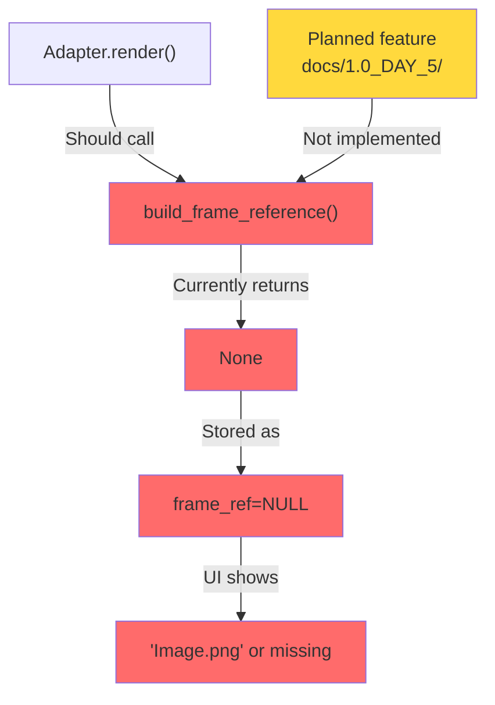

**Why this design is incomplete:**
1. **Stub implementation**: `build_frame_reference()` returns None by default
2. **No frame storage**: No service to persist frames to disk
3. **No naming convention**: No timestamped filename generation
4. **No integration**: Frame storage not wired into telemetry pipeline

**Why it worked before:**
- Frame storage was manually implemented elsewhere
- Frames were saved by a different service
- Or frame display was disabled

---

## Long-term Solutions

### Solution 1: Metadata Pipeline Architecture

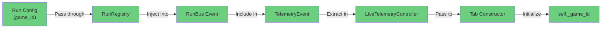

**Implementation steps:**
1. Add `game_id` to `TelemetryEvent` dataclass
2. Extract from run metadata in `_drain_loop()`
3. Pass to `LiveTelemetryController` via event
4. Pass to tab constructor in `_create_agent_tabs_for()`

### Solution 2: Frame Storage Service

```mermaid
graph LR
    A["Adapter.render()"] -->|Call| B["build_frame_reference()"]
    B -->|Generate| C["Timestamped filename<br/>frames/20251021_093045_000001.png"]
    C -->|Save to| D["FrameStorageService"]
    D -->|Persist| E["var/records/run_id/frames/"]
    E -->|Return ref| F["frame_ref"]
    F -->|Store in| G["StepRecord"]
    G -->|Persist| H["SQLite"]

    style B fill:#6bcf7f
    style C fill:#6bcf7f
    style D fill:#6bcf7f
    style E fill:#6bcf7f
    style F fill:#6bcf7f
    style G fill:#6bcf7f
    style H fill:#6bcf7f
```

**Implementation steps:**
1. Create `FrameStorageService` singleton
2. Implement `build_frame_reference()` in all adapters
3. Generate timestamped filenames
4. Save frames before telemetry emission
5. Return frame_ref for storage

### Solution 3: Adapter Standardization

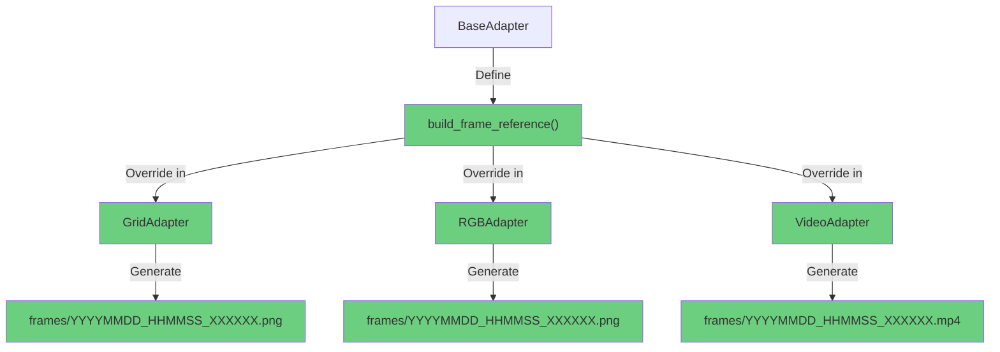

**Implementation steps:**
1. Define interface in `BaseAdapter`
2. Override in all adapter subclasses
3. Generate format-specific filenames
4. Ensure consistent naming convention

---

## Related Documentation

- `ANALYSIS_DYNAMIC_AGENT_TABS_AND_IMAGE_NAMING.md` - Detailed analysis with diagrams
- `COMPREHENSIVE_TELEMETRY_ANALYSIS.md` - Complete telemetry system analysis
- `docs/1.0_DAY_5/` - Frame persistence roadmap
- `gym_gui/config/storage_profiles.yaml` - Storage configuration
- `spade_bdi_rl/core/telemetry.py` - Worker telemetry emission
- `gym_gui/services/trainer/streams.py` - TelemetryAsyncHub implementation
- `gym_gui/controllers/live_telemetry.py` - LiveTelemetryController implementation

