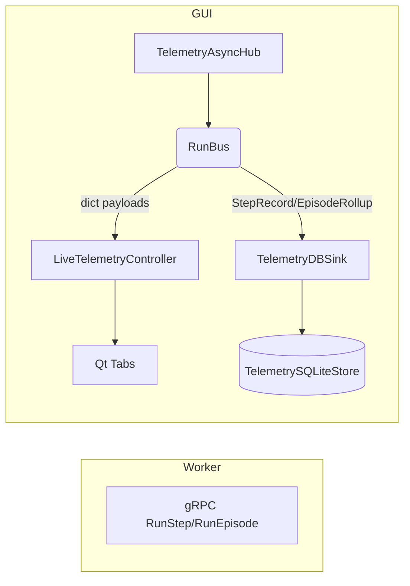
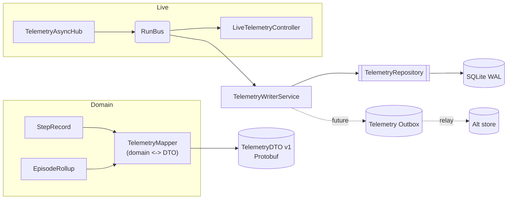
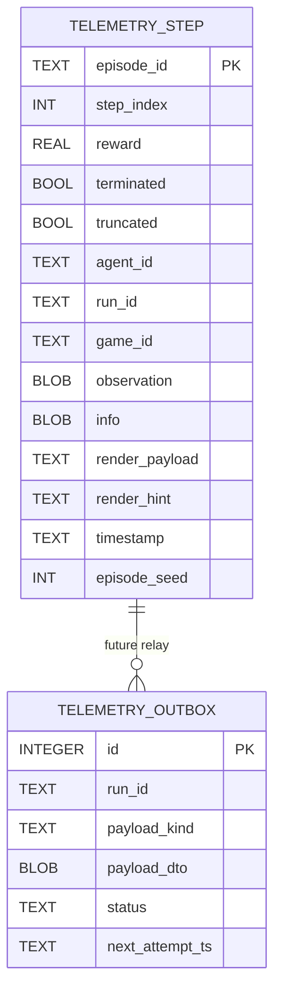

# DTO / Repository Adoption Plan

## DTOs & DAOs at a Glance

- **Data Transfer Object (DTO):** A serialisable representation used at service boundaries. It stabilises wire contracts while the internal domain (`StepRecord`, `EpisodeRollup`) can evolve.
- **Data Access Object / Repository:** An abstraction over persistence (e.g., SQLite today). It keeps storage concerns isolated so writers/readers do not depend on concrete stores.
- **Benefits when implemented correctly:**
  - Schema evolution becomes additive: DTOs can be versioned (`TelemetryStepV1`, `V2`) without refactoring live UI code.
  - Persistence swapping/extension (Postgres/S3/Kafka) only requires a new repository implementation or outbox relay; business logic stays untouched.
  - Testing improves: mappers/repositories can be unit-tested independently of Qt/UI or SQLite.
  - Enables transactional outbox pattern to add reliable secondary sinks later.

---

> Grounded in `/home/hamid/Desktop/Projects/GUI_BDI_RL` (telemetry + trainer subsystems).

---

## 1. Current Telemetry Flow (as implemented today)

- **Domain objects:** `StepRecord`, `EpisodeRollup` in `gym_gui/core/data_model/telemetry_core.py`. These dataclasses are the only typed records in the system.
- **Ingestion:** `TelemetryAsyncHub` drains gRPC protos (`RunStep`, `RunEpisode`) and publishes dict payloads onto the in-process bus `gym_gui/services/trainer/streams.py`.
- **Live consumers:** `LiveTelemetryController` reads those dicts from `RunBus` and pushes them straight into Qt tables/widgets `gym_gui/controllers/live_telemetry_controllers.py`.
- **Durable sink:** `TelemetryDBSink` converts the dict payload into `StepRecord` / `EpisodeRollup` and writes directly to `TelemetrySQLiteStore` `gym_gui/telemetry/db_sink.py`, `gym_gui/telemetry/sqlite_store.py`.
- **Repositories / DTOs:** **None.** There is no repository abstraction, no mapper layer, and no DTO package anywhere in the tree.

### Observed Gaps
- External-facing contract = raw dict/dataclass → any schema change risks breaking consumers.
- Persistence concerns leak into the writer; swapping SQLite or adding a second sink would require refactoring multiple files.
- No staging point (outbox) to fan telemetry into future stores (Kafka/S3/Postgres).

---

## 2. Proposed DTO / Repository Architecture

### Key Design Decisions
1. **DTOs only at the boundary.** Internal code keeps using `StepRecord` / `EpisodeRollup`; DTOs represent the wire format (Protobuf recommended to align with the existing gRPC model).
2. **Repository interface** mediates persistence; current SQLite writer becomes `SQLiteTelemetryRepository`.
3. **Outbox-ready writer** allows a second durable path later without touching live consumers.

---

## 3. File / Naming Guidance

| Component | Purpose | Suggested Path (absolute) | Notes |
| --- | --- | --- | --- |
| Telemetry DTO schema (`TelemetryStepV1`, `TelemetryEpisodeV1`) | Versioned contract for external clients / replay APIs | `/home/hamid/Desktop/Projects/GUI_BDI_RL/gym_gui/telemetry/contracts/telemetry_v1.proto` | Generate to `telemetry_v1_pb2.py`; keep version in filename to co-exist with future schemas. |
| Python mapper | Pure conversions between dataclasses and DTOs | `/home/hamid/Desktop/Projects/GUI_BDI_RL/gym_gui/telemetry/contracts/mapper.py` | Static methods `to_dto_step`, `from_dto_step`, etc.; unit-testable. |
| Repository protocol + SQLite implementation | Persistence seam | `/home/hamid/Desktop/Projects/GUI_BDI_RL/gym_gui/telemetry/repository.py` | `class TelemetryRepository(Protocol)` + `class SQLiteTelemetryRepository`. Delegates to existing `TelemetrySQLiteStore`. |
| Writer orchestration | Consume RunBus events, call repository (and later outbox) | `/home/hamid/Desktop/Projects/GUI_BDI_RL/gym_gui/telemetry/writer_service.py` | Replace direct calls in `TelemetryDBSink` with this service or refactor sink to depend on repository. |
| Outbox definitions (future) | Transactional outbox rows + relay | `/home/hamid/Desktop/Projects/GUI_BDI_RL/gym_gui/telemetry/outbox.py` | Optional: only when second durable target is needed. |

> ⚠️ Rename this doc to `PLAN_DTO_REPOSITORY_ADOPTION.md` to reflect that it is a forward-looking design memo (current name implies implementation details that do not exist yet).

### Naming Conventions & Clean-up Candidates

**Proposed Standards**
- Modules/files: snake_case, singular when housing a single class (`live_telemetry_controller.py`, `sqlite_repository.py`).
- Packages: lower_snake (`telemetry/contracts`, `telemetry/repository`).
- Classes: PascalCase (`TelemetryRepository`, `TelemetryStepV1`).
- DTO versions: suffix with `V1`, `V2` in class/ message names; keep proto filenames versioned (`telemetry_v1.proto`).
- Environment variables / config keys: upper snake with prefix (`TELEMETRY_*`).

**Existing Mismatches**

| Current Name | Issue | Proposed Rename | Touch Points |
| --- | --- | --- | --- |
| `/home/hamid/Desktop/Projects/GUI_BDI_RL/gym_gui/controllers/live_telemetry_controllers.py` | Plural file name while housing `LiveTelemetryController` | `live_telemetry_controller.py` | Update imports in `/home/hamid/Desktop/Projects/GUI_BDI_RL/gym_gui/services/bootstrap.py`, tests, and UI modules. |
| `/home/hamid/Desktop/Projects/GUI_BDI_RL/gym_gui/services/telemetry.py` | File name generic vs. class `TelemetryService` (okay) but when DTO repo added, avoid collision | Consider `telemetry_service.py` for clarity | Update service imports across project. |
| Future DTO mapper (`mapper.py`) | Ensure snake_case; no action if following proposed path | `mapper.py` (already snake_case) | — |

Establishing these conventions upfront will prevent drift when new DTO/repository files land.

---

## 4. Implementation Roadmap (Phased)

### Phase 0 – Foundations (no behaviour change)
| Step | Files to touch | Goal |
| --- | --- | --- |
| Define DTO proto (`TelemetryStepV1`, `TelemetryEpisodeV1`) | `gym_gui/telemetry/contracts/telemetry_v1.proto` | Establish public schema; follow protobuf compatibility rules (no field reuse, only additive optional fields). |
| Implement mapper + tests | `gym_gui/telemetry/contracts/mapper.py`, `tests/telemetry/test_mapper.py` | Pure conversions domain ↔ DTO; ensures future refactors don’t break the contract. |

### Phase 1 – Repository seam
| Step | Files to touch | Goal |
| --- | --- | --- |
| Introduce `TelemetryRepository` protocol + SQLite impl | `gym_gui/telemetry/repository.py` | Surface write/read operations behind an interface. |
| Refactor `TelemetryDBSink` to depend on repository | `gym_gui/telemetry/db_sink.py` | Replace direct `TelemetrySQLiteStore` calls with repository methods (mapping handled inside repository or mapper). |

### Phase 2 – External API (optional early)
| Step | Files | Goal |
| --- | --- | --- |
| Expose DTOs via API/gRPC | e.g. `gym_gui/services/api/telemetry_endpoints.py` | Provide a stable read interface returning DTO v1; version using SemVer. |

### Phase 3 – Secondary durable path
| Step | Files | Goal |
| --- | --- | --- |
| Add outbox table + repository support | `gym_gui/telemetry/outbox.py`, migrations | Transactionally persist DTO payload alongside primary write. |
| Implement relay to alternate store | `gym_gui/telemetry/outbox_relay.py` | Stream outbox rows to Kafka/S3/Postgres; mark delivered. |

---

## 5. Data Model Snapshot (EER)

*(Outbox table shown for future-proofing; not present in current schema.)*

---

## 6. Guardrails & Risks

- **Keep DTOs external.** Internal logic continues to use `StepRecord` / `EpisodeRollup`; DTOs are for external consumers and storage interchange only.
- **Repository scope.** Limit repository usage to telemetry writer + replay queries. Avoid over-abstracting internal UI paths (they can keep reading from existing services).
- **Versioning discipline.** Treat DTOs as public API. Add fields additively; introduce `TelemetryStepV2` rather than mutating V1 when a breaking change is unavoidable.
- **Testing.** Mapper tests + repository integration tests ensure domain ↔ DTO ↔ storage works before layering new sinks.

---

### Quick Checklist
- [ ] Proto schema + mapper implemented and tested.
- [ ] Repository interface introduced; `TelemetryDBSink` refactored.
- [ ] (Optional) DTO-based read API shipped.
- [ ] (Future) Outbox + relay for secondary durable path.

This plan keeps the current live/durable split intact while creating the seams needed for API stability and future storage expansion.