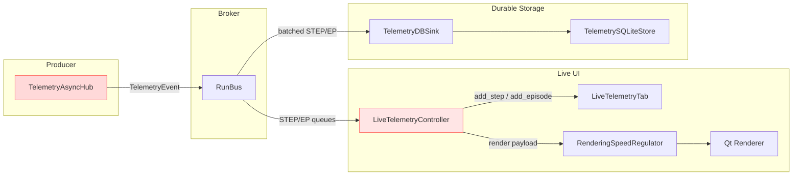
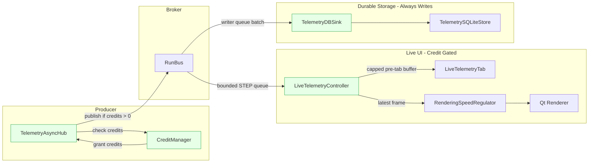
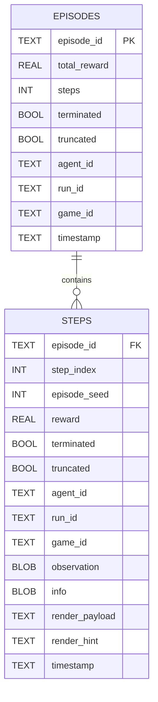

# Day 14 — Telemetry Reliability Remediation Plan

## TL;DR

- Wrap up the unfinished credit/backpressure plumbing, tame noisy logging, and keep UI handoff buffers bounded.
- The infrastructure for fast UI + durable SQLite is solid; the remaining work is wiring and guard rails around edge cases.

## Problems Observed (grounded in code)

- **Credit system is never enforced.** `consume_credit()` is never called, so the supposed flow control never throttles producers `gym_gui/telemetry/credit_manager.py:77` and `gym_gui/services/trainer/streams.py:505`.  
- **Telemetry logs fire at `ERROR` for routine events.** Normal step ingestion emits `logger.error` in both the service and storage layers, producing noisy logs and hiding real faults `gym_gui/services/telemetry.py:47`, `gym_gui/telemetry/sqlite_store.py:286`.  
- **Unbounded pre-tab buffers.** If UI tabs never materialise, `self._step_buffer[key]` / `self._episode_buffer[key]` grow without limit (`list` without a cap) `gym_gui/controllers/live_telemetry_controllers.py:458`. That leaks memory when remote agents never open a tab.  
- **Rendering regulator drops payloads silently when not running.** Early `submit_payload` calls before `start()` are ignored `gym_gui/telemetry/rendering_speed_regulator.py:100`; we need a hand-over queue or explicit warn path for first payloads.

## Action Plan

| Priority | Task | Owner | Notes |
| --- | --- | --- | --- |
| P0 | Wire credit consumption before RunBus publish (drop/pause UI path when no credits) | Telemetry | Guard with control-topic feedback so DB sink keeps writing |
| P1 | Downgrade routine log levels (service/store) + add structured context for true failures | Telemetry | Keeps dashboards usable and alerts meaningful |
| P1 | Add size caps to pre-tab buffers + counter metrics for dropped buffered events | UI | Follow same policy as regulator queue (drop oldest) |
| P2 | Buffer-first render payloads until regulator starts (or auto-start from ctor) | UI | Ensures first frames show even if regulator timer lags |
| P2 | Extend tests to cover credit-consumption path & buffer caps | QA | Update `gym_gui/tests/test_phase3_bus_writer_split.py` or add new cases |

### Current Flow (Issues Highlighted)

### Target Flow (With Credit Gating)

## Implementation Notes

1. **Credit Enforcement**
   - Introduce a lightweight guard in `TelemetryAsyncHub._drain_loop` to call `credit_mgr.consume_credit()` before publishing to RunBus `gym_gui/services/trainer/streams.py:528`.  
   - When credits run out, emit a `Topic.CONTROL` message so the UI can resume once it grants credits.

2. **Logging Hygiene**
   - Replace `[TELEMETRY]` and `[DB_FLUSH]` log statements with `logger.info` / `logger.debug`, and reserve `logger.error` for exception paths `gym_gui/services/telemetry.py:47`, `gym_gui/telemetry/sqlite_store.py:286`.

3. **Bounded Buffers**
   - Convert `self._step_buffer[key]` / `self._episode_buffer[key]` to `collections.deque(maxlen=...)`, mirroring the UI buffer defaults `gym_gui/controllers/live_telemetry_controllers.py:458`.

4. **Rendering Bootstrap**
   - Auto-start `RenderingSpeedRegulator` inside its constructor or queue submissions until started `gym_gui/telemetry/rendering_speed_regulator.py:61`.

5. **Validation Tests**
   - Extend existing RunBus + DB split tests to cover the new credit gating and buffer caps `gym_gui/tests/test_phase3_bus_writer_split.py:50`.

## File Impact Map (per problem)

| Problem | Current Hotspots (absolute path) | Likely Impacted Files When Fixing |
| --- | --- | --- |
| Credit enforcement absent | `/home/hamid/Desktop/Projects/GUI_BDI_RL/gym_gui/services/trainer/streams.py` (publish path), `/home/hamid/Desktop/Projects/GUI_BDI_RL/gym_gui/telemetry/credit_manager.py` (state) | `/home/hamid/Desktop/Projects/GUI_BDI_RL/gym_gui/services/trainer/streams.py`, `/home/hamid/Desktop/Projects/GUI_BDI_RL/gym_gui/controllers/live_telemetry_controllers.py` (credit grants), `/home/hamid/Desktop/Projects/GUI_BDI_RL/gym_gui/telemetry/run_bus.py` (CONTROL topic handling) |
| Noisy telemetry logging | `/home/hamid/Desktop/Projects/GUI_BDI_RL/gym_gui/services/telemetry.py` (`record_step`), `/home/hamid/Desktop/Projects/GUI_BDI_RL/gym_gui/telemetry/sqlite_store.py` (`_flush_steps`) | Same files plus `/home/hamid/Desktop/Projects/GUI_BDI_RL/gym_gui/telemetry/db_sink.py` if we add structured logging around batches |
| Unbounded pre-tab buffers | `/home/hamid/Desktop/Projects/GUI_BDI_RL/gym_gui/controllers/live_telemetry_controllers.py` (`_step_buffer`, `_episode_buffer`) | `/home/hamid/Desktop/Projects/GUI_BDI_RL/gym_gui/controllers/live_telemetry_controllers.py`, `/home/hamid/Desktop/Projects/GUI_BDI_RL/gym_gui/ui/widgets/live_telemetry_tab.py` (overflow messaging) |
| Rendering regulator drops early payloads | `/home/hamid/Desktop/Projects/GUI_BDI_RL/gym_gui/telemetry/rendering_speed_regulator.py` (`submit_payload`), `/home/hamid/Desktop/Projects/GUI_BDI_RL/gym_gui/ui/widgets/live_telemetry_tab.py` (regulator wiring) | `/home/hamid/Desktop/Projects/GUI_BDI_RL/gym_gui/telemetry/rendering_speed_regulator.py`, `/home/hamid/Desktop/Projects/GUI_BDI_RL/gym_gui/ui/widgets/live_telemetry_tab.py` |

## Field Reference (Worker → Proto → In-Process)

| Stage | Structure & Source | Key Fields |
| --- | --- | --- |
| **Worker JSONL Step** | `TelemetryEmitter.step()` `spade_bdi_rl/core/telemetry_worker.py:28` + call site `spade_bdi_rl/core/runtime.py:169` | `type`, `ts`, `ts_unix_ns`, `run_id`, `episode` (display), `episode_index` (0-based), `step_index`, `agent_id`, `action`, `reward`, `terminated`, `truncated`, `state`, `next_state`, `observation`, `next_observation`, `q_before`, `q_after`, `epsilon`, `render_payload`, `episode_seed` |
| **Worker JSONL Episode** | `TelemetryEmitter.episode()` `spade_bdi_rl/core/telemetry_worker.py:52` + runtime emission `spade_bdi_rl/core/runtime.py:99` | `type`, `ts`, `ts_unix_ns`, `run_id`, `episode`, `episode_index`, `agent_id`, `reward`, `steps`, `success`, `metadata_json` (seed, episode_seed, policy, control mode, game_id, etc.) |
| **Trainer Proto Step** | `RunStep` `gym_gui/services/trainer/proto/trainer.proto:85` | `run_id`, `episode_index`, `step_index`, `action_json`, `observation_json`, `reward`, `terminated`, `truncated`, `timestamp`, `policy_label`, `backend`, `seq_id`, `agent_id`, `render_hint_json`, `frame_ref`, `payload_version`, `render_payload_json`, `episode_seed` |
| **Trainer Proto Episode** | `RunEpisode` `gym_gui/services/trainer/proto/trainer.proto:112` | `run_id`, `episode_index`, `total_reward`, `steps`, `terminated`, `truncated`, `metadata_json`, `timestamp`, `seq_id`, `agent_id` |
| **TelemetryEvent Payload** | `TelemetryEvent` envelope `gym_gui/telemetry/events.py:25` constructed in `TelemetryAsyncHub._drain_loop` `gym_gui/services/trainer/streams.py:528` | `topic` (`Topic.STEP_APPENDED` / `Topic.EPISODE_FINALIZED`), `run_id`, `agent_id`, `seq_id`, `ts_iso`, `payload` (dict produced from proto via `MessageToDict`, includes `render_payload_json`, `metadata_json`, `episode_seed`, etc.) |
| **In-Process Data Model** | `StepRecord` / `EpisodeRollup` used by services + SQLite `gym_gui/core/data_model/telemetry_core.py:14` | Step: `episode_id`, `step_index`, `action`, `observation`, `reward`, `terminated`, `truncated`, `info`, `timestamp`, `render_payload`, `agent_id`, `render_hint`, `frame_ref`, `payload_version`, `run_id`. Episode: `episode_id`, `total_reward`, `steps`, `terminated`, `truncated`, `metadata`, `timestamp`, `agent_id`, `run_id`, `game_id`. |
| **SQLite Schema** | `TelemetrySQLiteStore._initialize()` `gym_gui/telemetry/sqlite_store.py:68` | `steps` table columns: `episode_id`, `step_index`, `action`, `observation`, `reward`, `terminated`, `truncated`, `info`, `render_payload`, `timestamp`, `agent_id`, `render_hint`, `frame_ref`, `payload_version`, `run_id`, `game_id`, `episode_seed`. `episodes` table columns: `episode_id`, `total_reward`, `steps`, `terminated`, `truncated`, `metadata`, `timestamp`, `agent_id`, `run_id`, `game_id`. |

### Clues for Investigation

- Worker emits **display** episode numbers (`episode = seed + episode_index`) but also includes `episode_index` and `episode_seed`; ensure UI tables use the correct one `spade_bdi_rl/core/runtime.py:232`.
- Worker serialises metadata to JSON lazily; trainer proto expects `metadata_json` string, so ensure consumers parse both dict/string cases `gym_gui/telemetry/db_sink.py:216`.
- Render payloads arrive under `render_payload_json` in the proto; `TelemetryAsyncHub` copies that into the event payload, and the UI regulator uses the resulting dict directly `gym_gui/services/trainer/streams.py:528`, `gym_gui/ui/widgets/live_telemetry_tab.py:240`.

### Sample Payloads

- Worker step JSON (see `docs/1.0_DAY_14/SAMPLE_WORKER_STEP.json`) shows the emitter’s output with display `episode`, zero-based `episode_index`, Q-learning diagnostics, and render payload dictionary `spade_bdi_rl/core/runtime.py:169`.
- Worker episode JSON (see `docs/1.0_DAY_14/SAMPLE_WORKER_EPISODE.json`) highlights the metadata fields that are later serialized into `metadata_json` for protobuf ingestion `spade_bdi_rl/core/runtime.py:99`.
- `step_delay` (seconds) is editable on the agent train form and surfaces in `RunConfig.step_delay`; the runtime sleeps that amount before emitting the next step, slowing telemetry at the source `spade_bdi_rl/core/config.py:49`, `spade_bdi_rl/core/runtime.py:201`.
- `TelemetryDBSink` tunables—`batch_size`, `checkpoint_interval`, `writer_queue_size`—shape WAL write behaviour: batches trade memory for fewer commits `gym_gui/telemetry/db_sink.py:39`, checkpoints keep WAL files from growing unbounded `gym_gui/telemetry/db_sink.py:318`, and the writer queue is sized larger than UI queues so persistence can absorb bursts without blocking `gym_gui/telemetry/db_sink.py:41`.
- `HealthMonitor` emits `RUN_HEARTBEAT` events every `heartbeat_interval` seconds to detect stalled runs (no new telemetry) and surface queue overflow stats `gym_gui/telemetry/health.py:49`; subscribers can raise alerts when heartbeats stop.
- `info` (per-step) and `metadata` (per-episode) carry adapter- or policy-specific details (e.g., policy label, backend, environment extras). They are persisted as JSON blobs so replay tools retain provenance even if schemas evolve `gym_gui/core/data_model/telemetry_core.py:14`, `gym_gui/services/trainer/service.py:478`.
- The “Info” column in **Telemetry Recent Steps** is a direct dump of `StepRecord.info`; table rendering pulls the dictionary straight from the payload so operators can inspect environment-returned diagnostics or policy annotations inline `gym_gui/ui/widgets/live_telemetry_tab.py:158`, `gym_gui/ui/widgets/live_telemetry_tab.py:339`.

## Mermaid EER Diagram (Telemetry DB)

### Next Steps

- Prioritise P0/P1 items for today’s implementation window.
- Draft unit/integration tests alongside credit gating changes.
- Schedule a quick telemetry smoke test once buffer caps + logging patches land.

## UI Throttling & Delay Controls

| Control Surface | Code Path | Effect |
| --- | --- | --- |
| **Agent step delay** (`step_delay` in train form) | `RunConfig.step_delay` `spade_bdi_rl/core/config.py:49`; applied in runtime loop `spade_bdi_rl/core/runtime.py:201` | Pauses the worker after every environment step, slowing telemetry emission at the source. |
| **Render throttle interval** (render every Nth step) | Setter `set_render_throttle_interval()` `gym_gui/ui/widgets/live_telemetry_tab.py:197` | UI only schedules table/UI renders every N steps while still recording all events. |
| **Rendering delay slider** (ms) | Regulator `set_render_delay()` `gym_gui/telemetry/rendering_speed_regulator.py:120` | Adjusts QTimer cadence (e.g., 100 ms ≈ 10 FPS) for the live grid without affecting tables. |
| **Credit grants from tabs** | `grant_credits(run_id, agent_id, amount)` `gym_gui/controllers/live_telemetry_controllers.py:248` | UI replenishes credits when ready; once consumption is wired, this backs pressure on the producer while DB writes continue. |
| **DB sink batching knobs** | `TelemetryDBSink(batch_size, checkpoint_interval, writer_queue_size)` `gym_gui/telemetry/db_sink.py:34` | Balance write throughput with durability: larger batches reduce commits, checkpoint interval trims WAL, oversized writer queues absorb spikes without dropping pre-DB. |
| **Heartbeat cadence** | `HealthMonitor(heartbeat_interval)` `gym_gui/telemetry/health.py:49` | Periodic `RUN_HEARTBEAT` keeps the run marked active and raises alarms if telemetry stops flowing for >3× interval. |
| **Per-step info map** | `StepRecord.info` `gym_gui/core/data_model/telemetry_core.py:14` | Free-form key/value map for adapter or policy annotations (e.g., policy label, backend, environment flags); stored as JSON in SQLite for replay fidelity. |
| **Per-episode metadata** | `EpisodeRollup.metadata` `gym_gui/core/data_model/telemetry_core.py:36` | Aggregated run details (control mode, seeds, success flags) that travel from the worker’s `metadata_json` to UI tables and storage. |
| **Actor selection** | Actors registered at bootstrap (`actors.register_actor(...)`) `gym_gui/services/bootstrap.py:28`; runtime selection via forms `gym_gui/services/actor.py:86` | UI chooses which actor to route actions through (human keyboard, BDI agent, LLM stub). The actor produces actions; the SPADE-BDI worker executes them during training `spade_bdi_rl/core/runtime.py:169`. |

Together these controls let ops balance learning speed with observability: increase `step_delay` or regulator delay for demos, dial them down for faster training, and rely on credit gating to prevent UI backlogs.

## Agent Train Form Controls (UX Quick Reference)

| Control | Code Path | Behaviour / Notes |
| --- | --- | --- |
| **Telemetry Throttle** (value > 1 skips telemetry) | Slider + warning label `gym_gui/ui/widgets/agent_train_form.py:136` | Multiplier that intentionally drops telemetry records for high-speed experiments. Currently only captured in the submitted config payload (`training_telemetry_throttle`); runtime enforcement is a known gap to wire into the worker pipeline. |
| **UI Rendering Throttle** (value > 1 skips frames) | `_on_ui_rendering_throttle_changed()` `gym_gui/ui/widgets/agent_train_form.py:164` | Reduces how often the live tab renders frames (especially useful for resource-constrained machines). |
| **Render Delay** (“Controls visual grid update speed”) | `_render_delay_slider` `gym_gui/ui/widgets/agent_train_form.py:172` | Directly feeds the regulator’s delay; slider shows the resulting FPS (e.g., 100 ms ≈ 10 FPS). |
| **Step Delay (ms)** (“0 ms will make training too fast”) | `_ui_training_speed_slider` `gym_gui/ui/widgets/agent_train_form.py:187` | Sets `RunConfig.step_delay` so the worker sleeps before each step `spade_bdi_rl/core/runtime.py:201`. |
| **Telemetry Buffer Size (steps)** | `_telemetry_buffer_spin` `gym_gui/ui/widgets/agent_train_form.py:232` | Caps how many recent steps the UI keeps in memory (default 512). |
| **Episode Buffer Size** | `_episode_buffer_spin` `gym_gui/ui/widgets/agent_train_form.py:249` | Similar cap for completed episodes (default 100). |

### Why DB Sink knobs stay hard-coded

`batch_size`, `checkpoint_interval`, and `writer_queue_size` are tuned in `bootstrap_default_services()` `gym_gui/services/bootstrap.py:88` for WAL safety and tested throughput. Surfacing them on the form risks misconfiguration (e.g., tiny batches spiking disk I/O, giant queues exhausting RAM). If operators need overrides, prefer environment flags or a dedicated ops config file with guard rails.

| Backend Tuning | Notes |
| --- | --- |
| `batch_size` | Batches more events per disk commit, reducing transaction overhead. Hard-coded at 128 in bootstrap `gym_gui/services/bootstrap.py:100` after profiling typical workloads. |
| `checkpoint_interval` | Calls `sqlite3` WAL checkpoint every _N_ writes (default 1024) to keep WAL files manageable `gym_gui/telemetry/db_sink.py:318`. |
| `writer_queue_size` | RunBus queue depth for the DB sink (4096) lets persistence absorb bursty telemetry without blocking producers `gym_gui/services/bootstrap.py:105`. |

### Heartbeat interval rationale

`heartbeat_interval=5.0` was chosen as a compromise between responsiveness and overhead: frequent enough to detect stalled runs quickly (health monitor flags anything idle for 3× interval) but infrequent enough to avoid log spam and unnecessary UI updates `gym_gui/telemetry/health.py:49`. Adjustable via service wiring if future deployments require tighter SLAs.

### Actor selection flow (grounded)

- The actor list the user sees comes from `ActorService.describe_actors()`; actors are registered during bootstrap `gym_gui/services/bootstrap.py:28`, and the UI lets the operator pick one before launching a run.
- `ActorService.set_active_actor()` stores the pick; subsequent calls to `select_action()` and `notify_step()` route through the selected actor implementation `gym_gui/services/actor.py:86`.
- During SPADE-BDI training the runtime queries its configured agent (`self.runtime.get_action(...)`) before emitting telemetry `spade_bdi_rl/core/runtime.py:180`, so the chosen actor directly influences the worker loop. The BDI agent itself uses deterministic Q-table lookups mixed with `numpy.random` exploration (`spade_bdi_rl/algorithms/qlearning.py:25`), not ad-hoc randomness in the GUI layer.
