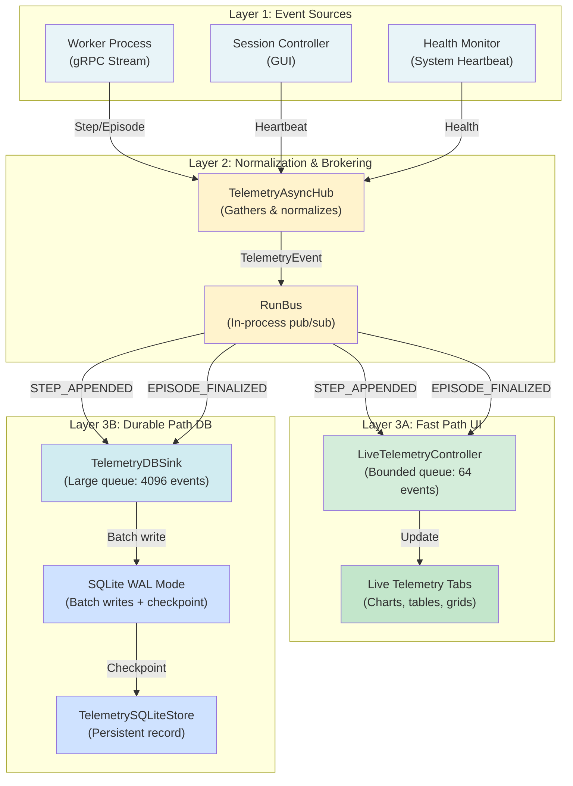
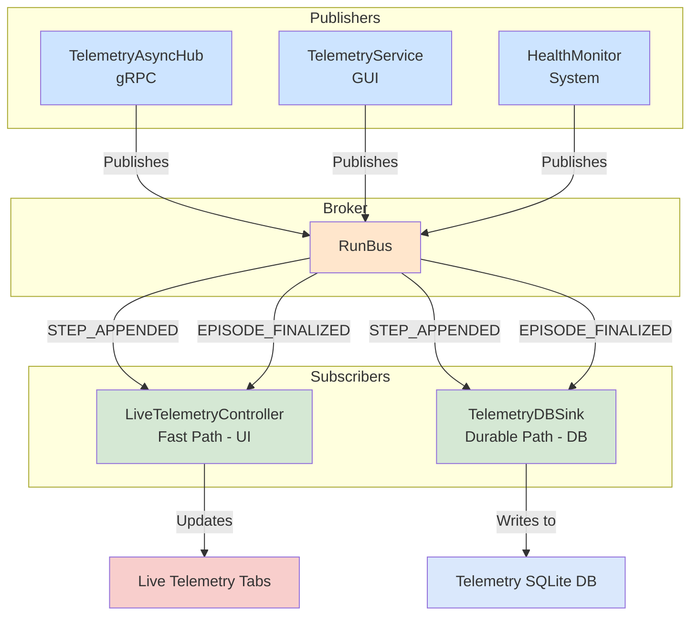
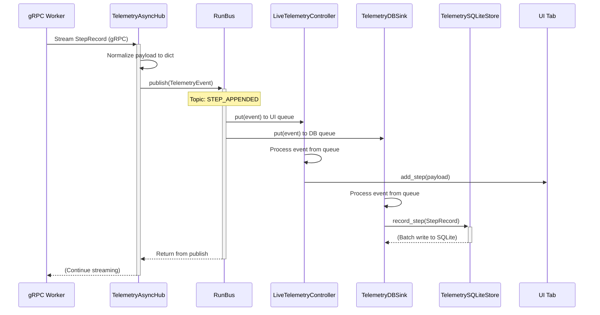
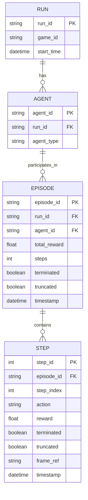

# Telemetry System Architecture

This document outlines the architecture of the in-process telemetry system, which is designed for high-performance, decoupled event handling within the application. The system is built around a central `RunBus`, a dual-path processing model (fast and durable), and a clear separation of concerns between event producers and consumers.

---

## 0. What is Telemetry and Why Do We Need It?

### What is Telemetry?

**Telemetry** is the automated collection, transmission, and recording of data from remote or distributed systems. In the context of this application, telemetry refers to the continuous stream of events generated during training runs—capturing every step an agent takes, every episode it completes, rewards earned, environment observations, actions selected, and diagnostic metadata.

Think of telemetry as the **"flight data recorder"** (black box) of your training pipeline. Just as an airplane records altitude, speed, engine parameters, and pilot actions for crash investigation and performance analysis, our telemetry system records:

- **Per-step data**: action taken, observation received, reward earned, next state
- **Per-episode data**: total reward, number of steps, success/failure status
- **Diagnostic data**: policy annotations, backend information, control mode, training configuration
- **System data**: frame references, render payloads, timing information

### Why Do We Need Telemetry Here?

#### 1. Live Observability During Training

**Problem**: Long-running RL training can take hours or days. Without telemetry, the operator is blind—they can't see if the agent is learning or stuck.

**Solution**: Real-time telemetry feeds the UI with live charts, grids, and statistics so operators can monitor progress, detect anomalies, and pause/adjust mid-training.

#### 2. Permanent Record for Reproducibility

**Problem**: If we only render data to the screen, it's lost when the training completes. We can't replay or analyze what happened.

**Solution**: Telemetry is persisted to SQLite, creating a complete historical record. Later, tools can replay episodes, inspect policy decisions frame-by-frame, and debug failures.

#### 3. Decoupling of Concerns

**Problem**: If the UI is slow, should training block? If the database is full, should telemetry stop?

**Solution**: Telemetry events flow through a pub/sub broker (RunBus) that decouples:

- **Fast path** (UI rendering) — drops old events if UI can't keep up, prioritizing responsiveness
- **Durable path** (database) — buffers events and writes them durably, ensuring no data loss

#### 4. Multi-Agent & Multi-Run Scenarios

**Problem**: In a single training session, multiple agents may run in parallel, each generating thousands of events per second.

**Solution**: Telemetry tags every event with `run_id` and `agent_id`, enabling the system to multiplex events from many sources, route them to the correct UI tab, and store them in a unified database schema.

#### 5. Debugging & Performance Analysis

**Problem**: If training suddenly stalls, crashes, or produces unexpected results, what went wrong?

**Solution**: Telemetry provides sequence numbers, timestamps, metadata, and render payloads that let developers:

- Identify gaps in the event stream (dropped/out-of-order events)
- Correlate telemetry events with logs (via correlation IDs)
- Extract frame sequences for visual debugging
- Measure step latency and identify bottlenecks

#### 6. Credit-Based Backpressure

**Problem**: A worker can emit telemetry faster than the UI can render or the database can write. If we don't throttle, queues overflow and memory explodes.

**Solution**: Telemetry implements credit-based backpressure where the UI/database inform the producer how many events they can accept, and the producer pauses if credits run out (only affecting the fast path, never the durable write).

### Telemetry as a Service Layer

In our architecture, telemetry is **not** just logging or printing statistics. It's a **service layer** that:

1. **Ingests** events from multiple sources (workers, environment, policy)
2. **Normalizes** events to a common schema (TelemetryEvent envelope)
3. **Routes** events to subscribers (UI, database, analytics)
4. **Throttles** producers via credit-based backpressure
5. **Persists** all events to SQLite with deduplication and WAL safety
6. **Exposes** a query interface for replay and analysis

This design ensures that training, UI, and persistence operate independently while staying synchronized through the event stream.

### Conceptual View: Telemetry Layers

---

## 1. Core Components

The system comprises three main types of components:

- **Publishers**: Components that generate and send telemetry events to the `RunBus`.
- **RunBus**: The central in-process message broker that decouples publishers from subscribers.
- **Subscribers**: Components that listen for specific event topics on the `RunBus` and process them.

### Component Diagram

The following diagram illustrates the relationships between the major components of the telemetry system.

## 2. Data Flow and Event Model

The entire system is event-driven, with all communication happening through the `RunBus`.

### Event Structure

All events are wrapped in a `TelemetryEvent` dataclass, which provides a standardized envelope with the following key fields:

- `topic`: A `Topic` enum (e.g., `STEP_APPENDED`, `EPISODE_FINALIZED`, `RUN_STARTED`).
- `run_id`: The unique identifier for the training run.
- `agent_id`: The identifier for the agent that generated the event.
- `seq_id`: A monotonically increasing sequence number for ordering and gap detection.
- `ts_iso`: An ISO 8601 timestamp.
- `payload`: A dictionary containing the actual event data (e.g., a `StepRecord` or `EpisodeRollup`).

This structure is defined in `gym_gui/telemetry/events.py`.

### Data Models

The core data payloads are defined as dataclasses in `gym_gui/core/data_model/telemetry_core.py`:

- `StepRecord`: Contains detailed information about a single step in an episode, including observation, action, reward, and agent ID.
- `EpisodeRollup`: Contains summary information for a completed episode, such as total reward and step count.

### Sequence Diagram: `STEP_APPENDED` Event

The following sequence diagram illustrates the journey of a single `STEP_APPENDED` event through the system.

## 3. Dual-Path Architecture

A key design feature is the dual-path architecture for event processing, which separates the concerns of live rendering (fast path) from durable storage (durable path).

### Fast Path: Live UI Rendering

- **Subscriber**: `LiveTelemetryController` (`gym_gui/controllers/live_telemetry_controllers.py`)
- **Queue Size**: Small (e.g., 64 events) to prioritize responsiveness and drop events if the UI falls behind.
- **Purpose**: To provide immediate visual feedback to the user. It processes events and updates the corresponding `LiveTelemetryTab` widgets. Throttling and sampling can be applied at this layer to manage rendering load without affecting the durable data record.

### Durable Path: Database Persistence

- **Subscriber**: `TelemetryDBSink` (`gym_gui/telemetry/db_sink.py`)
- **Queue Size**: Large (e.g., 512 events) to buffer against write spikes and ensure no data is lost.
- **Purpose**: To guarantee that every single telemetry event is persisted to the SQLite database for later analysis, replay, and auditing. It runs in a dedicated background thread and performs batched writes for efficiency.

This separation ensures that a slow or overloaded UI cannot cause data loss in the permanent record.

## 4. Database and Data Models

The durable storage is handled by `TelemetrySQLiteStore`, which manages the `telemetry.db` file.

### EER Diagram

This diagram shows the logical relationship between the core data entities and how they map to the database.

This architecture provides a robust, scalable, and decoupled system for handling telemetry data, ensuring both real-time visibility and data integrity.
