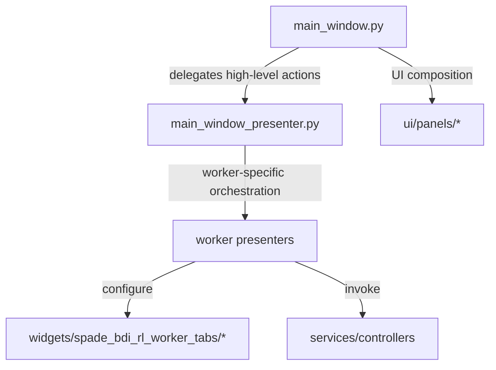
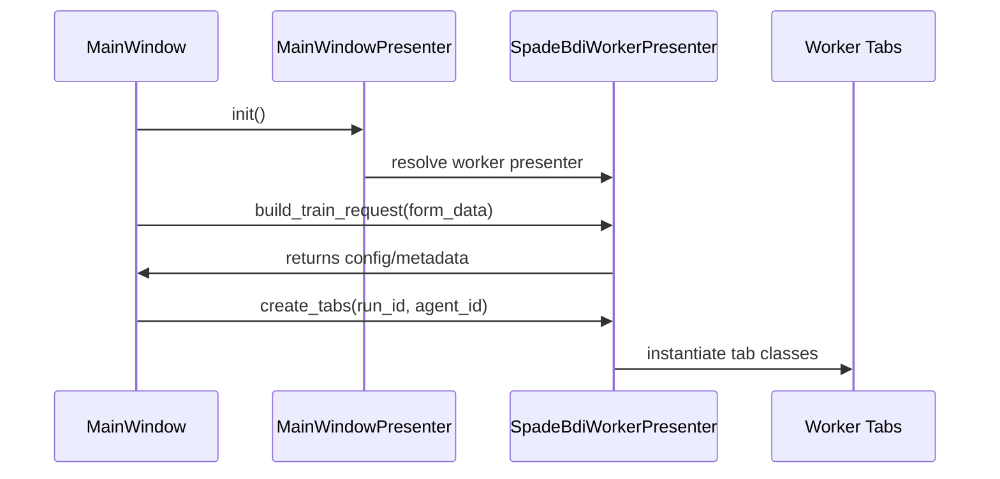
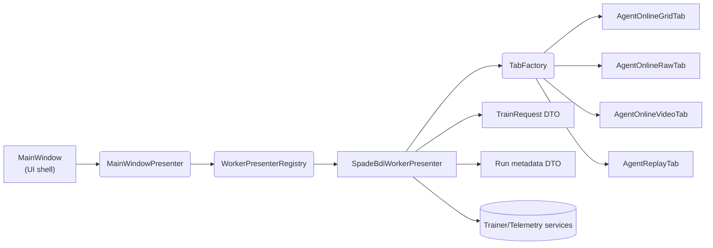
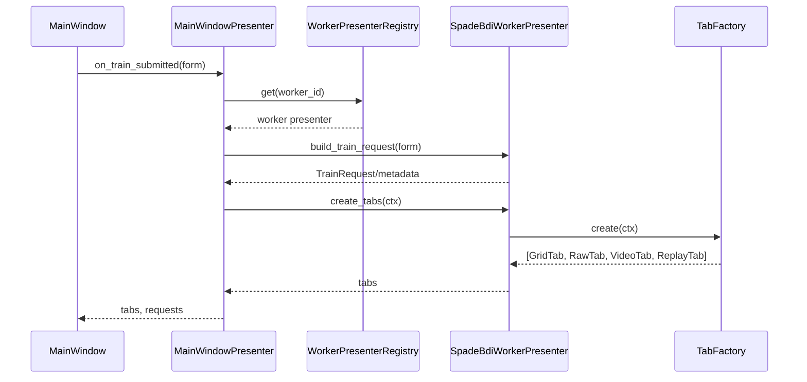

# Worker UI Organization & Scoping Plan

> Grounded analysis for `/home/hamid/Desktop/Projects/GUI_BDI_RL` (Qt UI layer, SPADE-BDI worker).

---

## 1. Current Layout Snapshot

### Widgets (`gym_gui/ui/widgets`)
- `agent_online_grid_tab.py`, `agent_online_raw_tab.py`, `agent_online_video_tab.py`, `agent_online_tab.py`, `agent_replay_tab.py`
  - All contain SPADE-BDI specific UI logic (rendering, stats, metadata) but sit at the top level of the widgets package.

### Panels (`gym_gui/ui/panels`)
- `control_panel_container.py`, `telemetry_container.py`, `info_log_container.py`
  - Created to move bulky UI code out of `main_window.py`. Each panel wraps a logical chunk of the main window.

### Main Window
- `/home/hamid/Desktop/Projects/GUI_BDI_RL/gym_gui/ui/main_window.py`
  - Still holds worker-specific helpers (e.g., `worker_config`, `metadata_payload`) and imports every agent tab class directly.

### Presenter
- `/home/hamid/Desktop/Projects/GUI_BDI_RL/gym_gui/ui/presenters/main_window_presenter.py`
  - Light shim today; opportunity to push more orchestration here.

### Utilities
- `/home/hamid/Desktop/Projects/GUI_BDI_RL/gym_gui/utils/` (e.g., `seeding.py`)
  - Generic helpers; risk of becoming a dumping ground if worker-specific helpers move here.

---

## 2. Target Structure for Worker-Specific UI

```text
/ gym_gui
  / ui
    / widgets
      / spade_bdi_rl_worker_tabs
        agent_online_grid_tab.py
        agent_online_raw_tab.py
        agent_online_video_tab.py
        agent_online_tab.py
        agent_replay_tab.py
      / <future worker folders>
```

**Benefits**
- Clear ownership: every worker gets its own UI namespace.
- Reduced coupling: main window imports one package instead of individual tabs.
- Easier onboarding: convention is obvious for new worker integrations.

**Implementation Notes**
- Provide `__all__` exports inside the worker package to expose shorthand imports if desired.
- Add `widgets/spade_bdi_rl_worker_tabs/__init__.py` with re-exports (`from .agent_online_grid_tab import AgentOnlineGridTab`) to maintain compatibility.

---

## 3. Separation of Concern Improvements



### Current Issues
1. **Worker config/metadata**: `_build_worker_config` and `_metadata_payload` live in `main_window.py`, mixing orchestration with UI.
2. **Panel usage**: Panels currently wrap UI elements but do not mediate interactions; future worker logic could creep in if not careful.
3. **Presenter underutilised**: `MainWindowPresenter` is a thin shim; little logic is delegated to it.

### Proposed Changes
- **Dedicated worker presenter:** Create `ui/presenters/workers/spade_bdi_rl_worker_presenter.py`. Responsibilities:
  - Compose worker config (`RunConfig`), metadata payloads, and tab creation logic.
  - Provide a minimal interface (`build_train_request`, `extract_metadata`, `create_tabs_for_run`).
- **Main window as coordinator:**
  - Keeps responsibility: host Qt widgets, route signals, request data from presenter.
  - Loses responsibility: constructing worker-specific payloads or wiring tabs manually.
- **Panels stay lean:**
  - Accept dependencies via constructor (e.g., presenter callbacks) instead of pulling from the main window directly.
  - Avoid business logic; focus on layout and signal forwarding.
- **Service locator integration:** Worker presenter resolves needed services (Telemetry, Trainer) rather than the main window knowing per-worker details.

**Result**
- Less boilerplate in main window; worker presenter becomes the single point of change when worker behaviour evolves.
- Allows additional presenters (`huggingface_worker_presenter.py`, etc.) to slot in with minimal churn.

---

## 4. Naming & Packaging Standards

| Artifact | Convention | Rationale |
| --- | --- | --- |
| Worker widget package | `widgets/<worker_id>_worker_tabs` | Makes worker ownership explicit. |
| Worker presenter module | `ui/presenters/workers/<worker_id>_presenter.py` | Groups worker orchestration logic. |
| Base/tab classes | PascalCase (`AgentOnlineGridTab`) | Already followed; keep consistent. |
| Generic utilities | Stay in `gym_gui/utils` | Worker-specific helpers belong under worker-specific packages (e.g., `spade_bdi_rl/utils`). |
| Config/data payloads | Move to presenters/services | `main_window.py` should call a presenter or service to obtain worker configs. |

---

## 5. Migration Plan (Detailed)

1. **Create worker tab package**
   - Path: `/home/hamid/Desktop/Projects/GUI_BDI_RL/gym_gui/ui/widgets/spade_bdi_rl_worker_tabs/`
   - Move existing tab modules into the package; add `__init__.py` with re-exports.
2. **Update imports**
   - Replace direct module imports in `/home/hamid/Desktop/Projects/GUI_BDI_RL/gym_gui/ui/main_window.py` and `/home/hamid/Desktop/Projects/GUI_BDI_RL/gym_gui/ui/widgets/render_tabs.py` (if any) with package imports.
3. **Introduce worker presenter**
   - Create `/home/hamid/Desktop/Projects/GUI_BDI_RL/gym_gui/ui/presenters/workers/spade_bdi_rl_worker_presenter.py`.
   - Move methods: `_build_worker_config`, `_metadata_payload`, tab assembly helpers.
4. **Refactor main window**
   - Inject the worker presenter via `MainWindowPresenter` or service locator.
   - Main window asks presenter for worker configs/tabs instead of building them inline.
5. **Panel adjustments**
   - Panels receive callbacks/data from presenter instead of reading main_window internals.
6. **Utilities audit**
   - Confirm `gym_gui/utils/seeding.py` is generic. If SPADE-specific, move to `spade_bdi_rl/utils/seeding.py` or similar.
7. **Documentation**
   - Update developer documentation/README to describe the convention.



---

## 6. Best Practices / Guardrails

- **Dependency injection:** presenters should receive dependencies (services) explicitly; avoid reaching into service locator scattered across UI code.
- **Minimal public surface:** worker presenters expose clear methods (`build_train_request`, `on_run_selected`, etc.) so main window remains thin.
- **Testing:** presenter logic can be unit-tested independently (no Qt). Tabs remain responsible solely for rendering.
- **Future workers:** new worker presenter + tab package replicates the pattern; main window only needs a registry of available worker presenters.

---

## 7. Risks & Mitigations

| Risk | Mitigation |
| --- | --- |
| Import breakage during move | Introduce re-export stubs in old locations temporarily; run static analysis (mypy, pylint) and tests. |
| Presenter duplicating logic | Share base classes or mixins if presenters need common behaviour; avoid copy/paste. |
| Panels creeping back into business logic | Review PRs to ensure panels only handle layout/property binding. |
| `gym_gui/utils` becoming junk drawer | Establish rule: only generic helpers belong there; worker-specific utilities live under worker packages. |

---

## 8. Final Recommendation

Proceed incrementally:
1. Move SPADE-BDI tabs into `widgets/spade_bdi_rl_worker_tabs`.
2. Extract worker-specific logic into `SpadeBdiWorkerPresenter`.
3. Ensure main window delegates config/metadata/tab creation to presenter.
4. Keep panels/layout slim; rely on presenter callbacks.
5. Document the pattern for future workers.

This refactor consolidates SPADE-BDI UI, clarifies separation of concerns, reduces duplicate wiring in the main window, and sets a repeatable blueprint for other worker integrations.


---

## Contrarian Review (what I’d tweak)

1. **Avoid speculative DTO/DAO layers until a real boundary needs them.** The current code has no external API surface beyond the trainer gRPC and SQLite store; introducing a full DTO/DAO stack everywhere invites ceremony and maintenance overhead (`gym_gui/telemetry/db_sink.py`, `gym_gui/services/trainer/streams.py`). Per Microsoft’s DTO guidance, treat DTOs as simple property bags at the boundary—define a tiny `api/v1` model (StepDTO, EpisodeDTO) only for the public surface and keep internals on `StepRecord`/`EpisodeRollup`. InfoQ’s YAGNI reminder applies: wait for a second client/version before abstracting the whole codebase.

2. **Finish the dependency direction after the widget move.** Relocating SPADE tabs into `/ui/widgets/spade_bdi_rl_worker_tabs` is solid, but ensure `main_window.py` stays agnostic by routing everything through a `WorkerPresenter` protocol. Sketch:

```python
class WorkerPresenter(Protocol):
    id: str
    def build_train_request(self, form: TrainFormData) -> TrainRequest: ...
    def create_tabs(self, run_id: str, agent_id: str) -> list[QWidget]: ...
```

Register presenters via a small registry so the main window just asks for “tabs for worker X” (no import soup). This keeps the flow consistent with the existing `MainWindowPresenter` and makes future workers pluggable.

3. **Keep backpressure simple and visible.** The credit idea lines up with Reactive Streams backpressure: the consumer dictates pace. Implement the guard right before `RunBus.publish()` (`gym_gui/services/trainer/streams.py:528`), drop the event when credits are exhausted, and emit a CONTROL message so the UI can grant more. Durable path (`TelemetryDBSink`) should bypass the credit gate so SQLite never misses writes.

4. **Prevent presenter sprawl.** Give the new worker presenter exactly three jobs: (a) build train requests/config from the form, (b) create worker-specific tabs, (c) translate metadata to the minimal DTO if/when you expose it. Rendering, signal wiring, table mutations stay inside widgets (`gym_gui/ui/widgets/spade_bdi_rl_worker_tabs/*`).

5. **Reduce boilerplate with factories/mixins.** Introduce a `TabFactory` returning the standard tab set and a `WorkerPresenterRegistry`. Leverage `BaseTelemetryTab` and mixins (copy-to-clipboard, overflow badges) to eliminate repetitive code across the grid/raw/video tabs. If a table grows complex, consider Qt’s model/view (`QAbstractTableModel`) to keep widget code lean.

6. **Centralize defaults and logging hygiene.** Store queue sizes/drop policy in one place (e.g., `telemetry/constants.py`) and provide a `BoundedDeque(maxlen, on_drop)` helper. Apply a single logging rule (DEBUG per-step, INFO per-episode, WARNING on drop, ERROR on exceptions) so you don’t need bespoke logging tweaks in every module.

If you follow these adjustments after the folder move, you’ll get the clarity you want—clear seams, minimal boilerplate, and room for future workers—without over-abstracting the current codebase.


---

## 9. Dependency Injection & Factory Blueprint

### Presenter/Factory Relationships



**Key contracts**
- `WorkerPresenterRegistry`: DI entry point. Accepts presenters via constructor or plugin discovery; returns presenter by `worker_id`.
- `TabFactory`: creates the canonical tab set for a worker run. Receives context (`run_id`, `agent_id`, `presenter`) and returns a list of widgets.
- `SpadeBdiWorkerPresenter`: orchestrates form data → `TrainRequest`, metadata mapping, tab creation via factory.
- `MainWindowPresenter`: wires main window events to the correct worker presenter.

### Example interfaces

```python
class WorkerPresenter(Protocol):
    id: str
    def build_train_request(self, form: TrainFormData) -> TrainRequest: ...
    def create_tabs(self, ctx: RunContext) -> list[QWidget]: ...
    def map_metadata(self, raw: dict[str, Any]) -> StepDTO: ...

@dataclass
class WorkerPresenterRegistry:
    presenters: dict[str, WorkerPresenter]
    def get(self, worker_id: str) -> WorkerPresenter: ...
```

With this shape, dependency injection is explicit: tests can register fake presenters, and additional workers register their presenter/factory without touching `MainWindow`.

---

## 10. Separation of Concerns Checklist

| Layer | Responsibilities | Must Not Do |
| --- | --- | --- |
| `MainWindow` | Owns Qt widgets, responds to user actions, forwards to presenter | Build worker configs, instantiate worker-specific tabs, talk directly to services |
| `MainWindowPresenter` | Mediates between view and worker presenters, holds registry | Contain worker-specific logic |
| `WorkerPresenter` | Build run/train requests, create worker tab set via factory, translate metadata | Manipulate Qt widgets directly, manage persistence |
| `TabFactory` | Instantiate tabs, apply shared mixins (copy, overflow, throttling) | Hold worker/business logic |
| `Panels` | Layout containers (control panel, telemetry, logs) | Build configs, call services |
| `Utilities` (`gym_gui/utils`) | Generic helpers (logging, formatting) | Worker-specific helpers |

**Guardrails**
- Introduce base mixins (`CopyableTableMixin`, `OverflowBannerMixin`) to share UI behaviour without copy-paste.
- Keep presenter factories ignorant of Qt specifics beyond returning widgets; UI tests can substitute fake tabs if needed.

---

## 11. Comprehensive Migration Timeline

1. **Foundations**
   - Create `widgets/spade_bdi_rl_worker_tabs/` package.
   - Move existing SPADE tabs; add `__init__.py` re-exporting tab classes for transitional imports.
2. **Dependency Injection setup**
   - Implement `WorkerPresenter` protocol, registry, and `TabFactory`.
   - Register `SpadeBdiWorkerPresenter` inside `main_window_presenter` (via constructor or service locator).
3. **Main window refactor**
   - Replace direct imports with `registry.get(worker_id).create_tabs(...)`.
   - Delegate train request/metadata building to presenter.
4. **Panel and utility audit**
   - Ensure panels accept callbacks/data via presenter (no direct service lookups).
   - Move worker-specific helpers from `gym_gui/utils` into `spade_bdi_rl/...` if they exist.
5. **Logging/constant centralisation**
   - Create `telemetry/constants.py` for queue sizes, max buffer lengths.
   - Provide `BoundedDeque` helper and enforce logging levels (DEBUG, INFO, WARNING, ERROR) globally.
6. **Backpressure gate**
   - Implement credit check before `RunBus.publish()`; emit CONTROL events on starvation; keep durable path unconditional.
7. **DTO v1 (minimal)**
   - Define `api/v1/models.py` with `StepDTO`, `EpisodeDTO`, and a small envelope. Only used at API/storage boundaries.



8. **Future workers**
   - Add new worker presenter + widget package. Register via registry (or plugin entry points if out-of-tree).
   - Reuse tab factory/mixins; override only what differs.

---

By codifying DI boundaries, embracing factories, and keeping DTO usage surgical, the UI remains modular, testable, and ready for additional workers without accruing ceremonial layers.


---

## Deep Dive: Contrarian Analysis

### Session Controller Reality Check
- `SessionController` is the real workhorse (`gym_gui/controllers/session.py`). It manages environment adapters, timers, seeds, telemetry, and emits signals. Worker presenters should **listen**, not replicate. Moving SPADE logic into presenters is safe as long as they orchestrate through existing signals (e.g., `session.session_initialized`, `step_processed`).
- `SessionSeedManager` and `SessionTimers` live in `gym_gui/utils`; relocating worker-specific helpers requires verifying that these truly are generic. If a helper is SPADE-only, move it under `spade_bdi_rl/utils` when detected.

### Panels & Presenter Workflow
- `control_panel_container.py`, `telemetry_container.py`, etc., are pure Qt layouts. That’s good—keep them ignorant of worker details. Panels should receive callbacks/cursors from presenters rather than direct service access.
- `MainWindowPresenter` today is thin (binds view, relays status messages). Before adding new layers, expand this presenter to coordinate with worker presenters via a registry. Avoid letting `MainWindow` talk directly to service locators—let the presenter do it.

### Dependency Injection Snapshot
- Service lookup currently happens in constructors (`SessionController` resolves `TelemetryService`, `ActorService`). This is hybrid DI—service locator pattern. The worker presenter can reuse the same locator or accept dependencies via constructor arguments supplied in bootstrap.
- For unit tests, provide presenters with mocked registry/factory instances.

### Factories Worth Building
- **TabFactory**: accepts a presenter/context and returns `[GridTab, RawTab, VideoTab, ReplayTab]`. Main window simply adds the returned widgets.
- **WorkerPresenterRegistry**: map `worker_id -> presenter`. During bootstrap, register the SPADE presenter. Future workers call `registry.register(worker_id, presenter)`. This keeps DI explicit.
- **WorkerFormFactory** (future): if different workers need different train forms, a factory can return the correct dialog/widget given a worker id.

### Avoiding Boilerplate Explosion
- Use mixins for repetitive tab features: `CopyableTableMixin`, `OverflowBannerMixin`, `ThrottleControlsMixin`. They already share code (e.g., copy-to-clipboard); make it explicit so new workers inherit behaviour.
- Configuration objects: define `RunContext`, `TrainFormData`, etc., as dataclasses to pass around strongly typed payloads instead of dicts.
- Logging: unify around one helper (maybe `telemetry/logging.py`) to set per-module log levels and prevent duplication.

### Risk Mitigation
- **Presenter creep**: keep worker presenters limited to orchestration. Give them the `SessionController` or a run-level service object, but they should not mutate widgets.
- **Service locator reliance**: future refactor could pass dependencies explicitly (constructor injection). For now, the presenter registering itself via locator keeps consistency with existing controllers.
- **Deep import surfaces**: when moving files, use re-export stubs (`from .spade_bdi_rl_worker_tabs import AgentOnlineGridTab`) temporarily to reduce breakages.


### Dependency Injection Nuggets (Pragmatic Additions)

- Define minimal Protocols (`TrainerClient`, `TelemetryHub`, `RunBus`, `TelemetryStore`) in `gym_gui/services/ports.py` mirroring existing concrete implementations (trainer service, async hub, run bus, sqlite store).
- Create a composition root `build_app_dependencies()` (e.g., in `gym_gui/services/bootstrap_di.py`) that instantiates real services and returns a dataclass `AppDeps(trainer, telemetry_hub, run_bus, store, logger)`.
- Inject dependencies via constructors:
  - `MainWindow(AppDeps)` caches the bundle and hands slices to `MainWindowPresenter`.
  - `MainWindowPresenter` takes `TrainerClient`, `TelemetryHub`, etc., so tests can pass fakes.
- Expose factory helpers (e.g., `TabFactory`, `WorkerPresenterRegistry`) that close over `AppDeps` and produce tab/presenter instances as needed.
- Keep Qt constraints in mind: create QObjects in the GUI thread; inject plain Python services into UI classes; rely on Qt queued connections for cross-thread signaling.
- This light DI keeps wiring explicit, enables worker swaps/testing, and avoids the Service Locator anti-pattern while staying container-free.


### Concrete Next Steps (Reiterated with detail)
1. **Create presenter registry** in `main_window_presenter.py`. Instantiated in MainWindow and provided to worker presenters.
2. **Implement `SpadeBdiWorkerPresenter`**: subscribes to `SessionController` signals, builds train requests (`build_train_request(form)`), creates tabs via TabFactory.
3. **Refactor `main_window.py`**: replace direct import usage with presenter calls (`presenter.create_tabs(RunContext(...))`). Move `_build_worker_config` and metadata functions to the worker presenter.
4. **Tab factory/mixins**: implement `TabFactory` to instantiate tabs with mixins. Migrate copy/paste/export logic into mixins to reduce duplicate code across grid/raw tabs.
5. **DTO edge**: define minimal API DTOs (`StepDTO`, `EpisodeDTO`) in `gym_gui/api/v1/models.py`. Mapping occurs inside worker presenter when publishing to external clients/storage. Internal code stays on `StepRecord`.
6. **Backpressure gate**: centralize credit logic in `TelemetryAsyncHub._drain_loop` (before `bus.publish(evt)`). Durable path ignores credit. Live path publishes CONTROL events to request credit (WYSIWYG: UI knows when it’s starving).

This keeps the refactor focused on extracting SPADE-specific wiring into manageable, testable components, while respecting existing controllers and signals.
