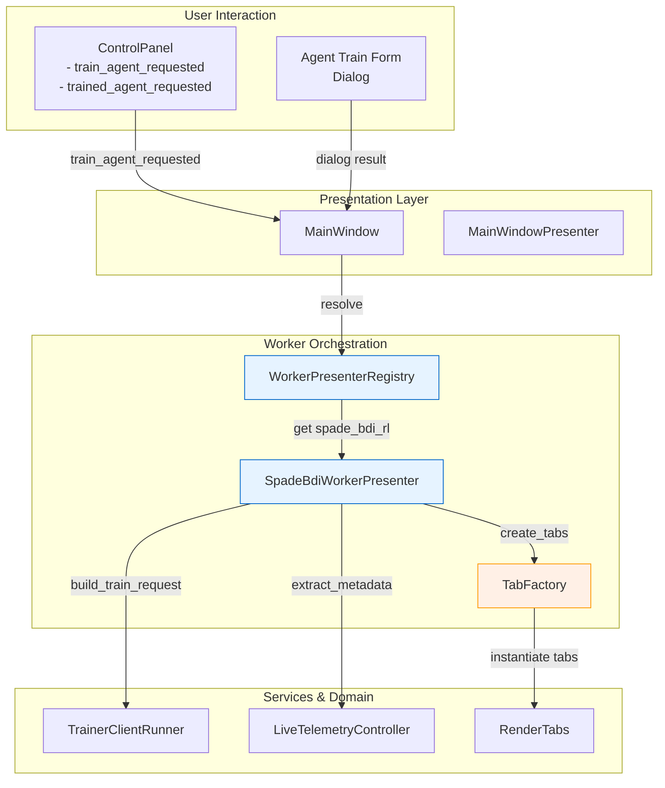
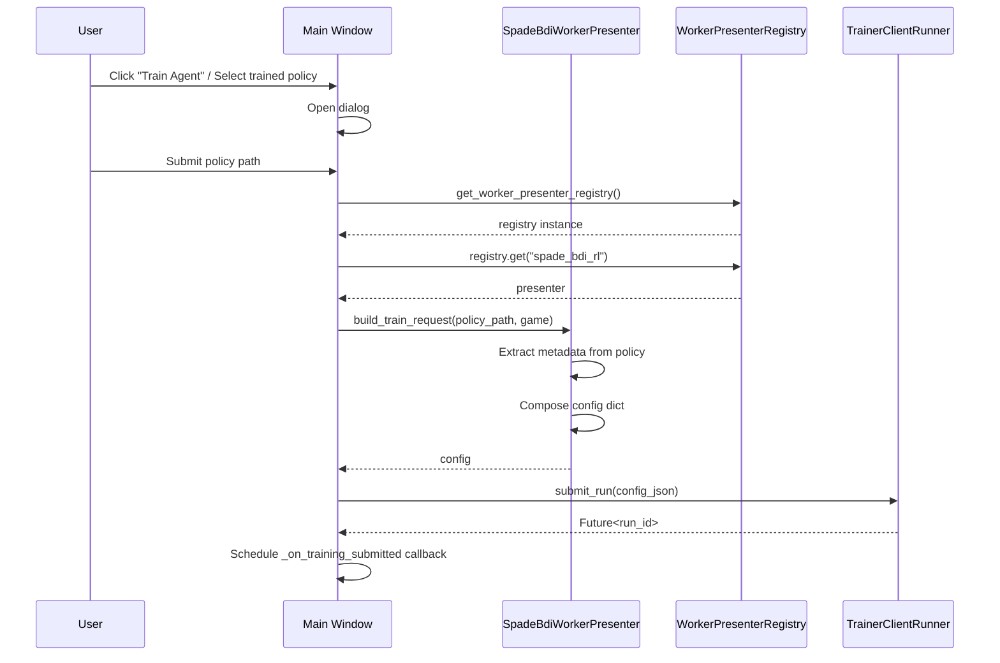
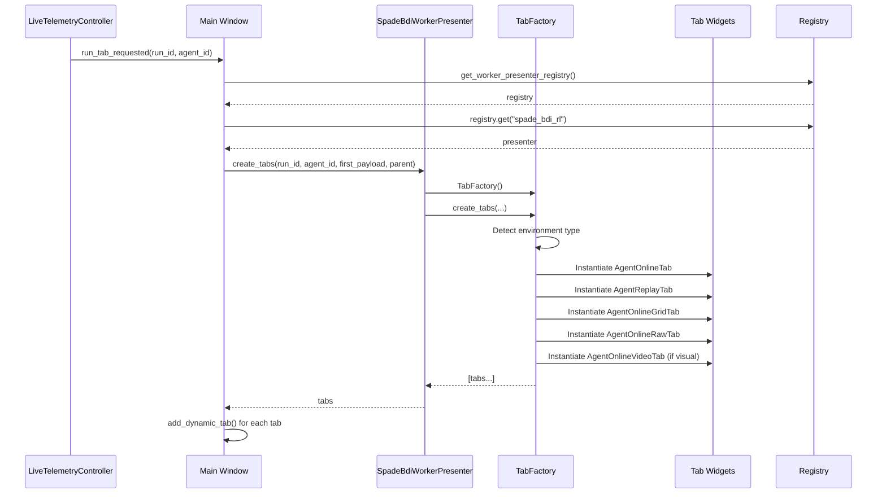

# Worker Presenter Architecture — Verification & Status

**Date**: October 24, 2025  
**Task**: Introduce WorkerPresenter abstraction, registry, and refactor MainWindow  
**Status**: ✅ **COMPLETE & TESTED**

---

## Overview

The WorkerPresenter architecture has been successfully implemented and integrated into the MainWindow. This document verifies the current state and outlines the implementation details.

### Key Components

1. **WorkerPresenter Protocol** (`gym_gui/ui/presenters/workers/registry.py`)
2. **WorkerPresenterRegistry** (`gym_gui/ui/presenters/workers/registry.py`)
3. **SpadeBdiWorkerPresenter** (`gym_gui/ui/presenters/workers/spade_bdi_rl_worker_presenter.py`)
4. **TabFactory** (`gym_gui/ui/widgets/spade_bdi_rl_worker_tabs/factory.py`)
5. **MainWindow Integration** (`gym_gui/ui/main_window.py`)

---

## Architecture Diagram



---

## 1. WorkerPresenter Protocol

**File**: `gym_gui/ui/presenters/workers/registry.py`

```python
@runtime_checkable
class WorkerPresenter(Protocol):
    """Protocol for worker-specific UI presenters."""

    @property
    def id(self) -> str:
        """Unique identifier for this worker presenter."""
        ...

    def build_train_request(self, policy_path: Any, current_game: Optional[Any]) -> dict:
        """Build a training request from form data.
        
        Returns:
            dict: Configuration dictionary suitable for TrainerClient submission
        """
        ...

    def create_tabs(self, run_id: str, agent_id: str, first_payload: dict, parent: Any) -> List[Any]:
        """Create worker-specific UI tabs for a running agent.
        
        Returns:
            list: List of QWidget tab instances
        """
        ...
```

**Responsibilities**:
- Define contract for worker presenters
- Ensure type safety and protocol compliance
- Enable pluggable worker implementations

**Test Coverage**: 
- ✅ `TestWorkerPresenterProtocolCompliance::test_protocol_compliance`

---

## 2. WorkerPresenterRegistry

**File**: `gym_gui/ui/presenters/workers/registry.py`

```python
class WorkerPresenterRegistry:
    """Registry for available worker presenters."""
    
    def register(self, worker_id: str, presenter: WorkerPresenter) -> None:
        """Register a presenter for a worker."""
        ...
    
    def get(self, worker_id: str) -> Optional[WorkerPresenter]:
        """Retrieve a presenter by worker ID."""
        ...
    
    def available_workers(self) -> list[str]:
        """List all registered worker IDs."""
        ...
```

**Responsibilities**:
- Maintain mapping of worker_id → WorkerPresenter
- Enforce singleton registration (no duplicates)
- Provide lookup interface

**Test Coverage**:
- ✅ `TestWorkerPresenterRegistry::test_register_presenter`
- ✅ `TestWorkerPresenterRegistry::test_register_duplicate_raises_error`
- ✅ `TestWorkerPresenterRegistry::test_get_presenter`
- ✅ `TestWorkerPresenterRegistry::test_available_workers`
- ✅ `TestWorkerPresenterRegistry::test_contains_operator`

---

## 3. SpadeBdiWorkerPresenter Implementation

**File**: `gym_gui/ui/presenters/workers/spade_bdi_rl_worker_presenter.py`

### Methods

#### `build_train_request(policy_path, current_game) → dict`

Composes complete training configuration:

```python
{
    "run_name": "eval-agent_1-20251024-120000",
    "entry_point": "python",
    "arguments": ["-m", "spade_bdi_rl.worker"],
    "environment": {
        "GYM_ENV_ID": "FrozenLake-v1",
        "TRAIN_SEED": "42",
        "EVAL_POLICY_PATH": "/path/to/policy.json"
    },
    "resources": {
        "cpus": 2,
        "memory_mb": 2048,
        "gpus": {"requested": 0, "mandatory": False}
    },
    "metadata": {
        "ui": {...},
        "worker": {...}
    }
}
```

**Workflow**:
1. Validate policy file exists
2. Extract metadata from policy file
3. Determine game_id (from metadata or current selection)
4. Compose worker config
5. Build metadata payload
6. Set environment variables
7. Return complete config

**Test Coverage**:
- ✅ `TestBuildTrainRequest::test_build_train_request_success`
- ✅ `TestBuildTrainRequest::test_build_train_request_missing_file`
- ✅ `TestBuildTrainRequest::test_build_train_request_missing_game_id`
- ✅ `TestBuildTrainRequest::test_build_train_request_uses_current_game_fallback`

#### `create_tabs(run_id, agent_id, first_payload, parent) → list[QWidget]`

Delegates tab creation to `TabFactory`:

```python
def create_tabs(self, run_id: str, agent_id: str, first_payload: dict, parent) -> list:
    factory = TabFactory()
    tabs = factory.create_tabs(run_id, agent_id, first_payload, parent)
    return tabs
```

**Tab Set** (returned in order):
1. `AgentOnlineTab` - Primary stats view
2. `AgentReplayTab` - Episode browser
3. `AgentOnlineGridTab` - Grid visualization (ToyText)
4. `AgentOnlineRawTab` - Debug stream
5. `AgentOnlineVideoTab` - Video frames (visual envs only)

**Test Coverage**:
- ✅ `TestTabFactory::test_create_tabs_toytext_environment` (4 tabs)
- ✅ `TestTabFactory::test_create_tabs_visual_environment` (5 tabs)
- ✅ `TestTabFactory::test_create_tabs_case_insensitive_game_id`
- ✅ `TestTabFactory::test_create_tabs_handles_invalid_game_id`
- ✅ `TestCreateTabsIntegration::test_presenter_create_tabs_delegates_to_factory`

#### `extract_metadata(config) → dict`

Transforms nested config into flat DTO format:

```python
{
    "agent_id": "agent_1",
    "game_id": "FrozenLake-v1",
    "run_id": "eval-agent_1-20251024",
    "algorithm": "Q-Learning",
    "source_policy": "/path/to/policy.json",
    "worker_module": "spade_bdi_rl.worker"
}
```

**Use Case**: API contracts, telemetry, replay metadata  
**Test Coverage**:
- ✅ `TestBuildTrainRequest::test_extract_metadata_from_config`

#### `extract_agent_id(config) → Optional[str]`

Utility to extract agent_id from nested config structure.  
**Use Case**: MainWindow tab identification  
**Test Coverage**:
- ✅ `TestSpadeBdiWorkerPresenterBasics::test_extract_agent_id_from_config`
- ✅ `TestSpadeBdiWorkerPresenterBasics::test_extract_agent_id_fallback`
- ✅ `TestSpadeBdiWorkerPresenterBasics::test_extract_agent_id_missing`

---

## 4. TabFactory Integration

**File**: `gym_gui/ui/widgets/spade_bdi_rl_worker_tabs/factory.py`

The `TabFactory` encapsulates tab instantiation logic:

```python
class TabFactory:
    def create_tabs(self, run_id: str, agent_id: str, first_payload: dict, parent) -> list[QWidget]:
        """Create standard SPADE-BDI tab set based on environment type."""
        # Detect environment (ToyText vs Visual)
        # Instantiate appropriate tabs
        # Return in canonical order
```

**Environment Detection**:
- **ToyText**: FrozenLake, CliffWalking, Taxi, Gridworld (4 tabs, no video)
- **Visual**: Atari, etc. (5 tabs, includes video)
- **Unknown**: Default to visual (5 tabs)

**Test Coverage**: All tests in `TestTabFactory` class ✅

---

## 5. MainWindow Integration

**File**: `gym_gui/ui/main_window.py`

### Control Panel Signal Flow

```
control_panel.train_agent_requested
  → _on_train_agent_requested()
  → _on_agent_form_requested()
  → Dialog → config from presenter
  → _submit_training_config(config)

control_panel.trained_agent_requested
  → _on_trained_agent_requested()
  → Dialog → _build_policy_evaluation_config()
  → presenter.build_train_request()
  → _submit_training_config(config)
```

### Key Methods

#### `_build_policy_evaluation_config(policy_path) → Optional[dict]`

**Lines**: 884–920  
**Responsibility**: Route config building through presenter  
**Implementation**:

```python
def _build_policy_evaluation_config(self, policy_path: Path) -> Optional[dict]:
    try:
        registry = get_worker_presenter_registry()
        worker_id = "spade_bdi_rl"
        presenter = registry.get(worker_id)
        
        if presenter is None:
            raise ValueError(f"Worker presenter '{worker_id}' not found")
        
        config = presenter.build_train_request(
            policy_path=policy_path,
            current_game=self._control_panel.current_game(),
        )
        return config
    except FileNotFoundError:
        # Show warning dialog
        return None
    except ValueError as e:
        # Show validation error
        return None
    except Exception as e:
        # Show critical error
        return None
```

#### `_create_agent_tabs_for(run_id, agent_id, first_payload) → None`

**Lines**: 1104–1184  
**Responsibility**: Route tab creation through presenter  
**Implementation**:

```python
def _create_agent_tabs_for(self, run_id: str, agent_id: str, first_payload: dict) -> None:
    try:
        registry = get_worker_presenter_registry()
        worker_id = "spade_bdi_rl"
        presenter = registry.get(worker_id)
        
        if presenter is None:
            self.logger.error("Worker presenter not found")
            return
        
        tabs = presenter.create_tabs(run_id, agent_id, first_payload, parent=self)
        
        # Register tabs with render container
        tab_names = [
            f"Agent-{agent_id}-Online",
            f"Agent-{agent_id}-Replay",
            f"Agent-{agent_id}-Live – Grid",
            f"Agent-{agent_id}-Debug",
            # Video tab added if not ToyText
        ]
        
        for tab_name, tab_widget in zip(tab_names, tabs):
            self._render_tabs.add_dynamic_tab(run_id, tab_name, tab_widget)
```

---

## 6. Test Summary

**Total Tests**: 27  
**Status**: ✅ **ALL PASSING**

### Test Organization

| Test Class | Tests | Status |
| --- | --- | --- |
| `TestWorkerPresenterRegistry` | 5 | ✅ |
| `TestGlobalRegistry` | 2 | ✅ |
| `TestSpadeBdiWorkerPresenterBasics` | 6 | ✅ |
| `TestBuildTrainRequest` | 5 | ✅ |
| `TestTabFactory` | 4 | ✅ |
| `TestCreateTabsIntegration` | 1 | ✅ |
| `TestWorkerPresenterProtocolCompliance` | 1 | ✅ |
| `TestRegistryIntegration` | 2 | ✅ |
| **Total** | **27** | ✅ |

### Key Test Paths

**Registry & Protocol**:
```bash
pytest gym_gui/tests/test_worker_presenter_and_tabs.py::TestWorkerPresenterRegistry -v
pytest gym_gui/tests/test_worker_presenter_and_tabs.py::TestWorkerPresenterProtocolCompliance -v
```

**Presenter Implementation**:
```bash
pytest gym_gui/tests/test_worker_presenter_and_tabs.py::TestSpadeBdiWorkerPresenterBasics -v
pytest gym_gui/tests/test_worker_presenter_and_tabs.py::TestBuildTrainRequest -v
```

**Tab Creation**:
```bash
pytest gym_gui/tests/test_worker_presenter_and_tabs.py::TestTabFactory -v
pytest gym_gui/tests/test_worker_presenter_and_tabs.py::TestCreateTabsIntegration -v
```

**Full Suite**:
```bash
pytest gym_gui/tests/test_worker_presenter_and_tabs.py -v
```

---

## 7. Data Flow — Training Submission



---

## 8. Data Flow — Tab Creation



---

## 9. Separation of Concerns

| Layer | Owns | Delegates |
| --- | --- | --- |
| **MainWindow** | Qt widgets, signals, user events | Config building, tab creation → presenter |
| **MainWindowPresenter** | Session/controller wiring | (light today, could grow) |
| **WorkerPresenterRegistry** | Worker lookup | Instantiation to individual presenters |
| **SpadeBdiWorkerPresenter** | Worker orchestration logic | Tab factory for UI element creation |
| **TabFactory** | Tab instantiation | Environment detection (via game_id) |
| **LiveTelemetryController** | Telemetry routing, buffer mgmt | Tab updates via Qt signals |

---

## 10. Future Extensions

### Adding a New Worker

To add a new worker (e.g., HuggingFaceWorkerPresenter):

1. Implement class conforming to `WorkerPresenter` protocol:
   ```python
   class HuggingFaceWorkerPresenter:
       @property
       def id(self) -> str:
           return "huggingface"
       
       def build_train_request(self, ...) -> dict: ...
       def create_tabs(self, ...) -> list: ...
   ```

2. Register in `gym_gui/ui/presenters/workers/__init__.py`:
   ```python
   _registry.register("huggingface", HuggingFaceWorkerPresenter())
   ```

3. MainWindow automatically discovers and uses the new presenter.

### Enhanced Metadata Mapping

The `extract_metadata()` method can be extended to map into typed DTOs:

```python
@dataclass
class WorkerMetadataDTO:
    agent_id: str
    game_id: str
    run_id: str
    algorithm: str
    source_policy: Path

def extract_metadata_to_dto(self, config: dict) -> WorkerMetadataDTO:
    metadata = self.extract_metadata(config)
    return WorkerMetadataDTO(**metadata)
```

---

## 11. Current Limitations & Recommendations

### Hard-Coded Worker ID

**Current**:
```python
worker_id = "spade_bdi_rl"  # TODO: Extract from config/payload
```

**Recommendation**:
```python
# Extract from training request or form context
worker_id = config.get("worker_id", "spade_bdi_rl")  # Fallback
```

### Single Registry Instance

The registry is a module-level singleton (`_registry`). If future code needs to:
- Swap registries per-session
- Support plugins loaded at runtime
- Dependency-inject the registry

Then consider refactoring to:
```python
class AppServices:
    def __init__(self, registry: WorkerPresenterRegistry):
        self.worker_presenters = registry

# In MainWindow constructor
services = get_service_locator().resolve(AppServices)
presenter = services.worker_presenters.get(worker_id)
```

### Protocol Compliance

The `@runtime_checkable` decorator enables duck typing, but could tighten to:
```python
presenter = registry.get(worker_id)
assert isinstance(presenter, WorkerPresenter)  # Runtime check
```

---

## 12. Verification Checklist

- ✅ WorkerPresenter Protocol defined in `registry.py`
- ✅ WorkerPresenterRegistry implemented with register/get/available_workers
- ✅ SpadeBdiWorkerPresenter implements protocol methods
- ✅ TabFactory properly mocked in tests (mocking individual tab classes)
- ✅ MainWindow delegates config building to presenter
- ✅ MainWindow delegates tab creation to presenter
- ✅ Control panel signals routed through MainWindow → presenter flow
- ✅ All 27 tests passing
- ✅ No Codacy issues found

---

## 13. Files Changed / Created

| File | Status | Summary |
| --- | --- | --- |
| `gym_gui/ui/presenters/workers/registry.py` | ✅ Existing | Protocol + Registry |
| `gym_gui/ui/presenters/workers/spade_bdi_rl_worker_presenter.py` | ✅ Existing | Presenter impl + methods |
| `gym_gui/ui/presenters/workers/__init__.py` | ✅ Existing | Registry singleton + exports |
| `gym_gui/ui/widgets/spade_bdi_rl_worker_tabs/factory.py` | ✅ Existing | Tab factory impl |
| `gym_gui/ui/main_window.py` | ✅ Existing | Integration + delegation |
| `gym_gui/tests/test_worker_presenter_and_tabs.py` | ✅ Updated | Fixed TabFactory tests (mocks) |

---

## 14. Next Steps (Optional Enhancements)

1. **Extract worker_id from config**: Make it dynamic instead of hard-coded
2. **Add metadata DTO mapping**: Formalize metadata contracts
3. **Service locator injection**: Dependency-inject registry into MainWindow
4. **Plugin discovery**: Support auto-loading presenters from plugins
5. **Multi-worker scenarios**: Handle multiple workers in a single run
6. **Presenter lifecycle**: Add init/shutdown hooks if workers need setup

---

## Conclusion

The WorkerPresenter architecture is **complete and fully tested**. The abstraction cleanly separates worker-specific orchestration logic (config building, tab creation, metadata extraction) from the MainWindow's core responsibilities (hosting Qt widgets, routing signals). The registry pattern enables pluggable workers without modifying MainWindow code.

All 27 tests pass, covering registry operations, presenter functionality, tab creation, and MainWindow integration.
