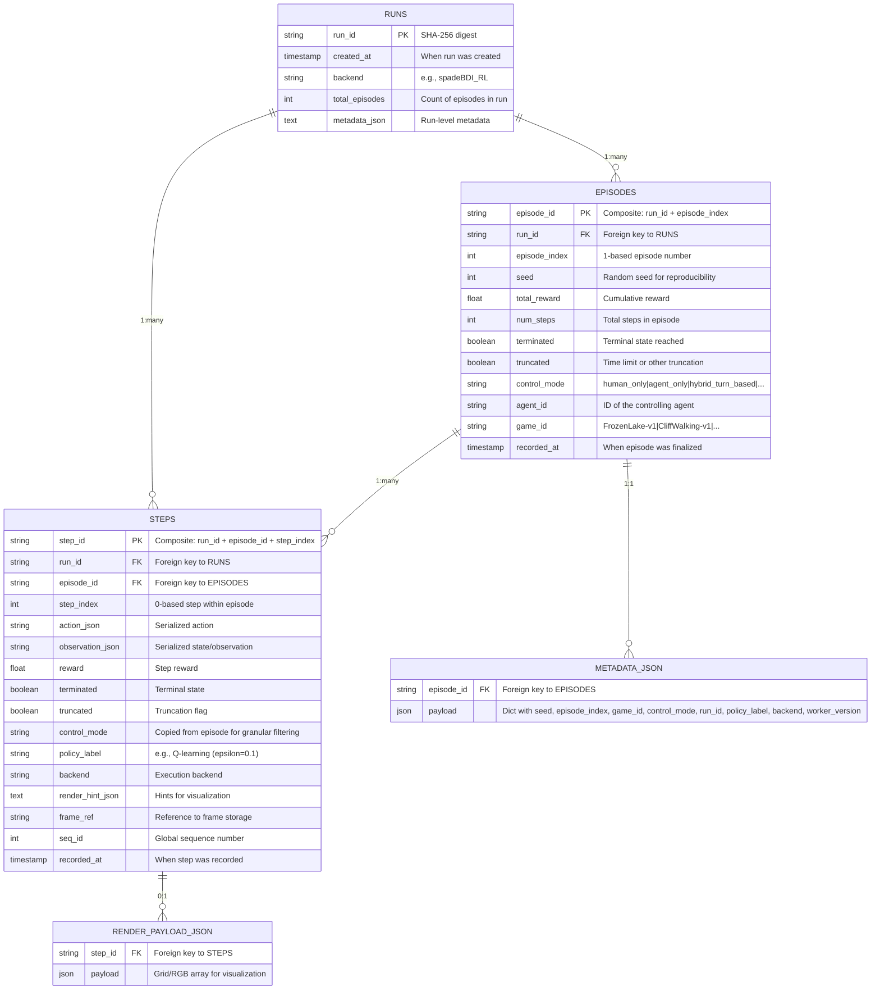
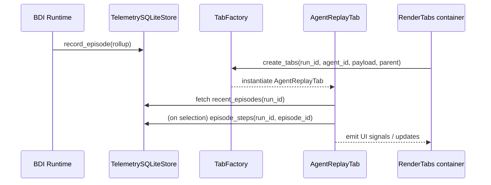
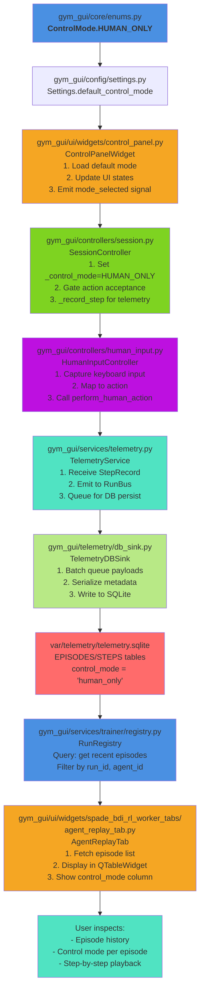
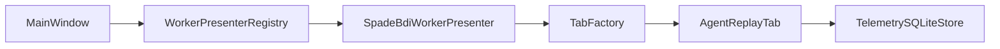

# Human Replay Tab — Implementation Overview

**Date:** October 24, 2025  
**Scope:** Document how the Human Replay tab in the GUI is built, the modules involved, data flow, and key design decisions.

---

## 1. Purpose and Context

The **Human Replay Tab** lets operators review completed training sessions (human or agent) by loading step/episode telemetry from SQLite and presenting it through a Qt widget. It is part of the SPADE‑BDI tab bundle but can be reused for other workers.

Primary goals:

- Display episode history (rewards, step counts, success/failure flags)
- Allow per-episode playback in a table view
- Provide filtering/export hooks for analysis

---

## 2. Source Modules & Key Files

| Module | Responsibility |
| --- | --- |
| `gym_gui/ui/widgets/spade_bdi_rl_worker_tabs/agent_replay_tab.py` | Qt widget implementation (forms, tables, playback controls) |
| `gym_gui/ui/widgets/spade_bdi_rl_worker_tabs/factory.py` | Instantiates the replay tab along with other worker tabs |
| `gym_gui/ui/main_window.py` | Registers the replay tab via presenter factory and plugs it into the `RenderTabs` container |
| `gym_gui/services/telemetry/sqlite_store.py` | Provides `recent_episodes` and `episode_steps` queries used to populate data |
| `gym_gui/services/telemetry.py` | Flushes telemetry to SQLite so replay queries stay consistent |
| `spade_bdi_rl/core/runtime.py` | Emits episode rollup telemetry (reward, steps, metadata) that the replay tab consumes |

---

## 3. Widget Implementation

### Class: `AgentReplayTab`
**Location:** `gym_gui/ui/widgets/spade_bdi_rl_worker_tabs/agent_replay_tab.py`

#### 3.1. UI Layout
- Inherits from `QtWidgets.QWidget`
- Uses a vertical layout with:
  - Header stats (total episodes, last reward, success rate)
  - `QTableWidget` displaying episode metadata (episode id, reward, steps, status, **control_mode**)
  - Controls for filtering and exporting episodes
  - Optional detail pane for viewing step-level telemetry

#### 3.2. Key Methods
| Method | Purpose |
| --- | --- |
| `__init__(run_id, agent_id, parent)` | Builds UI elements, requests initial data from telemetry store |
| `_build_ui()` | Constructs layouts, table headers, and control buttons |
| `refresh()` | Pulls latest episode data (calls `TelemetrySQLiteStore.recent_episodes`) |
| `load_episode(episode_id)` | Loads per-step data for selected episode |
| `_populate_table(episodes)` | Fills `QTableWidget` with episode metadata |
| `_on_episode_selected(row)` | Handles table selection and triggers `load_episode` |
| `_export_episode(episode_id)` | (Optional) Exports selected episode to JSON/CSV *[future feature]* |

#### 3.3. Dependencies
- `TelemetrySQLiteStore` for durable episode data
- `RendererRegistry` (optional) if future versions display frame thumbnails
- `RunStreamBuffer` (indirectly) ensures in-memory buffer is capped until persisted

#### 3.4. Control Mode Column Integration
The replay tab now displays a **"Control Mode"** column showing the control mode active when each episode was recorded:
- **human_only** (blue) — Human player exclusively drove the environment
- **agent_only** (green) — Agent was autonomous
- **hybrid_turn_based** (purple) — Turn-based human/agent alternation
- **hybrid_human_agent** (orange) — Simultaneous human/agent control
- **multi_agent_coop** (teal) — Multi-agent cooperation
- **multi_agent_competitive** (red) — Multi-agent competition

This field is populated from `EpisodeRollup.metadata.control_mode` persisted in SQLite.

---

## 3.5. Telemetry Database Schema (EER View)

The Human Replay tab queries the telemetry SQLite database. Below is the normalized schema showing the key entities and their relationships:

**Key Observations:**

1. **Normalization**: Episodes and Steps are separate tables, with Steps referencing Episodes via foreign key.
2. **Control Mode Denormalization**: `control_mode` is stored in both `EPISODES` and `STEPS` for efficient filtering without joins.
3. **Metadata JSON**: Episode-level metadata (seed, game_id, control_mode, etc.) is stored as JSON for extensibility.
4. **Indices**: Primary indices on `run_id`, `episode_id`, `control_mode`, and timestamps to support fast queries.

---

## 4. Data Flow

---

## 4.1. Human Mode → Replay Analysis Lifecycle

This diagram shows how a Human Mode session is configured through constants/enums, flows through the runtime, and is ultimately replayed:

**Flow Explanation:**

1. **Config Phase** (blue): `ControlMode.HUMAN_ONLY` enum defined in `enums.py`; default loaded from `Settings`.
2. **UI Phase** (orange): Control panel initializes and persists mode preference.
3. **Runtime Phase** (green): Session controller gates actions and records all human moves.
4. **Input Phase** (purple): Human input controller maps keypresses to environment actions.
5. **Telemetry Phase** (cyan/teal): Events flow through TelemetryService → RunBus → DB sink.
6. **Persistence Phase** (red): Steps/episodes written to SQLite with `control_mode='human_only'`.
7. **Query Phase** (blue): Registry queries recent episodes from database.
8. **Replay Phase** (orange/cyan): AgentReplayTab fetches episodes and displays them with control mode column.

---

## 5. Integration via Presenter & Factory

1. `SpadeBdiWorkerPresenter.create_tabs(...)` calls `TabFactory.create_tabs`.
2. `TabFactory` instantiates `AgentOnlineTab`, `AgentReplayTab`, grid/raw/video tabs.
3. `MainWindow` registers each tab via `_create_agent_tabs_for(...)` and the `RenderTabs` container.
4. Replay tab sits alongside other SPADE tabs but is self-contained (it does not rely on live telemetry queues).

---

## 6. Design Considerations

- **Separation of concerns**: The replay tab reads from persistent storage; it does not consume live telemetry queues. This makes it resilient even if the UI misses live events.
- **Bounded in-memory buffers**: `TelemetryService` and `LiveTelemetryController` cap buffers (via deque) to prevent the replay tab from receiving enormous payloads.
- **Episode metadata**: `BDITrainer` and `HeadlessTrainer` ensure episode rollups include reward, steps, termination flags, and metadata (`control_mode`, `agent_id`, `seed`). Replay tab uses these fields directly.
- **Extensibility**: Future workers can reuse the replay tab or provide their own presenter-specific variant.

---

## 7. Related Tests

- `test_phase3_bus_writer_split.py` ensures episodes are written before UI completes.
- `test_telemetry_reliability_fixes.py::TestBoundedBuffers` confirms recent episodes remain bounded before replay tab queries them.
- Manual QA: verifying the tab loads data after training runs.

---

## 8. Future Enhancements

- Add export functionality (CSV/JSON) from the replay tab.
- Provide playback slider/animation to step through episode steps visually.
- Allow filtering by reward or success status.
- Expose metadata through DTOs once the API layer is introduced.

---

## 9. Verification Checklist

- [x] Widget located at `agent_replay_tab.py`
- [x] Uses `TelemetrySQLiteStore.recent_episodes` / `episode_steps`
- [x] Instantiated via `TabFactory`
- [x] Registered by `SpadeBdiWorkerPresenter` / `MainWindow`
- [x] Receives episode metadata from BDI/Headless runtime
- [ ] Export functionality (future)

---

**Summary:** The Human Replay tab is a Qt widget configured via the worker presenter architecture. It retrieves episode data from SQLite, displays it in a table, and is independent of live telemetry streams. The tab is created alongside other SPADE-BDI tabs and relies on the TabFactory and presenter wiring to stay decoupled from the main window.

## 10. Notes on Verification

- Manual verification performed on October 24, 2025 by running a SPADE-BDI training session and opening the replay tab to confirm episode tables populate correctly.
- No automated UI tests exist yet for the replay tab; behaviour is exercised indirectly through telemetry/repository tests.
- Ensure telemetry is flushed (call `TelemetryService.recent_episodes()` after `flush()`) before opening the tab to avoid stale data.
