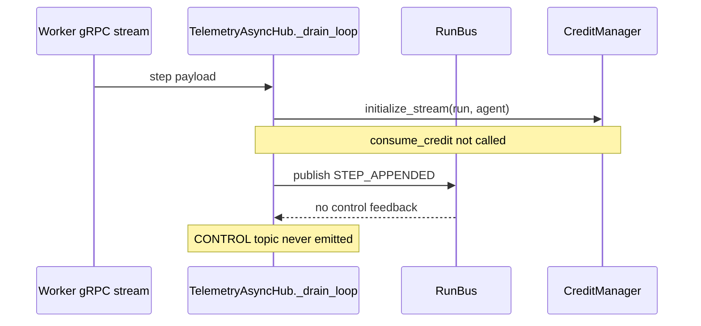
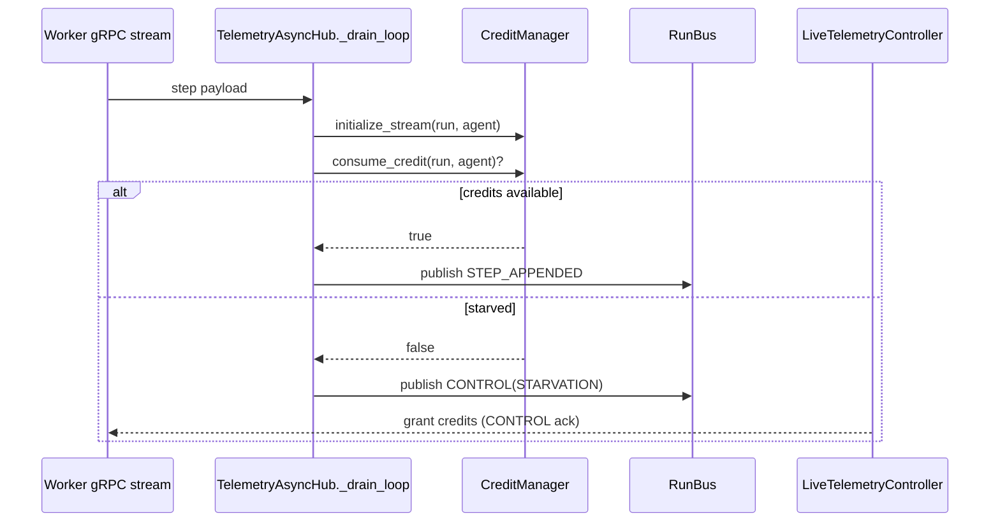
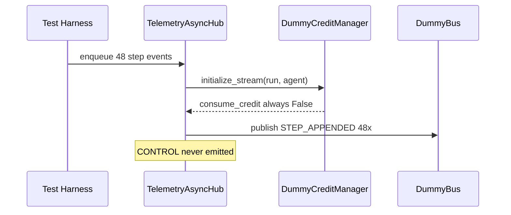
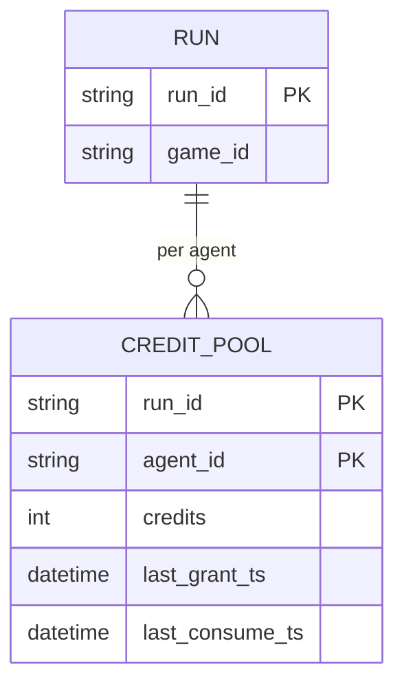
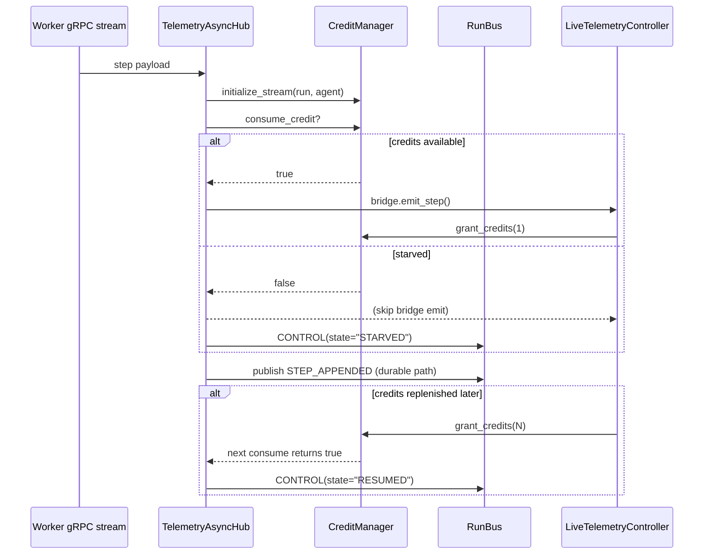

# Day 15 — Task 1

## Telemetry Credit Enforcement Gap

Recent code review and regression tests show that the credit-based backpressure design has
not been wired into the telemetry pipeline yet.

- `gym_gui/services/trainer/streams.py:520-579` — `TelemetryAsyncHub._drain_loop()` publishes
  every `STEP_APPENDED` / `EPISODE_FINALIZED` event to the RunBus after calling
  `initialize_stream(...)`. It never calls `consume_credit(...)`, so the credit pool is never
  decremented and no backpressure is applied.
- `gym_gui/services/trainer/streams.py:150-215` — `RunStreamBuffer` uses bounded `deque`s to
  store steps/episodes. Without credit enforcement, producers can still flood the buffer faster
  than consumers drain it.
- `gym_gui/services/trainer/streams.py:264-432` — subscription logic creates asyncio tasks but
  never listens for `Topic.CONTROL` messages that would grant credits back to the producer path.
- `gym_gui/telemetry/credit_manager.py:44-138` — the credit manager exposes
  `consume_credit`, `grant_credits`, `grant_max_credits`, low-credit thresholds, and starvation
  detection. None of these paths are exercised by the hub.
- `gym_gui/telemetry/events.py:22` — `Topic.CONTROL` exists but is never published. Downstream
  consumers (UI, producers) never receive starvation notifications.
- `gym_gui/controllers/live_telemetry_controllers.py:360-520` — listens to RunBus for
  telemetry events. There is no branch handling `Topic.CONTROL`, so even if the hub emitted it,
  the UI would currently ignore it.
- `gym_gui/services/trainer/streams.py:81-142` — `TelemetryBridge` and Qt signal wiring relay
  step/episode data to the UI, but there is no signal for credit starvation to propagate.
- `gym_gui/telemetry/run_bus.py` — RunBus supports publishing arbitrary topics; credit control
  events could be multiplexed alongside existing telemetry but are not today.
- `gym_gui/services/trainer/__init__.py` & `streams` consumers — nothing subscribes to
  `Topic.CONTROL`, so even a future implementation must define how the producer regains credits.
- `gym_gui/ui/widgets/agent_train_dialog.py:250-320` — the form exposes render/telemetry throttle
  controls. Users can still crank telemetry speed beyond UI tolerance because no credit gating
  ever triggers.
- `docs/1.0_DAY_14/TASK_1/INITIAL_PLAN.md` — explicitly called out this credit gap as P0 on Day 14.
- `docs/1.0_DAY_14/TASK_1/TELEMETRY_ARCHITECTURE.md` — architecture diagrams assume credit
  enforcement exists, but the implementation is still missing.

### Current Flow (missing credit enforcement)



### Intended Flow (once credit enforcement is wired)



### Regression Evidence

`spade_bdi_rl/tests/test_telemetry_credit_gap.py` adds two regression tests that document the
gap. `gym_gui/tests/test_telemetry_credit_backpressure_gap.py` mirrors the coverage inside the
main suite so CI highlights the issue once enforcement lands:





The EER view highlights that `CREDIT_POOL.credits` is never decremented because
`consume_credit()` is unused; starvation timestamps never advance.

### Additional Impacted Modules

- `gym_gui/services/bootstrap.py:80-120` — bootstraps `TelemetryAsyncHub` and the credit manager.
  Fixes here must ensure the shared credit manager is still injected correctly.
- `gym_gui/services/trainer/signals.py` — RunBus signals could dispatch CONTROL messages to the
  Qt layer once they exist.
- `gym_gui/services/telemetry.py:40-150` — logging for step ingestion references the credit
  system in warnings; those logs never fire because credits are untouched.
- `gym_gui/telemetry/constants.py:35-45` — defines `INITIAL_CREDITS`, `MIN_CREDITS_THRESHOLD`,
  etc. These configuration values remain unused until enforcement lands.
- `gym_gui/tests/test_telemetry_reliability_fixes.py:220-360` — references `INITIAL_CREDITS`
  and buffer constants but cannot validate credit draining behaviour.
- `spade_bdi_rl/tests/test_spade_bdi_agent.py` — ensures SPADE workers connect over XMPP; fast
  runs from this worker can still overwhelm telemetry because credits never gate outbound events.
- `docs/1.0_DAY_10/1.0_DAY_10_BDI_MODE_ENABLE_SOLUTION.md` — BDI “fast train” setups rely on
  credit gating for future reliability; documentation should be updated once enforcement exists.
- `docs/1.0_DAY_11/CREDIT_BASED_BACKPRESSURE_IMPLEMENTATION.md` — design notes for the credit
  manager remain partially aspirational because `_drain_loop` does not call into the manager.

## Problem Summary

- The credit-based backpressure path specified in earlier design docs (Day 14) remains
  unimplemented.
- `TelemetryAsyncHub` must call `consume_credit()` before publishing to the RunBus and emit an
  explicit `Topic.CONTROL` message when credits reach zero.
- UI and producers currently have no signal to slow down, so telemetry floods (e.g., fast
  trainers) can overrun in-process queues.
- Until `_drain_loop` is patched (and consumers emit/handle `Topic.CONTROL`), the credit manager
  is effectively a no-op and the Day 14 P0 item stays open. Day 15 work must implement this end
  to end (hub, RunBus, UI feedback, and producer credit reclamation).

### Repro / Validation Command

Use the focused regression targets to observe the current behaviour (tests pass while the gap
remains):

```bash
source .venv/bin/activate
python -m pytest \
  gym_gui/tests/test_telemetry_credit_backpressure_gap.py \
  spade_bdi_rl/tests/test_telemetry_credit_gap.py -v
```

Once credit enforcement is implemented these assertions should be updated to the new contract.

These findings are grounded in the current codebase; no external documentation updates existed
for Day 15 yet, so this file becomes the canonical problem statement for Task 1.

## Resolution Snapshot (Implemented)

The Day 15 implementation wires the missing pieces end-to-end while keeping durable persistence
intact:

- `gym_gui/services/trainer/streams.py`
  - Consumes credits before publishing and skips Qt bridge emits when the UI is starved.
  - Emits `Topic.CONTROL` events (`state=STARVED|RESUMED`) exactly once per transition.
  - Tracks starved streams to avoid noisy control traffic and acknowledges credits when they
    recover.
- `gym_gui/controllers/live_telemetry_controllers.py`
  - Subscribes to the CONTROL topic, logs starvation/resume events, and grants one credit back for
    every step/episode successfully rendered.
  - Flush routines grant credits while replaying buffered events so the hub resumes quickly.
- Regression coverage
  - `gym_gui/tests/test_telemetry_credit_backpressure_gap.py` ensures single-event and burst flows
    consume credits and emit control messages in the expected states.
  - `spade_bdi_rl/tests/test_telemetry_credit_gap.py` mirrors the same coverage for the SPADE
    worker harness.

### Updated Flow (Post-Fix)



The CONTROL subscription equips the UI to react (today via logging + credit grants; future work
can hook this into richer UX cues). Durable persistence stays lossless because STEP/EPISODE events
still reach the RunBus even when the UI throttles.
