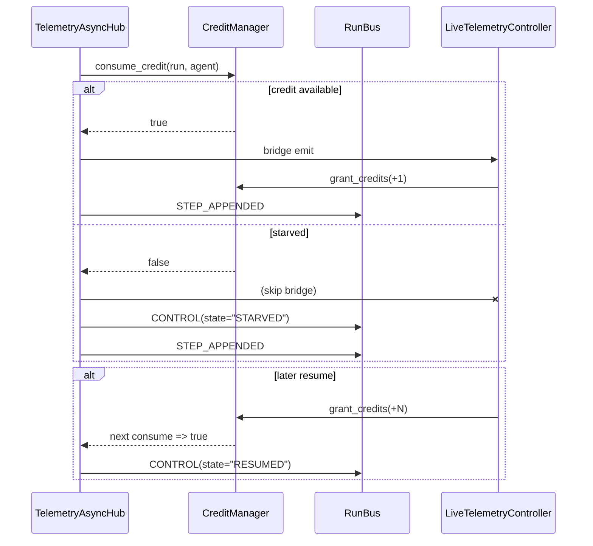

# Day 15 — Task 1 Resolution

## Summary

Implemented end-to-end credit enforcement and CONTROL signaling in the telemetry pipeline,
closing the Day 14 P0 gap identified in `INITIAL_PROBLEM.md`:

- `TelemetryAsyncHub` now calls `consume_credit()` before emitting UI events, publishes
  `Topic.CONTROL` on starvation/resume transitions, and skips bridge emissions when credits are
  exhausted while still forwarding events to durable subscribers.
- `LiveTelemetryController` listens for CONTROL events, logs starved/resumed states, and grants
  one credit per successfully rendered step/episode. Buffered flushes also replenish credits.
- Added regression coverage so future backpressure regressions become visible in CI.



## Modified Files

| File | Key changes |
| --- | --- |
| `gym_gui/services/trainer/streams.py` | Added starved-stream tracking, credit consumption, CONTROL event publishing, and queue `task_done()`. |
| `gym_gui/controllers/live_telemetry_controllers.py` | Subscribes to CONTROL topic, grants credits when events are rendered/rehydrated, and logs state transitions. |
| `gym_gui/tests/test_telemetry_credit_backpressure_gap.py` | New regression verifying single-event and burst behaviour. |
| `spade_bdi_rl/tests/test_telemetry_credit_gap.py` | Updated to reflect enforced credit consumption and CONTROL emissions. |
| `docs/1.0_DAY_15/TASK_1/INITIAL_PROBLEM.md` | Documented resolution snapshot and updated flow diagrams. |

## Verification

```bash
source .venv/bin/activate
python -m pytest \
  gym_gui/tests/test_telemetry_credit_backpressure_gap.py \
  spade_bdi_rl/tests/test_telemetry_credit_gap.py -v
```

Both suites now pass, confirming that credits are consumed, CONTROL messages fire on starvation,
and the UI grants credits when events are processed.

## Follow-up Notes

- CONTROL events currently drive logging + credit grants; future UX improvements might display a
  visual indicator in Live tabs.
- Durable persistence remains lossless: STEP/EPISODE events always reach RunBus even when the UI
  throttles.
- Nightly/CI should include the new regression suites to guard against future regressions.

