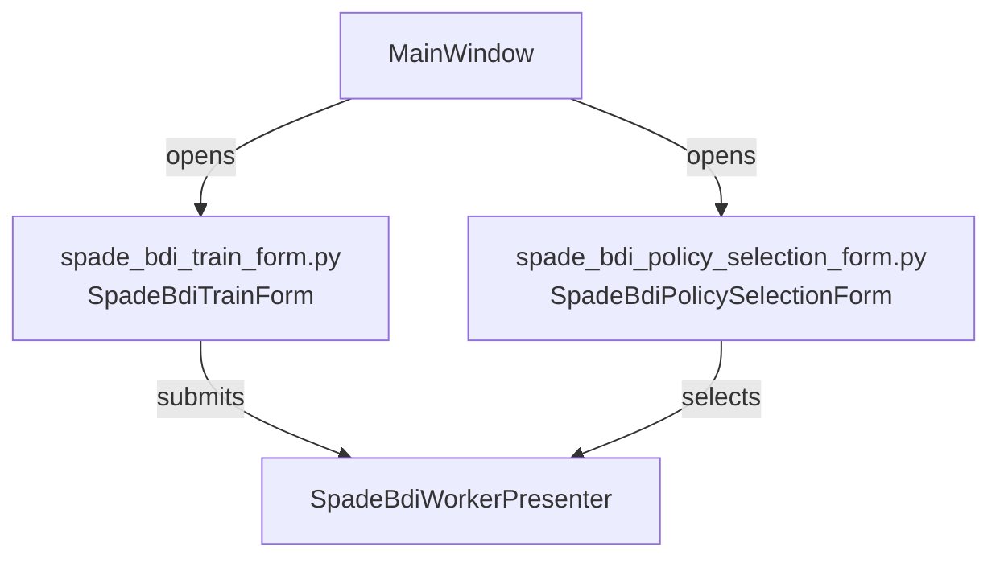
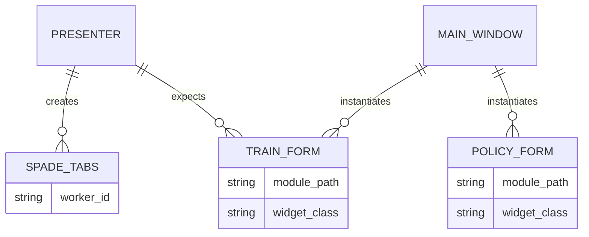
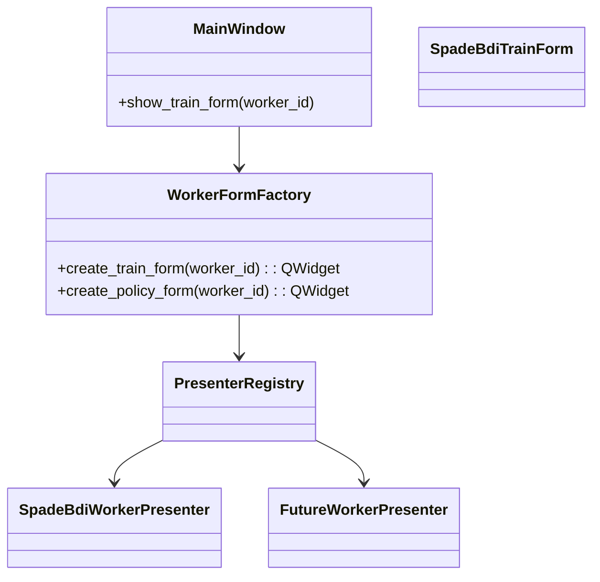

# Day 15 — Task 2

## UI Form Abstractions (Naming & Coupling Gap)

### Current State

- `gym_gui/ui/widgets/spade_bdi_train_form.py` (formerly `agent_train_dialog.py`) defines
  **`SpadeBdiTrainForm`**, a Qt dialog that builds a full SPADE-BDI training payload (controls,
  telemetry throttles, XMPP fields).
  SPADE-BDI training payload (controls, telemetry throttles, XMPP fields).
- `gym_gui/ui/widgets/spade_bdi_policy_selection_form.py` hosts the SPADE-BDI policy selector
  dialog (a rename of the previous duplicate pair). Even after deduplication it remains worker
  specific and globally owned.
- `gym_gui/ui/widgets/spade_bdi_rl_worker_tabs/__init__.py` re-exported the dialog (now renamed), tying
  the dialog to the SPADE presenter bundle.
- `gym_gui/ui/main_window.py` now resolves forms via the factory but previously wired
  control-panel signals with SPADE-centric names (e.g., `agent_loadout_requested`); these have been
  renamed to `agent_form_requested`, yet historical docs still reference the old terminology.
  (lines ~830-880), with TODOs for supporting additional workers routed through the presenter
  registry.
- The naming still implies modal Qt dialogs even though future workflows may embed these as
  forms; the worker prefix (`SpadeBdi`) helps but a generic interface is still missing.
- Internal dependencies remain global: dialogs call `validate_train_run_config` directly instead
  of resolving validation through presenters or factories.
- The SPADE tab package does not include the dialog in its `__all__`, yet imports it for side
  effects—a sign of incidental coupling.

### Why This Breaks Down

1. **Worker-Specific UI Hard-Coded**
   - The dialog is tailored for SPADE-BDI (XMPP credentials, SPADE-only telemetry knobs). New
     worker types (e.g., HuggingFace, PPO) would either shoehorn fields into the same dialog or
     spawn copy/paste variants.
   - No interface exists for presenters to provide their own configuration widgets; MainWindow
     owns the dialog type.
2. **Single Worker Ownership**
   - Although the duplicate dialog was removed, the remaining `SpadeBdiPolicySelectionForm` stays
     SPADE-specific. Additional workers must provide their own UI via the factory, but there is no
     default/fallback form.
3. **Naming Drift**
   - Dialog vs. form naming is inconsistent: `AgentTrainDialog` vs. `policy_selection_form.py`,
     window title “Agent Train Form,” etc. This complicates future conversions to non-modal
     workflows.
4. **Presenter Contract**
   - Worker presenters supply config/build logic but cannot influence UI composition. Dependency
     injection stops at the presenter boundary; UI remains globally resolved.
5. **Global Service Resolution**
   - `AgentTrainDialog` resolves services directly, making reuse in headless or alternate UI
     contexts difficult.
6. **Tab Package Leakage**
   - `spade_bdi_rl_worker_tabs/__init__.py` imports `AgentTrainDialog` yet does not export it,
     indicating SPADE-specific wiring is bleeding into utility modules without clear ownership.

- `TRAIN_FORM.module_path` currently points to `gym_gui/ui/widgets/agent_train_dialog.py`, baked
  into MainWindow.
- `POLICY_FORM.module_path` exists twice, so the relationship is ambiguous.
- No entity owns a generic “form factory,” leaving presenters unable to supply their own widgets.

### Impacted Files / Modules

- `gym_gui/ui/main_window.py` — instantiates dialogs directly; will need abstraction to request
  worker-specific forms.
- `gym_gui/ui/widgets/agent_train_dialog.py` — SPADE-only form tied to dialog naming.
- `gym_gui/ui/widgets/spade_bdi_policy_selection_form.py` — only SPADE-specific implementation;
  additional workers still require separate modules.
- Legacy docs still reference `agent_loadout_requested`; we should update or annotate them to
  reflect the new `agent_form_requested` event.
- `gym_gui/ui/widgets/spade_bdi_rl_worker_tabs/__init__.py` — re-exports the dialog for SPADE.
- `docs/1.0_DAY_14/TASK_3/ORGANIZATION_AND_SCOPING.md` — prior plan proposed worker presenters
  and factories but didn’t tackle dialog/form naming or DI.
- `docs/1.0_DAY_10/1.0_DAY_10_BDI_MODE_ENABLE_SOLUTION.md` — references SPADE-specific controls
  currently embedded in the dialog.

### Desired Direction

- Rename SPADE-specific UI widgets to `_spade_bdi_worker_form.py` style and expose via a factory.
- Presenters (or a form factory) return the appropriate Qt widget; MainWindow stops referencing
  concrete dialog classes.
- Remove the duplicate `policy_selection_dialog.py` and adopt consistent naming (`*_form.py`).
- Lay groundwork for dependency injection (pass form classes/factories via presenter registry).

This document frames the problem; next steps will plan the refactor (renames, DI seams, presenter
API changes).
