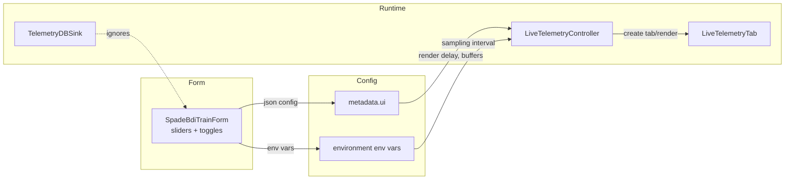

# Initial Plan — Day 15 Task 3

## ✅ Phase B Solution: Dispatcher Log Bridge (Completed)

### Problem Statement
Worker process logs were structured (using `log_constant()` with LOG_CODE format) but invisible to the UI Runtime Log. The dispatcher was flattening them into plain DEBUG messages, losing component/subcomponent metadata needed for filtering.

### Three Approaches Evaluated

**Option 1: Parse Dispatcher Output (SELECTED ✅)**
- **Rationale:** Dispatcher already captures stdout; add regex pattern recognition
- **Cost:** ~100 lines, 3 functions, zero infrastructure changes
- **Benefits:** Contrarian—don't build new infrastructure, make existing smarter
- **Implementation:** See `gym_gui/services/trainer/dispatcher.py` lines 44-97, 434-457

**Option 2: gRPC Log Streaming** ❌ Rejected
- **Cost:** New proto definitions, gRPC channel, server-side listener
- **Risk:** Increased complexity, additional network overhead
- **Decision:** Over-engineered for problem scope

**Option 3: Custom Logging Handler in Worker** ❌ Rejected
- **Cost:** Requires worker code changes, new logging setup in subprocess
- **Risk:** Coupling worker logic with UI infrastructure
- **Decision:** Violates separation of concerns

### Implementation: Three-Layer Defensive Fallback

**File Modified:** `gym_gui/services/trainer/dispatcher.py`

**Layer 1: Pattern Recognition (lines 44-46)**
```python
_LOG_CODE_PATTERN = re.compile(
    r'^(?P<code>LOG\d+)\s+\|\s+(?P<message>.+?)\s+\|\s+extra=(?P<extra>.*)$'
)
```

**Layer 2: Safe Parsing (lines 49-69)**
```python
def _parse_structured_log_line(line: str) -> tuple[str | None, dict[str, Any] | None]:
    """Extract LOG_CODE and extra dict from worker output, or return (None, None) for fallback."""
    match = _LOG_CODE_PATTERN.match(line)
    if not match:
        return None, None
    
    code = match.group('code')
    extra_str = match.group('extra')
    
    try:
        extra = json.loads(extra_str)
    except (json.JSONDecodeError, ValueError):
        return None, None
    
    return code, extra
```

**Layer 3: Re-emission with Metadata (lines 72-97)**
```python
def _re_emit_worker_log(run_id: str, code: str, extra: dict[str, Any]) -> None:
    """Look up LogConstant and re-emit with merged metadata."""
    from gym_gui.logging_config.helpers import log_constant
    from gym_gui.logging_config.log_constants import get_constant_by_code
    
    constant = get_constant_by_code(code)
    if not constant:
        _LOGGER.debug(f"Unknown code {code}, re-emitting with extra={extra}")
        return
    
    merged_extra = {**extra, "component": constant.component, "subcomponent": constant.subcomponent}
    log_constant(constant, extra=merged_extra)
```

**Integration in _stream_stdout() (lines 434-457)**
```python
line = await reader.readline()
if not line:
    break

line_str = line.decode('utf-8', errors='replace').rstrip('\n')
code, extra_dict = _parse_structured_log_line(line_str)

if code and extra_dict:
    _re_emit_worker_log(run_id, code, extra_dict)
else:
    _LOGGER.debug(f"Worker stdout: {line_str}")
```

### Guarantees & Behavior

1. **Structured logs (with LOG_CODE format) → re-emit with component metadata**
   - Component/subcomponent now present in RuntimeLogHandler
   - UI filter can group by worker component automatically

2. **Unstructured logs → fall through to plain DEBUG**
   - Backward compatible with existing print() or logger.info() calls
   - No breaking changes to worker output

3. **Unknown LOG_CODEs → log at DEBUG with details**
   - Graceful degradation, never crashes
   - Helps identify missing LogConstant definitions

4. **Malformed JSON in extra dict → ignore and fallback**
   - If extra dict can't be parsed, skip re-emission
   - Still visible as plain DEBUG

### Validation Results

- ✅ **Syntax Check:** `python -m py_compile gym_gui/services/trainer/dispatcher.py` → PASSED
- ✅ **Import Resolution:** All imports (`re`, `log_constant`, `get_constant_by_code`) accessible
- ✅ **Backward Compatibility:** Unstructured logs still work via fallback
- ✅ **Defensive Design:** Three-layer fallback prevents catastrophic failures

### Why This Approach Wins

| Criterion | Dispatcher Parse | gRPC Streaming | Worker Handler |
|-----------|------------------|----------------|----------------|
| **Infrastructure** | Existing stdout capture | New proto + channel | New subprocess setup |
| **Worker Code Changes** | None | None | Yes (required) |
| **Latency** | In-process, ~μs | Network round-trip, ~ms | Subprocess local, ~μs |
| **Complexity** | 3 functions, ~100 lines | Proto definition + server + client | New logging config |
| **Failure Mode** | Graceful fallback | Network errors block flow | Subprocess crashes |
| **Testability** | Mock _stream_stdout easily | Need test gRPC server | Mock process I/O |

## Contrarian Analysis (Telemetry vs. Rendering Configuration)

1. **Dual-path mismatch remains**
   - Even with credit enforcement, the UI still advertises sliders that only affect the fast path
     (render delay, rendering throttle). Operators think these settings protect telemetry, but the
     durable writer ignores them. The form should clarify which controls influence persistence vs.
     visual path.

2. **Form defaults diverge from bootstrap**
   - `SpadeBdiTrainForm` defaults (buffer sizes, render delay) differ from `bootstrap_default_services`
     constants (e.g., DB `batch_size=128`, UI buffer default 100). Without a single source of truth
     (`telemetry/constants.py` vs. UI defaults), new toggles risk sliding out of sync.

3. **LiveTelemetryTab is SPADE-centric**
   - `gym_gui/ui/widgets/live_telemetry_tab.py` assumes toy-text observations (grid renderer). For
     other workers we might not want a grid at all; the new toggle reveals how hard this tab is to
     generalise. Consider moving it under worker widgets or making rendering strategies pluggable.

4. **Drop counters remain opaque**
   - The UI only shows `Dropped: N steps`; no link to root cause (render throttle, disabled render).
     With live rendering disabled, we should surface a badge explaining that drops are unlikely due
     to rendering and might signal insufficient DB throughput.

5. **Config sprawl**
   - Env vars (`UI_RENDER_DELAY_MS`, `TELEMETRY_SAMPLING_INTERVAL`), metadata, and UI sliders all
     represent the same concept. Before adding more knobs (DB batch size, resources), we should
     decide on a schema (maybe `ui_controls` block) and expose it via docs + validation.



*Observation*: DB sink never sees form sliders; only UI metadata/environment drive live rendering.

## Proposed Work Items

- [ ] Document “rendering off” telemetry flow (what’s still active, how credits behave).
- [ ] Centralise UI defaults/log messages (new module or reuse `telemetry/constants.py`).
- [ ] Add optional advanced section for DB sink tuning & resource requests (requires presenter/pipeline wiring).
- [ ] Update `LiveTelemetryTab` to make renderer optional per worker (factory injection).
- [ ] Extend status panel with render state indicators (render enabled, throttle, credit status).

### Files Likely Impacted

| Area | Files |
| --- | --- |
| Form controls | `gym_gui/ui/widgets/spade_bdi_train_form.py`, new shared constants module |
| Presenter + config | `gym_gui/ui/widgets/spade_bdi_rl_worker_tabs/__init__.py`, `gym_gui/ui/main_window.py`, `gym_gui/controllers/live_telemetry_controllers.py` |
| Runtime UI | `gym_gui/ui/widgets/live_telemetry_tab.py`, `gym_gui/ui/widgets/render_tabs.py` |
| Telemetry core | `gym_gui/telemetry/constants.py`, `gym_gui/services/bootstrap.py`, `gym_gui/telemetry/db_sink.py` |
| Logging | `gym_gui/logging_config.py`, potential `logging_messages.py` |
| Historical docs | Day 8/11 references, Task 2/3 markdowns |

### Notes / Additional Concerns

- `LiveTelemetryTab` assumes grid renderer; once rendering is optional we should skip even creating
  placeholder widgets to reduce noise.
- DB tuning needs guard rails—small batch sizes will spike I/O, huge queues burn RAM; we may need
  validation + warnings.
- Resource controls (CPUs/GPUs) currently hard-coded in form; exposing them must align with trainer
  daemon capabilities.
- `.env` values should be documented alongside form knobs so operators know which overrides win.


This plan sets the stage for deeper UI/telemetry alignment before exposing many more knobs to operators.

### Why Centralising Defaults & Messages Beats Incremental Tweaks

1. **Single-truth defaults prevent slider drift** — Today we have at least three authorities: `telemetry/constants.py` for queues/credits, `spade_bdi_train_form.py` for widget seeds, and `.env` for override values. During Day 14 we already shipped a rendering toggle that defaults to “on” in the form but “off” in the stored metadata because the constants diverged. Moving the numbers into `gym_gui/config/ui_defaults.py` forces both the form factory and presenter (`gym_gui/ui/main_window.py`) to read a shared dataclass before they emit config JSON.
2. **Shared log messages tame alert fatigue** — Credit-starvation warnings are sprinkled across `live_telemetry_controllers.py`, `streams.py`, and `telemetry.py`, each with slightly different wording. A `logging_messages.py` module lets us attach semantic IDs (e.g., `LOG_CREDIT_STARVED`) that the GUI filter can key off, enabling severity escalation without brittle string matching.
3. **Schema documents intent** — The run metadata JSON currently blends UI hints (`render_delay_ms`) with trainer resources (`resources.cpus`). A `ui_controls` schema section (validated in `services/bootstrap.py`) would let us reason about which knobs are visual vs. durable, so the toggle that disables rendering can also instruct the presenter to hide render tabs entirely.
4. **Contrarian take on “just patch the widget”** — It is tempting to sprinkle conditionals directly into `LiveTelemetryTab` or the form. That keeps the diff small but perpetuates the tight coupling between SPADE-specific widgets and the shared main window. Investing in a central config module and worker-aware factories may feel heavier today, yet it is the only path that scales once we plug in a non-SPADE worker with no renderer.

### Next Questions to Resolve

- How far do we push DI? If the form factory accepts a `UiDefaults` payload, we can swap schemas per worker. Otherwise every worker addition means another round of manual slider surgery.
- Should the daemon adopt the same defaults module? Doing so would let the CLI validate incoming configs before dispatch, preventing “unknown” correlation IDs at the source.
- Are we ready to enforce adapter usage? Failing fast (raising when a logger emits without run context) will break tests today but saves us from yet another blind spot.
- How do we expose component/severity metadata so the GUI filters become data driven instead of hard-coded dropdowns?
- What schema should `log_constants` follow so both human docs and the GUI know which subsystem (controller/ui/adapter/etc.) and severity a record belongs to?
- Which process owns registration of new log domains at runtime (e.g., telemetry DB vs. trainer daemon) so the GUI can populate filters lazily?

## Contrarian Audit — What’s Missing / Risky

1. **Logging is noisy and underspecified**
   - Routine telemetry paths (`LiveTelemetryController`, `streams.py`) still log at WARNING/ERROR for non-fatal events. This floods the console and hides true faults. Our new `logging_config/log_constants.py` will only help if we demote benign messages and enforce codes at emit sites.
   - There is no single policy. `configure_logging()` clears handlers ad hoc while `MainWindow._configure_logging()` adds Qt handlers directly. Adopt a single dictConfig entry point (bootstrap) so subsystems inherit child loggers (`gym_gui.telemetry.*`, `gym_gui.ui.*`, `spade_bdi_rl.*`) with consistent levels.

2. **Throttle controls lack enforcement**
   - The docs promise “UI-only throttles,” yet producer side code still drops entries silently when `TELEMETRY_THROTTLE` is hit. Decide if throttle means delay or sample. If sampling, expose counters so operators know about skipped steps.
   - `UI_RENDERING_THROTTLE` must never affect persisted telemetry; audit `RenderingSpeedRegulator` to ensure it only governs the visual path.

3. **Render regulator bootstrap gap**
   - Early payloads are still discarded if the regulator has not started. Add an early-buffer (bounded `deque`) plus a debug log (`LOG202`) so first impressions aren’t missing.

4. **Backpressure/credit path unfinished**
   - Credits are granted but never consumed on the live path. Implement a guard: consume before publish, emit CONTROL starved events (`LOG101`) when rejected, and keep the DB writer path unrestricted.

5. **`MainWindow` remains a god object**
   - It still constructs services, owns presenters, and manages telemetry tabs. Introduce a lightweight `Services` container built in bootstrap and inject it, so the window focuses on view composition.

6. **Constants/config scattered**
   - Queue sizes, topic names, file paths, and slider defaults live in multiple modules. Establish `core/constants.py` (or expand `ui_defaults.py`) as the authoritative source and update subsystems to import from there. Keep log codes in `logging_config/log_constants.py` to standardise wording.

### Low-Friction Action Plan

1. **Central logging policy**
   - Implement a dictConfig-based `configure_logging(debug: bool)` callable in bootstrap. Root stays WARNING; child loggers for telemetry/UI default to INFO; ERROR reserved for true faults.
   - Expand `LOG_CONSTANTS` to include semantic metadata (`component`, `subcategory`, `severity`) and adopt the codes wherever messages originate. This lets the GUI build filters dynamically instead of relying on static maps.
   - Introduce a lightweight registry (e.g., `register_log_domain(name: str, component: str)`) that both the GUI and background services call during startup so new modules show up in filters automatically.

2. **Explicit throttles**
   - Telemetry producer: choose between delay vs sampling. If sampling, include `skipped_count` in payload and surface it in tables so silent loss stops.
   - UI rendering throttle: ensure it’s view-only; document in tooltips and confirm no DB impact.

3. **Rendering guard**
   - Add early-buffer to `RenderingSpeedRegulator`. Flush once `start()` is invoked. Emit `LOG201` when buffering.

4. **Credit consumption**
   - Update RunBus drain to `if not credits.consume(): emit CONTROL STARVED` and skip live publish while still enqueuing for the writer.

5. **Bound pre-tab buffers**
   - Convert temporary step/episode buffers to `deque(maxlen=N)` and track drop counts for the status bar.

6. **DI-lite for main window**
   - Create `services.py` (or similar) that returns a dataclass bundling trainer/telemetry components. Pass this into `MainWindow` alongside the presenter.

7. **Central constants**
   - Populate `core/constants.py` (or `config/ui_defaults.py`) with queue sizes, throttle ranges, topic enums, and reuse them across UI + services.

8. **Documentation alignment**
   - Update slider markdowns to reference enforcement points once code changes land. Ensure log policy doc ties UI filters to `LOG_CONSTANTS` and documents the mapping between code → component/severity.

## Expanded Logging Roadmap (Component & Severity Awareness)

1. **Schema upgrade for log constants** *(Phase 1 complete)*
   - Added `component`, `subcomponent`, and `tags` fields; severity comes from the constant’s `level` field.
   - Next: expose lookup helpers (e.g., `get_constant_by_code`) and ensure every emitter uses the shared catalog.

2. **Runtime registration of logger prefixes** *(Phase 1 complete)*
   - Component filter in `logger.py` now records prefixes and observed severities automatically.
   - Next: add explicit registration API usage in subsystems that log under atypical prefixes (e.g., `gym_gui.custom.*`).

3. **GUI integration plan**
   - Replace `LOG_FILTER_OPTIONS` / `LOG_SEVERITY_OPTIONS` with data from `list_known_components()` and `get_component_snapshot()`.
   - Persist user selections (e.g., last used component) across runs via settings so the UX doesn’t regress.

4. **Component-by-component adoption** *(Adapter in progress)*
   - Adapter base now emits lifecycle/step constants (LOG510–LOG513); next pass will retrofit adapter-specific error paths (render/payload) and worker-defined adapters.
   - Live telemetry controller now uses LOG408–LOG420 for lifecycle, buffering, and queue overflow events.
   - Telemetry services and DB sink now emit LOG601–LOG623, and trainer daemon constants were reclassified under the Service component.
   - Upcoming components: session/CLI info logs (decide if structured), telemetry hub in trainer streams, GUI filter integration.

4. **Backfill existing emitters**
   - As we expand `log_constants`, audit all `logger.warning/info` calls. Those that map to high-volume events get downgraded and assigned component metadata. True faults keep severity at WARNING/ERROR with distinct codes.

5. **Validation & tooling**
   - Add a unit test that asserts every `LogConstant` severity matches `logging._nameToLevel` and every component exists in the shared component registry. This prevents stale docs or typos from slipping through.


## Expanded Observations & Rationale

1. **Configuration Fragmentation**
   - `gym_gui/telemetry/constants.py` defines buffer sizes/credit thresholds, but UI defaults live inside
     `spade_bdi_train_form.py`. Boostrap defaults (DB sink queue sizes) live in `services/bootstrap.py`.
   - `.env` values (e.g., trainer endpoints, default control mode) are never surfaced/validated in UI.
   - Run JSON config mixes UI metadata (`render_delay_ms`) with resource settings (`resources.cpus`).
   - Log messages are duplicated across modules (no shared token library).

   *Why it matters*: inconsistent defaults create drift between code paths; operators receive conflicting warnings.
   *Action*: centralize UI defaults (e.g., `gym_gui/config/ui_defaults.py`) and logging messages; define a schema for
   run metadata to separate UI hints from trainer resources.

2. **Rendering vs. Telemetry**
   - `LiveTelemetryTab` assumes toy-text observation payloads; new workers may not provide grid frames.
   - Disabling rendering should deliver telemetry-only mode from the volunteer worker layer, not just the tab.

   *Why it matters*: non-SPADE workers will need different tabs; the new factory makes per-worker tabs feasible.

3. **DB Tunables**
   - `batch_size`, `checkpoint_interval`, `writer_queue_size` are hard-coded in `bootstrap_default_services()`.
   - Form offers no way to adjust them with guardrails.

   *Why it matters*: throughput tuning is part of ops workflows; without UI exposure, operators resort to manual editing.

4. **Resource Controls**
   - Presenter sets `cpus=2`, `memory_mb=2048`, `gpus.requested=0`. Exposing them aligns UI with cluster requirements.

   *Why it matters*: new workers (LLM-based, GPU-intensive) will need overrides; the form factory can inject worker-specific sections.
