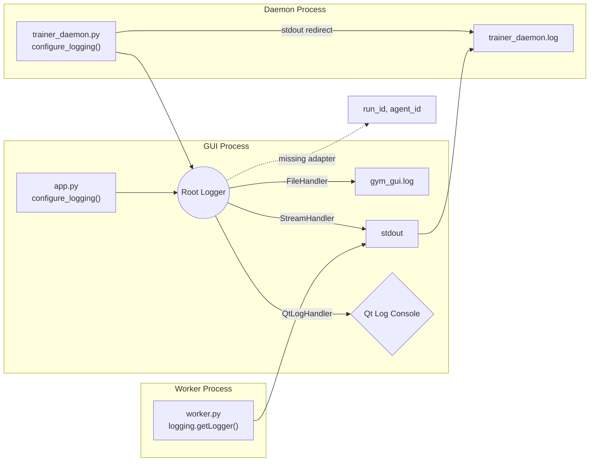
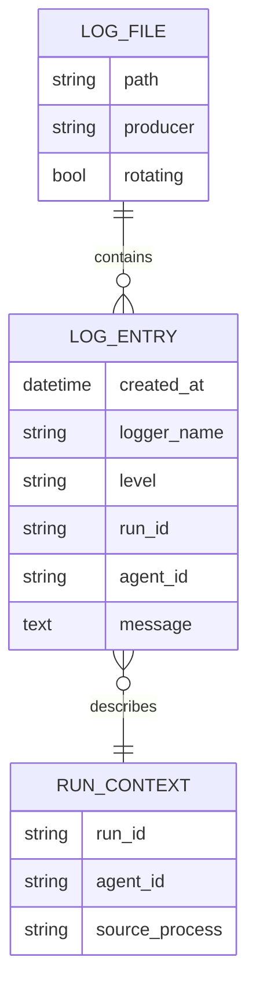

## Logging Problem Statement — Day 15 Task 3

### Why We Still Have Blind Spots

- The GUI advertises rich filtering (component + severity) yet both controls draw from a hard-coded mapping in `gym_gui/ui/main_window.py` that only covers `gym_gui.*` and a single worker prefix. Any new module (e.g., `gym_gui.telemetry`) falls through the cracks and appears under “All”, defeating triage.
- `configure_logging()` in `gym_gui/logging_config/logger.py` now enforces correlation IDs and rotating files, but every process that calls it wipes existing handlers. The Qt bridge (`MainWindow._configure_logging`) adds another handler on top, so duplicate streams reappear if the window is re-constructed.
- Trainer daemon startup (`gym_gui/services/trainer_daemon.py`) still configures logging before it forks workers. Because `stdout` is also redirected to `/var/logs/trainer_daemon.log`, we are effectively double writing daemon messages (once via `gym_gui.log`, once via redirection) whenever `log_to_file=True`.
- Worker processes rarely use `CorrelationIdAdapter`; many modules call `logging.getLogger(__name__)` directly and emit without `extra`. The formatter then stamps `[run=unknown agent=unknown]`, giving operators no way to tie a spike of dropped steps back to a run id.

### Current File Outputs

| Path | Producer | Contents | Notes |
| --- | --- | --- | --- |
| `/var/logs/gym_gui.log` | Any process that calls `configure_logging()` with `log_to_file=True` (`gym_gui/app.py`, CLI, daemon) | High volume INFO/DEBUG with correlation placeholders | Rotation enabled (10 MB × 5) but duplicates Qt stream when GUI runs. |
| `/var/logs/trainer_daemon.log` | Daemon stdout/stderr redirection in `gym_gui/services/trainer_daemon.py` | Mixed logging + bare `print()` lines from worker supervision | No rotation, no correlation IDs. |
| `/var/logs/*.log.[1-5]` | RotatingFileHandler backups | Historical slices for `gym_gui.log` | Evidence rotation works post refactor. |
| `/var/logs/README.md` | Dev note | Documents intent (transient, safe to clear) | Does not mention daemon log or rotation behaviour. |

*Takeaway*: without consistent adapters the run context is lost before reaching either file sink or GUI display.

### Component & Severity Filters (Reality vs Implementation)

- Component options come from `MainWindow.LOG_FILTER_OPTIONS`, mapping prefixes such as `"UI" → "gym_gui.ui"` and `"Worker" → "spade_bdi_rl.worker"`. Anything outside these prefixes (e.g., `gym_gui.telemetry`) is invisible when the operator narrows the view, which explains why credit warnings vanish.
- Severity options call `LOG_SEVERITY_OPTIONS`, but the Qt handler never prunes existing buffer entries. Changing from `ERROR` back to `INFO` does not restore earlier lines; the text widget only receives new records.
- `QtLogHandler` in `gym_gui/ui/logging_bridge.py` emits fully formatted strings. Downstream filters parse the string rather than the original `LogRecord`, so augmenting severity/component logic now requires regexing formatted text.
- `log_constants.py` exposes code/level/message but lacks component, subcategory, or tags, so the GUI has no structured data for building dropdowns. We need that schema upgrade before any dynamic filtering can work.

### Root Causes Summarised

1. **Handler lifecycle is not idempotent** — Each call to `configure_logging()` clears handlers; each Qt window adds another, causing double writes when the window is reloaded.
2. **Correlation metadata defaults to `unknown`** — Modules never set `run_id`/`agent_id`, so the new formatter offers illusion of context without substance.
3. **Daemon still double logs** — File handler + stdout redirect produce the same message twice, bloating `gym_gui.log` and hiding worker chatter inside `trainer_daemon.log`.
4. **Filters lag behind module growth** — Static prefix map forces developers to update UI every time a new package logs.
5. **Logger naming is inconsistent** — Some modules expose `_LOGGER`, others `LOGGER`, some `self.logger`, and others fetch `logging.getLogger(__name__)` inline. This inconsistency blocks mechanical refactors like auto-wrapping adapters or deriving prefixes for the GUI filter.
6. **No structured metadata for filtering** — Without component/severity metadata attached to each log code (or derived from logger names), the GUI cannot pivot filters dynamically or warn when a new subsystem starts logging.

### Contrarian Recommendations

- **Stop clearing handlers** — Detect whether a RotatingFileHandler already exists before re-initialising. GUI should call `configure_logging(stream=False)` and rely solely on `QtLogHandler` for the onscreen feed.
- **Mandatory adapters** — Wrap every service logger with `CorrelationIdAdapter` at construction time (e.g., `LiveTelemetryController` when it registers a run). Failing to provide a run id should be treated as an error, not defaulted to `unknown`.
- **Daemon fork strategy** — In subprocess mode, skip file logging and append run context to redirected stdout so `trainer_daemon.log` becomes the canonical daemon file. Reserve `/var/logs/gym_gui.log` for GUI + orchestration noise.
- **Dynamic filters** — Build the component menu from the set of logger names observed during the session. That keeps telemetry modules, bootstrap helpers, and future workers selectable without code churn.

### EER Snapshot (Log Artefacts)

*Gap*: `RUN_CONTEXT` rows are hypothetical—the current pipeline never persists them, so queries by run id fail.

### Impacted Code Inventory

- `gym_gui/logging_config/logger.py` — Handler setup, rotating file policy, correlation defaults.
- `gym_gui/ui/main_window.py` — Filter dropdowns, Qt handler attachment, GUI buffering semantics.
- `gym_gui/ui/logging_bridge.py` — Emits formatted strings, limiting downstream filtering options.
- `gym_gui/services/trainer_daemon.py` — Duplicated logging due to simultaneous file handler + stdout redirect.
- `spade_bdi_rl/core/worker.py` — Emits logs without adapter metadata, feeding `trainer_daemon.log` with contextless lines.

### Mitigations Now In Flight

- `gym_gui/logging_config/log_constants.py` now captures shared log codes/meaning **and** supplies `component`, `subcomponent`, and `tags`, giving the GUI first-class metadata for filtering.
- `configure_logging()` provisions handlers through `dictConfig`, layers the new `ComponentFilter`, and keeps a registry of observed logger prefixes to populate filter models.
- Starvation/control telemetry and render buffering paths emit log codes with component metadata, reducing noise and feeding the registry immediately.
- Adapter base operations (`load`, `reset`, `step`, `close`, `render`) now emit structured codes (LOG510–LOG513) and capture render/payload failures via LOG503/LOG505, so adapter activity participates in the filtering pipeline without bespoke strings.
- Live telemetry controller lifecycle/subscription events switch to LOG408–LOG420, replacing ad-hoc info/warning logs and ensuring queue overflows and tab flushes carry component metadata.
- Telemetry services (LOG601–LOG624) and the DB sink/SQLite store now log through the Service component, and trainer daemon events were reclassified under the same component for consistent filtering.
- Upcoming work: surface the registry to the Qt widgets (replace hard-coded dropdowns) and migrate remaining emitters to the enriched constants so no record falls back to `component=Unknown`.

Addressing these hotspots is prerequisite to any further telemetry/slider work; otherwise operators continue to chase “Dropped: N steps” alerts without observability.
