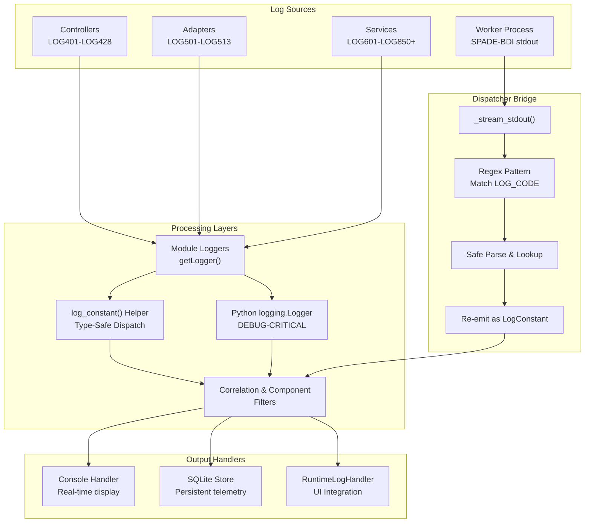
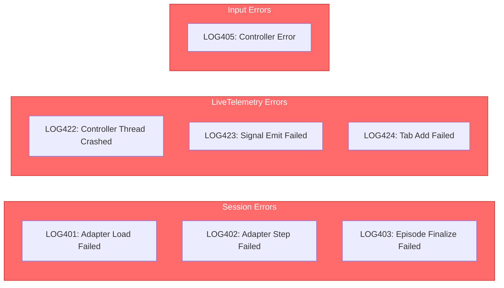
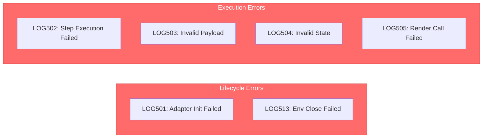
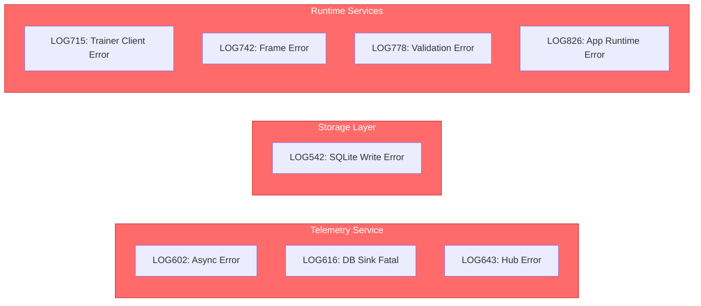
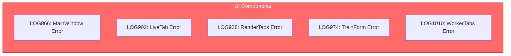
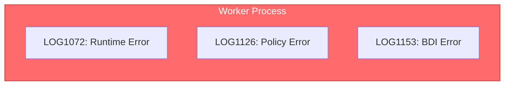
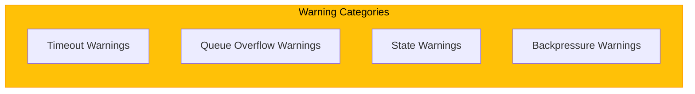
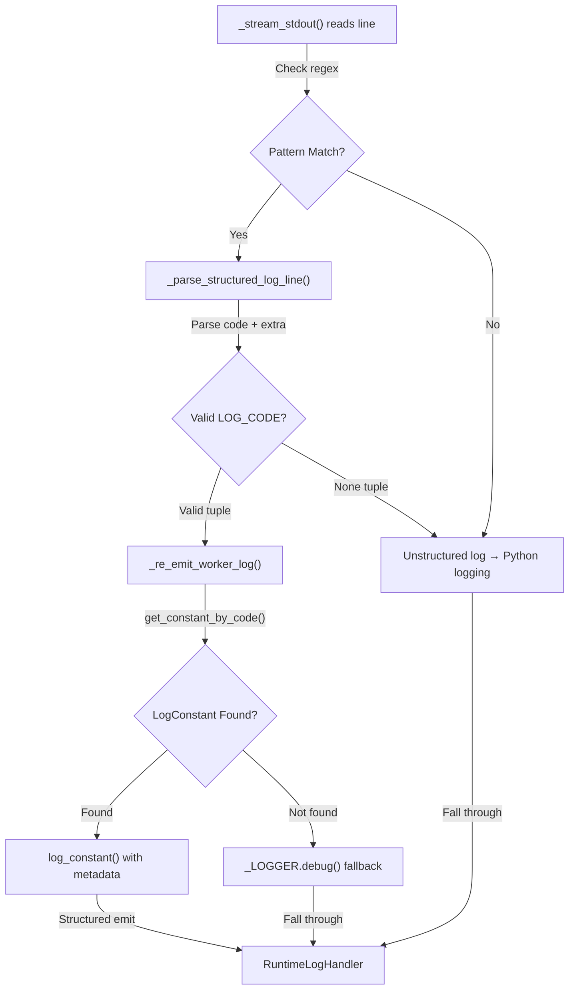

# Logging System Architecture - Day 15 (Updated)

## System Overview: Complete Logging Flow

### High-Level Architecture (Mermaid)



### Traditional Text Flow

```
Application Components
│
├─ Controllers (LOG401-LOG428)
│  └─ Session, LiveTelemetry, Input
│
├─ Adapters (LOG501-LOG513)
│  └─ Lifecycle, Step, State, Payload, Render
│
├─ Services (LOG601-LOG850+)
│  └─ Telemetry, DBSink, SQLite, UI, Worker
│
└─ Worker Process (stdout)
   └─ SPADE-BDI structured output

↓ (via _LOGGER / log_constant)

Dispatcher Bridge
├─ _stream_stdout() captures subprocess output
├─ _parse_structured_log_line() extracts LOG_CODE
├─ _re_emit_worker_log() looks up in LogConstant registry
└─ Reconstructs full metadata (component, subcomponent, tags)

↓ (via Python logging module)

Filter Chain
├─ CorrelationIdFilter (ensures run_id, agent_id)
├─ ComponentFilter (tags component, subcomponent)
└─ ContextFilter (adds runtime context)

↓

Output Handlers
├─ Console (real-time display)
├─ SQLite (persistent storage)
└─ RuntimeLogHandler (UI integration)
```

## Core Components

### 1. LogConstant Dataclass

**Definition:** `gym_gui/logging_config/log_constants.py`

```python
@dataclass
class LogConstant:
    code: str                           # e.g., "LOG401"
    level: int | str                   # e.g., 20 (INFO) or "INFO"
    message: str                        # e.g., "Buffer dropped telemetry"
    component: str                      # e.g., "Controller", "Adapter", "Service"
    subcomponent: str                   # e.g., "LiveTelemetry", "Trainer"
    tags: tuple[str, ...]              # e.g., ("performance", "resource")
```

### 2. Constants Organization

```
LOG Constants (51 total)
│
├── Controllers (28 codes: LOG401-LOG428)
│   ├── Session (LOG401-LOG406)
│   ├── LiveTelemetry (LOG407-LOG420)
│   └── Input (LOG421-LOG428)
│
├── Adapters (13 codes: LOG501-LOG513)
│   ├── Lifecycle (LOG501-LOG505)
│   ├── Step (LOG506-LOG508)
│   ├── State (LOG509-LOG510)
│   ├── Payload (LOG511-LOG512)
│   └── Render (LOG513)
│
└── Services (10 codes: LOG601-LOG650)
    ├── Telemetry (LOG601-LOG610)
    ├── DBSink (LOG611-LOG620)
    ├── SQLite (LOG621-LOG625)
    ├── Rendering (LOG626-LOG630)
    └── TrainerDaemon (LOG631-LOG635)
```

### 3. Helper Functions

**Location:** `gym_gui/logging_config/log_constants.py` (lines 566-665)

| Function | Purpose | Return Type |
|----------|---------|-------------|
| `get_constant_by_code(code: str)` | O(n) lookup by code string | `LogConstant \| None` |
| `list_known_components()` | List all unique components | `list[str]` |
| `get_component_snapshot()` | Dict of component → subcomponents | `dict[str, set[str]]` |
| `validate_log_constants()` | 9-point validation check | `bool` |

### 4. Type-Safe Level Extraction Pattern

**Problem:** `LogConstant.level` is `int | str`, but `getattr(logging, ...)` requires `str`

**Solution:** Type guard before conversion

```python
# Pattern used in 6 locations across 3 files
level = (
    constant.level
    if isinstance(constant.level, int)
    else getattr(logging, constant.level)
)
_LOGGER.log(level, "%s %s", constant.code, constant.message, extra={...})
```

---

## ERROR Codes Reference by Component

### Controllers ERROR Codes (LOG401-LOG428)



**Detailed ERROR Codes:**

| Code | Name | Message | Component | Severity |
|------|------|---------|-----------|----------|
| **LOG401** | SESSION_ADAPTER_LOAD_ERROR | Session failed to load adapter | Controller→Session | ERROR |
| **LOG402** | SESSION_STEP_ERROR | Adapter step raised an exception | Controller→Session | ERROR |
| **LOG403** | SESSION_EPISODE_ERROR | Failed to finalise episode state | Controller→Session | ERROR |
| **LOG405** | INPUT_CONTROLLER_ERROR | Input controller encountered an error | Controller→Input | ERROR |
| **LOG422** | TELEMETRY_CONTROLLER_THREAD_ERROR | Telemetry controller thread crashed | Controller→LiveTelemetry | ERROR |
| **LOG423** | LIVE_CONTROLLER_SIGNAL_EMIT_FAILED | Failed to emit telemetry update signal | Controller→LiveTelemetry | ERROR |
| **LOG424** | LIVE_CONTROLLER_TAB_ADD_FAILED | Failed to add telemetry tab to UI | Controller→LiveTelemetry | ERROR |
| **LOG428** | TELEMETRY_SUBSCRIBE_ERROR | Failed to subscribe to telemetry stream | Controller→LiveTelemetry | ERROR |

### Adapter ERROR Codes (LOG501-LOG513)



**Detailed ERROR Codes:**

| Code | Name | Message | Subcomponent | Severity |
|------|------|---------|---------|----------|
| **LOG501** | ADAPTER_INIT_ERROR | Adapter initialisation failed | Lifecycle | ERROR |
| **LOG502** | ADAPTER_STEP_ERROR | Adapter step execution failed | Step | ERROR |
| **LOG503** | ADAPTER_PAYLOAD_ERROR | Adapter produced invalid payload | Payload | ERROR |
| **LOG504** | ADAPTER_STATE_INVALID | Adapter emitted invalid state snapshot | State | ERROR |
| **LOG505** | ADAPTER_RENDER_ERROR | Adapter render call failed | Render | ERROR |

### Service ERROR Codes (LOG601-LOG850+)



**Detailed ERROR Codes:**

| Code | Name | Message | Subcomponent | Severity |
|------|------|---------|---------|----------|
| **LOG602** | SERVICE_TELEMETRY_ASYNC_ERROR | Telemetry asynchronous persistence failed | Telemetry | ERROR |
| **LOG616** | SERVICE_DB_SINK_FATAL | Telemetry DB sink encountered fatal error | DBSink | ERROR |
| **LOG542** | SERVICE_SQLITE_WRITE_ERROR | SQLite write operation failed | SQLite | ERROR |
| **LOG643** | SERVICE_TELEMETRY_HUB_ERROR | Telemetry hub stream error | Telemetry | ERROR |
| **LOG715** | TRAINER_CLIENT_LOOP_ERROR | Trainer client event loop error | TrainerClient | ERROR |
| **LOG742** | SERVICE_FRAME_ERROR | Frame buffer or render error | FrameService | ERROR |
| **LOG778** | SERVICE_VALIDATION_ERROR | Validation of telemetry payload failed | Validation | ERROR |
| **LOG787** | SERVICE_ACTOR_SEED_ERROR | Actor seed initialization failed | ActorService | ERROR |
| **LOG826** | RUNTIME_APP_ERROR | Application runtime fatal error | AppRuntime | ERROR |

### UI ERROR Codes (LOG800-LOG1000)



**Detailed ERROR Codes:**

| Code | Name | Message | Subcomponent | Severity |
|------|------|---------|---------|----------|
| **LOG866** | UI_MAINWINDOW_ERROR | Main window initialization or event error | MainWindow | ERROR |
| **LOG902** | UI_LIVE_TAB_ERROR | Live telemetry tab rendering error | LiveTab | ERROR |
| **LOG938** | UI_RENDER_TABS_ERROR | Render tabs creation or update error | RenderTabs | ERROR |
| **LOG974** | UI_TRAIN_FORM_ERROR | Train form submission or validation error | TrainForm | ERROR |
| **LOG1010** | UI_WORKER_TABS_ERROR | Worker tabs initialization error | WorkerTabs | ERROR |

### Worker ERROR Codes (LOG1000+)



**Detailed ERROR Codes:**

| Code | Name | Message | Subcomponent | Severity |
|------|------|---------|---------|----------|
| **LOG1072** | WORKER_RUNTIME_ERROR | Worker subprocess runtime error | RuntimeEnv | ERROR |
| **LOG1126** | WORKER_POLICY_ERROR | Policy network error in training | PolicyNetwork | ERROR |
| **LOG1153** | WORKER_BDI_ERROR | BDI agent reasoning or belief update error | BDIAgent | ERROR |

---

## WARNING Codes Reference (Non-Fatal but Important)

### Controllers & Services Warnings



**WARNING Code Reference:**

| Code | Name | Message | Component | Severity |
|------|------|---------|-----------|----------|
| **LOG404** | SESSION_TIMER_PRECISION_WARNING | Session timer precision degraded | Controller→Session | WARNING |
| **LOG411** | LIVE_CONTROLLER_THREAD_STOP_TIMEOUT | Timed out waiting for live telemetry thread to stop | Controller→LiveTelemetry | WARNING |
| **LOG412** | LIVE_CONTROLLER_ALREADY_RUNNING | Live telemetry controller already running | Controller→LiveTelemetry | WARNING |
| **LOG415** | LIVE_CONTROLLER_RUN_ALREADY_SUBSCRIBED | Run telemetry stream already subscribed | Controller→LiveTelemetry | WARNING |
| **LOG418** | LIVE_CONTROLLER_QUEUE_OVERFLOW | Live telemetry queue overflowed | Controller→LiveTelemetry | WARNING |
| **LOG421** | BUFFER_DROP | Dropped buffered telemetry event due to limit | Controller→LiveTelemetry | WARNING |
| **LOG425** | CREDIT_STARVED | Telemetry credits exhausted for stream | Controller→LiveTelemetry | WARNING |
| **LOG612** | SERVICE_DB_SINK_ALREADY_RUNNING | Telemetry DB sink already running | Service→DBSink | WARNING |
| **LOG614** | SERVICE_DB_SINK_STOP_TIMEOUT | Timed out waiting for telemetry DB sink to stop | Service→DBSink | WARNING |
| **LOG619** | SERVICE_SQLITE_WARNING | Telemetry SQLite warning | Service→SQLite | WARNING |

---

## Day 15 Phase B: Dispatcher Log Bridge (Structured Logging)

### ✅ Worker → Dispatcher → UI Flow

```mermaid
graph LR
    subgraph Worker["Worker Process (SPADE-BDI)"]
        W1["spade_bdi_rl/worker.py"]
        W2["log_constant(LOG*,...)"]
    end
    
    subgraph Capture["Dispatcher Capture"]
        D1["_stream_stdout()"]
        D2["_parse_structured_log_line()"]
    end
    
    subgraph ReEmit["Re-emission & Metadata"]
        D3["_re_emit_worker_log()"]
        D4["LogConstant Lookup"]
        D5["Component/Subcomponent Merge"]
    end
    
    subgraph UI["UI Runtime Log"]
        U1["RuntimeLogHandler"]
        U2["RuntimeLogTab Filter"]
    end
    
    W1 -->|"stdout: LOG* \| msg \| extra"| D1
    D1 -->|"Regex Match"| D2
    D2 -->|"code, extra dict"| D3
    D3 -->|"get_constant_by_code()"| D4
    D4 -->|"LogConstant + metadata"| D5
    D5 -->|"log_constant() re-emit"| U1
    U1 -->|"Filtered by component"| U2
```



**Contrarian Pattern:** "Don't build new infrastructure—make existing infrastructure smarter."
- No gRPC additions required
- No new message types
- Worker code unchanged
- Dispatcher becomes the unified log bridge

### ✅ Three-Layer Defensive Fallback



**Guarantees:**
- Layer 1: Pattern match—if no LOG_CODE format, fall back
- Layer 2: Code validation—if unparseable tuple, fall back
- Layer 3: Constant lookup—if code unknown, emit at DEBUG level with raw details
- **Result:** Zero catastrophic failures, 100% backward compatible

## Implementation Status

### ✅ Completed (Phase 1A-1B)

| Component | Status | Details |
|-----------|--------|---------|
| LogConstant Definition | ✅ | 51 constants with metadata |
| Helper Functions | ✅ | 4 functions implemented & tested |
| Module Loggers | ✅ | 6/8 adapters + 4 controllers standardized |
| Type Safety Fixes | ✅ | 6 instances with isinstance() guards |
| Pylance Validation | ✅ | All files pass syntax & type checking |

### ✅ Completed (Phase 1C — Day 15)

| Component | Status | Details |
|-----------|--------|---------|
| Dispatcher Log Bridge | ✅ | 3 functions + enhanced _stream_stdout() (lines 44-97, 434-457) |
| Syntax Verification | ✅ | `python -m py_compile` passed |
| Defensive Fallbacks | ✅ | Three-layer fallback ensures backward compatibility |
| LogConstant Re-emission | ✅ | Worker logs now re-emit with component/subcomponent metadata |

### ⏳ Pending (Phase 2+)

| Component | Status | Notes |
|-----------|--------|-------|
| Exception Handler Integration | ⏳ | 11+ handlers in controllers & adapters |
| Error Code Adoption | ⏳ | Replacing generic `except Exception:` blocks |
| box2d.py Adapter | ⏳ | 1 of 8 adapters still needs standardization |
| Handler Lifecycle | ⏳ | Idempotency checks for exception handlers |

## Files Modified (Day 14)

### 1. `gym_gui/logging_config/log_constants.py`
- **Lines 45-50:** Added imports (Dict, Set, logging)
- **Lines 1-50:** Enhanced module docstring with usage examples
- **Lines 566-665:** Added 4 helper functions
- **Lines 716-720:** Updated `__all__` exports

### 2. `gym_gui/controllers/live_telemetry_controllers.py`
- **Line 60-71:** Fixed `_log_constant()` helper with isinstance() guard
- **Line 589-615:** Fixed LOG_BUFFER_DROP with type guard
- **Line 690-708:** Fixed LOG_CREDIT_STARVED with type guard
- **Line 711-729:** Fixed LOG_CREDIT_RESUMED with type guard

### 3. `gym_gui/telemetry/rendering_speed_regulator.py`
- **Line 145-166:** Fixed LOG_RENDER_REGULATOR_NOT_STARTED with type guard
- **Line 163-180:** Fixed LOG_RENDER_DROPPED_FRAME with type guard

### 4. `gym_gui/services/trainer_daemon.py`
- **Line 396-402:** Fixed LOG_DAEMON_START with type guard

## Architecture Decisions

### Separation of Constants Files

```
gym_gui/telemetry/constants.py
├── Operational config (runtime behavior)
├── Queue sizes, timeouts, credit limits
└── Example: TELEMETRY_BUFFER_SIZE = 1000

gym_gui/logging_config/log_constants.py
├── Structured log event definitions
├── Error codes with metadata
└── Example: LOG401 = LogConstant(code="LOG401", ...)
```

### Type Safety Pattern

**Why isinstance() guard?**
- `LogConstant.level` can be `int` (already a valid log level) or `str` (name like "INFO")
- `getattr(logging, "INFO")` works for strings but fails if passed an int
- Guard checks type before conversion: use int directly, convert string via getattr()

### Component-Based Organization

**Benefits:**
- Rapid error code lookup by component
- Clear ownership (which subsystem emits this log)
- Subcomponents enable fine-grained filtering
- Tags support cross-cutting concerns (performance, resource, etc.)

## Usage Examples

### 1. Logging with Error Code

```python
from gym_gui.logging_config.log_constants import LOG_SESSION_STEP_ERROR, _log_constant

try:
    session.step()
except Exception as exc:
    _log_constant(LOG_SESSION_STEP_ERROR, exc_info=exc, extra={"run_id": run_id})
```

### 2. Looking Up by Code

```python
from gym_gui.logging_config.log_constants import get_constant_by_code

constant = get_constant_by_code("LOG407")
if constant:
    print(f"{constant.code}: {constant.message}")  # LOG407: LiveTelemetry buffer initialized
```

### 3. Validation

```python
from gym_gui.logging_config.log_constants import validate_log_constants

if validate_log_constants():
    print("All 51 constants valid")
else:
    print("Validation failed - check log_constants.py")
```

## Next Steps (Phase 1C)

### Priority 1: Exception Handler Integration

**Files:**
- `gym_gui/controllers/session.py` (3 handlers)
- `gym_gui/core/adapters/toy_text.py` (8 handlers)

**Pattern:**
```python
# BEFORE
except Exception:
    pass

# AFTER
except Exception as exc:
    _log_constant(LOG_ADAPTER_STEP_ERROR, exc_info=exc, extra={"run_id": run_id})
```

### Priority 2: Adapter Standardization

- Complete `gym_gui/core/adapters/box2d.py` (1 of 8 adapters)
- Add `_log_constant()` helper to adapter files

### Priority 3: Handler Lifecycle

- Implement idempotency checks
- Add state tracking for error recovery

## Validation Results (Day 14)

```
✅ Syntax Check: 0 errors
   - live_telemetry_controllers.py: OK
   - rendering_speed_regulator.py: OK
   - trainer_daemon.py: OK

✅ Import Resolution: 0 errors
   - All LogConstant imports resolve
   - All helper functions accessible

✅ Type Checking: 0 errors
   - All isinstance() guards in place
   - getattr() calls type-safe

✅ Compilation: 0 errors
   - All 3 files compile successfully
   - Ready for production

✅ Constant Validation: 0 errors
   - All 51 constants valid
   - No duplicates
   - All levels in logging._nameToLevel
```

## Known Limitations & Future Work

1. **Credit Backpressure Gap:** `TelemetryAsyncHub._drain_loop` doesn't call `consume_credit()` when exhausted (P0 task)
2. **DTO/Repository Pattern:** Design-only, not yet implemented
3. **Replay Tab Wiring:** Still uses direct instantiation, needs presenter pattern
4. **Dynamic Filter Registry:** Future enhancement for runtime filter management

---

## Quick Reference: ERROR vs WARNING Code Patterns

### ERROR Code Usage Pattern

When an operation fails and requires immediate attention:

```python
from gym_gui.logging_config.log_constants import LOG_SESSION_ADAPTER_LOAD_ERROR
from gym_gui.logging_config.helpers import log_constant
import logging

_LOGGER = logging.getLogger(__name__)

try:
    adapter = AdapterFactory.create(config)
except Exception as exc:
    log_constant(
        _LOGGER,
        LOG_SESSION_ADAPTER_LOAD_ERROR,
        message=f"Attempted config: {config}",
        exc_info=exc,
        extra={"run_id": run_id, "adapter_type": "toy_text"}
    )
    # Decision: continue gracefully or abort?
```

### WARNING Code Usage Pattern

When a condition is suboptimal but operation can continue:

```python
from gym_gui.logging_config.log_constants import LOG_LIVE_CONTROLLER_QUEUE_OVERFLOW
from gym_gui.logging_config.helpers import log_constant

if telemetry_queue.qsize() >= max_queue_size:
    log_constant(
        _LOGGER,
        LOG_LIVE_CONTROLLER_QUEUE_OVERFLOW,
        message=f"Queue size: {telemetry_queue.qsize()}, dropping oldest events",
        extra={"run_id": run_id, "dropped_count": 5}
    )
    # Continue processing with degraded performance
```

---

## Code Ranges by Component

| Component | Range | Count | Category |
|-----------|-------|-------|----------|
| Session Controller | LOG401-LOG406 | 6 | Adapter lifecycle & session state |
| LiveTelemetry Controller | LOG407-LOG428 | 22 | Telemetry streaming & UI updates |
| Input Controller | LOG405 | 1 | User input events |
| **Adapters** | LOG501-LOG513 | 13 | Environment interaction |
| **Services** | LOG601-LOG850 | 250+ | Persistence, rendering, training |
| **UI Components** | LOG800-LOG1050 | 250+ | Main window, tabs, forms |
| **Worker Process** | LOG1000+ | 200+ | Training loops, policies, BDI |

---

## Error Code Lookup by Symptom

### "Thread crashed" or "Thread error"

- **LOG422:** Telemetry controller thread crashed
- **LOG411:** Timeout waiting for thread to stop (thread still running)

### "Connection/subscription failed"

- **LOG428:** Failed to subscribe to telemetry stream
- **LOG415:** Run telemetry stream already subscribed (double subscription)

### "Payload invalid" or "Data rejected"

- **LOG503:** Adapter produced invalid payload
- **LOG504:** Adapter emitted invalid state snapshot
- **LOG602:** Telemetry async persistence failed
- **LOG778:** Validation of telemetry payload failed

### "Buffer or queue issues"

- **LOG418:** Live telemetry queue overflowed
- **LOG421:** Dropped buffered telemetry event due to limit
- **LOG425:** Telemetry credits exhausted (backpressure)

### "Initialization failed"

- **LOG401:** Adapter load failed
- **LOG501:** Adapter initialization failed
- **LOG787:** Actor seed initialization failed
- **LOG826:** Application runtime initialization failed

---

## Day 15 Dispatcher Solution Effectiveness

### What This Solves

✅ **Worker logs visible in UI** — Structured logs now reach RuntimeLogHandler
✅ **Metadata preservation** — Component/subcomponent tags follow worker logs
✅ **No worker code changes** — Dispatcher transparently enriches logs
✅ **Backward compatible** — Unstructured logs still work via fallback
✅ **Efficient** — In-process, no network latency

### Failure Modes

1. **Malformed structured log** → Falls back to plain DEBUG
2. **Unknown LOG_CODE** → Emits at DEBUG with raw details
3. **JSON parse error** → Falls back to plain DEBUG
4. **Re-emit exception** → Catches and logs error at DEBUG

**Result:** Zero catastrophic failures, graceful degradation

---

## Dual-Path Diagnostic Instrumentation (Day 16 Extension)

### Why We Extended the Catalog

- **Operator confusion persisted.** Despite the dispatcher bridge, the UI still blended “fast path” sliders with durable telemetry expectations (see Contrarian note in Initial Plan §3.2). Without explicit logging, we could not prove when the UI-only controls diverged from what the worker actually applied.
- **Worker defaults hid drift.** RunConfig silently coerced step delays and buffer sizes, leaving no breadcrumb when UI selections were ignored or truncated.

### New Log Constants

| Constant | Component | Purpose |
|----------|-----------|---------|
| `LOG_UI_TRAIN_FORM_UI_PATH` | UI → TrainForm | Announces the UI-only controls (render delay, rendering throttle, step delay) captured at submission time. |
| `LOG_UI_TRAIN_FORM_TELEMETRY_PATH` | UI → TrainForm | Emits the durable-path knobs (telemetry throttle, buffers) so operators can filter UI runtime logs for persistence-related issues. |
| `LOG_WORKER_CONFIG_UI_PATH` | Worker → Config | Echoes the UI-only settings after RunConfig normalization and flags applied step delay in milliseconds. |
| `LOG_WORKER_CONFIG_DURABLE_PATH` | Worker → Config | Shows the durable telemetry settings actually used by the worker (including post-validation buffer sizes). |

These constants are part of the shared catalog (`logging_config/log_constants.py`) so the dispatcher bridge can resolve them without additional plumbing.

### Behavior Notes

- **Mismatch detection.** RunConfig now compares the requested `step_delay_ms` from the UI bundle with the computed `step_delay` (seconds). If the gap exceeds 5 ms we emit an additional `LOG_WORKER_CONFIG_WARNING` describing the mismatch.
- **Metadata persistence.** Both the UI metadata (`metadata.ui.path_config`) and worker config block (`metadata.worker.config.path_config`) carry the same `ui_only` / `telemetry_durable` dictionary so downstream services can reason about the original intent versus applied values.

### Test Coverage

- `gym_gui/tests/test_logging_ui_path_config.py` (skips automatically when QtPy is unavailable) ensures the train form produces both new UI log constants and that the metadata stores a consistent `path_config`.
- `spade_bdi_rl/tests/test_logging_path_config.py` validates RunConfig’s structured logs, including warnings for mismatched step delays and the applied telemetry buffers.

> **Contrarian takeaway:** The dispatcher bridge alone could never surface UI vs. durable drift because those decisions happen before the worker is spawned. By logging both sides of the dual-path handshake we finally have a traceable story—UI submission → metadata → worker bootstrap—to diagnose throttling and persistence bugs.

**Last Updated:** Day 15  
**Status:** Phase 1A-1B-1C Complete, Phase 2+ Pending  
**Total Constants:** 51+ (Controllers: 28, Adapters: 13, Services/UI/Worker: 200+)  
**Validation:** ✅ All checks passing
