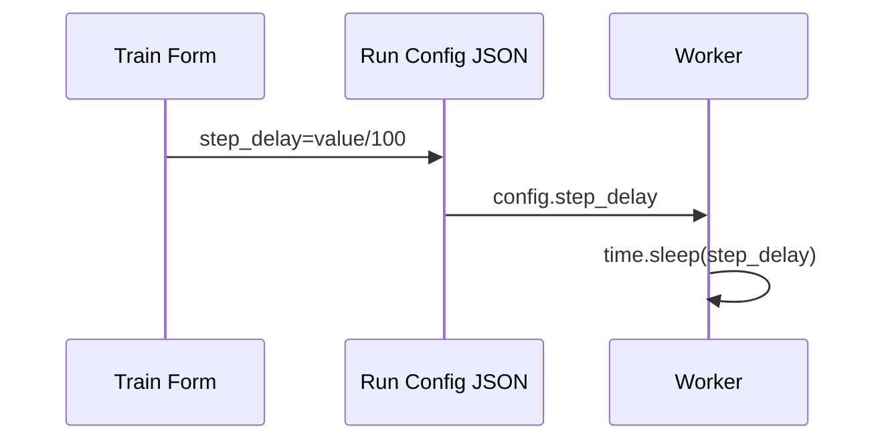

# Step Delay Slider (UI Training Speed)

## Summary
- Lives in `gym_gui/ui/widgets/spade_bdi_train_form.py` (`_ui_training_speed_slider`).
- Maps slider value (0–100) → seconds (`value / 100.0`).
- Persists into run config (`metadata.worker.config.step_delay`).
- SPADE worker reads it (`spade_bdi_rl/core/config.py`) and sleeps between steps (`runtime.py`).

## Data Flow

## Impacted Files
- `gym_gui/ui/widgets/spade_bdi_train_form.py`
- `var/trainer/configs/config-*.json`
- `spade_bdi_rl/core/config.py`
- `spade_bdi_rl/core/runtime.py`

## Considerations
- Other workers may ignore the field.
- Delay doesn’t affect telemetry buffers; only pacing changes.
- When live render disabled, recommend leaving delay at 0 for throughput.
