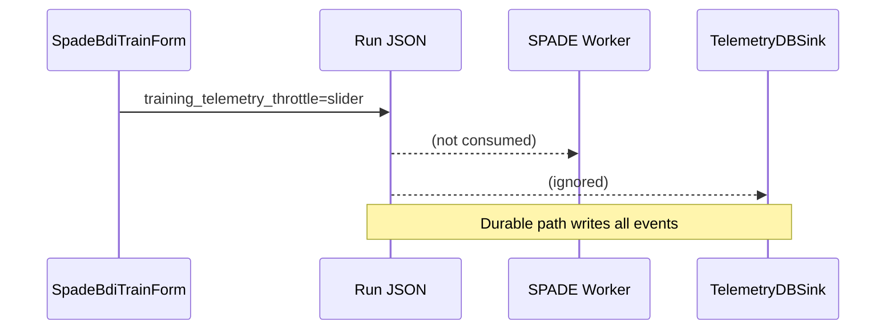

# Telemetry Throttle Slider

## Current Behaviour

- UI definition: `gym_gui/ui/widgets/spade_bdi_train_form.py` (`_training_telemetry_throttle_slider`).
- `_on_training_telemetry_throttle_changed` adjusts label/warning but only records the value in:
  - `metadata.ui.training_telemetry_throttle`
  - `environment["TRAINING_TELEMETRY_THROTTLE"]`
- No downstream consumer: worker code (`spade_bdi_rl/core/config.py`, `runtime.py`) never reads the field.
- Result: slider is cosmetic; durable path (`TelemetryDBSink`) still writes every event.

## Problem

- Operators might believe the slider throttles persistence or controls dropped-step counters.
- With no enforcement, intentionally dropping telemetry is not possible and warning text is misleading.

## Files / Areas Impacted

- `gym_gui/ui/widgets/spade_bdi_train_form.py` (definition & metadata emission).
- Run configs under `var/trainer/configs/` (store values in `metadata.ui` & `environment`).
- Documentation still references the slider (Day 14 Task 1 plan).
- *Missing implementation:* `spade_bdi_rl` and telemetry services ignore the setting.

## Recommended Actions

- Either implement data sampling in worker/telemetry pipeline or hide the control.
- Update warning copy to clarify current behaviour.
- Track decision in design docs to avoid future confusion.

## Reference Diagram

