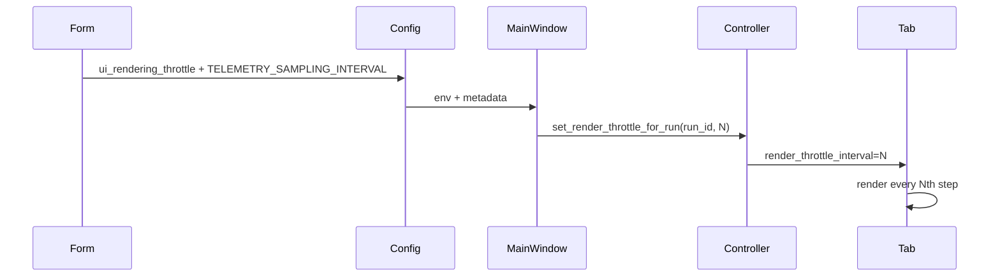

# UI Rendering Throttle Slider

## Purpose
- Lets operators skip visual renders while keeping telemetry tables/durable writes intact.
- Range 1–10 (1 = render every step, 10 = render every tenth step).
- Lives in `gym_gui/ui/widgets/spade_bdi_train_form.py`.

## Code Path
1. **Form layer**
   - `_ui_rendering_throttle_slider` defined (~line 160).
   - `_on_ui_rendering_throttle_changed` updates label/warning.
   - `_build_base_config()` stores value in:
     - `metadata.ui["ui_rendering_throttle"]`
     - `environment["TELEMETRY_SAMPLING_INTERVAL"]`
2. **MainWindow** (`gym_gui/ui/main_window.py`)
   - `_on_training_submitted` reads env var, calls `LiveTelemetryController.set_render_throttle_for_run`.
3. **Controller** (`gym_gui/controllers/live_telemetry_controllers.py`)
   - Persists throttle per run and returns it when tabs are created.
4. **LiveTelemetryTab** (`gym_gui/ui/widgets/live_telemetry_tab.py`)
   - Constructor receives `render_throttle_interval` and renders every Nth step in `add_step`.

## Interactions with Other Controls
- **Render delay**: sets timer cadence; combined with throttle defines visual FPS.
- **Disable live rendering**: when checked, slider is disabled; env still carries last value—tabs ignore it because they never create renderers.
- **Telemetry**: DB path unaffected; tables update on every step regardless of throttle.

## Known Gaps
- Env var remains at old value when rendering disabled (minor inconsistency).
- No UI feedback showing effective throttle for running jobs.
- Docs historically implied telemetry impact; ensure warnings emphasize visual-only effect.

## Impacted Files
- `gym_gui/ui/widgets/spade_bdi_train_form.py`
- `gym_gui/ui/main_window.py`
- `gym_gui/controllers/live_telemetry_controllers.py`
- `gym_gui/ui/widgets/live_telemetry_tab.py`
- Config snapshots under `var/trainer/configs/`

## Recommendations
1. When disabling rendering, set `TELEMETRY_SAMPLING_INTERVAL=1` to avoid stale values.
2. Surface throttle info in LiveTelemetryTab header ("Rendering every Nth step").
3. Document slider as "visual only" (done here) and align tooltips/warnings.
