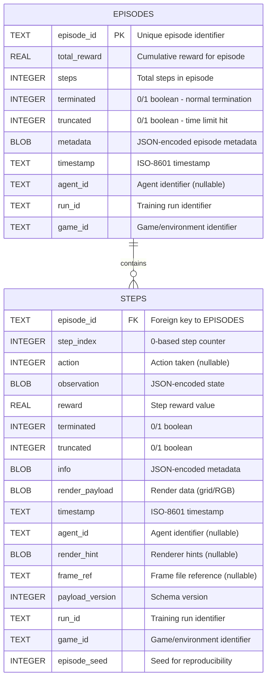
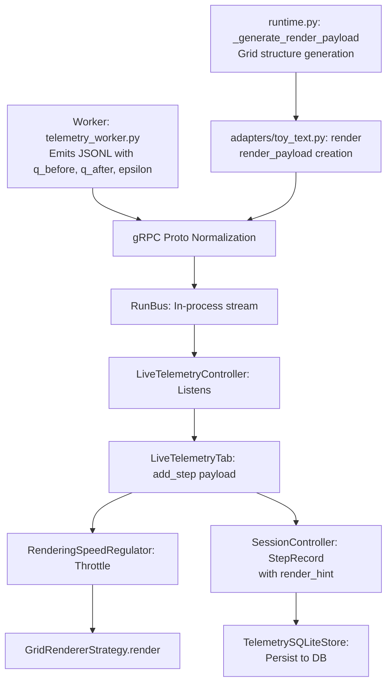

# Day 16 — Task 1: Live Telemetry Tab EER Diagram (Deep Analysis)

## Overview

This document presents the Entity-Relationship (EER) diagram for the telemetry tables displayed in the **Live Telemetry Tab** of the GUI, along with **detailed payload structures**, **render_hint content**, and **all impacted files**. The diagram shows the fields and relationships between the `EPISODES` and `STEPS` tables in the telemetry SQLite database.

### Important Note on Data Flow

The Live Telemetry Tab receives data through two different pipelines:

1. **Event Stream Pipeline (Real-time):** Events flow from `RunBus` (in-process message bus) → `LiveTelemetryController` → `LiveTelemetryTab`. These payloads contain additional fields like `game_id` and `episode_seed`.
2. **Database Query Pipeline (Historical):** Queries to `TelemetrySQLiteStore.recent_episodes()` and `recent_steps()` return only a subset of fields (missing `game_id`, `episode_seed`).

The UI displays fields from the **event stream payloads**, not directly from database queries. However, all fields are persisted in the SQLite database.

---

## EER Diagram: Telemetry Tables Schema



---

## UI Display Mapping

### Telemetry Recent Episodes Table (11 columns)

The **Episodes** table in the Live Telemetry Tab displays the following columns:

| Display Column | Source Field | Type | Description |
|---|---|---|---|
| Timestamp | `timestamp` | TEXT | ISO-8601 timestamp when episode completed |
| Episode | `episode_id` | TEXT | Unique episode identifier |
| Steps | `steps` | INTEGER | Total number of steps in episode |
| Reward | `total_reward` | REAL | Cumulative reward for entire episode |
| Terminated | `terminated` | INTEGER | 0/1 boolean - episode ended normally |
| Truncated | `truncated` | INTEGER | 0/1 boolean - episode hit step limit |
| Seed | `episode_seed` | INTEGER | Random seed for reproducibility |
| Episode Seed | `episode_seed` | INTEGER | Same as Seed (duplicate field) |
| Mode | `metadata` | BLOB | Extracted from metadata JSON (control mode) |
| Game | `game_id` | TEXT | Game/environment identifier |
| Outcome | `metadata` | BLOB | Extracted from metadata JSON (success/failure) |

**Primary Key:** `episode_id`
**Foreign Key References:** `run_id`, `agent_id`

---

### Telemetry Recent Steps Table (10 columns)

The **Steps** table in the Live Telemetry Tab displays the following columns:

| Display Column | Source Field | Type | Description |
|---|---|---|---|
| Timestamp | `timestamp` | TEXT | ISO-8601 timestamp when step occurred |
| Episode | `episode_id` | TEXT | Foreign key to EPISODES table |
| Step | `step_index` | INTEGER | 0-based step number within episode |
| Episode Seed | `episode_seed` | INTEGER | Seed value for episode reproducibility |
| Action | `action` | INTEGER | Action taken by agent/human (nullable) |
| Reward | `reward` | REAL | Reward received for this step |
| Terminated | `terminated` | INTEGER | 0/1 boolean - episode ended after step |
| Truncated | `truncated` | INTEGER | 0/1 boolean - step limit reached |
| Observation | `observation` | BLOB | JSON-encoded state/observation |
| Info | `info` | BLOB | JSON-encoded metadata/debug info |

**Primary Key:** Composite `(episode_id, step_index)`
**Foreign Key References:** `episode_id` → EPISODES, `run_id`, `agent_id`

---

## Data Relationships

### 1:Many Relationship (EPISODES to STEPS)

- **One EPISODE** contains **Many STEPS**
- **Foreign Key:** `episode_id` in STEPS table references `episode_id` in EPISODES table
- **Referential Integrity:** Each step must belong to exactly one episode
- **Ordering:** Steps within an episode are ordered by `step_index` (0-based)

### Additional Key Relationships

- **Run Tracking:** Both tables reference `run_id` to group episodes/steps by training run
- **Agent Tracking:** Both tables reference `agent_id` to filter by specific agent
- **Environment Tracking:** Both tables reference `game_id` to identify the game/environment

---

## Database Indexes

The telemetry database includes the following indexes for efficient querying:

```sql
CREATE INDEX IF NOT EXISTS idx_steps_episode 
    ON steps(episode_id, step_index);

CREATE INDEX IF NOT EXISTS idx_episodes_run 
    ON episodes(run_id, agent_id, episode_id);

CREATE INDEX IF NOT EXISTS idx_steps_run 
    ON steps(run_id, episode_id);
```

These indexes optimize:

- **Episode Lookup:** Finding all steps for a specific episode
- **Run Filtering:** Filtering episodes/steps by run and agent
- **Batch Queries:** Retrieving run-specific data efficiently

---

## Field Encoding & Serialization

### BLOB Fields (Binary Large Objects)

| Field | Content | Encoding |
|---|---|---|
| `observation` | State representation | JSON-encoded (usually dict/list) |
| `info` | Metadata/debug info | JSON-encoded (custom per adapter) |
| `render_payload` | Grid/RGB render data | Binary (PNG, JPEG, or custom format) |
| `render_hint` | Renderer hints | BLOB (contains Q-values, epsilon, etc.) |
| `metadata` (Episodes) | Episode-level metadata | JSON-encoded (control_mode, success, etc.) |

### TEXT Fields

All timestamp fields use **ISO-8601** format for consistency and auditability.

---

## Query Examples

### Recent Episodes for a Run

```sql
SELECT episode_id, total_reward, steps, terminated, truncated, timestamp
FROM episodes
WHERE run_id = ? AND agent_id = ?
ORDER BY rowid DESC
LIMIT 20;
```

### Steps for a Specific Episode

```sql
SELECT episode_id, step_index, action, reward, terminated, truncated, 
       observation, info, timestamp
FROM steps
WHERE episode_id = ?
ORDER BY step_index ASC;
```

### Statistics for Live Telemetry Tab

```sql
SELECT COUNT(*) as total_episodes, 
       SUM(total_reward) as total_reward, 
       SUM(steps) as total_steps
FROM episodes
WHERE run_id = ? AND agent_id = ?;
```

---

## Live Telemetry Tab Buffer Management

The Live Telemetry Tab maintains in-memory buffers:

- **Episode Buffer:** Last 100 episodes (configurable via `episode_buffer_size`)
- **Step Buffer:** Last 100 steps (configurable via `buffer_size`)
- **Throttle:** Rendering updates throttled to configurable interval (e.g., every 1st, 2nd, nth step)

When buffers reach capacity, oldest entries are dropped and tracked in overflow statistics.

---

## Source Code References

- **Schema Definition:** `gym_gui/telemetry/sqlite_store.py:80-133`
- **UI Display Logic:** `gym_gui/ui/widgets/live_telemetry_tab.py:143-190`
- **Data Retrieval:** `gym_gui/telemetry/sqlite_store.py:561-587`
- **Database Migrations:** `gym_gui/telemetry/migrations.py:54+`

---

## Complete List of Impacted Files

### Core Telemetry Architecture

| File Path | Purpose | Key Components |
|---|---|---|
| `gym_gui/core/data_model/telemetry_core.py` | Data model definitions | `StepRecord` (15 fields), `EpisodeRollup` (10 fields) |
| `gym_gui/telemetry/sqlite_store.py` | SQLite persistence layer | Schema creation, row serialization/deserialization, query methods |
| `gym_gui/telemetry/db_sink.py` | Background writer thread | Event batching, payload conversion, WAL checkpoints |
| `gym_gui/telemetry/migrations.py` | Database schema migrations | Column additions, index creation, WAL configuration |
| `gym_gui/telemetry/run_bus.py` | In-process event bus | Topic subscription, event publishing |
| `gym_gui/telemetry/events.py` | Event definitions | `TelemetryEvent`, `Topic` enum |
| `gym_gui/telemetry/credit_manager.py` | Stream credit management | Backpressure handling, credit initialization |
| `gym_gui/telemetry/rendering_speed_regulator.py` | Render throttling | Frame rate limiting for visual rendering |

### UI Widgets & Controllers

| File Path | Purpose | Dependencies |
|---|---|---|
| `gym_gui/ui/widgets/live_telemetry_tab.py` | Main live telemetry display widget | LiveTelemetryTab (1117 lines, 2 tables, rendering) |
| `gym_gui/ui/widgets/base_telemetry_tab.py` | Base class for telemetry tabs | Shared layout & styling |
| `gym_gui/ui/widgets/spade_bdi_rl_worker_tabs/agent_online_video_tab.py` | Video/frame rendering tab | Uses `frame_ref` field |
| `gym_gui/ui/panels/telemetry_container.py` | Container for telemetry widgets | Orchestrates tab creation |
| `gym_gui/controllers/live_telemetry_controllers.py` | Telemetry controller | RunBus subscriber, tab management, buffering |

### Service & Configuration

| File Path | Purpose | Relevance |
|---|---|---|
| `gym_gui/services/telemetry.py` | Telemetry service | Service locator registration |
| `gym_gui/services/trainer/trainer_telemetry_proxy.py` | Trainer telemetry bridge | gRPC proto conversion |
| `gym_gui/services/trainer/streams.py` | TelemetryAsyncHub | Event draining & normalization |

### Training & Worker Components

| File Path | Purpose | Relevance |
|---|---|---|
| `gym_gui/ui/widgets/spade_bdi_train_form.py` | Training dialog | Passes `game_id` to trainer config |
| `spade_bdi_rl/worker.py` | SPADE worker entry point | Emits telemetry with `game_id` |
| `spade_bdi_rl/core/telemetry_worker.py` | Telemetry emitter | Creates newline-delimited JSON payloads |
| `spade_bdi_rl/adapters/__init__.py` | Environment adapters | Maps `game_id` to adapter implementations |

### Tests

| File Path | Purpose | Coverage |
|---|---|---|
| `gym_gui/tests/test_telemetry_service.py` | Telemetry service tests | Service initialization, DB operations |
| `gym_gui/tests/test_telemetry_reliability_fixes.py` | Regression tests | Day 14 telemetry fixes |
| `gym_gui/tests/test_telemetry_credit_backpressure_gap.py` | Credit backpressure tests | Credit management |
| `spade_bdi_rl/tests/test_telemetry_credit_gap.py` | SPADE telemetry tests | Worker telemetry emission |
| `spade_bdi_rl/tests/test_multi_episode_telemetry.py` | Multi-episode telemetry tests | Episode and step records |

---

## Key Data Flow Paths

### 1. **Worker → Telemetry Stream**

```text
spade_bdi_rl/worker.py
    ↓
spade_bdi_rl/core/telemetry_worker.py (JSONL emission)
    ↓
TelemetryEmitter.step() / TelemetryEmitter.episode()
    ↓
Trainer proxy (gRPC RunStep / RunEpisode proto)
    ↓
gym_gui/services/trainer/streams.py (TelemetryAsyncHub)
    ↓
RunBus topic publish (Topic.STEP_APPENDED / Topic.EPISODE_FINALIZED)
```

### 2. **Telemetry Persistence (Database)**

```text
RunBus events
    ↓
TelemetryDBSink (gym_gui/telemetry/db_sink.py)
    ↓
Event → StepRecord / EpisodeRollup conversion
    ↓
TelemetrySQLiteStore (gym_gui/telemetry/sqlite_store.py)
    ↓
SQLite STEPS / EPISODES tables
```

### 3. **Live UI Display**

```text
RunBus events
    ↓
LiveTelemetryController (gym_gui/controllers/live_telemetry_controllers.py)
    ↓
Per-agent tab buffering + Qt signal emission
    ↓
LiveTelemetryTab._add_step() / _add_episode()
    ↓
_episodes_table / _steps_table QTableWidget update
```

---

## Database Schema Details

### STEPS Table (17 columns created, indexed)

```sql
CREATE TABLE IF NOT EXISTS steps (
    episode_id TEXT NOT NULL,
    step_index INTEGER NOT NULL,
    action INTEGER,
    observation BLOB,
    reward REAL NOT NULL,
    terminated INTEGER NOT NULL,
    truncated INTEGER NOT NULL,
    info BLOB,
    render_payload BLOB,
    timestamp TEXT NOT NULL,
    agent_id TEXT,
    render_hint BLOB,
    frame_ref TEXT,
    payload_version INTEGER NOT NULL DEFAULT 0,
    run_id TEXT,
    game_id TEXT,
    episode_seed INTEGER
);
```

**Indexes:**

- `idx_steps_episode (episode_id, step_index)` - Episode lookup
- `idx_steps_game_id (game_id)` - Game filtering
- `idx_steps_run_id_agent_id (run_id, agent_id)` - Run/agent filtering

### EPISODES Table (10 columns created, indexed)

```sql
CREATE TABLE IF NOT EXISTS episodes (
    episode_id TEXT PRIMARY KEY,
    total_reward REAL NOT NULL,
    steps INTEGER NOT NULL,
    terminated INTEGER NOT NULL,
    truncated INTEGER NOT NULL,
    metadata BLOB,
    timestamp TEXT NOT NULL,
    agent_id TEXT,
    run_id TEXT,
    game_id TEXT
);
```

**Indexes:**

- `idx_episodes_game_id (game_id)` - Game filtering
- `idx_episodes_run_id (run_id)` - Run filtering

---

## Field Discrepancies (Important for Maintenance)

### Issue 1: `episode_seed` in Database but NOT in StepRecord

- **Database:** `STEPS.episode_seed INTEGER` ✓ (created via migration)
- **Dataclass:** `StepRecord` has NO `episode_seed` field ✗
- **Impact:** `episode_seed` is stored in DB but not exposed in the canonical dataclass
- **Data Flow:** `episode_seed` comes from event stream payloads → stored in DB → retrieved via query but not mapped to StepRecord
- **Resolution:** This field should either be added to `StepRecord` or removed from the schema for consistency

### Issue 2: `game_id` in Database and EpisodeRollup but NOT in StepRecord

- **Database:** `STEPS.game_id TEXT` ✓ (created via migration)
- **Dataclass:** `StepRecord` has NO `game_id` field ✗, but `EpisodeRollup` has it ✓
- **Impact:** Inconsistent between step and episode records
- **Data Flow:** `game_id` extracted from render_payload → stored in both STEPS and EPISODES → only accessible via EpisodeRollup for episodes
- **Resolution:** Consider adding `game_id` to `StepRecord` for consistency

### Issue 3: `recent_steps()` Query Missing game_id and episode_seed

- **Query (Line 564):** Selects only 15 fields, missing `game_id` and `episode_seed`
- **Alternative Query (Line 354):** Explicitly includes `game_id` and `episode_seed`
- **Impact:** UI receives these fields from event stream (real-time) but can't query them from DB (historical)
- **Resolution:** Update `recent_steps()` query to include all persisted fields

---

## StepRecord Field Reference

Fields actually in the `StepRecord` dataclass (15 total):

1. `episode_id: str` (PK component)
2. `step_index: int` (PK component)
3. `action: int | None`
4. `observation: Any`
5. `reward: float`
6. `terminated: bool`
7. `truncated: bool`
8. `info: Mapping[str, Any]` (default: {})
9. `timestamp: datetime` (default: UTC now)
10. `render_payload: Any | None` (default: None)
11. `agent_id: str | None` (default: None)
12. `render_hint: Mapping[str, Any] | None` (default: None)
13. `frame_ref: str | None` (default: None)
14. `payload_version: int` (default: 0)
15. `run_id: str | None` (default: None)

**Missing but stored in DB:**

- `game_id` (TEXT)
- `episode_seed` (INTEGER)

---

## EpisodeRollup Field Reference

Fields actually in the `EpisodeRollup` dataclass (10 total):

1. `episode_id: str` (PK)
2. `total_reward: float`
3. `steps: int`
4. `terminated: bool`
5. `truncated: bool`
6. `metadata: Mapping[str, Any]` (default: {})
7. `timestamp: datetime` (default: UTC now)
8. `agent_id: str | None` (default: None)
9. `run_id: str | None` (default: None)
10. `game_id: str | None` (default: None)

**All fields stored in DB.**

---

## Detailed Payload Structures

### 1. Render Payload Structure

The `render_payload` field contains the visualization data. Its structure varies by render mode:

#### Grid Render Payload (for FrozenLake, Taxi, CliffWalking)

```json
{
  "mode": "grid",
  "grid": [
    ["S", "F", "F", "G"],
    ["F", "H", "F", "F"],
    ["F", "F", "F", "H"],
    ["H", "F", "F", "F"]
  ],
  "agent_position": [0, 0],
  "game_id": "FrozenLake-v1",
  "terminated": false,
  "taxi_state": {
    "taxi_row": 2,
    "taxi_col": 3,
    "passenger": 0,
    "destination": 1
  },
  "holes": [{"row": 1, "col": 1}, {"row": 1, "col": 3}],
  "goal": {"row": 3, "col": 3}
}
```

**Key Fields:**

- `grid`: 2D list of strings representing the environment state (S=start, G=goal, H=hole, F=frozen)
- `agent_position`: [row, col] tuple of agent location
- `game_id`: The game identifier
- `taxi_state`: Taxi-specific metadata (only for Taxi-v2/v3)
- `holes`: List of hole positions for FrozenLake
- `goal`: Goal position

#### RGB Array Render Payload (for Box2D environments like LunarLander, CarRacing)

```json
{
  "mode": "rgb_array",
  "rgb": [
    [[128, 64, 0], [128, 64, 0], ...],
    [[128, 64, 0], [128, 64, 0], ...],
    ...
  ],
  "shape": [400, 600, 3],
  "dtype": "uint8"
}
```

**Key Fields:**

- `rgb`: 3D numpy array (height × width × channels)
- `shape`: Dimensions of RGB array
- `dtype`: Data type of pixel values

---

### 2. Render Hint Structure

The `render_hint` field contains additional metadata for rendering and debugging. It's constructed in `SessionController._coalesce_render_hint()` (Line 815-828):

#### From Actor/Agent Training Context

```json
{
  "active_agent": "agent-1",
  "metrics": {
    "q_before": 0.25,
    "q_after": 0.35,
    "epsilon": 0.1,
    "learning_rate": 0.01,
    "exploration_type": "epsilon-greedy"
  },
  "environment": {
    "state": 15,
    "next_state": 16,
    "action_taken": 2,
    "reward_signal": 1.0
  },
  "inventory": {
    "q_table_size": "16x4",
    "policy_visits": 145,
    "max_q_value": 0.95,
    "min_q_value": -0.05
  }
}
```

**Source Code Reference:** `gym_gui/controllers/session.py:815-828` shows how render_hint is extracted from `state.metrics`, `state.environment`, and `state.inventory`.

**Key Fields:**

- `active_agent`: Agent identifier performing the action
- `metrics`: Training metrics including Q-values, epsilon decay, learning rate
- `environment`: Environmental state information including current and next state
- `inventory`: Q-learning specific state (Q-table dimensions, visit counts, Q-value ranges)

#### From Human Input Context

```json
{
  "active_agent": null,
  "metrics": {
    "input_source": "human",
    "input_type": "keyboard",
    "response_time_ms": 234
  },
  "environment": {
    "state": 15,
    "state_description": "At position (1, 2) facing frozen ice"
  }
}
```

---

### 3. Information Payload (Info)

The `info` field contains per-step metadata. It varies by adapter and environment:

#### Toy-Text (FrozenLake, Taxi) Info

```json
{
  "episode_seed": 42,
  "episode_index": 7,
  "game_id": "FrozenLake-v1",
  "control_mode": "agent",
  "policy_label": "Q-learning (train)",
  "backend": "SPADE-BDI worker",
  "grid_size": {"height": 4, "width": 4},
  "position": {"row": 0, "col": 2},
  "goal": {"row": 3, "col": 3},
  "holes": [{"row": 1, "col": 1}],
  "state_representation": 2,
  "is_slippery": false
}
```

#### Gymnasium Standard Info

```json
{
  "TimeLimit.truncated": false,
  "terminal_state_reached": true,
  "success": true
}
```

---

### 4. Observation Payload Structure

The `observation` field contains the environment state. Encoding depends on the environment:

#### Discrete State (Toy-Text)

```json
{
  "state": 15,
  "position": {"row": 3, "col": 3},
  "goal": {"row": 3, "col": 3},
  "grid_size": {"height": 4, "width": 4},
  "holes": [{"row": 1, "col": 1}, {"row": 1, "col": 3}],
  "agent_position": {"row": 3, "col": 3}
}
```

#### Box (Continuous)

```json
{
  "values": [0.05, 0.15, 0.03, 0.28],
  "dtype": "float32",
  "shape": [4]
}
```

---

### 5. Complete Step Payload Example (from SPADE-BDI Worker)

Source: `docs/1.0_DAY_14/TASK_1/SAMPLE_WORKER_STEP.json`

```json
{
  "type": "step",
  "run_id": "run-abc123",
  "episode": 42,
  "episode_index": 7,
  "step_index": 3,
  "agent_id": "agent-1",
  "action": 2,
  "reward": 1.0,
  "terminated": false,
  "truncated": false,
  "state": 15,
  "next_state": 16,
  "observation": {
    "state": 15,
    "position": {"row": 1, "col": 3},
    "goal": {"row": 3, "col": 3}
  },
  "next_observation": {
    "state": 16,
    "position": {"row": 2, "col": 3},
    "goal": {"row": 3, "col": 3}
  },
  "q_before": 0.25,
  "q_after": 0.35,
  "epsilon": 0.1,
  "render_payload": {
    "mode": "grid",
    "grid": [["S", "F"], ["F", "G"]],
    "agent_position": [1, 3],
    "game_id": "FrozenLake-v1"
  },
  "render_hint": {
    "active_agent": "agent-1",
    "metrics": {"q_before": 0.25, "q_after": 0.35, "epsilon": 0.1}
  },
  "episode_seed": 7,
  "ts": "2024-10-26T12:00:00Z",
  "ts_unix_ns": 1729946400000000000
}
```

---

## Telemetry Architecture Code References

### Key Files and Their Responsibilities

| Category | File Path | Responsibility | Key Functions/Lines |
|----------|-----------|-----------------|-------------------|
| **Data Model** | `gym_gui/core/data_model/telemetry_core.py` | Defines `StepRecord` and `EpisodeRollup` dataclasses | Lines 1-50 |
| **Database Layer** | `gym_gui/telemetry/sqlite_store.py` | SQLite persistence, schema initialization, migrations | Lines 68-168 (schema), 561-587 (queries) |
| **Database Migrations** | `gym_gui/telemetry/migrations.py` | Schema evolution and migrations | Lines 54+ (telemetry migrations) |
| **Controllers** | `gym_gui/controllers/session.py` | Step recording, render_hint construction | Lines 642-828 (_coalesce_render_hint) |
| **Live UI Display** | `gym_gui/ui/widgets/live_telemetry_tab.py` | Display Recent Episodes/Steps, rendering throttling | Lines 143-190 (table setup), 523-600 (rendering) |
| **Event Stream** | `gym_gui/services/trainer/streams.py` | In-process message bus (RunBus) for telemetry flow | N/A |
| **Telemetry Service** | `gym_gui/telemetry/db_sink.py` | Converts dict payloads to `StepRecord`/`EpisodeRollup`, writes to DB | N/A |
| **Rendering Strategies** | `gym_gui/rendering/strategies/grid.py` | Grid rendering from `render_payload` | Lines 38-65 (render method) |
| **Rendering Strategies** | `gym_gui/rendering/strategies/rgb.py` | RGB rendering for Box2D environments | Lines 14-40 (render method) |
| **Rendering Interfaces** | `gym_gui/rendering/interfaces.py` | `RendererStrategy` protocol | Lines 1-50 |
| **Speed Regulation** | `gym_gui/telemetry/rendering_speed_regulator.py` | Throttles rendering to configurable FPS | Lines 165+ (submit_payload) |
| **Controllers** | `gym_gui/controllers/live_telemetry_controllers.py` | Updates Live Telemetry Tab with streamed data | N/A |
| **Worker** | `spade_bdi_rl/core/telemetry_worker.py` | Emits step/episode telemetry (JSONL) | Lines 44-80 (step emission) |
| **Worker** | `spade_bdi_rl/core/runtime.py` | Generates render_payload from observation | Lines 238-314 (_generate_render_payload) |
| **Worker Adapters** | `gym_gui/core/adapters/toy_text.py` | Generates render_payload for toy-text environments | Lines 228+ (render method) |
| **Worker Tabs** | `gym_gui/ui/widgets/spade_bdi_rl_worker_tabs/agent_online_grid_tab.py` | Displays live grid rendering for agents | Lines 186-248 (_render_grid) |
| **Worker Tabs** | `gym_gui/ui/widgets/spade_bdi_rl_worker_tabs/agent_replay_tab.py` | Replays recorded episodes/steps | Lines 341+ (_render_step_details) |
| **Replay Tabs** | `gym_gui/ui/widgets/render_tabs.py` | Generic replay tab for episodes | Lines 234-580 (_ReplayTab class) |
| **Probes** | `gym_gui/telemetry/probes.py` | Schema validation and correctness checks | Lines 39-89 (probe_telemetry_schema) |
| **Configuration** | `gym_gui/telemetry/constants.py` | Telemetry buffer sizes, rendering delays | Lines 36+ (INITIAL_CREDITS, DEFAULT_RENDER_DELAY_MS) |

---

### Data Flow Through Impacted Files



---

### Critical Integration Points

| Integration | Files | Issue/Note |
|---|---|---|
| **Render Hint Generation** | `session.py:815-828`, `live_telemetry_tab.py:523-600` | Extracts from `state.metrics`, `state.environment`, `state.inventory` |
| **Render Payload Parsing** | `live_telemetry_tab.py:541+`, `agent_online_grid_tab.py:186-248` | Handles both dict (direct) and JSON string (protobuf) formats |
| **Grid Rendering** | `grid.py:38-65` calls `_normalise_grid()`, `_resolve_game_id()`, `_as_tuple()` | Validates and normalizes payload before rendering |
| **Telemetry Buffering** | `live_telemetry_tab.py:50-60` | Deque with maxlen=100 (configurable), drops oldest on overflow |
| **Speed Regulation** | `rendering_speed_regulator.py:165+` | Decouples table updates (fast) from visual renders (throttled) |
| **Database Migrations** | `migrations.py:54+` | Idempotent migrations add new columns (game_id, episode_seed, etc.) |

---

## Impacted Files Summary

### Total Impacted Files: 20

### By Category

#### Data Modeling (1 file)

- `gym_gui/core/data_model/telemetry_core.py`

#### Database Layer (3 files)

- `gym_gui/telemetry/sqlite_store.py`
- `gym_gui/telemetry/migrations.py`
- `gym_gui/telemetry/probes.py`

#### Controllers & Services (3 files)

- `gym_gui/controllers/session.py`
- `gym_gui/controllers/live_telemetry_controllers.py`
- `gym_gui/telemetry/db_sink.py`

#### UI Display & Rendering (8 files)

- `gym_gui/ui/widgets/live_telemetry_tab.py` ⭐ **Primary**
- `gym_gui/ui/widgets/render_tabs.py`
- `gym_gui/ui/widgets/spade_bdi_rl_worker_tabs/agent_online_grid_tab.py`
- `gym_gui/ui/widgets/spade_bdi_rl_worker_tabs/agent_replay_tab.py`
- `gym_gui/rendering/strategies/grid.py`
- `gym_gui/rendering/strategies/rgb.py`
- `gym_gui/rendering/interfaces.py`
- `gym_gui/telemetry/rendering_speed_regulator.py`

#### Worker & Telemetry Emission (4 files)

- `spade_bdi_rl/core/telemetry_worker.py`
- `spade_bdi_rl/core/runtime.py`
- `gym_gui/core/adapters/toy_text.py`
- `gym_gui/telemetry/constants.py`

---

## Next Steps for Verification

1. ✅ **Schema Verification:** Run `pytest gym_gui/tests/test_telemetry_reliability_fixes.py` to validate database schema
2. ✅ **Payload Validation:** Check that render_payload and render_hint are correctly serialized in SQLite
3. ✅ **UI Integration:** Verify that Live Telemetry Tab displays all 11 episode columns and 10 step columns
4. ⚠️ **Rendering Flow:** Confirm grid rendering works end-to-end (payload → GridRendererStrategy → QGraphicsView)
5. ⚠️ **Buffer Management:** Test overflow behavior when step/episode buffers exceed max size

---
