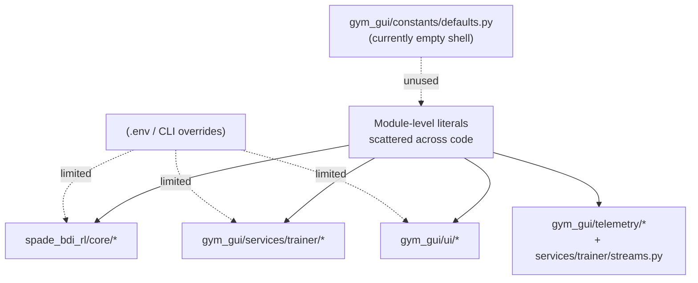
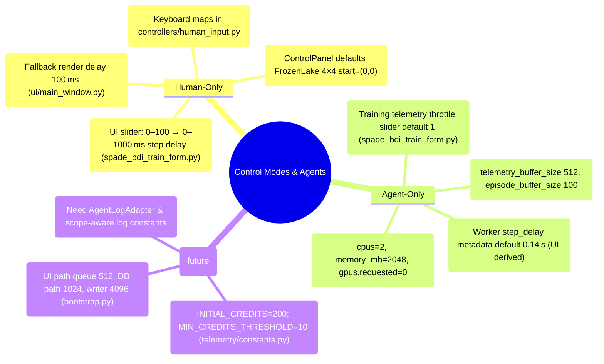
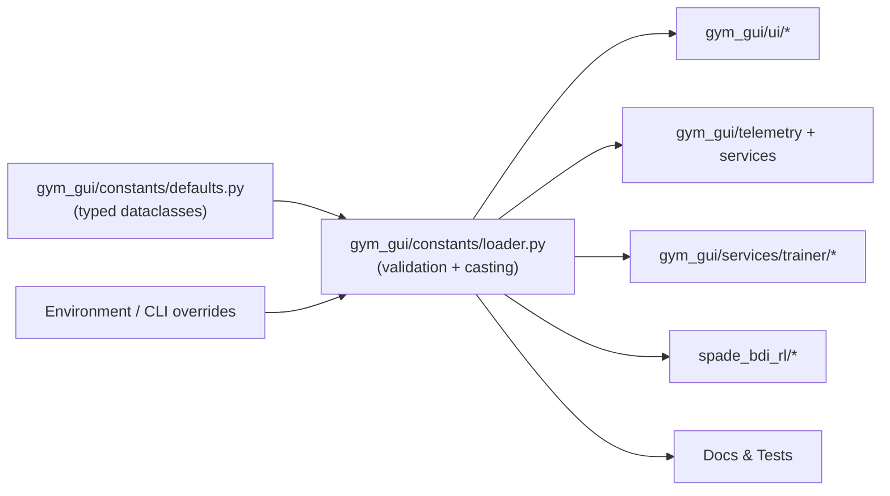
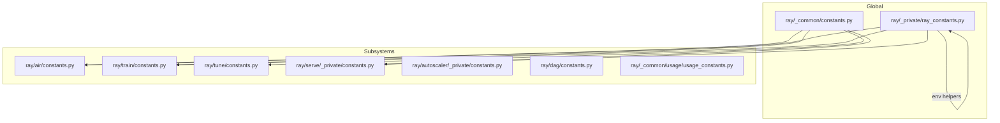

# Recommendations — Day 16 Task 4

**Subject:** Centralising configuration/constants & enabling `.env` overrides

---

## 1. Problem Statement

- **Scattered literals:** Default values are hard-coded in UI widgets, telemetry services, trainer configuration, and worker code. Changing a render delay or queue size requires editing multiple files, inviting drift and regressions.
- **No single source of truth:** Concepts like buffer sizes, agent credentials, log filter labels, and map dimensions are redeclared per module. UI hints and documentation often fall out of sync with what the trainer or worker actually uses.
- **Limited overrides:** Only a small subset of settings flow through `gym_gui.config.settings`. Operators cannot tune slider defaults, database batch sizes, or worker credentials via environment variables without editing code.
- **Testing & docs brittleness:** Unit tests, docs, and runtime logs embed the same magic numbers. This multiplies churn when defaults change and discourages experimentation (e.g., larger buffers for high-frequency multi-agent runs).
- **Operational blind spots:** Without a central registry, we cannot audit the effective configuration of a run (CPUs, telemetry buffers, map sizes). Incident response and capacity planning take longer, and multi-agent rollouts become guesswork.

### Why Centralising Constants Helps

1. **Single source of truth:** One declarative module (backed by env overrides) keeps UI, telemetry, trainer, worker, docs, and tests aligned.
2. **Environment-driven tuning:** Operators can adjust values via `.env` (or config service) without rebuilding, unlocking faster iteration.
3. **Discoverability & tooling:** Scripts/tests can introspect available constants, generate documentation, and fail fast when modules add new defaults without registration.
4. **Consistent validation:** Ranges and descriptions live alongside values, so UI tooltips, schema validators, and runtime guards stay consistent.
5. **Better testing:** Tests import the canonical constants, eliminating fragile literals and enabling parameterised checks.
6. **Operational visibility:** A `dump_constants` helper can reveal the current runtime configuration, aiding debugging and compliance.



**Goal:** Replace `ADHOC` with a constants loader that merges defaults and environment overrides before any subsystem consumes them.

---

## 2. Inventory of Hard-Coded Constants

| Area | Examples (files & symbols) | Why it matters |
|------|----------------------------|----------------|
| **Paths & directories** | `gym_gui/config/paths.py` (`VAR_TRAINER_DIR`, `VAR_LOGS_DIR`, etc.) | Central but not env-aware. Logger/tests should resolve these via loader. |
| **Environment defaults / settings** | `gym_gui/config/settings.py` (`qt_api`, `default_seed`, `default_control_mode`) | Good loader exists but re-embeds defaults that should reside in constants. |
| **Game configs** | `gym_gui/config/game_configs.py` (`DEFAULT_FROZEN_LAKE_CONFIG`, etc.), `gym_gui/config/game_config_builder.py` (min/max grid) | Defaults duplicated between UI, adapters, and tests; must coordinate map/grid semantics. |
| **Telemetry & backpressure** | `gym_gui/telemetry/constants.py`, `gym_gui/services/telemetry.py` (`history_limit=512`), `gym_gui/services/trainer/streams.py` (RunBus queue sizes) | Inconsistent buffers cause UI vs durable-path drift; need env overrides for high-rate runs. |
| **UI widgets** | `spade_bdi_train_form.py` (slider ranges, buffer spin boxes), `live_telemetry_tab.py` (grid drawing defaults), `busy_indicator.py` (`_AUTO_PROGRESS_INTERVAL_MS`), `agent_replay_tab.py` (`_DEFAULT_MAX_EPISODES`) | UI/telemetry mismatch when these differ from service defaults; centralising keeps hints accurate. |
| **Logging filters** | `info_log_container.py` (component/severity lists), `logging_config/logger.py` (format strings) | Should reflect component registry and new agent filters (multi-agent readiness). |
| **Trainer services** | `trainer/config.py` (resource schema), `trainer/service.py` (`_QUEUE_MAXSIZE`, `_HISTORY_LIMIT`), `trainer/launcher.py` (`_DEFAULT_TARGET`, `_POLL_INTERVAL`), `trainer/dispatcher.py` (gRPC flags) | Scheduler / queue defaults must be tunable and consistent across CLI, UI, and worker. |
| **Telemetry persistence** | `telemetry/db_sink.py` (`batch_size`, `checkpoint_interval`, `writer_queue_size`), `services/bootstrap.py` (RunBus queue sizes, `heartbeat_interval=5.0s`) | WAL size and resource usage hinge on these; central constants enable env tuning. |
| **Worker runtime** | `spade_bdi_rl/core/agent.py` & `core/bdi_agent.py` (`DEFAULT_JID`, `DEFAULT_PASSWORD`, `_DEFAULT_START_TIMEOUT`), `core/config.py` (step delay, buffer sizes), `core/telemetry_worker.py` (timestamp behaviour) | Credentials/timeouts must be configurable; step delay mismatches hinder logging and tuning. |
| **BDI plan** | `spade_bdi_rl/assets/asl/main_agent.asl` (`goal_pos(7,7)`, max steps 100, epsilon constants) | Plan assumes 8×8 map while UI defaults to 4×4; constants registry should reconcile. |
| **Infrastructure** | `spade_bdi_rl/infrastructure/docker-compose.yaml` (ports, admin password) | External orchestration parameters should not be retyped per deployment. |
| **Enums & identifiers** | `gym_gui/core/enums.py`, `services/trainer/registry.py` (status strings), `services/trainer/events.py` (outcomes) | Shared catalog prevents mismatched control modes or status labels. |
| **Tests & docs** | `gym_gui/tests/test_telemetry_reliability_fixes.py`, `test_logging_ui_path_config.py`, `spade_bdi_rl/tests/test_worker_suite.py`, multiple docs referencing literals | Tests should import canonical constants to stay resilient. |

---

## 3. Mode-Specific Constant Landscape



- **Human-only** runs favour immediate UI feedback and low throughput; constants controlling sliders/render delays should reference central defaults.
- **Agent-only/single agent** emphasises telemetry throughput; step delay and buffer constants must align with worker runtime and DB sink.
- **Multi-agent** scenarios require credit/buffer coordination and agent-aware logging to prevent starvation or ambiguous diagnostics. Central constants pave the way.

---

## 4. Worker & BDI Plan Constants (Current Snapshot)

| Location | Current constants | Notes / risks |
|----------|-------------------|---------------|
| `spade_bdi_rl/core/agent.py`, `core/bdi_agent.py` | `DEFAULT_JID="agent@localhost"`, `DEFAULT_PASSWORD="secret"`, `_DEFAULT_START_TIMEOUT=10.0` | Credentials/timeouts leaked in code; central registry should expose env-driven secrets. |
| `spade_bdi_rl/core/config.py` | `policy_strategy` strings (`train`, `load`, `eval`, `train_and_save`), telemetry buffers 2048/100, `step_delay` (float seconds) | Emit mismatch warnings but still rely on UI-sourced numbers; central values avoid divergence. |
| `spade_bdi_rl/assets/asl/main_agent.asl` | `goal_pos(7,7)`, `Steps < 100`, `.set_epsilon(0.1)` vs cached 0.0 | Plan assumes 8×8 map with 100-step cap; UI default 4×4 triggers mismatch. |
| `spade_bdi_rl/infrastructure/docker-compose.yaml` | Ports `5222/5280/5443`, admin password `admin`, agent password `secret` | Should be exposed via config constants for production hardening. |

**Map/Grid size mismatch:** UI defaults (4×4) conflict with BDI plan (goal `(7,7)`). The FrozenLake adapter supports only 4×4/8×8 in its fallback map logic. Central constants must define allowed grid sizes and goal positions to keep UI, adapter, and plan consistent.

---

## 5. Telemetry, Trainer & Persistence Constants

| Component | Current defaults | Impact on CPU / Memory |
|-----------|-----------------|-------------------------|
| `TelemetryAsyncHub` (streams/bootstrap) | `max_queue=4096`, `buffer_size=2048` | Large queues reduce drops but consume RAM (~event payload × queue size). |
| `TelemetryService` | `history_limit=512` → episodes buffer ≈256 | Higher limits improve “Recent” views but store duplicates in memory. |
| `TelemetryDBSink` | `batch_size=64`, `checkpoint_interval=1000`, `writer_queue_size=512` | Batch size influences SQLite write amplification; checkpoint interval affects WAL growth vs checkpoint CPU spikes. |
| `TelemetryAsyncHub` credit path | `INITIAL_CREDITS=200`, `MIN_CREDITS_THRESHOLD=10` | Without tuning, multi-agent high-frequency runs can starve UI path. |
| `HealthMonitor` | `heartbeat_interval=5.0s` | Drives log noise & health-check CPU usage; central value enables env tuning. |
| `TrainerService` gRPC queues | `_QUEUE_MAXSIZE=2048`, `_STEP_HISTORY_LIMIT=4096`, `_EPISODE_HISTORY_LIMIT=1024` | Excessively high limits inflate per-run memory usage. |

Centralising these values enables `.env` keys like `GYM_DB_SINK_BATCH_SIZE`, `GYM_HEARTBEAT_INTERVAL`, `GYM_HUB_MAX_QUEUE`, aligning telemetry throughput with available CPU/memory.

---

## 6. Resource Allocation Defaults

| Location | Defaults today | Recommendation |
|----------|----------------|----------------|
| `SpadeBdiTrainForm` / `SpadeBdiWorkerPresenter` | `cpus=2`, `memory_mb=2048`, `gpus.requested=0` | Move to constants registry with env overrides (`GYM_RUN_CPUS`, `GYM_RUN_MEMORY_MB`, `GYM_RUN_GPU_REQUESTED`). |
| `gym_gui/services/trainer/config.py` | Schema enforces `cpus ≥1`, `memory_mb ≥256` | Pull min/max values from constants to keep CLI/UI aligned. |
| `trainer/launcher.py` | `_DEFAULT_TARGET="127.0.0.1:50055"`, `_POLL_INTERVAL=0.5` | Expose as env-tunable endpoints for remote trainer daemons. |

These allocations govern how many agents fit per host and whether GPU-enabled workers can be scheduled. Centralisation prevents UI vs CLI mismatches that overcommit resources.

---

## 7. Host Resource Context & Rationale

Understanding the baseline hardware helps determine sensible defaults and when operators should override them:

- **Sample host (dev machine)**  
  - 32 logical CPUs (Intel i9-13900HX), base scheduler clock 800 MHz–5.4 GHz (`lscpu`).  
  - 31 GiB RAM total, 14 GiB in use, 13 GiB free (`free -hl`).  
  - NVIDIA GeForce RTX 4090 (16 GiB VRAM) with ~494 MiB currently used (`nvidia-smi`).  
  - Swap 2 GiB (unused), single NUMA node.

Even on high-end hardware, GUI defaults (cpus=2, memory=2048 MB, gpu=0) should not overcommit; however, smaller workstations or cloud VMs may require tighter limits. Central constants allow environment-specific tuning:

| Constant | Current default | Reason to make env-configurable |
|----------|----------------|----------------------------------|
| `RUN_RESOURCES_CPUS` | 2 | Multi-agent matches may need ≥4 CPUs; small laptops may only grant 1. |
| `RUN_RESOURCES_MEMORY_MB` | 2048 | High-resolution renderers/telemetry batches may require more; headless hosts may prefer less to enable concurrency. |
| `RUN_RESOURCES_GPU_REQUESTED` | 0 | Future GPU-intensive workers (e.g., vision/policy nets) will need 1+, while CPU-only nodes should keep 0. |
| `DB_SINK_WRITER_QUEUE_SIZE` | 4096 | Large queue = more RAM; adapt to host memory. |

By encoding these in the constants registry, operators can set `.env` keys (e.g., `GYM_RUN_CPUS=4`, `GYM_RUN_GPU_REQUESTED=1`) based on observed resource usage reported by tools like `free`, `lscpu`, and `nvidia-smi`.

---

## 7. External Gymnasium Baselines (Reference Data)

| Environment (paths under `.venv/lib/python3.12/site-packages/`) | Key constants (upstream) | Relevance |
|-------------|---------------------------|-----------|
| `gymnasium/envs/toy_text/frozen_lake.py` | `MAPS = {"4x4","8x8"}`, start `(0,0)`, goal `(N-1,N-1)`, `generate_random_map(size,p)` | Constants registry should define supported sizes and link UI overrides to these canonical maps to avoid invalid layouts. |
| `gymnasium/envs/toy_text/cliffwalking.py` | `shape=(4,12)`, cliff row `[3,1..10]`, `render_fps=4`, `cell_size=(60,60)` | UI toggles `is_slippery`; default map/goal must match these values. |
| `gymnasium/envs/toy_text/taxi.py` | Map definition (`MAP` constant), `WINDOW_SIZE=(550,350)`, action meanings | UI defaults (passenger colours, map display) should reference canonical map to avoid mismatch. |
| `gymnasium/envs/box2d/bipedal_walker.py` | Physics constants (gravity, `FPS=50`, hull density) | Box2D adapters should import physics defaults (when Box2D available) rather than hard-coding approximations. |
| `gymnasium/envs/box2d/car_dynamics.py`, `car_racing.py` | Engine power, tire friction, track tile count | Centralised constants can surface these for UI sliders or worker tuning. |

Documenting upstream values helps explain why certain defaults (map size, FPS) matter and prevents silent breakage when Gymnasium updates them.

---

## 8. Map/Grid Alignment & Human vs Agent Configuration

- **FrozenLake UI vs BDI plan:** UI defaults `grid_height=4`/`grid_width=4` (human-friendly), but BDI ASL plan assumes `goal_pos(7,7)` (8×8). Without central constants, multi-agent matches can spawn agents at invalid tiles.
- **Control panel overrides:** `gym_gui/ui/widgets/control_panel.py` clamps grid sizes (`min=4`, `max=20`). Without sharing these bounds, adapters may generate invalid maps.
- **Telemetry renderers:** `LiveTelemetryTab` uses `grid_size_info` but falls back to 4×4 when metadata missing. Centralising ensures telemetry visualisation respects actual game config.

Central registry should provide:

- Allowed grid sizes per environment.
- Default start/goal coordinates per control mode (Human vs Agent).
- A flag linking UI slider ranges to adapter constraints (e.g., hole count < grid area - 2).

---

## 9. Recommended Architecture (Target State)



Key characteristics:

- Typed entries describing default, env key, validator, description.
- Loader provides `get_constant("telemetry.db_sink.batch_size")`.
- Tests and docs import from loader to avoid stale literals.
- CLI / UI components register themselves to update tooltips and validation dynamically.

---

## 10. Next Steps

1. **Rename & scaffold:** Rename `gym_gui/constansts/` → `gym_gui/constants/`, create `defaults.py`, `schema.py`, and `loader.py`.
2. **Define schema:** Decide on representation (e.g., `@dataclass ConstantSpec` with fields `key`, `default`, `env`, `type`, `description`, `min`, `max`).
3. **Populate Phase 0 defaults:** Paths, render/step delays, buffer sizes, CPU/memory/GPU, BDI credentials (pull from env).
4. **Refactor consumers (Phase 1):** Update telemetry constants & UI widgets to read from loader; add `.env` keys like `GYM_UI_RENDER_DELAY_MS`, `GYM_TELEMETRY_BUFFER_STEPS`.
5. **Refactor trainer & worker (Phase 2):** Replace `_QUEUE_MAXSIZE`, credentials, step delay, etc., with loader lookups; ensure worker ASL defaults align with registry.
6. **Introduce agent-aware logging constants:** Extend log constants with `scope` metadata to support per-agent filtering once loader is in place.
7. **Update tests/docs:** Replace literals with `from gym_gui.constants.loader import get_constant`; document available env keys for operators.
8. **Add tooling:** Provide `scripts/dump_constants.py` and CI check ensuring new uppercase literals are registered (e.g., pytest plugin scanning for unregistered constants).

Centralising constants unlocks safe tuning, consistent multi-agent behaviour, and clearer operational visibility — prerequisites for scaling beyond single-agent demos.

---

## Appendix: Relevant Codebase Structure (Constants & Resource Paths)

```text
├─ gym_gui/
│  ├─ config/
│  │  ├─ game_configs.py          # Environment-specific dataclass defaults
│  │  ├─ game_config_builder.py   # UI → config coercion, currently clamps ranges
│  │  ├─ paths.py                 # VAR_* directories (logs, telemetry, trainer)
│  │  └─ settings.py              # Env loader (partial coverage)
│  ├─ constansts/                 # ← will be renamed to constants/
│  │  ├─ constants.py             # empty placeholder today
│  │  └─ defaults.py              # empty placeholder today
│  ├─ telemetry/
│  │  ├─ constants.py             # Buffer/queue sizes, credit thresholds
│  │  ├─ db_sink.py               # batch_size, checkpoint_interval, writer_queue
│  │  └─ run_bus.py               # subscriber queue sizes, overflow tracking
│  ├─ services/
│  │  ├─ bootstrap.py             # Wires telemetry hub, DB sink, health monitor
│  │  └─ trainer/
│  │     ├─ config.py             # Trainer schema, resource defaults
│  │     ├─ service.py            # gRPC queues, history limits
│  │     ├─ streams.py            # TelemetryAsyncHub max_queue / buffer_size
│  │     └─ dispatcher.py         # Worker command/env assembly
│  ├─ ui/
│  │  ├─ main_window.py           # Fallback render delay, log filters
│  │  ├─ panels/info_log_container.py  # Component/severity filter options
│  │  └─ widgets/
│  │     ├─ spade_bdi_train_form.py    # Slider ranges, telemetry buffers, resources
│  │     ├─ live_telemetry_tab.py      # Grid sizing defaults
│  │     └─ busy_indicator.py          # Animation interval constants
│  ├─ logging_config/
│  │  ├─ logger.py               # Format strings, component registry
│  │  └─ log_constants.py        # Structured log catalog (needs scope metadata)
│  └─ tests/                     # Reference constants in assertions (must import loader)
│
└─ spade_bdi_rl/
   ├─ constants.py            # Worker defaults (credentials, buffers, epsilon)
   ├─ core/
   │  ├─ agent.py, bdi_agent.py  # DEFAULT_JID/PASSWORD, timeouts
   │  ├─ config.py               # RunConfig defaults (step_delay, buffers)
   │  └─ telemetry_worker.py     # Telemetry emitter behaviour
   ├─ adapters/frozenlake.py     # map_size logic (4×4 vs 8×8)
   ├─ assets/asl/main_agent.asl  # BDI plan goals, epsilon, step caps
   └─ infrastructure/docker-compose.yaml  # Ejabberd credentials & ports
```


## Appendix: External Reference — How Ray Organises Constants



Ray balances centralisation and autonomy by:

- **Subsystem-specific modules:** Core runtime values stay in `_common/constants.py`; env-tunable defaults and helper functions live in `_private/ray_constants.py`. AIR, Train, Tune, Serve, Autoscaler, DAG, etc. each expose their own constants modules to localise ownership.
- **Environment-aware helpers:** Ray wraps env parsing in utilities (`env_integer`, `get_env_float_positive`, etc.), so every constant can be overridden with validation and consistent logging.
- **Documented env keys:** Modules enumerate the environment variables they honour (e.g., `AIR_ENV_VARS`), improving discoverability.
- **Layered approach:** Shared identifiers in `_common`, tunables in `_private`, domain-specific overlays in subsystem packages, and release/benchmark folders reuse these constants for fidelity.

**Lessons for us:**

1. Pair a central registry with subsystem overlays (e.g., `constants/telemetry.py`, `constants/ui.py`) to avoid one monolithic file while still using a shared loader.
2. Implement env parsing helpers akin to Ray's utilities so validations and logging remain consistent across modules.
3. Maintain a documented set of supported env keys, mirroring Ray's discoverability.
4. Ensure tests/benchmarks import from the same constants modules to avoid drift between production and validation environments.

### How Ray Applies These Constants (Usage Examples)

| Subsystem | Constant usage pattern | Link/back to file | Takeaway |
|-----------|-----------------------|-------------------|----------|
| Core runtime (`ray/_private/ray_constants.py`) | All tunables (object store size, reserved CPU/memory, default port) are read via `env_*` helpers before configuring worker/system components. | `DEFAULT_SYSTEM_RESERVED_*`, `DEFAULT_OBJECT_STORE_MAX_MEMORY_BYTES`, etc. | Single place defines default + env override; downstream code calls only the constant. |
| Scheduler/autoscaler (`ray/autoscaler/_private/constants.py`) | Autoscaler loop intervals, node launch timeouts, idle timeouts drawn from constants and consumed by control loops. | `AUTOSCALER_MAX_NUM_FAILURES`, `IDLE_TIMEOUT_S` | Control-plane loops rely on documented defaults; tuning happens via env/config. |
| Ray Serve | HTTP/GRPC ports, controller names, histogram buckets defined in constants; server setup reads them to configure proxies, controllers, health checks. | `DEFAULT_HTTP_PORT`, `CONTROL_LOOP_INTERVAL_S`, `REQUEST_LATENCY_BUCKETS_MS` | Serve isolates configuration knobs yet runs all env parsing centrally (`get_env_*`). |
| Ray AIR / Train / Tune | Checkpoint file names, metric keys, session warnings stored in constants; training loops and experiment tracking reference them when serialising state. | `MODEL_KEY`, `TRAINING_ITERATION`, `EXPR_PARAM_FILE` | Keeps experiment artefacts consistent and traceable across packages. |
| Tests/benchmarks | Release and benchmark suites import from the same constants modules (`ray/release/.../constants.py`) to configure workloads. | e.g., `train_tests/benchmark/constants.py` | Ensures testing mimics production defaults; no magic numbers in benchmarks. |

These patterns show how consistent constants usage keeps configuration safe, documented, and tuneable—precisely the direction we’re targeting with our own registry.

### Why Emulating Ray’s Approach Matters

Ray is a large, multi-team project with long-lived clusters and diverse workloads (Serve, AIR, Train, Tune, Autoscaler, Dashboard, etc.). Their constants architecture exists because they **must** balance stability with configurability:

1. **Backward-compatible defaults.** When Ray changes object-store limits or control-loop cadences, they only touch the constants module. Downstream services already consume those values indirectly, preventing scattered breaking changes. We need the same guardrails as our telemetry/trainer stack evolves.
2. **Environment-driven experimentation without forks.** Ray’s env helpers let operators tune behaviour (e.g., Serve latency buckets, autoscaler intervals) in production without code changes. Our operators will want to tweak telemetry queue sizes, heartbeat intervals, or resource budgets on the fly; central constants plus env overrides empower that.
3. **Cross-team ownership transparency.** Having `serve/constants.py`, `autoscaler/constants.py`, etc., makes it obvious which team owns which knobs. As we add more workers or UI modules, subsystem-specific overlays (built on the shared loader) prevent hidden couplings.
4. **Testing parity.** Ray’s release and benchmark suites import the same constants used in runtime. This guarantees that stress tests mimic real deployments. We should follow suit so perf/soak tests on DB sinks or multi-agent sessions exercise true defaults.
5. **Documentation & observability.** Ray surfaces supported env vars and records them in docs/dashboards. When incidents occur, they can quickly confirm effective values. Our incident response will benefit from being able to dump “constants + env overrides” for a given run.

Adopting these practices will reduce drift, ease ops, and set us up for future multi-agent, multi-worker expansion without configuration chaos.

Use this map to prioritise refactors: rename the constants package, implement the loader, then move consumers module by module.
