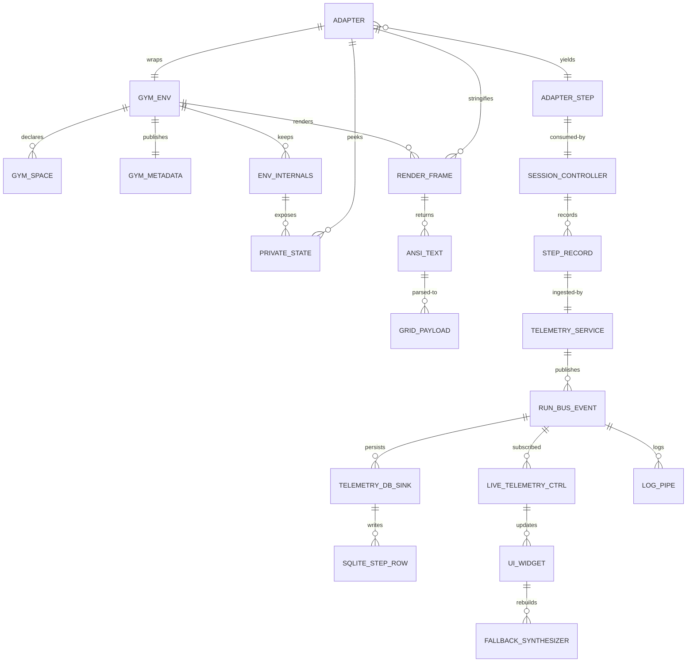
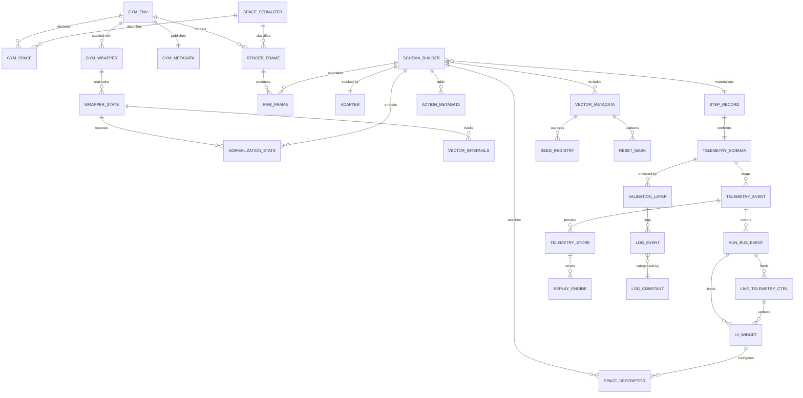

# Gymnasium → GUI Data Contract Deep Dive (Contrarian Edition)

> Goal: expose every data shape our GUI assumes today, uncover brittle points inside Gymnasium, and outline the extra metadata we must demand when onboarding new environments (toy-text, Box2D, vectorised, graph-based, etc.).

## 1. Native Gymnasium Signals (Beyond Toy-Text)

### 1.1 Discrete grid-world family
- **FrozenLakeEnv** stores layout metadata in `desc`, grid dimensions in `nrow`/`ncol`, transition map `P`, and runtime state in `self.s`. `generate_random_map` also returns plain string descriptors; nothing in Gym bridges this to richer JSON (`.venv/lib/python3.12/site-packages/gymnasium/envs/toy_text/frozen_lake.py:73-211`).
- **CliffWalkingEnv** exposes only `shape` (no explicit `desc`), derives transitions via `_calculate_transition_prob`, and flags the cliff mask `_cliff`. Terminal state detection is positional math—no helper to share hazard indices (`.../cliffwalking.py:28-141`).
- **TaxiEnv** encodes state through `encode`/`decode`, publishes `info['action_mask']`, but keeps passenger/destination semantics implicit. Rain/fickle variants alter transition graph without new telemetry fields (`.../taxi.py:88-353`).
- **BlackjackEnv** returns tuple observations and no render metadata. Rewards depend on `natural`/`sab` flags that only live in constructor kwargs (`.../blackjack.py:1-144`).

### 1.2 Continuous & composite observation spaces
- **Box** surfaces lower/upper bounds, dtype, boundedness flags, and derived `low_repr`/`high_repr` for summarisation. Gym uses these for sampling and validation but never packages them into `info` payloads (`gymnasium/spaces/box.py:1-189`).
- **Dict / Tuple / Sequence spaces** only describe structure; key order (`spaces.keys()`), implicit batching rules, and nested flattening require extra signalling when bridging to telemetry. For Sequence, length bounds live in `maxlen` but are not surfaced per step (`gymnasium/spaces/dict.py`, `tuple.py`, `sequence.py`).
- **Graph** introduces `GraphInstance(nodes, edges, edge_links)` with optional edge feature tensors, yet sampling relies on `num_nodes` arguments at runtime—no canonical place to report adjacency in `info` (`gymnasium/spaces/graph.py:1-188`).
- **Text/OneOf/MultiBinary/MultiDiscrete** each rely on `.n`, `.nvec`, `.charset`, etc., with masks for sampling—GUI auto-controls must respect these exact field names (`gymnasium/spaces/text.py`, `multi_binary.py`, `multi_discrete.py`, `oneof.py`).

### 1.3 Vectorisation stack
- **VectorEnv base** batches observations/rewards/terminations, adds `metadata['autoreset_mode']`, and exposes `single_observation_space` vs. `observation_space`. It does not embed per-env episode ids or reset masks into `info` (`gymnasium/vector/vector_env.py:1-210`).
- **SyncVectorEnv/AsyncVectorEnv** rely on `batch_space`, `batch_differing_spaces`, and maintain `_observations`, `_terminations`, `_autoreset_envs` arrays—none of which are forwarded to `.info` by default. Seeds can be list/tuple, but returned info lacks which sub-env got which seed (`gymnasium/vector/sync_vector_env.py:1-184`, `async_vector_env.py`).
- **Vector wrappers** (`normalize_observation`, `array_conversion`, `stateful_reward`, `dict_info_to_list`, etc.) mutate observation payloads, attach running statistics, and inject numpy/torch/jax conversions without changing the base API metadata. Their side channels (RunningMeanStd stats, dtype hints) stay private (`gymnasium/wrappers/vector/*.py`).

### 1.4 Space utilities & flattening helpers
- **`flatdim`/`flatten`** expose canonical shapes for downstream neural nets, but raise exceptions for `Graph`/`Sequence` spaces (`gymnasium/spaces/utils.py:18-149`). Adapters must guard these errors when serialising observations.
- **`batch_space`/`batch_differing_spaces`** in `vector/utils/space_utils.py` duplicate spaces, derive shape-consistent low/high arrays, and fall back to Tuple-of-copies for dynamic spaces (Graph, Sequence, Text) (`gymnasium/vector/utils/space_utils.py:1-132`). This is the authoritative source for generating vectorised space descriptors.
- **`concatenate`/`iterate`/`create_empty_array`** provide the mechanics for assembling batched observations/actions; ignoring them leads to dtype mismatches when we synthesise payloads for the GUI.

### 1.5 Core environment attributes & wrappers
- **`Env` base class** documents mandatory attributes (`metadata`, `np_random`, `np_random_seed`) and emphasises that `render()` returns frames of type dependent on `render_mode` (strings for ANSI, arrays for RGB). None are automatically funnelled into telemetry (`gymnasium/core.py:1-220`).
- **Vector action wrappers** (e.g., `TransformAction`, `VectorizeTransformAction`, `ClipAction`) can reshape action spaces and return batched arrays that differ from the raw environment space; they emit warnings if batched spaces do not match expectations (`gymnasium/wrappers/vector/vectorize_action.py:1-220`). GUI integrations must honour the wrapper-adjusted `action_space`.

## 2. GUI Consumption Patterns & Hidden Assumptions

- **ToyTextAdapter** parses ANSI text render into structured payloads (grid, agent position, holes, goal, grid_size, taxi_state) and persists snapshots to `VAR_DATA_DIR` (`gym_gui/core/adapters/toy_text.py:214-370`).
- **Base EnvironmentAdapter** auto-wraps Gym `.step()` results into `AdapterStep` with `render_payload`, `render_hint`, and `frame_ref`, but swallows render errors silently (`gym_gui/core/adapters/base.py:200-314`).
- **SessionController** expects `StepRecord` to contain action, observation, reward, terminated/truncated flags, agent_id, render payload/hints, frame refs—and persists frames when available (`gym_gui/controllers/session.py:606-727`).
- **Telemetry pipeline** (TelemetryService, TelemetryDBSink, trainer streams) assumes incoming step payloads already expose `render_payload`, `render_payload_json`, `agent_id`, `episode_seed`, `run_id`, `game_id`. Validation hooks discard steps lacking these keys (`gym_gui/services/telemetry.py:34-190`, `gym_gui/telemetry/db_sink.py:26-187`, `gym_gui/services/trainer/streams.py:1-210`).
- **Passive control logic** infers neutral actions by interrogating `spaces.Box.low/high`, `spaces.MultiBinary.n`, `spaces.MultiDiscrete.nvec`, `spaces.Tuple.spaces` (`gym_gui/controllers/session.py:688-785`).

## 3. Gap Ledger (Now + Future)

| # | Theme | What Gym Provides | What GUI Assumes | Risk When Scaling |
|---|-------|-------------------|------------------|-------------------|
| 1 | Render payload | ANSI string only (`FrozenLakeEnv.render`) | Structured grid+metadata dict | Remote/worker runs must run adapter serialization or GUI falls back to guesswork |
| 2 | State decoding | `self.s`, optional `decode()` for Taxi | Adapter reads private attributes for agent positions | Vector wrappers / Gym updates could hide `.s`, breaking overlays |
| 3 | Grid dims | `nrow/ncol` only in some envs | Defaults fallback to static config | Custom maps silently misaligned |
| 4 | Action metadata | `info['action_mask']` for Taxi | GUI fabricates `taxi_state` dict | Telemetry-based training lacks passenger context |
| 5 | Vector autoreset | Stored in `metadata['autoreset_mode']` | GUI ignores autoreset info | Missing terminal frames & seed continuity |
| 6 | Composite spaces | Graph/Dict/Sequence provide nested descriptors only | GUI expects flattish metrics/inventory dicts | Future envs need schema translation layer |
| 7 | Snapshot persistence | Adapter writes filesystem path | Telemetry just stores string path | Replay tabs fail unless remote file shipped |
| 8 | Continuous wrappers | NormalizeObservation tracks running mean | GUI not aware of normalization metadata | Displayed metrics drift from actual observation scale |
| 9 | Seed visibility | Vector reset seeds tracked internally | GUI only logs `seed` at start | Regression triage impossible across batched envs |
| 10 | Space flattening | `flatdim` / `batch_space` encode canonical shapes | GUI reimplements flatten/batch heuristics | Mismatched tensor layouts for dict/graph spaces |

## 4. Required Field Matrix (Roadmap)

### 4.1 Minimum contract for any environment adapter

| Category | Fields | Source Today | Required Actions |
|----------|--------|--------------|------------------|
| Identity | `game_id`, `payload_version`, `agent_id` | `ToyTextAdapter.step`, `TelemetryBridge` | Formalise schema so trainers emit same keys |
| Geometry | `grid`, `grid_size`, `agent_position` **or** `rgb` frame | `ToyTextAdapter.render`, `Box2DAdapter.render` | Define alternatives for non-grid envs (`Graph`, `Sequence` states) |
| Dynamics | `terminated`, `truncated`, `reward`, `step_index`, `episode_id` | `AdapterStep`, `StepRecord` | Capture vector autoreset + cumulative reward |
| Semantics | Env-specific overlays (holes/goals, taxi passenger/dest, graph adjacency) | Custom adapter enrichment | Add plug-in enrichment layer per space type |
| Assets | `snapshot_path` or inline frame bytes | Toy-text text dump | For remote runs, embed frame content or signed URL |

### 4.2 Composite observation handling blueprint

- **Dict/Tuple spaces**: flatten keys into hierarchical telemetry (e.g., `obs.position.x`). Use schema generator that walks `space.spaces` recursively (future util).
- **Graph spaces**: capture `num_nodes`, `num_edges`, `node_feature_shape`, `edge_feature_shape`, and adjacency list per step; map to GUI overlays or table view.
- **Sequence/OneOf**: require adapters to provide `structure_descriptor` (length bounds, dtype). GUI can pre-allocate viewer columns.
- **Text**: include `charset` and token indices so GUI can render vocabulary heatmaps instead of raw ints.

## 5. Vectorisation Readiness Checks

- Track `metadata['autoreset_mode']` and add to `StepRecord.info` so GUI can warn when frames skip termination (`gymnasium/vector/vector_env.py:72-118`).
- Capture `options['reset_mask']` when partial resets happen in vector envs to annotate which instances restarted (`sync_vector_env.py:130-197`).
- Ensure wrappers that change dtype (e.g., `numpy_to_torch`, `jax_to_numpy`) expose conversion direction so render tabs can deserialise payloads (`gymnasium/wrappers/vector/numpy_to_torch.py`, `jax_to_numpy.py`).
- For batched rewards, persist `_rewards` arrays and env indices alongside `StepRecord` to maintain per-env history in GUI timeline.
- Surface per-env seeds (`VectorEnv.np_random_seed`) and include them in telemetry for reproducible debugging.

## 6. Telemetry & Storage Alignment

- `TelemetryService.record_step` writes `EpisodeRecord` without render metadata—extend storage schema to include grid snapshots or vector seeds (`gym_gui/services/telemetry.py:70-148`).
- `TelemetryDBSink` reconstructs `StepRecord` from bus payload; enrich bus events with new fields (graph descriptors, autoreset flags) before persistence (`gym_gui/telemetry/db_sink.py:114-179`).
- gRPC `trainer.proto` currently carries `render_payload_json`, `payload_version`, `episode_seed`; add upcoming fields (`grid_descriptor`, `space_signature`, `autoreset_mode`) so CLI/GUI parity holds (`gym_gui/services/trainer/proto/trainer.proto:94-170`).

## 7. EER Diagrams (Current vs. Target Contracts)



### Desired schema-driven flow



## 8. Action Items & Mitigations

1. **Schema formalisation**: author a shared JSON schema/Protobuf for `StepRecord.render_payload` covering grids, RGB frames, graph descriptors, vector indices.
2. **State accessor wrappers**: wrap Gym envs with helper methods (`get_agent_state`, `describe_space`) rather than peeking at `.s` or `.desc`.
3. **Vector metadata pipeline**: propagate `autoreset_mode`, `reset_mask`, and env indices into GUI analytics/telemetry records.
4. **Composite space translators**: implement a `SpaceSerializer` utility walking Dict/Tuple/Graph spaces to generate GUI-friendly payloads.
5. **Remote asset handling**: replace raw `snapshot_path` with binary payloads or signed storage handles to support distributed telemetry.
6. **Observation calibration**: expose normalization statistics (mean/var) from wrappers to GUI metrics dashboards; correct for scale drift.
7. **Seed registry**: record per-env seeds in telemetry DB for deterministic replays and multi-env syncing.

## 10. Why gym_gui must evolve

The gaps above are only solvable on our side because Gymnasium deliberately keeps its API minimal. Concretely:

- **Stability against Gym internals**: Today’s adapters hit private attributes (`self.s`, `decode`, `desc`). Any upstream refactor (vector agents, JAX envs) would break our overlays. Introducing explicit accessor wrappers in `gym_gui/core/adapters` isolates those changes (`gym_gui/core/adapters/toy_text.py`).
- **Telemetry consistency**: Trainer and telemetry services assume enriched payloads that Gym never emits. Without schema upgrades and validation hooks (`gym_gui/services/telemetry.py`, `gym_gui/telemetry/db_sink.py`), future envs will silently skip UI features.
- **Vector-awareness**: GUI session controller has no concept of sub-env indices, autoreset modes, or partial resets; adding that context requires updates across controllers and telemetry consumers (`gym_gui/controllers/session.py`, `gym_gui/services/trainer/streams.py`).
- **Composite space UX**: Upcoming environments (graph, text, sequence) demand richer visualisations. Building a `SpaceSerializer` and adaptive widgets in `gym_gui/ui` prevents ad-hoc hacks when we integrate them.
- **Distributed runs**: Snapshot persistence must shift from filesystem paths to transportable assets so remote trainer telemetry renders correctly (`gym_gui/core/adapters/base.py`, `gym_gui/services/storage.py`).

Without these gym_gui changes we remain locked to toy-text/Box2D edge cases, and every new environment family would require manual patchwork.

### 10.1 Current `trainer.proto` contract

For reference, the existing telemetry surface defined in `gym_gui/services/trainer/proto/trainer.proto` exposes the following message (field names and tags confirmed against the current repository):

```proto
message RunStep {
  string run_id = 1;
  uint64 episode_index = 2;
  uint64 step_index = 3;
  string action_json = 4;
  string observation_json = 5;
  double reward = 6;
  bool terminated = 7;
  bool truncated = 8;
  google.protobuf.Timestamp timestamp = 9;
  string policy_label = 10;
  string backend = 11;
  uint64 seq_id = 12;
  string agent_id = 13;
  string render_hint_json = 14;
  string frame_ref = 15;
  uint32 payload_version = 16;
  string render_payload_json = 17;
  uint64 episode_seed = 18;
}
```

Any schema extensions must add new tags (e.g., `space_signature_json = 19`, `vector_metadata_json = 20`, `normalization_stats_json = 21`) rather than renaming existing fields to preserve compatibility with deployed trainers and replays.

## 11. Logging & Constant Blueprint (Proposed)

To keep observability aligned with the schema work, introduce dedicated constant buckets:

| Module | Constant namespace | Purpose |
|--------|--------------------|---------|
| `gym_gui/logging_config/log_constants.py` | `LOG_SCHEMA_MISMATCH`, `LOG_VECTOR_AUTORESET_MODE`, `LOG_SPACE_DESCRIPTOR_MISSING`, `LOG_NORMALIZATION_STATS_DROPPED` | Emit when incoming telemetry lacks required schema bits (grid descriptors, autoreset, normalization stats). |
| `gym_gui/constants/telemetry_constants.py` | `RENDER_PAYLOAD_GRID`, `RENDER_PAYLOAD_RGB`, `RENDER_PAYLOAD_GRAPH`, `TELEMETRY_KEY_AUTORESET_MODE`, `TELEMETRY_KEY_SPACE_DESCRIPTOR` | Canonical keys for schema generation/validation. |
| `gym_gui/constants/space_signatures.py` | `SPACE_SIGNATURE_DICT`, `SPACE_SIGNATURE_GRAPH`, `SPACE_SIGNATURE_SEQUENCE`, `SPACE_SIGNATURE_TEXT` | Blueprint descriptors for GUI layout components. |
| `gym_gui/constants/constants_vector.py` | `DEFAULT_AUTORESET_MODE`, `RESET_MASK_KEY`, `VECTOR_ENV_INDEX_KEY`, `VECTOR_SEED_KEY` | Shared between adapters, session controller, and telemetry. |

### Intended logging usage

```python
from gym_gui.logging_config.log_constants import (
    LOG_SCHEMA_MISMATCH,
    LOG_VECTOR_AUTORESET_MODE,
    LOG_NORMALIZATION_STATS_DROPPED,
)

if missing_keys:
    self.log_constant(
        LOG_SCHEMA_MISMATCH,
        extra={
            "run_id": run_id,
            "missing": sorted(missing_keys),
            "payload_version": payload.get("payload_version"),
        },
    )

if autoreset_mode not in SUPPORTED_AUTORESET_MODES:
    self.log_constant(
        LOG_VECTOR_AUTORESET_MODE,
        extra={"autoreset_mode": autoreset_mode, "supported": SUPPORTED_AUTORESET_MODES},
    )

if normalization_stats is None:
    self.log_constant(
        LOG_NORMALIZATION_STATS_DROPPED,
        extra={"game_id": game_id, "wrapper": "NormalizeObservation"},
    )
```

Constants provide a single source for schema enforcement:

```python
from gym_gui.constants.telemetry_constants import (
    RENDER_PAYLOAD_GRID,
    TELEMETRY_KEY_AUTORESET_MODE,
    TELEMETRY_KEY_SPACE_DESCRIPTOR,
)

payload[TELEMETRY_KEY_AUTORESET_MODE] = vector_metadata.autoreset_mode
payload[TELEMETRY_KEY_SPACE_DESCRIPTOR] = space_serializer.describe(env.observation_space)
payload[RENDER_PAYLOAD_GRID] = grid_payload
```

## 12. Initial Implementation Blueprint

1. **Schema package**
   - Create `gym_gui/core/schema/step_payload.py` with dataclasses for `GridPayload`, `RGBPayload`, `GraphPayload`, `VectorMetadata`, and serialization helpers.
   - Generate JSON Schema/Proto definitions in `gym_gui/core/schema/definitions/` consumed by trainers and GUI.

2. **Space serializer**
   - Add `gym_gui/core/spaces/serializer.py` walking Gym space objects, returning descriptors keyed by the constants in §11.
   - Integrate serializer in adapters’ `load()` and `render()` phases to attach descriptors to telemetry.

3. **Telemetry validation layer**
   - Update `gym_gui/services/telemetry.py` to validate incoming payloads against the schema.
   - Extend `TelemetryDBSink` to persist schema version, vector metadata, and normalization stats.

4. **Session/controller upgrades**
   - Modify `gym_gui/controllers/session.py` to record per-env seeds, reset masks, and autoreset warnings using new log constants.
   - Enhance UI renderers to branch on `RENDER_PAYLOAD_GRAPH`, `RENDER_PAYLOAD_RGB`, etc.

5. **Trainer alignment**
   - Update gRPC protobuf (`gym_gui/services/trainer/proto/trainer.proto`) and telemetry streams to include new fields (autoreset mode, space descriptors, normalization stats, vector seeds).

6. **Testing & tooling**
   - Create contract tests in `gym_gui/tests/test_schema_contract.py` ensuring every adapter emits the required constants.
   - Add CLI utility (`python -m gym_gui.tools.dump_space_signature`) to inspect space descriptors for new environments.

## 13. Refactor / Deprecate Targets

| File | Action | Rationale |
|------|--------|-----------|
| `gym_gui/core/adapters/toy_text.py` (ANSI parser sections `render()` / `_ansi_to_grid` lines 62-212) | Refactor | Replace ad-hoc ANSI scraping with schema-driven payload generation so adapters pull descriptors from Gym wrappers instead of private strings. |
| `gym_gui/core/adapters/toy_text_demo.py` | Remove after migration | CLI smoke harness only exercises legacy payload; superseded by schema contract tests and renders obsolete defaults. |
| `gym_gui/controllers/session.py` (`_record_step`, `_coalesce_render_hint`, `_extract_frame_reference` lines 580-860) | Refactor | Inject new telemetry constants (vector seeds, space descriptors) and drop assumptions about `render_payload` structure; centralise passive-action defaults via space serializer. |
| `gym_gui/ui/widgets/live_telemetry_tab.py` (`_generate_render_payload_from_observation` lines 1000-1090) | Remove once schema enforced | Fallback JSON synthesiser adds duplicated logic; schema-compliant payloads make it redundant and risky. |
| `gym_gui/services/telemetry.py` (`record_step` lines 57-146) | Refactor | Validate against new schema, persist normalization stats, vector metadata, and raise `LOG_SCHEMA_MISMATCH` when absent. |
| `gym_gui/telemetry/db_sink.py` (`_process_step_queue` lines 118-182) | Refactor | Persist expanded schema columns; drop manual `StepRecord` reconstruction once trainer emits schema-compliant payload. |
| `gym_gui/services/trainer/streams.py` (`_normalize_payload` lines 24-108) | Refactor | Replace generic dict pass-through with schema-aware transformation, include autoreset/reset-mask fields, remove `normalized_payload` duplication. |
| `gym_gui/services/trainer/proto/trainer.proto` | Refactor | Extend telemetry messages to include `space_signature`, `vector_metadata`, `normalization_stats`; deprecate legacy `render_payload_json` once new fields adopted. |
| `gym_gui/core/adapters/box2d.py` (`render()` and `_extract_metrics` lines 25-120) | Refactor | Align RGB payload with schema (include frame timestamp, autoreset index) and export observation signatures via new constants. |
| `gym_gui/ui/widgets/render_tabs.py` (grid/RGB branches around lines 180-360) | Refactor | Use constants (`RENDER_PAYLOAD_GRID`, `RENDER_PAYLOAD_GRAPH`) instead of brittle key tests; enable graph/text viewers. |
| `gym_gui/services/storage.py` & `gym_gui/telemetry/sqlite_store.py` | Refactor | Expand serialization to store schema version, vector seeds, normalization stats; remove reliance on filesystem snapshots for toy-text. |
| `gym_gui/core/data_model/telemetry_core.py` | Refactor | Update `StepRecord` dataclass to include new fields (`space_descriptor`, `vector_index`, `autoreset_mode`, `normalization_stats`). |
| `gym_gui/tests/test_adapter_integration.py` | Refactor | Replace manual grid assertions with schema validation and ensure new space descriptors present. |
| `gym_gui/logging_config/log_constants.py` | Refactor | Add proposed constants (`LOG_SCHEMA_MISMATCH`, etc.) and remove redundant adapter-specific log IDs tied to ANSI parsing. |

Redundant utilities and fallbacks will be removed only after adapters and trainers comply with the schema, ensuring we cut dead code without breaking compatibility. Remaining modules not listed still undergo targeted updates but retain their core structure.

## 14. Why the current system still works (despite gaps)

1. **Adapters patch over missing metadata**: `ToyTextAdapter.render()` manually parses ANSI into `grid`, `agent_position`, `holes`, and adds FrozenLake/Taxi extras. Even though Gym never emits these fields, the adapter fabricates them on the fly (`gym_gui/core/adapters/toy_text.py`).
2. **Direct access to internals**: Adapters rely on `env.unwrapped.s`, `decode()`, `desc`, and static configs. As long as Gym keeps these attributes, the GUI gets enough state to paint overlays.
3. **Generous fallbacks**: UI widgets call `_generate_render_payload_from_observation` to rebuild grids when telemetry lacks `render_payload` (`gym_gui/ui/widgets/live_telemetry_tab.py`). This compensates for missing remote serialization.
4. **Loose schema expectations**: `TelemetryService` and `TelemetryDBSink` accept dict payloads with optional keys; absent descriptors simply result in empty columns, not failures (`gym_gui/services/telemetry.py`, `gym_gui/telemetry/db_sink.py`).
5. **Single-env focus**: Most workflows target toy-text/Box2D with deterministic layouts. Static defaults (grid width/height, start/goal positions) cover the majority of cases.
6. **Synchronous runs**: Without heavy vectorisation, autoreset, or distributed playback, the system avoids the metadata gaps (reset masks, per-env seeds, normalization stats) that will matter in upcoming features.

These stopgaps explain current functionality, but they collapse once we add new environment families, remote trainers, or vectorised runs—hence the schema-driven roadmap above.

## 9. Referenced Files

- `gymnasium/envs/toy_text/frozen_lake.py`
- `gymnasium/envs/toy_text/cliffwalking.py`
- `gymnasium/envs/toy_text/taxi.py`
- `gymnasium/envs/toy_text/blackjack.py`
- `gymnasium/spaces/box.py`, `dict.py`, `tuple.py`, `sequence.py`, `graph.py`, `multi_binary.py`, `multi_discrete.py`, `text.py`
- `gymnasium/spaces/utils.py`
- `gymnasium/vector/vector_env.py`, `sync_vector_env.py`, `async_vector_env.py`
- `gymnasium/vector/utils/space_utils.py`
- `gymnasium/wrappers/vector/array_conversion.py`, `stateful_observation.py`, `vectorize_action.py`
- `gymnasium/core.py`
- `gym_gui/core/adapters/base.py`, `toy_text.py`, `box2d.py`
- `gym_gui/controllers/session.py`
- `gym_gui/services/telemetry.py`, `storage.py`
- `gym_gui/telemetry/db_sink.py`
- `gym_gui/services/trainer/streams.py`, `proto/trainer.proto`
