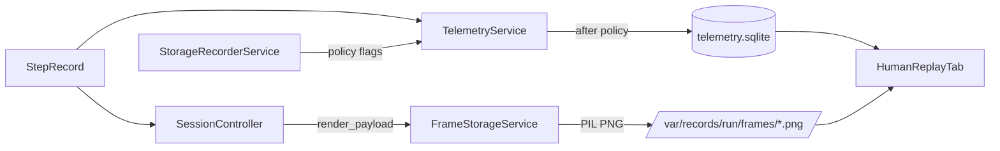

# Human Replay Frame Storage Bottleneck (2025-11-02)

## TL;DR
- Every render step calls `FrameStorageService.save_frame`, dumping a PNG under `var/records/<run_id>/frames/`.
- The Box2D storage profile (`storage_profiles.yaml`) enables `frame_compression: png`, so the encoder runs regardless of telemetry mode.
- PIL encoding + disk churn throttles Box2D/LunarLander/MuJoCo runs and stalls the Human Replay tab.
- SQLite still records the `frame_ref`, so we pay both the disk cost *and* the DB write—even though telemetry already carries the RGB array.

## Evidence
```python
# gym_gui/controllers/session.py:873
self._frame_storage.save_frame(step.render_payload, frame_ref, run_id=run_id)
```

```yaml
# gym_gui/config/storage_profiles.yaml
box2d:
  strategy: ndjson_png
  frame_compression: png
  keep_every_n_frames: 1
```

```python
# gym_gui/tests/test_frame_storage_behavior.py
def test_frame_storage_per_step_creates_many_pngs(...):
    storage.save_frame(...)
    assert len(frame_dir.glob("*.png")) == 5
```

## Flow Diagram


## Impacted Files
- `gym_gui/controllers/session.py`: unconditionally invokes `save_frame` per step.
- `gym_gui/services/frame_storage.py`: encodes arrays via PIL, logging each save.
- `gym_gui/config/storage_profiles.yaml`: Box2D profile enforces PNG compression.
- `gym_gui/tests/test_frame_storage_behavior.py`: verifies PNG files are written for every call.
- `gym_gui/services/telemetry.py`: still forwards `frame_ref` into SQLite even when PNGs exist.
- `gym_gui/ui/widgets/render_tabs.py`: Human Replay tab expects frame files based on `frame_ref`.

## Why It Hurts
1. **CPU overhead**: PIL encoding per step consumes time in the same thread that processes telemetry.
2. **Disk churn**: Tens of thousands of PNGs are created for longer episodes.
3. **Replay lag**: Human Replay waits on filesystem reads; slow disks or large PNGs delay playback.
4. **Double writes**: Telemetry already contains the RGB array; writing it again to disk is redundant.

## Recommendations
- Add a storage profile flag (e.g., `frame_capture_enabled`) and bypass `save_frame` when disabled. ✅ *Implemented via `capture_frames` in `StorageProfile` and gated calls inside `SessionController`.*
- For fast training modes, rely on telemetry to reconstruct frames on demand instead of writing PNGs.
- Batch or async the encoder if disk snapshots are truly required.
- Update the replay loader to use telemetry-first rendering, falling back to PNGs only when necessary.

*Documented: 2025-11-02*
- Update the replay loader to use telemetry-first rendering, falling back to PNGs only when necessary.

## Current Status (2025-11-02)
- `StorageProfile.capture_frames` defaults to `compress_frames` but Box2D sets it to `false`, so session steps no longer emit PNGs in fast training runs.
- `SessionController` now queries `StorageRecorderService.capture_frames_enabled()` before saving frames.
- Telemetry persistence drops `render_payload` and `observation` for profiles that opt out, preventing SQLite from serialising 96×96 RGB blobs every step.
- Regression tests (`gym_gui/tests/test_frame_storage_behavior.py`) lock in this behaviour while keeping `FrameStorageService` functional for manual captures.
