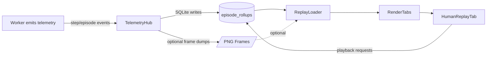
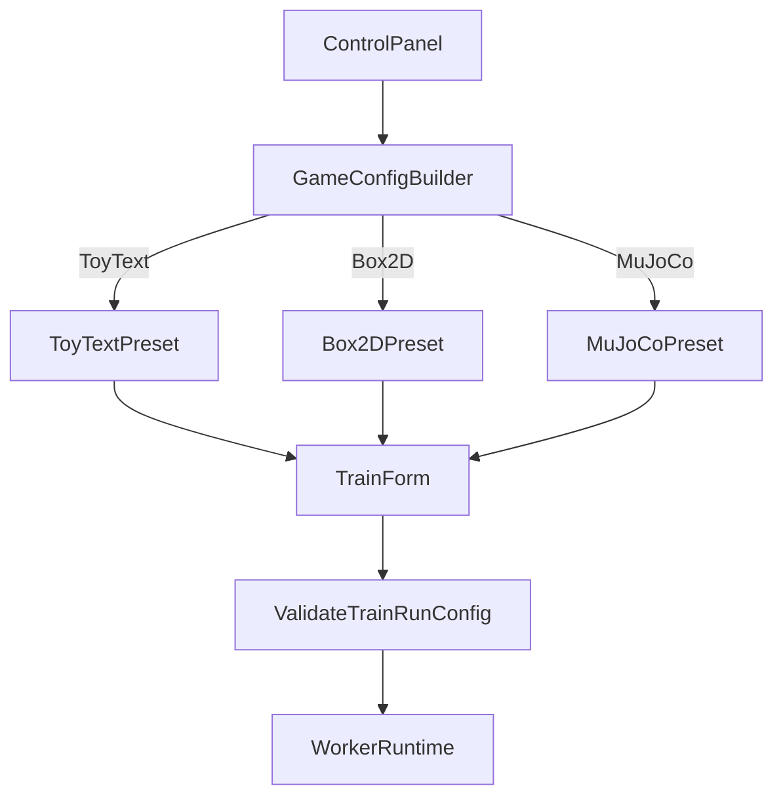

# Task Plan: Human Replay Fixes And MuJoCo Enablement (2025-11-02)

## Goals

- Stabilise the Human Replay tab so it reliably captures and replays episodes regardless of game family.
- Extend the GUI/game config layer to support non-ToyText environments, starting with MuJoCo classics.
- Keep the GUI/worker contract clean (no ControlPanel coupling to CleanRL) while adding new presets.

## Current Pain Points

1. **Human Replay reliability**
   - Replay tab appears but no episodes populate for some runs.
   - Need to confirm episode telemetry schema + DB writes after the telemetry refactor.
   - Ensure replay loader handles non-grid environments (RGB, continuous observations).
   - Frame-by-frame PNG capture for the Video tab is overwhelming SQLite and slowing Box2D/LunarLander runs; need to decouple Human Replay from expensive frame storage.
2. **Game catalog limitations**
   - `gym_gui/config/game_configs.py` only lists ToyText variants (FrozenLake, CliffWalking, etc.).
   - No Box2D/MuJoCo defaults, so Control Panel cannot launch those environments.
   - Constants (e.g., `constants_game.py`) lack metadata for physics-based families.
3. **Control panel & worker coherence**
   - Current train form mixes SPADE-BDI and CleanRL assumptions.
   - Need separate config builders per family, or at least clean injection of env-specific params.

## Deliverables

1. Human Replay fixes (telemetry + loader + UI feedback).
2. Game constants extended with Box2D & MuJoCo definitions.
3. Control Panel/Train Form updated to surface MuJoCo selection + config presets.
4. Worker adapter updates (if required) to launch MuJoCo via existing infrastructure.
5. Tests covering new paths (unit + smoke-level integration where feasible).

## Likely Impacted Files

- `gym_gui/constants/constants_game.py` — introduce new families, metadata, display names.
- `gym_gui/config/game_configs.py` — supply presets/hyper-parameters for Box2D & MuJoCo.
- `gym_gui/ui/widgets/spade_bdi_train_form.py` — surface new options, avoid hard-coded ToyText assumptions.
- `gym_gui/core/adapters/*` — ensure adapters can instantiate MuJoCo envs and skip PNG frame dumps when disabled.
- `gym_gui/ui/widgets/render_tabs.py` & `_ReplayTab` support modules — adjust replay loading pipeline.
- `spade_bdi_worker/core/runtime.py` & `tensorboard_logger.py` — verify episode artifact emission covers continuous-action telemetry.
- `var/trainer/schema` & telemetry storage classes — if schema tweaks are required for continuous observations.
- Test suites: `gym_gui/tests/test_worker_presenter_and_tabs.py`, `spade_bdi_worker/tests/test_tensorboard_logger.py`, plus new replay regression tests.

## Proposed Work Breakdown

### A. Human Replay Audit & Fix

1. Inspect telemetry DB writes during runs (confirm `EpisodeReplay` persistence).
2. Add logging around replay loader to capture missing episodes.
3. **DONE:** profile Video tab frame capture and gate `save_frame` behind the new `capture_frames` flag (`StorageProfile`, `SessionController`).
4. **DONE:** drop `render_payload`/`observation` from SQLite persistence when the active profile opts out, keeping the live UI fast while trimming stored blobs.
5. Reproduce failure cases with headless runs; write regression test in `gym_gui/tests` (pending for loader-side issues).
6. Patch loader / UI to handle continuous obs + large payloads.

### B. Game Configuration Refactor

1. Expand `constants_game.py` with new enums/categories:
   - Add Box2D family (LunarLander, BipedalWalker, CarRacing, etc.).
   - Add MuJoCo family list provided by user.
2. Update `game_configs.py` to generate default hyper-parameters per family (reward scales, obs spaces, etc.).
3. Ensure Control Panel populates new families via `available_games()`.

### C. UI/Worker Integration

1. Update train form to surface MuJoCo options (seed, episode limits, physics toggles).
2. Confirm worker adapter can load MuJoCo envs (maybe via CleanRL integration) or add bridging code.
3. Add CLI/env config plumbing for GPU requirements (MuJoCo needs mujoco-py / MuJoCo engine installed).

### D. QA & Docs

1. Extend tests: replay loader, new game configs, TensorBoard path regression.
2. Update documentation (README + new Task log) with setup instructions for MuJoCo dependencies.

## Contrarian Progress Check

- **We fixed symlinked symptoms, not root causes.** The TensorBoard cleanup and splitter tweaks improved usability, but Human Replay still depends on brittle PNG dumping; unless we replace that pipeline with telemetry-derived frames, MuJoCo performance will suffer regardless of new configs.
- **Config sprawl risk.** Adding a dozen MuJoCo presets without revisiting adapter abstraction could cement the current Control Panel → CleanRL coupling. Consider extracting a provider interface before copy-pasting more presets.
- **Telemetry schema debt.** Continuous control environments produce high-frequency data; our current SQLite layout (per-step JSON) may become the next bottleneck. We should evaluate batching/compression before scaling to the full MuJoCo suite.
- **Dependency drag.** MuJoCo setup requires binaries + mujoco-python; shipping this through the GUI with SPADE-BDI workers may complicate reproducibility. A containerised runtime or dependency checker could avert support churn.
- **Testing gap.** Present regression tests focus on ToyText. Without automated coverage for MuJoCo/Box2D, we’ll rely on manual runs. Plan to add smoke tests that instantiate at least one MuJoCo env (mock physics if necessary) to guard against drift.

## Open Questions

- Do we rely on CleanRL training scripts for MuJoCo, or integrate with SPADE-BDI worker directly?
- What licensing/packaging concerns exist for MuJoCo binaries in this environment?
- Is TensorBoard writer already capturing relevant metrics for MuJoCo (continuous actions)?

## Next Actions

1. Review Human Replay event flow (`RenderTabs._replay_tab`, telemetry DB schema).
2. Draft data model updates for new game families in `constants_game.py`.
3. Prototype MuJoCo run config using existing train form, capture gaps.
