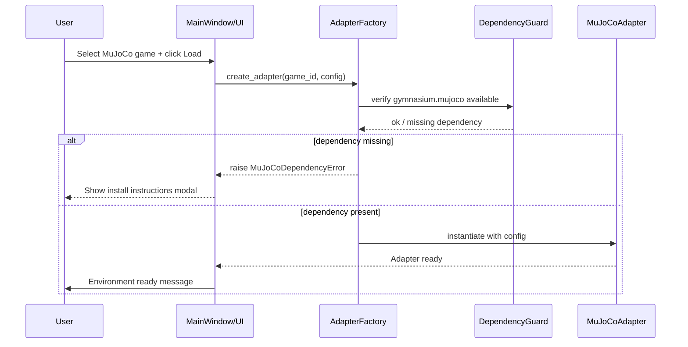

# MuJoCo Integration — Contrarian Assessment and Deep Dive

## Why the Existing Plan Is Fragile

- **Box2D bias in control flow.** Session idle ticks, passive actions, and human shortcut routing all assume Box2D semantics. Extending those switches to MuJoCo without guardrails risks resurrecting the telemetry backpressure bug (Day-14 P0). Until the credit gap in `TelemetryAsyncHub._drain_loop` is closed, jamming high-frequency MuJoCo rollouts through the same channel will amplify the leak.
- **UI overreach.** The control panel mutates per-game overrides synchronously on every signal. Adding dense MuJoCo sliders will worsen the spaghetti unless we split read/write layers or cache pending values before firing reloads. Otherwise continuous toggles (e.g., `frame_skip`, `terminate_when_unhealthy`) will force full environment reloads on every spin-box nudge.
- **Telemetry payload inflation.** MuJoCo observations (17–376 floats) dwarf ToyText metrics. The current SQLite schema writes JSON per step; WAL mode masks cost for ToyText, but MuJoCo’s ~4 KB per step explodes storage and UI diffing. If we push ahead without chunked serialization or columnar rollups, the Human Replay P0 resurfaces.
- **Dependency drift.** `gymnasium[mujoco]` pulls C bindings plus shared-library assets. The repo already vendored CleanRL and Xuance copies; duplicating binaries or expecting local Mujoco installation will break the deterministic trainer worker unless we add runtime checks and fail-fast messaging in the GUI.
- **Policy UX debt.** We agreed human play is out-of-scope, but action mapping still injects fallback vectors for Box2D. Leaving MuJoCo mapped to the default zero vector will make agent-only demos look broken unless we surface that limitation in-game info and telegraph that only scripted/worker agents are supported.

## Deep Integration Blueprint

### 1. Domain Model & Registry

1. Add explicit MuJoCo `GameId` constants for the first tranche (`HalfCheetah-v4`, `Hopper-v4`, `Walker2d-v4`). Keep scope tight to honor Q1.
2. Update `ENVIRONMENT_FAMILY_BY_GAME`, `DEFAULT_RENDER_MODES`, and `DEFAULT_CONTROL_MODES` (agent-only + no-human hybrid until we offer analog inputs).
3. Thread the new family through any `EnvironmentFamily.BOX2D` guards in `SessionController` so MuJoCo skips idle ticks but still plugs into the existing turn/status pipeline.

### 2. Configuration Surfaces

1. Mirror the Box2D config dataclasses with `HalfCheetahConfig`, `HopperConfig`, and `Walker2dConfig`. Core toggles worth exposing now:
   - `frame_skip` (int) — action repeat to tame physics cost.
   - `exclude_current_positions_from_observation` (bool) — the default Gymnasium knob for MuJoCo observation cropping.
   - `reset_noise_scale` and `terminate_when_unhealthy` (per-env bool) to make failure cases debuggable from the UI.
2. Inject those configs into `ControlPanelConfig` and persist overrides via the existing dictionary. Expect to add nested groups in `_refresh_game_config_ui` so sliders/checkboxes cluster under a “MuJoCo Parameters” heading.
3. Extend `GameConfigBuilder` to sanitize the new overrides (clamp `frame_skip`, coerce floats, ensure bools) before constructing the dataclasses.
4. Document in the UI that human controls are intentionally disabled for MuJoCo (Q3) to avoid confusion.

### 3. Adapter Layer

1. Create `gym_gui/core/adapters/mujoco.py` with a `MuJoCoAdapter` base class that parallels `Box2DAdapter`:
   - Inherit the RGB render contract and `build_frame_reference` so telemetry tabs can reuse the PNG pipeline.
   - Implement `_extract_metrics` hooks per game (e.g., torso velocity/height for Hopper, hip angle for Walker2d) to keep telemetry meaningful without flooding logs.
2. Register `MUJOCO_ADAPTERS` and merge into `_registry()` in `AdapterFactory`. Ensure adapter constructors accept both `context` and the new config dataclasses.
3. Make the adapters explicitly raise if a user attempts a human-only control mode, surfacing a UI error instead of silently falling back.

### 4. Services & Telemetry

1. Extend `ContinuousActionMapper` with placeholders (all zeros) plus a warning log so automated policies still work while human control stays disabled. Future analog input work can replace these vectors.
2. Gate telemetry frame dumps via a per-family flag. MuJoCo episodes can generate >10k frames; add a `capture_frames` override in the control panel that defaults off for MuJoCo to avoid choking SQLite (align with Day-19 “Human Replay Fixes”).
3. Audit `TelemetryAsyncHub` credit consumption before rolling out; if the backpressure fix is still pending, ship MuJoCo behind a feature flag or throttle step emission to protect the P0.

### 5. Trainer & Worker Cohesion

1. Bootstrap CleanRL worker presets: select Mujoco-ready scripts (`ppo_continuous_action.py`, `sac_continuous_action.py`) and pre-fill the train form when a MuJoCo game is selected. Confirm CLI glue passes the correct `env_id`.
2. Validate that SPADE-BDI worker either declines MuJoCo requests gracefully or forwards them to the CleanRL integration (documented fallback).
3. Add dependency guardrails: on load, check for `gymnasium.mujoco` availability and show a modal with installation instructions if missing.

### 6. Testing & Observability

1. Add smoke tests that instantiate each new adapter, perform one reset/step with dummy configs, and assert telemetry payload sizes stay bounded.
2. Instrument logging (one per component) to record when MuJoCo toggles change, since reloads are expensive.
3. Update game info panels with new HTML descriptions mirroring the Box2D style so the Game Info tab remains authoritative.

### 7. Documentation & Rollout

1. Record the integration steps and dependency expectations in the Day-19 task log plus a fresh Day-20 addendum.
2. Reference Xuance’s MuJoCo presets (seed handling, observation normalization) to justify default values; cite specific YAMLs so the next engineer can triangulate configs quickly.
3. Capture residual debt in the journaling doc (telemetry backpressure, human control roadmap, dependency install UX) so we do not lose sight post-merge.

## File Impact Map

| File | Role Today | MuJoCo Impact | Risk / Debt |
| --- | --- | --- | --- |
| `gym_gui/core/enums.py` | Enumerates families, render defaults, allowed modes | Add `GameId` values and tie them to `EnvironmentFamily.MUJOCO`; restrict control modes to agent-only | Forgetting the mapping breaks adapter lookup and idle timer branching |
| `gym_gui/core/factories/adapters.py` | Registers adapters and builds them with typed configs | Merge `MUJOCO_ADAPTERS` and pass MuJoCo config dataclasses | Registry memoization hides missing imports until runtime; add unit tests |
| `gym_gui/core/adapters/*` | Adapter implementations for ToyText/Box2D | New `mujoco.py` module plus shared utilities for RGB capture & metrics | Copy/paste Box2D logic risks frame overrun; throttle render payloads |
| `gym_gui/config/game_configs.py` | Dataclasses + defaults for game overrides | Introduce per-env MuJoCo config classes with physics toggles | Need deterministic defaults aligned with Xuance/cleanrl baselines |
| `gym_gui/config/game_config_builder.py` | Converts overrides into typed configs | Sanitize MuJoCo overrides (`frame_skip`, `terminate_when_unhealthy`) before instantiating | Without clamps, invalid UI values crash `gym.make` |
| `gym_gui/ui/widgets/control_panel.py` | Builds dynamic config widgets and emits override signals | Add grouped MuJoCo controls, debounce reloads, and display agent-only notice | Existing synchronous reload will stutter if we emit on every spin change |
| `gym_gui/controllers/session.py` | Orchestrates adapter lifecycle, idle timers, telemetry | Treat `EnvironmentFamily.MUJOCO` as non-idle, enforce agent-only loads, surface dependency errors | Idle tick logic currently hard-coded for Box2D; guard new path |
| `gym_gui/services/action_mapping.py` | Converts discrete inputs to continuous vectors | Register placeholder mappings and log that human control is disabled | Zero-vector fallback must not silently mask missing policy inputs |
| `gym_gui/services/telemetry.py` + `TelemetryAsyncHub` | Streams step payloads into SQLite | Add throttles/feature flag before enabling MuJoCo to avoid credit overflow | Backpressure P0 remains open; blockers must be cleared first |
| `gym_gui/ui/widgets/spade_bdi_train_form.py` | Collects run configs for workers | Pre-select MuJoCo-friendly scripts and env IDs; warn if dependency missing | Form currently defaults to ToyText; must avoid confusing combinations |

## Recommended Implementation Phasing

1. **Guard Rails First.** Patch `TelemetryAsyncHub` credit handling and add a feature flag (`ENABLE_MUJOCO`) so we can dogfood without destabilising existing runs.
2. **Domain Additions.** Extend `GameId`, `EnvironmentFamily` mappings, and unit tests. Ship with adapters returning clear errors until the remaining work lands.
3. **Adapter + Config Layer.** Implement `mujoco.py` adapters and the corresponding config dataclasses/builder sanitation. Validate with smoke tests invoking `create_adapter` + `reset`.
4. **UI Wiring.** Introduce MuJoCo sections in the control panel with grouped widgets and debounced emissions. Update game info panel to clarify agent-only status.
5. **Worker & CLI Integration.** Update trainer form defaults, ensure CleanRL worker handles MuJoCo env IDs, and emit dependency guidance when `gymnasium.mujoco` is absent.
6. **Telemetry & Storage Tuning.** Disable frame capture by default for MuJoCo, add log guards, and monitor storage growth; re-enable once Human Replay refactor lands.
7. **Documentation & Education.** Publish setup notes (dependencies, expected performance), cross-link Xuance configs for canonical hyper-parameters, and capture residual debt for human control UX.

## Integration Flow Overview

```mermaid
flowchart LR
   ControlPanel[Control Panel Overrides]
   GameConfigBuilder
   AdapterFactory
   MuJoCoAdapter
   SessionController
   TelemetryHub[TelemetryAsyncHub]
   UI[Render Tabs / Live Metrics]

   ControlPanel -->|MuJoCo parameters| GameConfigBuilder
   GameConfigBuilder -->|Typed config| AdapterFactory
   AdapterFactory -->|create_adapter| MuJoCoAdapter
   MuJoCoAdapter -->|reset/step| SessionController
   SessionController -->|step events| TelemetryHub
   TelemetryHub -->|frames + metrics| UI
```

## Alignment With Contrarian Concerns

| Risk | Mitigation Strategy |
| --- | --- |
| Telemetry backpressure resurfaces | Gate MuJoCo behind the credit fix or throttle step emission; monitor `TelemetryAsyncHub` before enabling by default. |
| UI complexity spike | Group MuJoCo controls, debounce overrides, and avoid immediate reloads on every spinbox change. |
| Storage bloat | Default MuJoCo runs to “telemetry-only” until Human Replay pipeline is decoupled; rely on optional frame capture. |
| Broken human UX | Block human control modes, log intent, and annotate in Game Info; revisit once analog input design exists. |
| Dependency surprises | Add runtime detection and documentation for `gymnasium[mujoco]`; ensure workers emit actionable errors rather than stack traces. |

## Immediate Next Steps

1. Land the telemetry credit fix or add a temporary MuJoCo feature flag to guard prod builds.
2. Prototype `MuJoCoAdapter` with HalfCheetah + config UI to validate the override wiring before scaling to other environments.
3. Update the train form and documentation in lockstep so QA can follow the new workflow without spelunking.

Prepared: 2025-11-03 — GitHub Copilot (Day 19 / Task 2)
