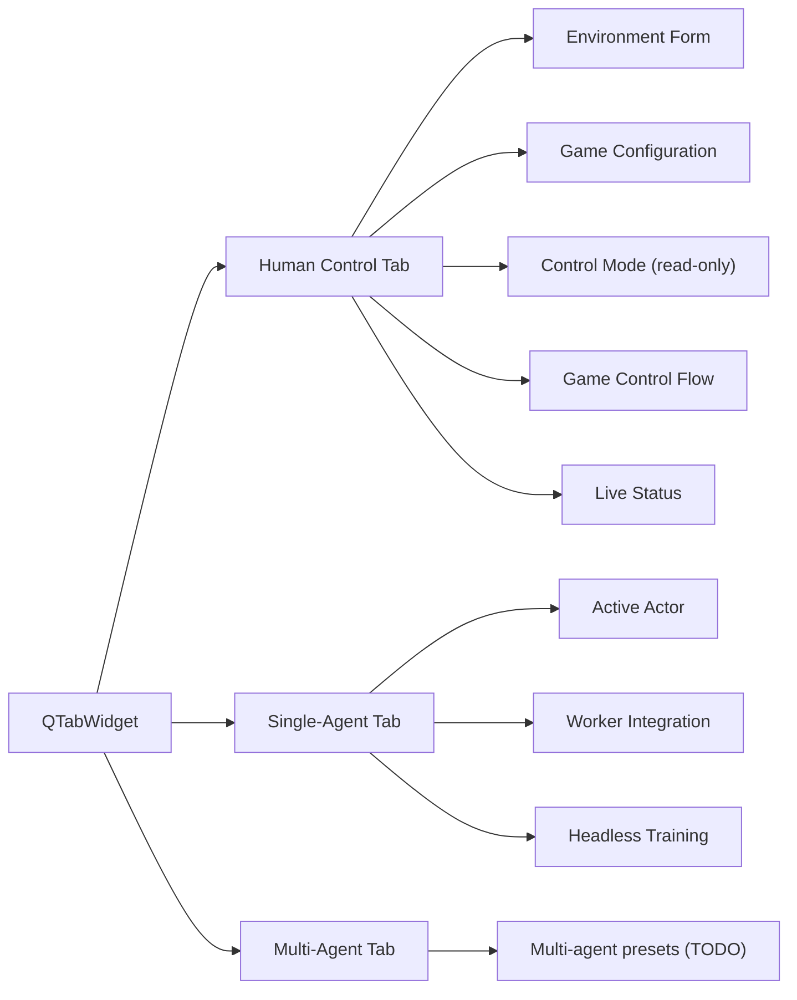

# Control Panel Tabbed Layout & Actor Naming Update (2025-11-02)

## Overview
- Introduced a tabbed layout to the SPADE control panel, separating Human, Single-Agent, and future Multi-Agent workflows.
- Added storage profile switches that strip heavy render payloads/observations from telemetry persists (carried over from the frame-storage work) so fast environments stay responsive.
- Renamed the **BDI-Q Agent** actor to **BDI Agent** to reflect that the BDI wrapper now hosts multiple learning backends, not just Q-learning.
- Registered a **CleanRL Worker** actor so the Single-Agent tab can point at external CleanRL policies without manual catalog edits.

## Control Panel Tabs

| Tab | Default Mode | Visible Widgets |
| --- | --- | --- |
| **Human Control** | `ControlMode.HUMAN_ONLY` | Environment selector + seed controls, game configuration stack, mode combo (read-only), Game Control Flow buttons, Status dashboard. |
| **Single-Agent Mode** | `ControlMode.AGENT_ONLY` | Active Actor selector, Worker Integration picker, Headless Training section (configure/train/load buttons). |
| **Multi-Agent Mode** | `ControlMode.MULTI_AGENT_COOP` (fallbacks to game-supported mode) | Placeholder message; wiring ready for future presets. |

- The active tab drives the control mode automatically. If the environment doesn’t support the requested mode, we fall back to the first supported mode and reflect it in the combo box.
- Human tab keeps the existing status telemetry (step, reward, turn, timings) and the full control flow buttons. Single-Agent tab hides these to keep the UI focused on background training tasks.

## Telemetry Trim Recap
- `StorageProfile` gained `capture_frames`, `drop_render_payload`, and `drop_observation` flags. Box2D profile disables frame capture and strips RGB payloads/observations before they hit SQLite.
- `SessionController` respects the `capture_frames` flag when deciding whether to persist PNG snapshots.
- `TelemetryService` trims heavy fields using `dataclasses.replace` before enqueuing records, keeping CarRacing/LunarLander responsive.

## Actor Naming Alignment
- The actor registration in `services/bootstrap.py` now advertises **BDI Agent** (display label and tooltip) instead of **BDI-Q Agent**.
- The underlying `BDIQAgent` class docstring clarified that the agent is a BDI wrapper with a default Q-learning strategy, leaving room for other algorithms.

## Touch Points
- `gym_gui/ui/widgets/control_panel.py` — rebuilt UI with tabbed structure and mode syncing helpers.
- `gym_gui/services/storage.py`, `gym_gui/services/telemetry.py` — telemetry trimming flags & logic (from earlier work).
- `gym_gui/services/bootstrap.py`, `gym_gui/services/actor.py` — actor display-name adjustments and CleanRL Worker registration.
- `gym_gui/tests/test_frame_storage_behavior.py` — asserts the new profile behaviour.

## Next Ideas
- Flesh out Multi-Agent tab with per-team presets and hub configuration.
- Offer a condensed “Live Replay” view that can subsample frames for heavy RGB environments.
- Surface the new profile toggles in an advanced settings dialog so users can switch between full-fidelity captures and lightweight telemetry.
