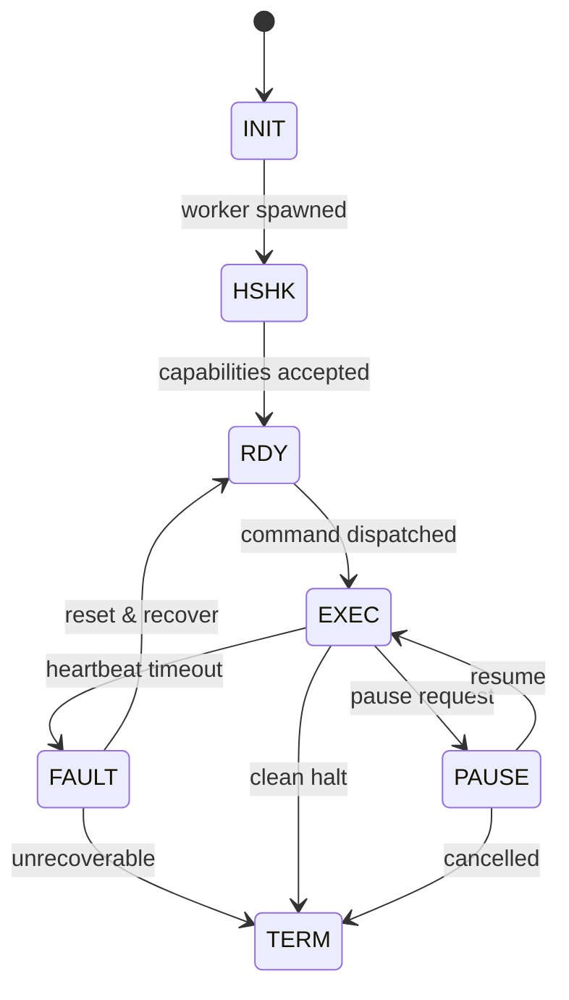
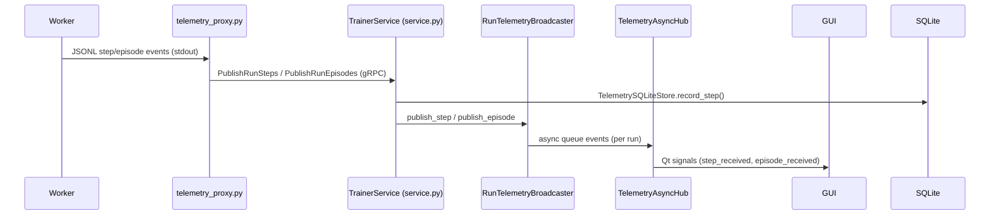

# Day 20 — Task 2: MOSAIC IPC Implementation Field Notes

Section 4.2/4.3 of the MOSAIC design memo sketches an inter-process communication (IPC) fabric combining JSONL telemetry, gRPC streams, and a lifecycle finite-state machine (FSM). This write-up anchors those claims in the repository as of 2025‑11‑03, expanding on how each guarantee is (or is not yet) realized in code.

## What the FSM Is (and Why It Matters)

A **finite-state machine (FSM)** is a directed graph whose nodes represent discrete lifecycle states and whose edges encode the only legal transitions. In MOSAIC the orchestration states are `INIT → HSHK → RDY → EXEC ↔ PAUSE → FAULT → TERM`, mirroring the diagram in the memo.

**What it offers:**

- **Safety:** illegal jumps (e.g., executing commands before a handshake) are forbidden because only edges present in the graph are traversed. In code, `gym_gui/services/trainer/dispatcher.py` updates `RunRegistry` statuses in `_dispatch_run`, `_monitor_loop`, and `_heartbeat_loop`, so each transition is explicit and logged.
- **Liveness:** watchdogs ensure the system keeps progressing. `TrainerService.Heartbeat()` (see `service.py`) stamps `RunRegistry.record_heartbeat`, while `_check_heartbeats()` in the dispatcher pushes runs stuck in `EXEC` into `FAULT` and eventually `FAILED`, satisfying the spec’s “progress or terminate” condition.
- **Deterministic recovery points:** by centralizing RESET/PAUSE edges the orchestrator knows when to request checkpoints or replay seeds.

**Why we need it:**

1. **Cross-process coordination.** The GUI, daemon, and workers run in separate processes; a shared FSM prevents race conditions (e.g., two simultaneous RESUME commands) and keeps the GUI’s understanding of state consistent with the daemon’s `RunRegistry` rows.
2. **Auditability.** `RunRegistry` (see `gym_gui/services/trainer/registry.py`) persists the status timeline, letting operations trace why a run halted.
3. **Policy enforcement.** Because only the dispatcher mutates status, business rules (e.g., “only RUNNING workers may emit telemetry”) stay enforceable.

## Architecture Walkthrough (Code References)

| Pipeline Stage (spec) | Implementation Anchor |
| --- | --- |
| **Worker emits JSONL telemetry to stdout** | SPADE/Headless workers stream `{"type": "step" …}` via their adapter layers (see `spade_bdi_worker/core/runtime.py` and `gym_gui/workers/headless_worker.py`). |
| **Telemetry proxy tails stdout and upgrades to protobuf** | `gym_gui/services/trainer/trainer_telemetry_proxy.py` (`JsonlTailer`, `_make_runstep`, `_publish_steps`). This sidecar spawns the worker and pushes messages into `PublishRunSteps/PublishRunEpisodes`. |
| **Daemon ingests client streams over gRPC** | `gym_gui/services/trainer/service.py` (`TrainerService.PublishRunSteps`, `.PublishRunEpisodes`). Messages are persisted via `_persist_step/_persist_episode` into `TelemetrySQLiteStore` and relayed to the in-memory broadcaster. |
| **Run-state FSM and resource lifecycle** | `gym_gui/services/trainer/dispatcher.py` drives `RunStatus` transitions exposed by `RunRegistry` (`registry.py`). Methods `_dispatch_run`, `_monitor_loop`, `_heartbeat_loop` mirror INIT→RUNNING→FAULT/HALT semantics mentioned in the spec. |
| **Live fan-out to GUI and other consumers** | `RunTelemetryBroadcaster` (in `service.py`) multiplexes steps/episodes; `TelemetryAsyncHub` in `gym_gui/services/trainer/streams.py` subscribes via `TrainerClient.stream_run_steps()` and emits Qt signals for UI widgets. |
| **Persistence and replay** | `gym_gui/telemetry/sqlite_store.py` stores `StepRecord`/`EpisodeRollup`. `StreamRunSteps()` replays rows from SQLite before live streaming, matching the spec’s deterministic replay requirement. |
| **Heartbeats and liveness** | `TrainerService.Heartbeat()` updates `RunRegistry.record_heartbeat`; `TrainerDispatcher._heartbeat_loop()` enforces timeouts and transitions stalled runs to `FAILED`, aligning with the “watchdog” clause. |

## Spec Crosswalk: 4.2 vs. Repository

- **Spawn & Handshake:** The dispatcher spawns workers via `_dispatch_run`, optionally wrapping them in the telemetry proxy (`trainer_telemetry_proxy.py`). A true capability handshake is still aspirational—today the daemon assumes the worker matches `worker_meta` embedded in the submitted config (`dispatcher.py`, lines around 250–360).
- **Command Dispatch & Correlation IDs:** GUI presenters use `TrainerClientRunner` to submit runs and observe status via `watch_runs`. Each run carries a digest and `run_id`, acting as the correlation handle for subsequent telemetry.
- **Telemetry Streaming:** JSONL output is parsed by `_make_runstep/_make_runepisode` and converted to `trainer_pb2.RunStep/RunEpisode`. These are consumed by `RunTelemetryBroadcaster` and `TelemetryAsyncHub`, which deliver updates to Qt widgets (e.g., `gym_gui/ui/widgets/live_telemetry_tab.py`).
- **Fault Handling:** Heartbeat gaps promote runs to `FAILED`, freeing GPU slots through `GPUAllocator.release_many`. Recovery hooks exist via `_terminate_worker` plus the ability to re-dispatch the run, though automated checkpoint rollback is still TODO.

## November 2025 FSM Rollout – Code Changes

The MOSAIC FSM landed across several subsystems. The bullet list below calls out the most relevant edits so future readers can grep the exact implementation:

- **Protocol & generated stubs**
  - `gym_gui/services/trainer/proto/trainer.proto` now carries the MOSAIC enum (`RUN_STATUS_INIT … RUN_STATUS_TERM`), the `RegisterWorker{Request,Response}` handshake, and the placeholder `ControlEvent` stream.
  - `trainer_pb2.py` / `trainer_pb2_grpc.py` were regenerated from that schema.
- **Registry & migrations**
  - `gym_gui/services/trainer/registry.py` replaced the legacy `pending/dispatching/running` enum with the MOSAIC values and added `_migrate_status_values` so pre-existing rows upgrade in place.
  - Outcome handling logs were fixed to reference `RunStatus.TERMINATED.value` instead of a removed local variable.
- **Dispatcher orchestration**
  - `gym_gui/services/trainer/dispatcher.py` now polls only `RunStatus.INIT`, flips spawned runs to `HANDSHAKE`, promotes to `EXECUTING` after the first telemetry payload, and escalates heartbeat misses to `RunStatus.FAULTED`.
- **Handshake + telemetry ingestion**
  - `gym_gui/services/trainer/service.py` implements `RegisterWorker`, tracks session tokens, gates telemetry streams until a handshake occurs, and automatically transitions `READY → EXECUTING` when telemetry starts.
  - `gym_gui/services/trainer/trainer_telemetry_proxy.py` performs the handshake before streaming stdout.
  - `gym_gui/services/telemetry.py` defensively checks optional storage helpers when trimming payloads.
- **Client/UI**
  - `gym_gui/services/trainer/client.py` maps the new statuses to proto integers.
  - `gym_gui/ui/main_window.py` requests the MOSAIC statuses in both watch and poll flows, and `_training_submit_deadline_seconds()` extends the SubmitRun timeout (6× default) to avoid false deadline errors with large SPADE-BDI payloads.
- **Worker compatibility**
  - `spade_bdi_worker/core/bdi_agent.py`, `core/runtime.py`, and `core/config.py` guarantee adapters are loaded before RL components use them and expose goal metadata for alignment tests.
  - `gym_gui/core/adapters/toy_text.py` records the resolved start/goal positions (needed by SPADE tests) and tolerates older `map_size` hints.
- **Housekeeping**
  - Requirements files (`requirements/base.txt`, `requirements/spade_bdi_worker.txt`) picked up the dependencies required by the new code paths, and `pytest.ini` documents the asyncio marker we use in new tests.

At the repo root, `README.md` was refreshed to mention the handshake-driven lifecycle, and log fixtures under `var/data/toy_text/*.txt` were regenerated to match the new adapter behaviour. The `spadeBDI_RL` subtree contains the worker assets touched in the process (goal metadata, telemetry config templates, etc.).

## Sequence Overview

## Implementation Notes & Evidence

### gRPC Surface & Contracts

- `trainer.proto` defines `PublishRunSteps`, `PublishRunEpisodes`, `Heartbeat`, and `StreamRunSteps/StreamRunEpisodes`. The generated stub lives at `gym_gui/services/trainer/proto/trainer_pb2_grpc.py`.
- `TrainerService.PublishRunSteps` logs the stream, validates `run_id`, persists via `_persist_step`, and forwards the payload to `RunTelemetryBroadcaster.publish_step` with sequence IDs (see `service.py` lines ~600-770).
- `StreamRunSteps` replays SQLite history (first 4k records) before yielding live updates, satisfying the deterministic replay story from Sec. 4.3.

### Telemetry Proxy

- `trainer_telemetry_proxy.py` is the concrete “telemetry proxy” from the memo: it tails worker stdout using `JsonlTailer`, marshals JSON into protobuf with `_make_runstep/_make_runepisode`, and pumps async queues into the gRPC client (`_publish_steps`, `_publish_episodes`).
- Queue backpressure is applied locally (`asyncio.Queue(maxsize=max_queue)` with drop-oldest fallback), matching the “JSONL → typed messages” translation in the pipeline.

### Dispatcher & Session FSM

- `TrainerDispatcher._dispatch_run` transitions a pending run to `DISPATCHING`/`RUNNING`, spawns the worker command (optionally wrapping it with the telemetry proxy), and emits `training_started` Qt signals.
- `_monitor_loop` and `_heartbeat_loop` back the FSM’s `EXEC`, `PAUSE`, `FAULT` semantics: missing heartbeats (see `_check_heartbeats`) trigger `RunStatus.FAILED` and worker termination via `_terminate_worker`.
- `RunRegistry` persists run metadata (`runs` table) and consumes `RUN_COMPLETED` events from the RunBus to finalize outcomes (cf. `_handle_run_completed_event`).

### Seeding, Checkpoints, and Replay Guarantees

- **Seed orchestration:** `SessionSeedManager` (`gym_gui/utils/seeding.py`) provides GUI-side control over RNG seeds. These seeds get serialized into the training config that the dispatcher writes to disk (`_save_run_config`).
- **Checkpoint plumbing:** Worker configs written in `_build_worker_command` carry optional checkpoint parameters (e.g., SPADE-BDI flags). However, there is no explicit RPC for checkpoint negotiation yet—the spec’s “idempotent RESET” currently relies on worker implementations honouring the command-line arguments.
- **Deterministic playback:** `TrainerService.StreamRunSteps()` loads the last 4096 steps from SQLite via `TelemetrySQLiteStore.recent_steps` before yielding live data, which lets QA reproduce trajectories when seeds and commands match.

### Latency and Backpressure

- The spec’s latency formula `L = d_emit + d_pipe + d_render` maps to `TelemetryAsyncHub` queuing (`d_pipe`) plus Qt rendering (`d_render`). `gym_gui/telemetry/credit_manager.py` tracks credits to keep UI rendering under control.
- Current limitation: credits only suppress GUI updates. Producers (workers) are not slowed because the daemon does not yet publish control messages back to the proxy—highlighting a gap to close for end-to-end stability at high λ.

### Capability-Driven Scheduling & Resources

- `GPUAllocator` (`gym_gui/services/trainer/gpu.py`) enforces GPU budgets, aligning with the spec’s `ℓ_w`/`ρ_w` constraints.
- Worker capability metadata is persisted alongside the run configuration in `VAR_TRAINER_DIR/configs`. Until a handshake RPC lands, the selection stage is manual: operators must ensure the worker module declared in the config matches the desired capability signature.

### GUI Subscription Path

- `TelemetryAsyncHub` (`streams.py`) maintains per-run deques (`RunStreamBuffer`) and posts custom Qt events through `TelemetryBridge`. This is the runtime that feeds dashboard widgets like `LiveTelemetryTab`.
- Credits/backpressure are coordinated through `gym_gui/telemetry/credit_manager.py`; although the spec promises end-to-end throttling, current code only logs `STARVED/RESUMED` without signaling producers (flagged in Day 20 Task 1).

### Tests & Diagnostics

- `pytest gym_gui/tests` exercises the trainer bridge (e.g., `test_trainer_client.py` for multi-event-loop support, `test_worker_presenter_and_tabs.py` for end-to-end GUI subscription). Recent runs (2025-11-03) expose diverging storage contracts (`TelemetryServiceTests` failing due to `_DummyStorage.drop_render_payload_enabled()`), reinforcing the dual-path gap documented in Task 1.
- SPADE-BDI worker coverage in `spade_bdi_worker/tests` currently fails when adapters aren’t loaded or XMPP auth is absent, evidencing outstanding work before strict schema enforcement can lean on this IPC stack.

## Gaps vs. Spec

1. **Handshake Capability Negotiation**: The memo references capability negotiation (INIT→HSHK). The code still launches workers directly; no message exchange enumerates supported commands. Opportunity: extend `SubmitRun` payload or introduce a `RegisterWorker` RPC.
2. **Producer Backpressure**: Credits stop at the GUI’s `TelemetryAsyncHub`; the daemon never clamps `PublishRunSteps` senders. A feedback channel (e.g., gRPC bidi control stream) is needed to enforce λ·p̄ < 1.
3. **Checkpoint / Reset Hooks**: Dispatcher handles kill/respawn, but “checkpoint replay” is left to the worker binaries. Adding checkpoint RPCs or explicit resume hooks would align practice with theory.
4. **Versioned Schemas**: `RunStep` still carries JSON blobs (`render_payload_json`, `observation_json`). Typed fields for `space_signature`, `vector_metadata` remain TODO, as cataloged in Task 1.

## Suggested Next Steps

1. **Introduce Worker Capability RPC**: Add a `RegisterWorkerCapabilities` unary RPC in `trainer.proto`; capture supported commands and telemetry schema before dispatching runs.
2. **Close the Credit Loop**: Extend `TelemetryAsyncHub` to emit control messages back through the RunBus (or a new gRPC stream) so `trainer_telemetry_proxy` can pause/resume worker emission.
3. **Schema Hardening**: Replace JSON fields in `RunStep`/`RunEpisode` with typed message sub-structures—then update `_make_runstep` and `_persist_step` accordingly.
4. **Checkpoint APIs**: Model `RESET/PAUSE/RESUME` transitions explicitly in the dispatcher, with hooks for workers to report checkpoint availability and restoration status.

These steps would tighten the correspondence between MOSAIC’s designed IPC guarantees and the executable code now in the repository.

## Completing the FSM: Concrete Worklist

To materialize the memo’s FSM end-to-end, the following sequence stitches the missing edges into code:

1. **Expand `RunStatus` and Persistence**
    - Add `HANDSHAKE`, `READY`, `PAUSED`, and `FAULTED` enum values in `gym_gui/services/trainer/registry.py`.
    - Migrate the `runs` table to store the new states (include a PRAGMA migration inserting rows with defaults for legacy data).

2. **Handshake RPC + Capability Exchange**
    - Extend `trainer.proto` with `rpc RegisterWorker(RegisterWorkerRequest) returns (RegisterWorkerResponse)` that workers call before emitting telemetry.
    - Implement the server hook inside `TrainerService`; once capabilities and protocol versions validate, promote the run `DISPATCHING → HANDSHAKE → READY`.
    - Update the telemetry proxy to call the RPC before starting the JSONL tail, passing worker metadata already persisted in `_build_worker_command`.

3. **Command Surface and State Guards**
    - Introduce dispatcher APIs `pause_run`, `resume_run`, and `reset_run`. Each should verify the current state (`READY` or `EXEC`) before transitioning.
    - GUI presenters (`gym_gui/ui/presenters/workers`) can then surface pause/resume controls, calling into the new client RPCs.

4. **Fault & Recovery Loop**
    - When `_check_heartbeats` detects a miss, move the run into `FAULTED` instead of `FAILED` and emit a RunBus event.
    - Add retry logic: attempt `reset_run` automatically up to N times, using checkpoint metadata stored alongside the run config. Only after retries fail does the state flip to `FAILED` / `TERM`.

5. **Telemetry-Driven Backpressure Edge**
    - Allow `TelemetryAsyncHub` to emit a `RUN_STARVED` event on the RunBus when credits exhaust for a sustained window.
    - Dispatcher listens for that event and transitions `EXEC → PAUSED` (or throttled EXEC) while notifying the worker via a new control RPC (`ControlStream` or piggyback on the capability channel).

6. **Testing & Observability**
    - Add state transition tests under `gym_gui/tests/test_trainer_service_fsm.py` validating the new edges.
    - Instrument structured logging (`log_constant`) whenever the run status mutates to verify real runs follow the FSM path.

This roadmap closes the spec gaps: we obtain a durable handshake, real pause/resume semantics, a recoverable fault loop, and telemetry-informed throttling. It also lays the foundation for future scheduling logic to reason about worker capabilities, budgets, and replay guarantees with confidence.

### Impacted Code Paths (audit & planned edits)

| Layer | Path | Why it changes | Planned edit |
| --- | --- | --- | --- |
| Persistence | `gym_gui/services/trainer/registry.py` | Defines `RunStatus`, seeds PENDING, records heartbeats/outcomes | Extend enum (`INIT/HSHK/RDY/EXEC/PAUSE/FAULT/TERM`), update `from_proto`, schema migrations, credit new status filters |
| gRPC Surface | `gym_gui/services/trainer/proto/trainer.proto` | Source-of-truth enum + new RPCs | Add enum variants, introduce `RegisterWorker`, `ControlStream` (pause/resume), regenerate stubs |
| Service Facade | `gym_gui/services/trainer/service.py` | Maps statuses to proto, publishes run updates | Update mapping tables, gate watchers by expanded phases, wire handshake/capability RPCs |
| Dispatcher | `gym_gui/services/trainer/dispatcher.py` | Drives transitions DISPATCH→RUNNING and handles faults | Insert explicit INIT→HSHK→RDY→EXEC flow, emit PAUSE on backpressure, FAULT on recoverable errors, TERM on graceful exit |
| Daemon Lifecycle | `gym_gui/services/trainer_daemon.py` | Shutdown pulls RUNNING/DISPATCHING | Include new in-flight states (`HSHK/RDY/PAUSE/FAULT/EXEC`) when draining resources |
| Client SDK | `gym_gui/services/trainer/client.py` | Converts enums for GUI consumers | Mirror enum additions and new RPC stubs, expose pause/resume/reset helpers |
| UI | `gym_gui/ui/main_window.py` | Filters statuses in list/grid views | Show new phases, surface pause/resume controls, colour-code FAULT/Pause badges |
| Logging | `gym_gui/logging_config/log_constants.py` | Re-emits worker logs and dispatcher transitions | Add log constants for handshake start/complete, pause/resume, fault detect, termination summary |
| Defaults | `gym_gui/constants/constants_trainer.py` | Houses dispatcher/heartbeat defaults | Introduce handshake timeout, pause retry windows, heartbeat grace tuning |
| Tests | `gym_gui/tests/**` | Assert transitions and RPC contracts | New suites for handshake, pause/resume, fault ladder, proto mapping |

### Run Status Lexicon

- `INIT`: Registry entry exists, resources pending. Dispatcher has not yet attempted GPU allocation or worker spawn.
- `HSHK`: Worker process started and is exchanging capabilities/versions with the daemon. The run must not stream telemetry yet.
- `RDY`: Handshake validated, the worker is ready for execution but awaiting an explicit `EXEC` command (e.g., after pause or scheduling delay).
- `EXEC`: Active training. Maps to today’s `RUNNING`; telemetry and checkpoints flow normally.
- `PAUSE`: Execution temporarily halted (credit starvation, operator pause). Worker keeps context alive and awaits a resume signal.
- `FAULT`: Recoverable failure detected (missed heartbeat, transient IO). System attempts automated recovery/reset before escalating to `TERM`.
- `TERM`: Terminal state covering both successful completion and unrecoverable failure (`COMPLETED`/`FAILED`/`CANCELLED`). Downstream UI may still map sub-outcomes for reporting.

### Logging & Constants delta

- Allocate new structured codes (e.g., `LOG_TRAINER_RUN_HANDSHAKE`, `LOG_TRAINER_RUN_PAUSED`, `LOG_TRAINER_RUN_RESUMED`, `LOG_TRAINER_RUN_FAULTED`) in `logging_config/log_constants.py` so dispatcher/service transitions emit analyzable breadcrumbs.
- Add trainer timing defaults in `constants_trainer.py` for handshake grace periods, pause watchdog, and recovery retry caps; surface them through `TRAINER_DEFAULTS` for reuse in service & tests.

These notes keep the implementation backlog discoverable for the next FSM pass and ensure the UI/daemon/service layers evolve together.
