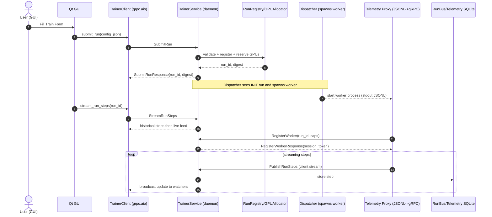
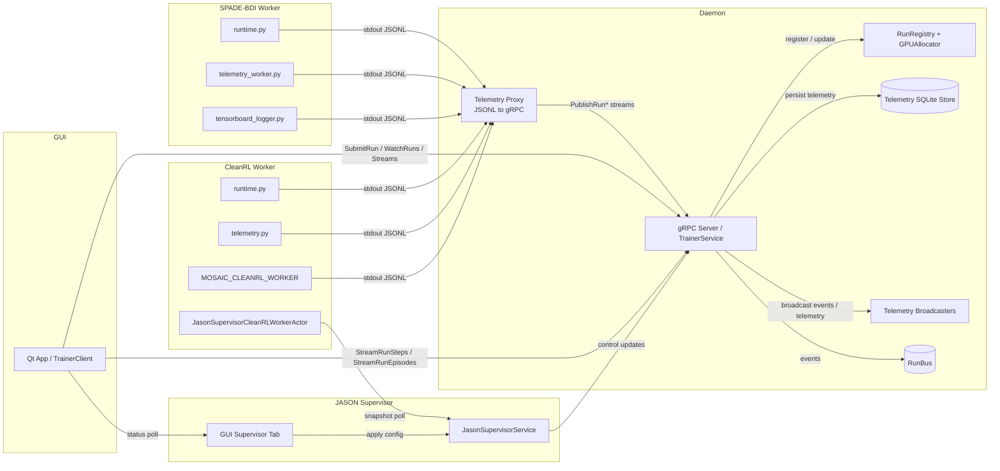
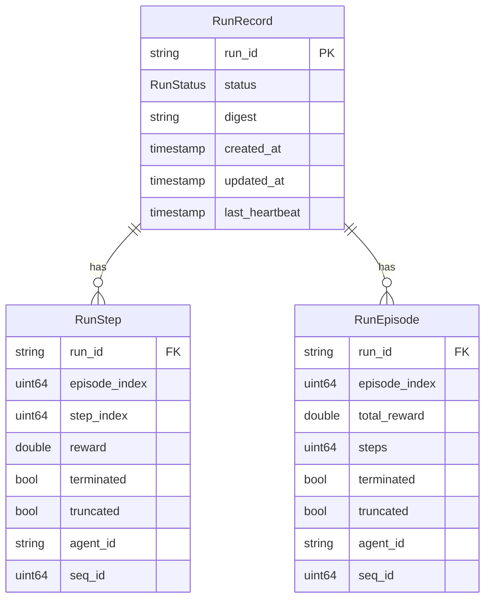
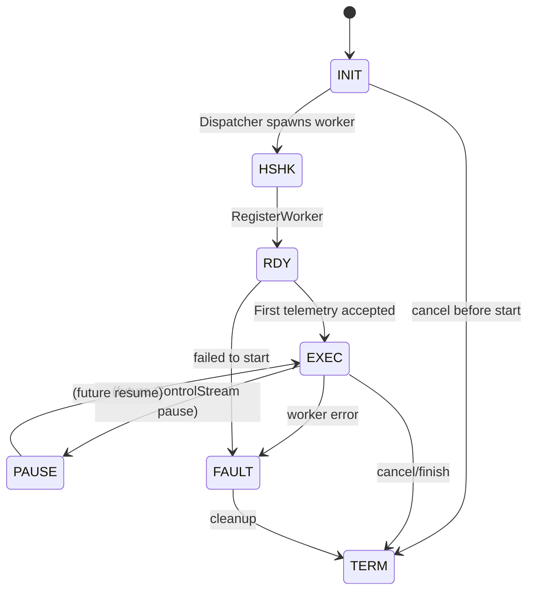
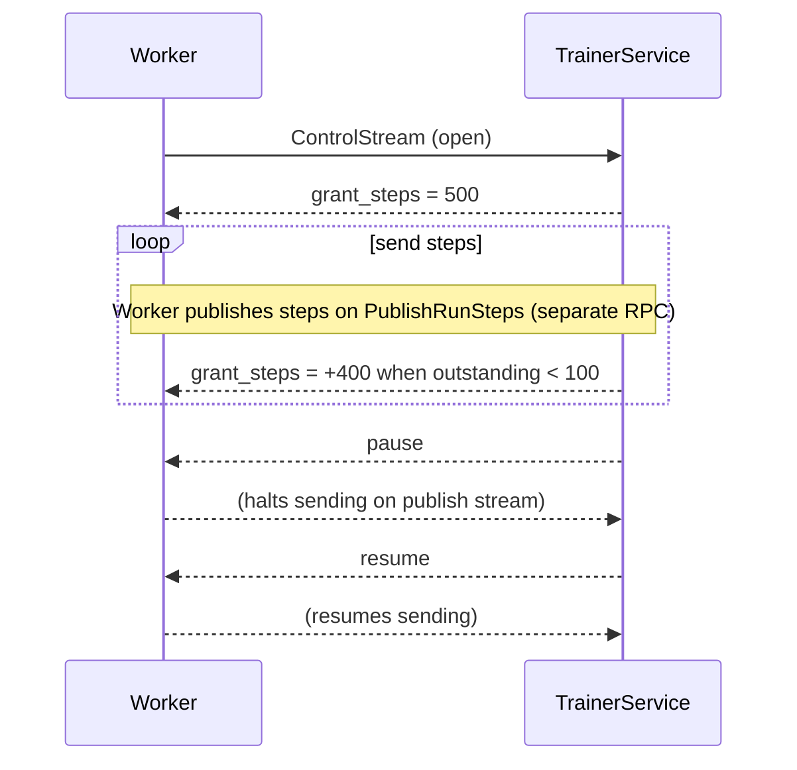

# gRPC in GUI_BDI_RL — End-to-End Guide

This document explains how gRPC powers the MOSAIC trainer stack in this repo: the schema, generated code, server and client wiring, telemetry streaming, and how to compile the `.proto`. It also shows why gRPC is a great fit here, with sequence, flow, ER, and state diagrams.

- Protocol file: `gym_gui/services/trainer/proto/trainer.proto`
- Generated modules: `trainer_pb2.py`, `trainer_pb2_grpc.py`, `trainer_pb2.pyi`
- Import shims: `gym_gui/services/trainer/proto/__init__.py`
- Server: `gym_gui/services/trainer_daemon.py` + `gym_gui/services/trainer/service.py`
- Async client: `gym_gui/services/trainer/client.py`
- Worker telemetry proxy: `gym_gui/services/trainer/trainer_telemetry_proxy.py`

Related analytics context: see `docs/1.0_DAY_20/TASK_5/WANDB_TAB.md` for how telemetry ultimately feeds analytics tabs after a run.

## What the trainer.proto defines

Contract: `service TrainerService` with RPCs covering control plane and data plane:

- Control plane
  - SubmitRun, CancelRun, ListRuns, WatchRuns (server-streaming), Heartbeat, GetHealth
  - RegisterWorker (capability handshake before streaming telemetry)
  - ControlStream (planned bi-di stream for credit/backpressure; currently UNIMPLEMENTED on the server)

- Data plane (telemetry)
  - StreamRunSteps, StreamRunEpisodes (GUI pulls live telemetry)
  - PublishRunSteps, PublishRunEpisodes (workers push live telemetry)

- Data types
  - RunRecord, RunStatus, RunStep, RunEpisode (+ control/handshake messages)

Key fit-for-purpose aspects in this schema:

- Unary RPCs for setup/queries
- Server-streams for GUI subscriptions
- Client-streams for high-throughput ingestion from workers
- Optional fields and enums for safe evolution

## Where gRPC is used in the code

### Server side

- `gym_gui/services/trainer_daemon.py`
  - creates `grpc.aio.server(...)`
  - registers the service: `trainer_pb2_grpc.add_TrainerServiceServicer_to_server(service, server)`
  - binds listen address: `server.add_insecure_port(<host:port>)`

- `gym_gui/services/trainer/service.py`
  - Implements `TrainerServiceServicer`
  - Control-plane: SubmitRun → validate config, reserve GPUs → broadcast; CancelRun; ListRuns; WatchRuns
  - Worker handshake: RegisterWorker (assigns session token; transitions to READY)
  - Telemetry pull: StreamRunSteps/StreamRunEpisodes (replay from DB then live via broadcaster)
  - Telemetry push: PublishRunSteps/PublishRunEpisodes (persist to SQLite, publish to RunBus, broadcast to GUI)
  - Health: GetHealth
  - ControlStream: currently returns UNIMPLEMENTED (credit/backpressure channel reserved)

### Client side (GUI)

- `gym_gui/services/trainer/client.py`
  - Async `TrainerClient` wraps a `grpc.aio.Channel` with tuned options (keepalive, max message size, deadlines)
  - Methods: submit_run, cancel_run, list_runs, heartbeat, get_health
  - Streaming contexts: `watch_runs()`, `stream_run_steps()`, `stream_run_episodes()` (yield async iterators and cleanly cancel)

### Worker telemetry (producer) side

- `gym_gui/services/trainer/trainer_telemetry_proxy.py`
  - Spawns the actual worker process (CleanRL, SPADE-BDI, etc.), tails JSONL stdout
  - Maps JSON lines → `RunStep`/`RunEpisode` protos
  - Pushes them via `PublishRunSteps` and `PublishRunEpisodes` using `grpc.aio` client-streams with large message options

### Generated code import shims

- `gym_gui/services/trainer/proto/__init__.py` registers `trainer_pb2` and `trainer_pb2_grpc` in `sys.modules` so absolute imports emitted by `grpcio-tools` work when importing via the package path `gym_gui.services.trainer.proto`.

## Compile the proto (Python)

Requirements: your venv has `grpcio`, `grpcio-tools`, `protobuf` matching the repo’s generated code. The generated stub currently requires grpcio >= 1.67.1.

```bash
# 1) Activate your venv
source ./.venv/bin/activate

# 2) Install compiler tooling (only needed when re-generating code)
pip install --upgrade grpcio grpcio-tools protobuf

# 3) Generate Python modules (paths are relative to repo root)
python -m grpc_tools.protoc \
  -I gym_gui/services/trainer/proto \
  --python_out=gym_gui/services/trainer/proto \
  --grpc_python_out=gym_gui/services/trainer/proto \
  gym_gui/services/trainer/proto/trainer.proto
```

Notes:

- The import `google/protobuf/timestamp.proto` is resolved by `grpc_tools.protoc` without extra include flags.
- If you see “The grpc package installed is at version X, but the generated code depends on grpcio>=1.67.1”, either:
  - upgrade grpcio to >= required version; or
  - re-run generation using your installed `grpcio-tools` (which will bake in your local generator version into `trainer_pb2_grpc.py`).

## Sequence: submitting a run and streaming telemetry



## Data flow overview



CleanRL nodes map to `cleanrl_worker/runtime.py`, `cleanrl_worker/telemetry.py`, and `cleanrl_worker/MOSAIC_CLEANRL_WORKER/`.
SPADE‑BDI nodes map to `spade_bdi_worker/core/runtime.py`, `spade_bdi_worker/core/telemetry_worker.py`, and `spade_bdi_worker/core/tensorboard_logger.py`.
`JASON Supervisor` now denotes the dedicated GUI tab and `JasonSupervisorService`, showing how the UI applies config, the CleanRL supervisor actor polls for snapshots, and the service emits control updates to the daemon.

- Key data paths in the codebase:

- `gym_gui/ui/widgets/control_panel.py` (supervisor tab) posts form values through `JasonSupervisorService.set_config()` and keeps the status labels fresh via `_update_supervisor_labels()`.
- `gym_gui/services/jason_supervisor/service.py` validates each control update (credit guard + `ValidationService.validate_trainer_control_update`) before persisting state for the GUI and bridge.
- `gym_gui/services/jason_bridge/server.py` exposes `ApplyControlUpdate` / `GetSupervisorStatus`, wiring external Jason agents into the supervisor service without touching the trainer internals.
- `gym_gui/workers/jason_supervisor_cleanrl_worker/worker.py` samples `JasonSupervisorService.snapshot()` on step/episode hooks so CleanRL runs can surface supervisor metadata.
- `gym_gui/services/trainer/trainer_telemetry_proxy.py` and the worker stdout feeds keep the telemetry plane pushing into `TrainerService`, which then broadcasts to the GUI and persists in SQLite.

## ER diagram (proto data model)



## Run status state machine



Notes:

- Exact transitions are driven by `RunRegistry` updates in `service.py` and `dispatcher.py`.
- `ControlStream` is reserved for a future credit/backpressure FSM; currently UNIMPLEMENTED on the server.

Implementation mapping:

- Dispatcher sets status to HANDSHAKE when the worker subprocess is spawned (`TrainerDispatcher._dispatch_run`).
- RegisterWorker transitions a run to READY if not already READY/EXECUTING/PAUSED (`TrainerService.RegisterWorker`).
- First accepted telemetry on PublishRunSteps/PublishRunEpisodes transitions to EXECUTING (`TrainerService.PublishRun*`).
- Cancel or terminal outcomes update to TERMINATED; failures move to FAULTED before cleanup (service/dispatcher).

## Why gRPC fits this system

- Strong, versioned schema
  - `.proto` is the source of truth for control-plane and telemetry-plane
  - Enums and optional fields allow forward-compatible evolution

- First-class streaming
  - Server-streaming (`WatchRuns`, `StreamRunSteps/Episodes`) aligns with the GUI’s live views
  - Client-streaming (`PublishRun*`) aligns with worker → daemon ingestion at high rate

- Async Python runtime
  - `grpc.aio` integrates cleanly with our asyncio daemon, dispatch loops, and GUI bridge threads

- Performance & limits
  - Tunable keepalive, deadlines, and large message sizes; binary encoding minimizes overhead

- Cross-language friendliness
  - Any worker stack can integrate by generating gRPC stubs (e.g., Python, Go, C++) while keeping the same schema

- Separation of concerns
  - Control-plane (submit/cancel/list/watch) is distinct from telemetry plane (push/pull streams)

- Operational safety
  - Deadlines, cancellation, and backpressure patterns (credit channel reserved) map well to long-running streams

## Practical code anchors

- Server creation/bind (excerpt) — `gym_gui/services/trainer_daemon.py`:
  - `self._grpc_server = grpc.aio.server(options=self._grpc_options)`
  - `trainer_pb2_grpc.add_TrainerServiceServicer_to_server(service, self._grpc_server)`
  - `self._grpc_server.add_insecure_port(self._listen)`

- Publish telemetry handler — `gym_gui/services/trainer/service.py`:
  - Persists to SQLite (`TelemetrySQLiteStore`), publishes to RunBus, and broadcasts to GUI stream subscribers

- Client subscribe — `gym_gui/services/trainer/client.py`:
  - `async with client.stream_run_steps(run_id) as steps:` yields each `RunStep`

- Telemetry proxy — `gym_gui/services/trainer/trainer_telemetry_proxy.py`:
  - Translates worker stdout JSONL to protobuf and pushes via client-streams with `grpc.aio`

- Import shims — `gym_gui/services/trainer/proto/__init__.py`:
  - Ensures absolute imports inside generated modules resolve when importing as a package

## Troubleshooting

- Version mismatch: `trainer_pb2_grpc.py` checks `grpcio>=1.67.1`. Upgrade grpcio or regenerate stubs with your local tools.
- Large messages: ensure options like `grpc.max_receive_message_length` and `grpc.max_send_message_length` are set on both client and server (the code already sets large defaults in client and proxy).
- Stream cancellation: always cancel/close streams in `finally` (client wrappers already do this).
- ControlStream returns UNIMPLEMENTED by design; credit/backpressure is a planned P0 follow-up (see Day-14 notes).

## Re-generating after schema changes

After editing `trainer.proto`, re-generate the Python bindings with the command above, and verify:

- `trainer_pb2.py` and `trainer_pb2_grpc.py` are updated under `gym_gui/services/trainer/proto`.
- No Pylance/typing regressions in places that construct protobuf messages.
- Integration: start the trainer daemon and submit a trivial run; ensure GUI can subscribe to `StreamRunSteps` and that the worker proxy can publish via `PublishRunSteps` without errors.

## ControlStream: contrarian, in‑depth analysis

The proto defines a bidirectional `ControlStream(stream ControlEvent) returns (stream ControlEvent)` with fields:

- grant_steps (server→worker) — credit tokens permitting N more steps
- pause/resume (server→worker) — soft control signals
- max_rate_hz (server→worker) — advisory rate cap

Today, the server implements this RPC as UNIMPLEMENTED on purpose. Below is a contrarian analysis: when you might not need it, where it helps, pitfalls to avoid, and a minimal viable design if you choose to enable it.

### When you might not need ControlStream

- Built‑in flow control already exists in gRPC streams. If your ingestion path (`PublishRunSteps/Episodes`) and the broadcaster/DB can keep up, TCP and HTTP/2 flow control naturally slow producers without an explicit credit protocol.
- GUI refresh is throttled independently; you can downsample or batch on the consumer side to keep the UI smooth without pausing producers.
- Many single‑node dev setups don’t suffer from multi‑tenant fairness or burst storms; a simple server‑side rate limiter on ingestion may be enough (drop/LOG at high load).

### Where ControlStream adds real value

- Multi‑tenant fairness: coordinate many workers across limited GPUs/IO so no single run starves others.
- Explicit pause from UI: deterministic “stop now” semantics instead of relying on network backpressure.
- Cost control: throttle or pause analytics/telemetry for specific runs during heavy periods.
- Data hygiene: implement a token bucket so you never ingest more than you can persist/display with bounded buffers.

### Common pitfalls (and how to avoid them)

1) Double throttling with HTTP/2 flow control

- Problem: credits + TCP window both apply; the worker may stall earlier than intended.
- Mitigation: keep credits coarse (e.g., grant in chunks of 100–1000) and use high‑water/low‑water thresholds so ControlStream is slow‑moving guidance, not per‑step chatter.

1) Token leaks and mis‑accounting

- Problem: server decrements credits without confirming acceptance; worker retries cause duplicates.
- Mitigation: decrement only on “accepted” at the ingestion point; send acks on ControlStream at low cadence (e.g., every 50 accepted) to refresh credits.

1) Cross‑stream ordering

- Problem: acks on ControlStream and steps on PublishRunSteps are independent streams; strict per‑step acks are brittle.
- Mitigation: use monotonic run‑local counters (the existing `seq_id` on steps) and batch acks “up to seq K” in ControlStream.

1) Priority inversion

- Problem: credits applied uniformly across runs lead to starving latency‑sensitive jobs.
- Mitigation: per‑class token buckets (e.g., interactive vs. batch) and fair sharing (weighted round‑robin grants).

1) Pause semantics that deadlock

- Problem: sending `pause=true` while the worker is blocked on backpressure yields no visible change.
- Mitigation: treat `pause` as an out‑of‑band hard gate on the worker loop regardless of gRPC writeability; worker checks a local “paused” flag before every send.

### Minimal viable spec (no proto change required)

Use the existing `ControlEvent` oneof with these conventions:

- Server responsibilities
  - On RegisterWorker, allocate a session and immediately send `grant_steps = N0` (e.g., 500).
  - Track per‑run ledger: credits_granted, credits_consumed, credits_outstanding.
  - On each accepted step (in `PublishRunSteps`/`PublishRunEpisodes`), increment consumed. When outstanding < low_watermark (e.g., 100), send another grant (e.g., +400) to hit high_watermark.
  - Honor `pause`/`resume` from the GUI by sending the flags down the stream, and enforce “hard gate” on the server: if paused and credits>0, still reject ingestion with FAILED_PRECONDITION to keep semantics clear.

- Worker responsibilities
  - Maintain local credits; before sending a step, check credits>0 unless operating in “advisory” mode.
  - Decrement on send or on ack? Prefer decrement on send to avoid send bursts after grant latency; rely on server to drop with clear status if out of sync.
  - Honor `pause` by halting sends; resume on `resume`.
  - Optionally smooth to `max_rate_hz` using a token bucket locally.

This delivers bounded throughput with low chatter and clear semantics, using the current schema.

### Optional proto extensions (for later)

- Add `uint32 request_steps` (worker→server) so the worker can request more when nearing zero (pull + push grants).
- Add `uint64 ack_seq` (server→worker) meaning “all steps up to this seq_id accepted” to simplify re‑sync.
- Add `bool advisory` (server→worker) to signal soft vs. enforced mode while rolling out.

### Integration points in code

- `TrainerService.PublishRunSteps/PublishRunEpisodes`
  - Place the credit decrement after the point of acceptance (right where we increment `accepted`), and reject when credits_outstanding == 0 if in enforced mode.
  - Emit batched acks/grants via the ControlStream handler.

- `TrainerService.ControlStream`
  - Implement a loop that watches per‑run ledgers and GUI signals; send grants/pause/resume; receive optional worker requests.
  - Authenticate the stream using the existing `session_token` from `RegisterWorkerResponse` (reject if missing/mismatch).

- Broadcaster/DB sink
  - No changes required; continue to persist and fan‑out.
  - Consider emitting `Topic.CONTROL` events on the RunBus so the GUI can reflect “paused/credits/rate” in the live view.

### Observability & safeguards

- Metrics per run: credits_granted, credits_consumed, grants_sent, pauses, resumes, drops_due_to_credit, current_outstanding, ingest_rate_hz.
- Logs: send grant decisions at INFO on first application; DEBUG thereafter with coalescing.
- Kill switches: env flags to disable enforcement and fall back to “advisory only”.
- Timeouts: if ControlStream disconnects, default to advisory mode and allow ingress (fail‑open) or fail‑closed if policy requires.

### Test strategy

- Unit: ledger math (grant/consume/watermarks), pause gates, reconnect replay with seq_id.
- Integration: worker proxy publishes at varying rates; assert grants and pauses arrive; verify no dupes/missed credits under reconnect.
- Soak: long streams with intermittent network stalls; ensure no token leaks and stable memory.
- Fault injection: drop ControlStream mid‑run; enforce policy (fail‑open vs fail‑closed) and verify recovery.

### ControlStream credit flow (illustrative)



### Contrarian bottom line

- Don’t ship ControlStream just to “have backpressure.” If your ingestion/broadcast path is already bounded and gRPC’s flow control suffices, you’re adding operational complexity for minimal win.
- If you need explicit control (multi‑tenant fairness, deterministic pause), implement the minimal design above first: coarse grants, batched acks, enforced pause, and clear observability. Defer finer‑grained features (per‑agent priority, worker pull credit) until you see real‑world pressure.
