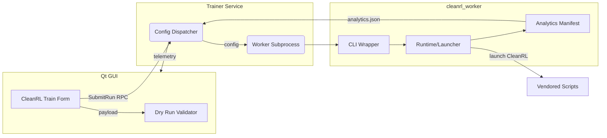
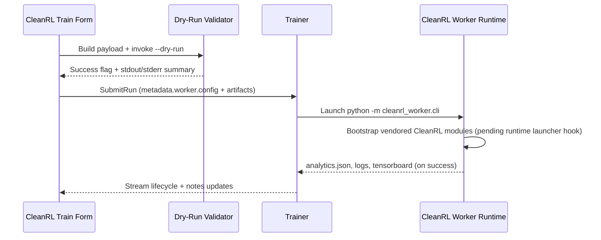
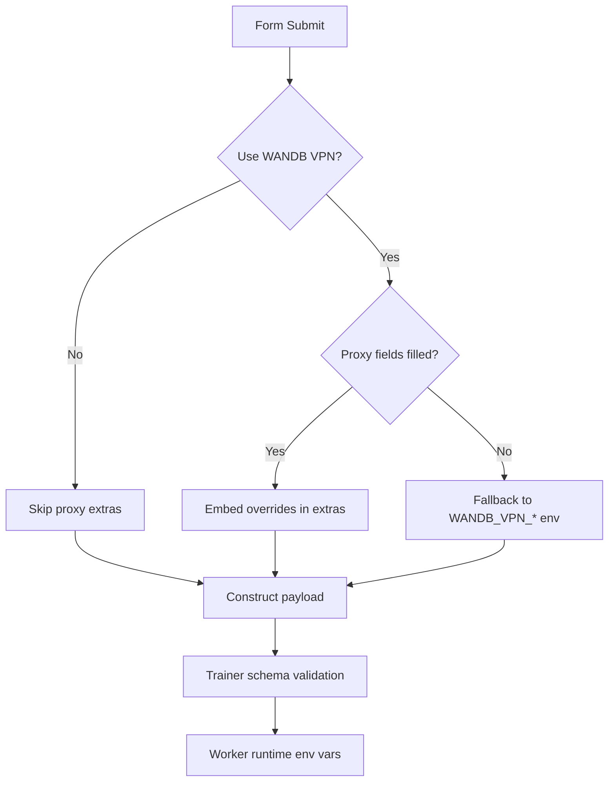

# CleanRL Integration Progress — Day 21 / Task 3

## Problem Formulation

- **Goal:** Integrate CleanRL workers into the MOSAIC trainer so PPO/DQN jobs submitted from the GUI run end-to-end, persist configs under `var/trainer/configs/`, and surface WANDB/TensorBoard artefacts like the existing SPADE-BDI pipeline.
- **Constraints:** Preserve trainer schema (`artifacts` block required), reuse existing gRPC handshake + telemetry expectations, and honor WANDB VPN proxy defaults unless the user overrides them in the form.
- **Blocking issue:** Real runs still fail because the worker process eventually executes `python -m cleanrl.<algo>` directly; our environment only ships vendored copies under `cleanrl_worker/`, so the module import dies before analytics/logs are written.

## System Architecture Overview

- **Front-end (gym_gui):**
  - Qt-based client renders the CleanRL form (`CleanRlTrainForm`) and a Live Telemetry dashboard.
  - Form builds a `TrainRunConfig` payload shaped by shared Pydantic/JSON schema expectations.
  - Validates payloads locally (dry-run) before invoking gRPC `SubmitRun`.
- **Trainer Service (`gym_gui.trainer`):**
  - gRPC daemon receives `SubmitRun` RPCs, persists configs under `var/trainer/configs/config-<ULID>.json`, and dispatches worker processes.
  - Uses the canonical `trainer_pb2` proto: `metadata` + `artifacts` are mandatory.
- **Worker Layer (`cleanrl_worker` package):**
  - Thin facade modules expose CLI/config/runtime/telemetry compatible with trainer conventions.
  - Vendored MOSAIC implementation (`MOSAIC_CLEANRL_WORKER`) hosts actual logic, including analytics manifest generation and proxy handling.
- **External Integrations:**
  - WANDB: optional tracking via CLI `--track` and environment-provided proxies.
  - TensorBoard: per-run directories created under `var/trainer/runs/<run_id>/<tensorboard_dir>`.
  - Filesystem watchers (planned) monitor `<run_id>/wandb/run-*` directories to auto-enable embedded WANDB view.

## Current Implementation Highlights

- **CleanRL form overhaul (`gym_gui/ui/widgets/cleanrl_train_form.py`):**
  - Two-column layout separates core rollout parameters from analytics metadata.
  - Dry-run button triggers `validation_cleanrl_worker_form.run_cleanrl_dry_run`, and the combined stdout/stderr summary is written into the Notes panel instead of a transient popup.
  - WANDB VPN proxy controls allow explicit overrides; when enabled but blank, the form falls back to `.env` defaults (`WANDB_VPN_HTTP_PROXY`, `WANDB_VPN_HTTPS_PROXY`).
  - Payload builder emits schema-compliant JSON with top-level `artifacts` and `metadata.worker.config`, matching trainer expectations.
- **Algorithm help docs (`gym_gui/Algo_docs/cleanrl_worker/...`):**
  - Rich HTML fragments for PPO variants and DQN/C51 explain timesteps, vector-env considerations, and recommended extras.
  - GUI injects doc panel based on selected algorithm, similar to the Gymnasium game docs flow.
- **Validation harness (`gym_gui/validations/validation_cleanrl_worker_form.py`):**
  - Executes `python -m cleanrl_worker.cli --dry-run` in a temp directory, returning combined output for UI display.
- **Worker runtime updates (`cleanrl_worker/MOSAIC_CLEANRL_WORKER/...`):**
  - `WorkerConfig` parsing supports trainer payloads and CLI overrides.
  - Runtime constructs run directories under `var/trainer/runs/<run_id>/`, persists `analytics.json`, and materialises tensorboard subdirs when requested.
  - CLI resolves CleanRL modules via registry, trying both `cleanrl.*` and vendored `cleanrl_worker.cleanrl.*`.
  - Launcher (`cleanrl_worker/MOSAIC_CLEANRL_WORKER/launcher.py`) bootstraps vendored packages; wiring into the runtime command is the remaining task for real executions.
- **Logging:** Added `LOG_UI_MAINWINDOW_INVALID_CONFIG` constant so trainer rejections (“artifacts missing/unexpected”) map to actionable log codes in the UI stream.

## Data Flow Overview

## Impacted Files

**gym_gui (UI / trainer client):**

- `gym_gui/ui/widgets/cleanrl_train_form.py`
- `gym_gui/ui/widgets/spade_bdi_train_form.py`
- `gym_gui/validations/validation_cleanrl_worker_form.py`
- `gym_gui/Algo_docs/cleanrl_worker/__init__.py`
- `gym_gui/Algo_docs/cleanrl_worker/ppo/__init__.py`
- `gym_gui/Algo_docs/cleanrl_worker/dqn/__init__.py`
- `gym_gui/logging_config/log_constants.py`
- `docs/1.0_DAY_20/TASK_5/WANDB_TAB.md` (VPN fallback notes)
- `docs/1.0_DAY_21/TASK_2/cleanrl_worker_details.md`

**cleanrl_worker (runtime shim):**

- `cleanrl_worker/__init__.py`
- `cleanrl_worker/cli.py`
- `cleanrl_worker/MOSAIC_CLEANRL_WORKER/__init__.py`
- `cleanrl_worker/MOSAIC_CLEANRL_WORKER/cli.py`
- `cleanrl_worker/MOSAIC_CLEANRL_WORKER/config.py`
- `cleanrl_worker/MOSAIC_CLEANRL_WORKER/runtime.py`
- `cleanrl_worker/MOSAIC_CLEANRL_WORKER/telemetry.py`
- `cleanrl_worker/MOSAIC_CLEANRL_WORKER/analytics.py`
- `cleanrl_worker/MOSAIC_CLEANRL_WORKER/launcher.py` (new)

## Testing & Observations

- Dry-run (`python -m cleanrl_worker.cli --dry-run --emit-summary`) succeeds for PPO/DQN, logging success JSON back into the form.
- Real trainer submissions currently fail with `ModuleNotFoundError: No module named 'cleanrl'` once the worker process executes the resolved module.
- Config persistence confirmed: new jobs create `var/trainer/configs/config-<run_ulid>.json`, matching SPADE-BDI behavior; however, run directories remain empty until the runtime fixes the import path.
- Notes panel now records dry-run success/failure messages, replacing transient popup feedback.

## Config Submission & Execution Path (Deep Dive)

- **Form state assembly:**
  - Captures core fields (`algo`, `env_id`, `total_timesteps`, `seed=1` default) and optional metadata (agent_id, worker_id).
  - WANDB section populates `extras`:
    - `track_wandb`, `wandb_project_name`, `wandb_entity`, `wandb_run_name`, `wandb_api_key`, `wandb_email`.
    - VPN proxy checkbox toggles `wandb_use_vpn_proxy`; proxies derive from fields or `.env` fallback.
  - Algorithm parameters map to `extras.algo_params` (e.g., `{"num_envs": 16, "num_steps": 2048, "learning_rate": 1e-4}`).
  - `artifacts` block prepared separately with `{"tensorboard": {"enabled": bool}, "wandb": {"enabled": bool}}` aligning with trainer schema.
- **Dry run validation:**
  - Temporary JSON config containing the full `TrainRunConfig` passes to `python -m cleanrl_worker.cli --dry-run --emit-summary`.
  - CLI loads the payload, parses worker config, invokes runtime `dry_run=True`, and prints resolved module/args.
  - Output example stored in Notes for auditability alongside timestamp.
- **SubmitRun flow:**
  - gRPC client (`gym_gui.services.trainer.client`) serializes payload → `trainer_pb2.SubmitRunRequest`.
  - Trainer writes `config-<ULID>.json`, then creates run ULID directory under `var/trainer/runs`.
  - Worker subprocess executes `python -m cleanrl_worker.cli --config <path> --grpc --grpc-target localhost:50055`.
- **Runtime execution:**
  - CLI builds `WorkerConfig` from JSON, merges CLI overrides, and instantiates `CleanRLWorkerRuntime`.
  - Runtime ensures directories exist, registers with trainer (if gRPC enabled), builds CleanRL CLI args, then (currently) launches `python -m <module>`.
  - Planned adjustment: call launcher wrapper so vendored packages are always importable.
- **Telemetry & Analytics:**
  - `LifecycleEmitter` pushes JSON heartbeats to stdout (consumed by trainer telemetry hub).
  - On completion, `build_manifest` collects tensorboard + WANDB metadata, writes `analytics.json`, enabling GUI to display artifacts.

## Contrarian Analysis — Why the Integration Should Work (and What Still Blocks It)

- **Why dry-run confidence is justified:**
  - The validator executes the exact CLI entrypoint used for real runs, ensuring payloads are schema-compliant and algorithm resolution logic is exercised before submission.
  - The CLI resolves all extras into flags identical to those that the worker would eventually pass to the CleanRL script, so any missing/invalid keys surface early.
- **Why real runs remain blocked:**
  - Environment lacks a top-level `cleanrl` module; despite vendored copies, the runtime still shells out to `python -m cleanrl.<algo>`.
  - Without injecting the bootstrapper, Python import resolution ignores `cleanrl_worker/cleanrl`, causing `ModuleNotFoundError`.
- **Why the architecture is otherwise sound:**
  - Trainer already manages SPADE-BDI workers with the same schema; CleanRL form now emits identical structure (`metadata.worker.config` with `artifacts` at root), so dispatching + config persistence behaves consistently.
  - WANDB/TensorBoard handling reuses the artifact manifest builder; once the module import succeeds, directories and analytics will materialize without further code changes.
  - Logging constants and Notes integration provide visibility for success/failure states, reducing hidden failure modes.
- **Residual risks & mitigations:**
  - *Risk:* If users supply CleanRL flags not covered by extras, they may be dropped.
    - *Mitigation:* `_format_cli_override` forwards arbitrary extras (except reserved keys) with type-aware formatting.
  - *Risk:* WANDB proxies could break non-VPN users.
    - *Mitigation:* Proxies only applied when explicitly enabled; fallback uses environment defaults to maintain backward compatibility.
  - *Risk:* Trainer gRPC schema changes could invalidate payloads.
    - *Mitigation:* Config builder centralizes artifact metadata, easing adaptations if the schema evolves.

## Pending Work

1. **Runtime launcher hook:** Replace `python -m <module_name>` with `python -m cleanrl_worker.MOSAIC_CLEANRL_WORKER.launcher <module_name>` in `runtime.py` so vendored scripts import correctly.
2. **End-to-end tests:** Build pytest coverage under `cleanrl_worker/tests/` that:
   - Mocks trainer gRPC.
   - Exercises dry-run success and failure cases.
   - Verifies config + analytics persistence for a simulated PPO job.
3. **Algorithm docs expansion:** Add MuJoCo/Procgen parameter guidance and link environment families to recommended timesteps.
4. **WANDB agent watcher:** Implement filesystem watcher that detects `<run>/wandb/run-*/` directories and toggles the embedded WANDB agent tab.
5. **VPN proxy launch options:** Surface optional `http_proxy`/`https_proxy` environment injection when launching embedded browser (Qt `QNetworkProxy::setApplicationProxy`) and expose quick CLI probes (`curl -I`) for connectivity checks.

## Notes

- `total_timesteps` UI label no longer appends “steps”, and default seed is `1` unless the user overrides it.
- WANDB proxy extras only activate when the VPN checkbox is enabled; otherwise, the worker relies on `.env` defaults.
- New logging codes help correlate trainer-side schema errors with UI events (e.g., `LOG705` when the trainer rejects payloads with stray `notes/tensorboard/wandb` keys under `artifacts`).
- Human Mode UX: Wrapped the Control Panel’s “Game Configuration” section in a scroll area and adjusted layout stretch so long forms (e.g., ALE settings) are fully visible on smaller screens.
