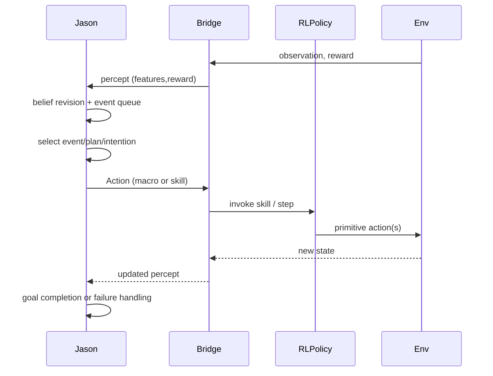

# JASON Mind Over RL

**Day 23 – Design Note**  
*(Grounded in the official Jason project (`jason-lang`) and our repository’s gRPC bridge folder `JASON_GRPC_BIDI_PYTHON`.)*

## 1. Purpose

This document captures how to layer a Jason (AgentSpeak) BDI agent “mind” above reinforcement learning (RL) and environment orchestration inside `gym_gui`. It explains the Jason reasoning cycle, then maps beliefs, desires, and intentions to telemetry, adapters, and trainer services in this codebase. The goal: enable explainable, plan-driven oversight and goal management while retaining RL for continuous control or skill execution.

## 2. Why “Mind Over RL”?

RL excels at micro-level action optimization; it is weak at explicit goal decomposition, reactive recovery logic, or human-auditable intent. Jason gives:

* Explicit goal lifecycle (achievement / maintenance / recovery).
* Transparent plan library & trigger semantics.
* Message-based multi-agent coordination.
* Deterministic selection functions (SE, SO, SI) you can tune.

Result: RL works as a set of embodied skills; Jason supervises which high-level goals to pursue and when to switch, suspend, or recover.

## 3. Jason Reasoning Cycle (Condensed)

| Phase | Action |
|-------|--------|
| Perception | Gather new percepts / messages → belief revision. |
| Event Extraction | Belief changes & posted goals become events (+b, -b, +!g, -!g). |
| SE (Select Event) | Pick one pending event (policy: FIFO, priority, custom). |
| Relevant Plans | Match event against plan triggers. |
| Applicable Plans | Filter by context (belief tests & unification). |
| SO (Select Option) | Choose one applicable plan. |
| Intention Update | Push plan onto an intention stack or merge with existing intention. |
| SI (Select Intention) | Pick which intention advances this cycle. |
| Execute Step | Perform next action / sub-goal / test. |
| Completion / Failure | Pop plan or emit failure event (-!g) for recovery plans. |

## 4. BDI Mapping to This Repository

| BDI Concept | Repo Integration |
|-------------|------------------|
| Beliefs | Derived from environment state via adapters (`gym_gui/core/adapters/*`) & telemetry hub (reward, episode step, object presence). |
| Desires | Configured training objectives (e.g., “complete episode”, “collect artifact”) or scenario-level mission tokens. |
| Intentions | Active pursuit stacks: each ties a high-level goal to pending sub-goals or RL skill calls. |
| Events | Emitted when beliefs change (e.g., `+artifact(collected)`), or internal `+!explore_sector`. |
| Plans | Authored AgentSpeak files (.asl) stored in a Jason project; bodies may invoke gRPC bridge actions. |
| Messages | Multi-agent coordination (e.g., negotiation of resource use) using Jason’s `.send`. |

## 5. gRPC Bridge Overview

Folder: `JASON_GRPC_BIDI_PYTHON/JASON_java_project/grpc-bridge-example` (see scripts + Gradle build). The bridge enables:

1. Jason agent → Python: Action request / policy directive.
2. Python → Jason agent: Percepts (state snapshots, reward deltas, termination flags).
3. Optional: Embedding RL skill invocation as internal Jason action (.rl_skill(Name, Args)).

### Message Contract (Conceptual)

```text
JasonAction {
	intention_id: string
	action_type: ENUM (MOVE, POLICY_STEP, META_GOAL, …)
	payload: map<string, any>
}

EnvPercept {
	tick: int
	features: map<string, any>    // flattened observation or structured slice
	reward: float
	terminated: bool
	truncated: bool
}
```

## 6. Integration Patterns

| Pattern | Description | When to Use |
|---------|-------------|-------------|
| High-Level Goal Dispatch | Jason selects next macro goal; RL handles primitive action loop. | Long episodes with changing objectives. |
| Skill Invocation | Plan body calls named RL skill policy (`!navigate_sector` executes a trained subpolicy). | Modular skill library. |
| Belief-Gated Acting | RL actions only run when belief predicate holds (e.g., `safe(zone)` true). | Safety-critical contexts. |
| Plan-Guided Curriculum | Sequence of RL tasks expressed as chained achievement goals. | Multi-stage training scenarios. |
| Recovery Escalation | Failure event (-!g) triggers fallback RL policy (robustness). | Uncertain dynamics / hazards. |

## 7. Example AgentSpeak Fragment (Hybrid)

```asl
// Belief seeds (ingested from Python bridge)
+at(sector_a).
+energy(80).

// Macro exploration goal
+!survey_area : at(S) & energy(E) & E > 30 <-
		.print("Starting survey at", S);
		!acquire_waypoints;     // posts internal sub-goal
		!navigate_waypoints;    // RL skill call sequence
		!report_results.

+!acquire_waypoints : true <- .send(env, request, waypoints(sector_a)); ?waypoints(L); .print("Waypoints received", L).

+!navigate_waypoints : waypoints(L) & energy(E) & E > 20 <- .rl_skill(navigate, L); ?reached_all(L); .print("Navigation complete").

-!navigate_waypoints : true <- .print("Navigation failed; retrying with cautious policy"); .rl_skill(navigate_safe, L); !navigate_waypoints.

+!report_results : reached_all(L) <- .send(controller, inform, survey_done(sector_a)); .print("Survey finished").
```
*`.rl_skill`* is a proposed internal action stub you would implement to forward a skill invocation over gRPC; success or failure updates beliefs (`reached_all/1`).

## 8. Data Flow (Mermaid Sequence)



## 9. Telemetry & Backpressure Hooks

Leverage existing `TelemetryAsyncHub` and buffer limits. Each Bridge emission can consume credit; if credits exhausted, Jason may:

1. Suspend intention (deferring new macro goals).
2. Emit control event `+!slow_mode` to throttle RL step frequency.
3. Switch to summarised percepts (down-sampled observation keys).

## 10. Failure & Recovery Design

Use `-!goal` triggered plans for structured fallback: e.g., switch to safe navigation skill, request assistance (`.send(peer, help, lost)`), or pivot to alternative macro objective.

## 11. Performance Considerations

| Concern | Mitigation |
|---------|------------|
| Latency bridging | Batch percepts; compress numeric vectors. |
| Large observation flatten | Expose semantic slices (entities, hazards) as beliefs rather than raw pixel array. |
| Episode step budget | Let Jason preempt RL when diminishing returns detected (belief `plateau(reward_window)`). |
| Multi-agent chat storm | Rate-limit `.send` using belief counters / cooldown facts. |

## 12. Extensibility Roadmap

Step | Action | Outcome
-----|--------|--------
1 | Define internal `.rl_skill(Name, Args)` action in bridge | Plan bodies can trigger RL skills
2 | Map environment state → belief translator module | Rich symbolic context
3 | Implement intention export telemetry (current goals) | UI introspection tab
4 | Add recovery plan templates (`recover_navigation`, `replan_goal`) | Robustness
5 | Integrate LLM plan suggester (out-of-band, human-reviewed) | Faster plan authoring

## 13. LLM Synergy (Responsible Use)

Workflow:

1. Prompt LLM with current belief vocabulary & mission template.
2. Generate candidate plans (with trigger/context/body separated).
3. Validate logically (no unsafe infinite recursion, correct predicates).
4. Commit into Jason plan library; restart agent.
5. Observe telemetry for intention switching quality.

LLM output is *not* executed directly—Jason enforces structured semantics and safety.

## 14. Quick Start (Jason Side)

```bash
# Build CLI (inside JASON_java_project or original jason repo)
./gradlew config

# Run an example (original examples directory)
jason examples/domestic-robot/DomesticRobot.mas2j

# Bridge demo (Python side)
./run_bridge_demo.sh  # in JASON_GRPC_BIDI_PYTHON root
```
Then wire Python process to supply percepts from a `gym_gui` adapter and accept macro actions.

## 15. Glossary

| Term | Meaning |
|------|---------|
| Belief | Fact in agent’s knowledge base (e.g., `at(sector_a)`). |
| Desire | Potential objective (not necessarily committed). |
| Intention | Active commitment: stack of executing plans. |
| Event | Trigger representing change or posted goal (`+!survey_area`). |
| Plan | Rule: `trigger : context <- body`. |
| Skill | RL policy or scripted routine invoked as atomic high-level action. |
| Recovery Plan | Plan triggered by failure event (`-!goal`) to restore progress. |
| Percept | External input translating environment → beliefs. |

## 16. Comparison With LLM “Reasoning” (Condensed)

Jason: symbolic, explicit state, deterministic selection functions.  
LLM: statistical next-token prediction; implicit latent “world model”.  
Hybrid: LLM drafts; Jason executes & supervises.

## 17. Safety & Auditability

* All belief mutations logged (align with Day-14 telemetry guardrails).  
* Intention switches emitted as control telemetry events for UI replay.  
* Recovery triggers annotated with cause (e.g., `failure(navigate_waypoints, obstacle_blocked)`).

## 18. Minimal Pseudo-Code Bridge Loop

```python
while True:
		obs, reward, terminated, truncated, info = env.step(policy_action)
		bridge.send_percept({
				'features': feature_extract(obs),
				'reward': reward,
				'terminated': terminated,
				'truncated': truncated,
		})
		jason_action = bridge.receive_action(timeout=STEP_TIMEOUT)
		if jason_action and jason_action.type == 'SKILL':
				policy_action = rl_skill_dispatch(jason_action.payload)
		elif jason_action and jason_action.type == 'META_GOAL':
				current_macro_goal = jason_action.payload['goal_id']
		if terminated or truncated:
				bridge.send_episode_event('episode_end')
				break
```

## 19. Next Steps

1. Prototype `.rl_skill` internal action handler.  
2. Implement belief translator for a selected MiniGrid variant (e.g., RedBlueDoors).  
3. Add intention telemetry panel (mirrors existing run bus).  
4. Document recovery scenarios in next Day log.  
5. Explore LLM-assisted plan generation under human review.

## 20. Attribution & Sources

Concepts summarized from the *Jason* open-source project (`jason-lang`), its interpreter semantics for AgentSpeak, and standard BDI literature. This document paraphrases rather than copies upstream text to respect licensing.

---
*End of Day 23 Jason Mind Over RL design note.*


